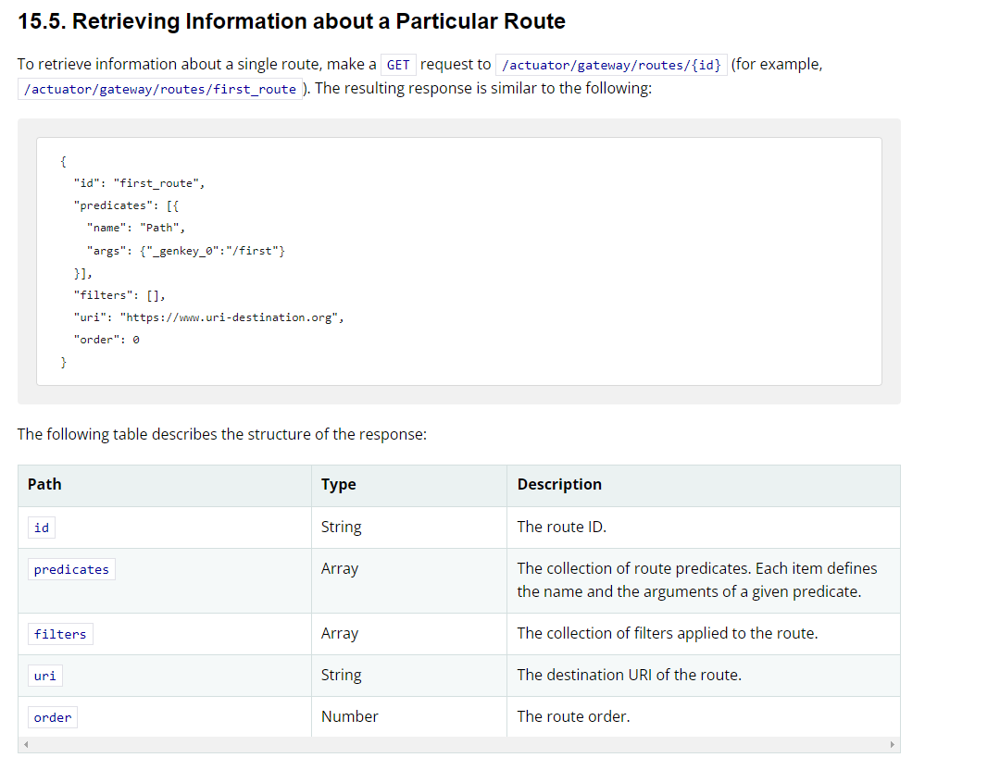
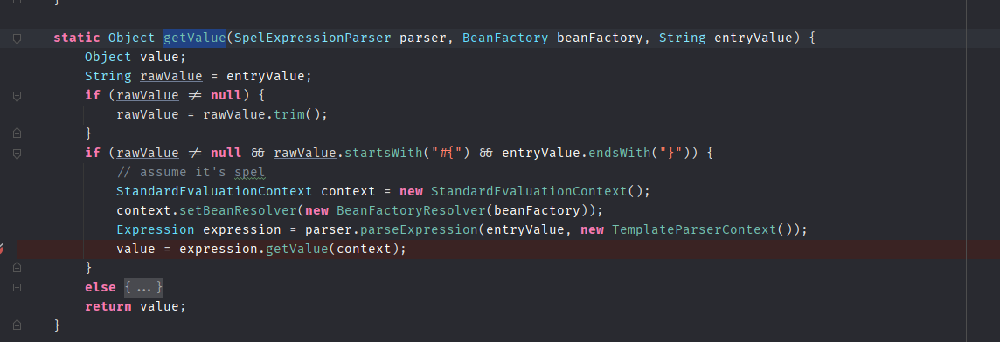
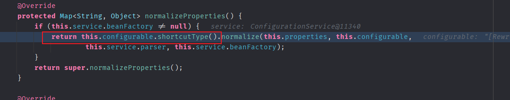

- [CVE-2022-22947 SpringCloudGateWay 远程代码执行](#cve-2022-22947-springcloudgateway-远程代码执行)
  - [影响版本](#影响版本)
  - [环境搭建](#环境搭建)
  - [原理分析](#原理分析)
    - [Actuator API](#actuator-api)
    - [ShortcutConfigurable](#shortcutconfigurable)
    - [GatewayFilters#normalizeProperties](#gatewayfiltersnormalizeproperties)
    - [利用思路](#利用思路)
  - [复现](#复现)
  - [补丁](#补丁)
# CVE-2022-22947 SpringCloudGateWay 远程代码执行
## 影响版本
Spring Cloud Gateway：  
3.1.0  
3.0.0 to 3.0.6  
Older, unsupported versions are also affected
## 环境搭建
https://github.com/spring-cloud/spring-cloud-gateway/tree/v3.1.0
## 原理分析
### Actuator API
SpringCloudGateWay支持通过Actuator端点对网关进行监控和交互，其中还可以删除和创建特定的路由。

路由相关定义如下

其中的filter参数可以定义该路由的Filter,并且可以传递Filter的参数。
SpringCloudGateWay内置了28个Filter。

### ShortcutConfigurable
可以看到所有的`GateWayFilter`都继承了`ShortcutConfigurable`接口。

而在`ShortcutConfigurable`接口中有一个`getValue`静态方法,可以看到里面执行了SPEL表达式,`expression.getValue(context)`。

而调用该`getValue`的地方在该接口的`ShortcutType`枚举类型中的`normalize`方法。

### GatewayFilters#normalizeProperties
而调用了`normalize`的地方则是在对每一个Filter初始化过程中对Filter属性进行解析时。

也就是其中会将Filter的配置属性传入`normalize`中,最后进入`getValue`执行SPEL表达式造成SPEL表达式注入。
### 利用思路
1. 利用Actuator API添加一个Filter,为该Filter传入一个参数,其值为恶意SPEL表达式。
2. 然后再利用`actuator/gateway/refresh`接口刷新网关配置,重新加载每一个Filter,导致在加载添加的Filter时解析我们设置的SPEL表达式造成RCE.
## 复现
以`RewritePathFilter`为例。  
1. 创建路由

2. 刷新配置

调用栈：

## 补丁
使用了`SimpleEvaluationContext`代替了`StandardEvaluationContext` .
