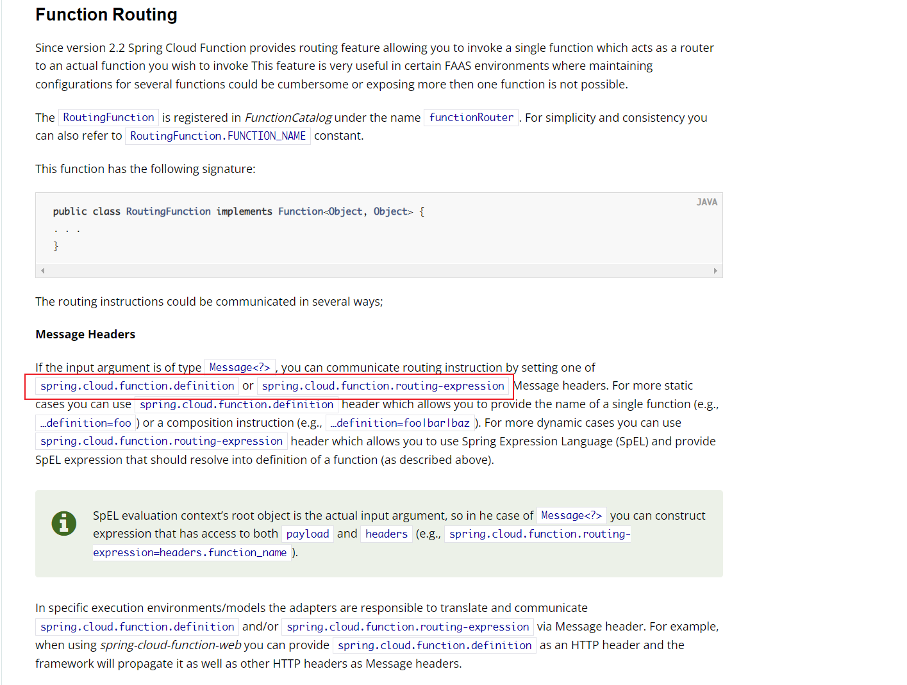
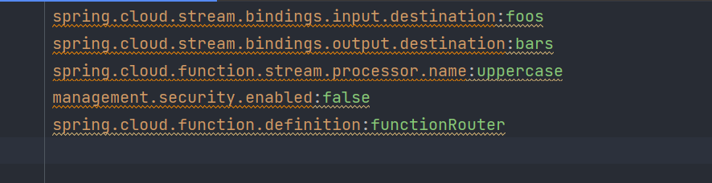
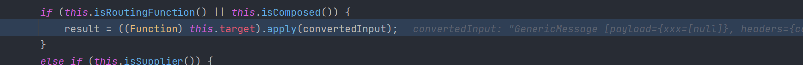
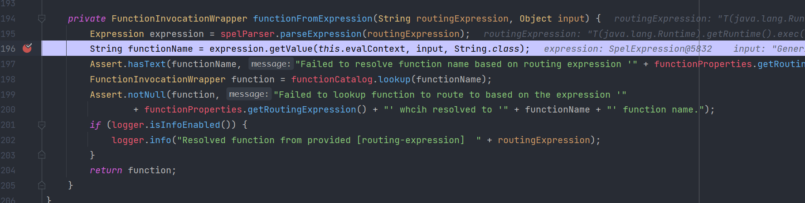
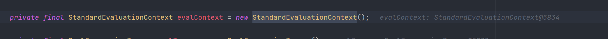
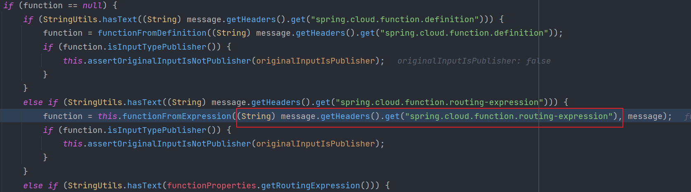
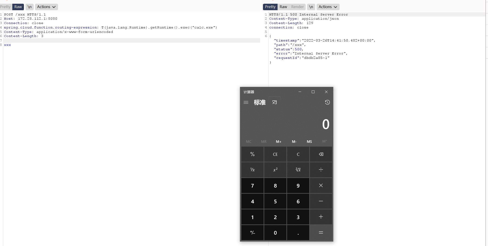
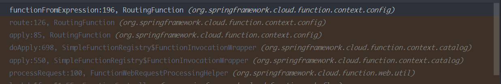
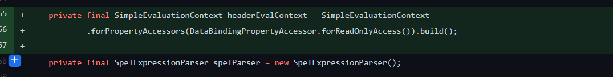
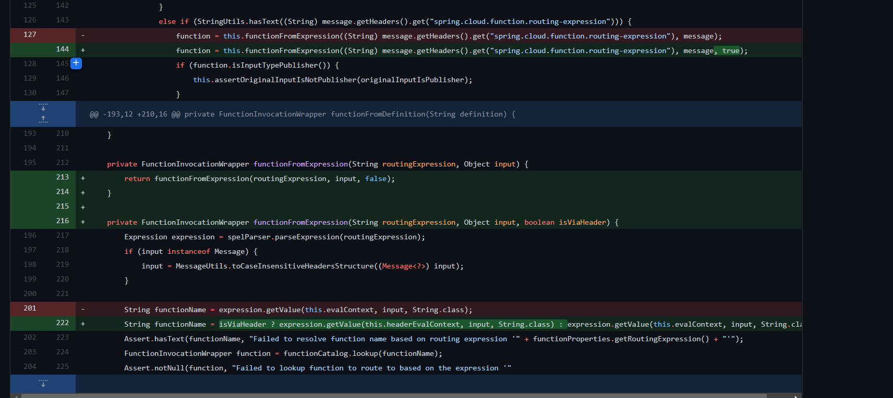

- [SpringCloudFunction Function Routing SPEL 注入](#springcloudfunction-function-routing-spel-注入)
  - [影响版本](#影响版本)
  - [环境搭建](#环境搭建)
  - [原理分析](#原理分析)
    - [Function Routing](#function-routing)
    - [functionFromExpression](#functionfromexpression)
  - [漏洞复现](#漏洞复现)
  - [补丁](#补丁)
# SpringCloudFunction Function Routing SPEL 注入
## 影响版本
2.2<=version<= 3.2.2
## 环境搭建
https://github.com/spring-cloud/spring-cloud-function/releases/tag/v3.2.2
启动/sample/function-sample-pojo项目.
## 原理分析
### Function Routing
关于`Function Routing`是`SpringCloudFunction`从v2.2版本起提供的新特性，官方说明如下：  
  
该功能旨在提供一个可以通过路由的方式来调用某个单独函数的功能，其中有两种路由方式一种为动态另一种为静态。其通过在Header头中指定相关参数在后端进行调用。  
**静态方式**：使用`spring.cloud.function.definition`Header头,在后面跟要执行的函数名，如`spring.cloud.function.definition=foor|bar`。  
**动态方式**：使用`spring.cloud.function.routing-expression`Header头，该方式使用SPEL表达式来执行该Header头的值来动态得到要执行的函数功能。
### functionFromExpression
开启动态执行功能需要在配置文件中指定`spring.cloud.function.definition:functionRouter`.
  
相关代码实现如下：
查看是否开启`functionRouter`.

动态路由函数功能实现如下。
  
可以看到其将路由表达式带入了`expression.getValue`进行计算,而使用的表达式上下文环境`this.evalContext`默认使用的是`StandardEvaluationContext`.  
  
而计算的表达式从`org/springframework/cloud/function/context/config/RoutingFunction.java`可以看到正是从`spring.cloud.function.routing-expression`Header中得到，也就是完全可控，最后造成了表达式注入。

## 漏洞复现
在Header头中指定`spring.cloud.function.routing-expression`为恶意SPEL表达式。
  
相关调用栈如下:

## 补丁
修复方式主要是判断了表达式的来源，如果使用Header中外部输入的话则使用`SimpleEvaluationContext `上下文计算表达式，如果是内部输入的话才使用`StandardEvaluationContext `.

