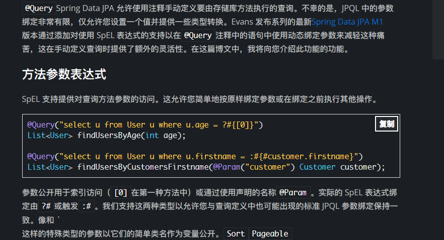
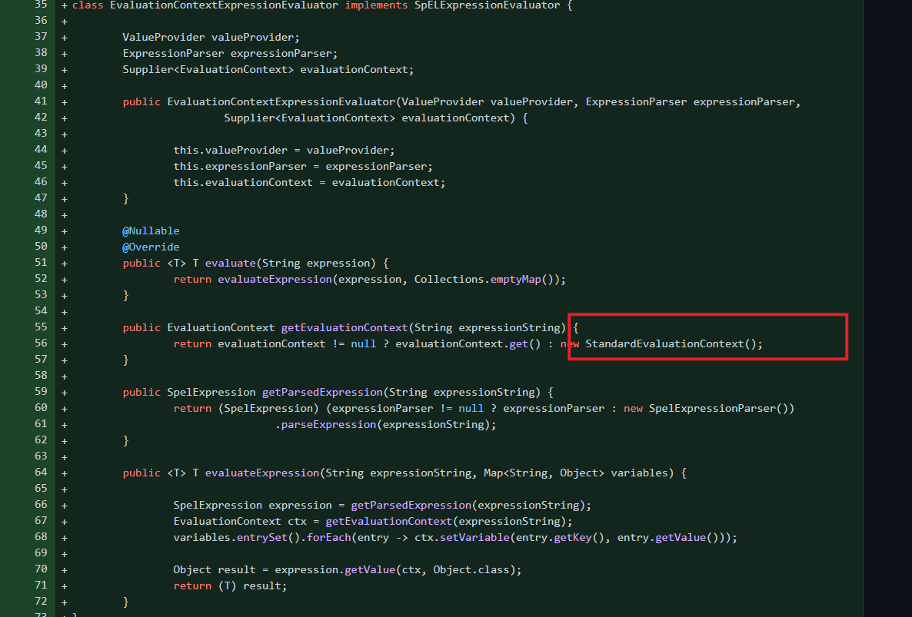

- [CVE-2022-22980 Spring Data Mongodb SPEL表达式注入](#cve-2022-22980-spring-data-mongodb-spel表达式注入)
  - [影响版本](#影响版本)
  - [环境搭建](#环境搭建)
  - [原理分析](#原理分析)
    - [SPEL  Support](#spel--support)
  - [漏洞复现](#漏洞复现)
  - [补丁](#补丁)
# CVE-2022-22980 Spring Data Mongodb SPEL表达式注入
## 影响版本
Spring Data MongoDB-Spring =3.4.0||>=3.3.0&&<=3.3.4||=旧的、不受支持的版本

## 环境搭建
```java
package com.example.cve_2022_22980;

import org.springframework.web.bind.annotation.RequestMapping;
import org.springframework.web.bind.annotation.RequestParam;
import org.springframework.web.bind.annotation.RestController;

import java.util.List;


@RestController
public class Controller {
  private final TestRepository testRepository;

    public Controller(TestRepository testRepository){
        this.testRepository = testRepository;
    }

    @RequestMapping (value = "/search")
    public List<User> getUser(@RequestParam(name = "key") String key){
        return testRepository.findUserByKey(key);
    }
}


package com.example.cve_2022_22980;

import org.springframework.data.mongodb.repository.MongoRepository;
import org.springframework.data.mongodb.repository.Query;
import org.springframework.stereotype.Repository;

import java.util.List;


@Repository
public interface TestRepository extends MongoRepository<User,String> {

@Query("{ key : :#{?0} }")
List<User> findUserByKey(String key);

}

package com.example.cve_2022_22980;

public class User {

    public int id;
    public String name;
    public User(int id,String name){
        this.id = id;
        this.name = name;
    }
}

```
## 原理分析
### SPEL  Support
主要原因在于Spring Data JPA M1版本开始支持使用SPEL表达式来在@QUERY注释语句中提供动态绑定的特性,当参数可控时则会造成SPEL注入.  
  

[官方SEPL支持说明文档](https://spring.io/blog/2014/07/15/spel-support-in-spring-data-jpa-query-definitions)  

## 漏洞复现


## 补丁
使用StandardEvaluationContext执行环境.
  

[Commit](https://github.com/spring-projects/spring-data-mongodb/commit/5e241c6ea55939c9587fad5058a07d7b3f0ccbd3)