- [CVE-2023-50164 ApacheStruts2 远程代码执行漏洞](#cve-2023-50164-apachestruts2-远程代码执行漏洞)
  - [影响版本](#影响版本)
  - [环境搭建](#环境搭建)
  - [漏洞原理](#漏洞原理)
    - [FileUploadInterceptor](#fileuploadinterceptor)
    - [ParametersInterceptor](#parametersinterceptor)
    - [case insensitive](#case-insensitive)
  - [漏洞复现](#漏洞复现)
  - [补丁](#补丁)
  - [参考](#参考)

# CVE-2023-50164 ApacheStruts2 远程代码执行漏洞
## 影响版本
2.5.0<=Apache Struts2<=2.5.32  
6.0.0<=Apache Struts2<=6.3.0 
## 环境搭建
UploadAction.java
```java
public class UploadAction extends ActionSupport {

    private static final long serialVersionUID = 1L;
    private File upload;
    private String uploadContentType;
    public File getUpload() {
        return upload;
    }
    public void setUpload(File upload) {
        this.upload = upload;
    }
    public String getUploadContentType() {
        return uploadContentType;
    }
    public void setUploadContentType(String uploadContentType) {
        this.uploadContentType = uploadContentType;
    }
    public String getUploadFileName() {
        return uploadFileName;
    }
    public void setUploadFileName(String uploadFileName) {
        this.uploadFileName = uploadFileName;
    }
    public String doUpload() {
        String path = ServletActionContext.getServletContext().getRealPath("/")+"upload";
        String realPath = path + File.separator +uploadFileName;
        try {
            FileUtils.copyFile(upload, new File(realPath));
        }
        catch (Exception e) {
            e.printStackTrace();
        }
        return SUCCESS;
    }
}
```
## 漏洞原理
该漏洞主要是由于文件上传时的文件名参数名在存储时是分大小写的,通过参数绑定的特性导致相关注入大写的相关参数，再通过自动调用setter方法不区分首字母大小写导致可以对相关文件名参数二次调用进行变量覆盖，最后进行目录穿越或者绕过文件上传的安全过滤机制上传WebShell.
### FileUploadInterceptor
FileUploadInterceptor 文件上传拦截器位于`org/apache/struts2/interceptor/FileUploadInterceptor.java`,当请求中包含文件时会自动调用,其中会自动添加3个相关参数()到上下文中。 
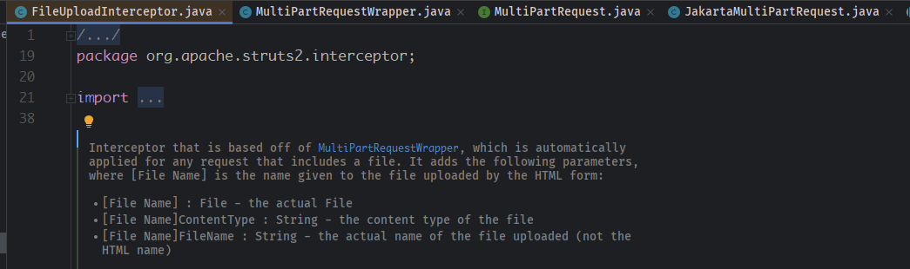  
```
[File Name] : File - the actual File
[File Name]ContentType : String - the content type of the file
[File Name]FileName : String - the actual name of the file uploaded (not the HTML name)
```  
发送一个常规文件名目录穿越的请求如下：  
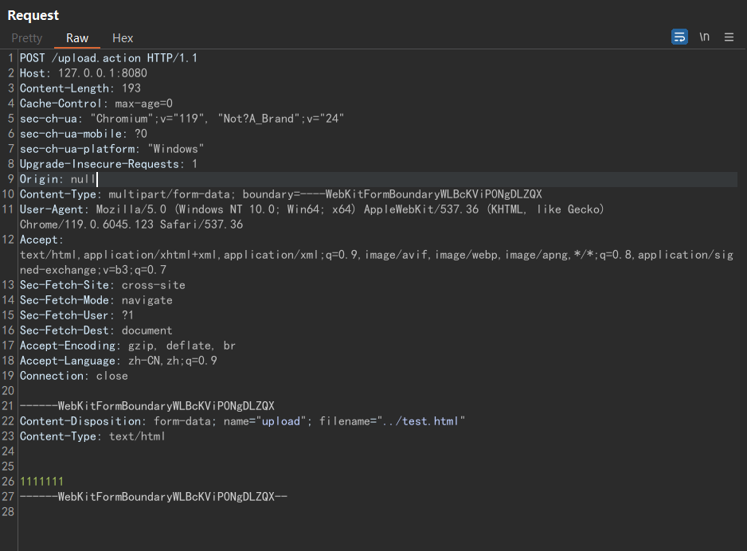
来到该拦截器中，其主要逻辑是遍历文件上传请求中的文件参数，然后做了一些安全校验，得到最终合法的文件。  
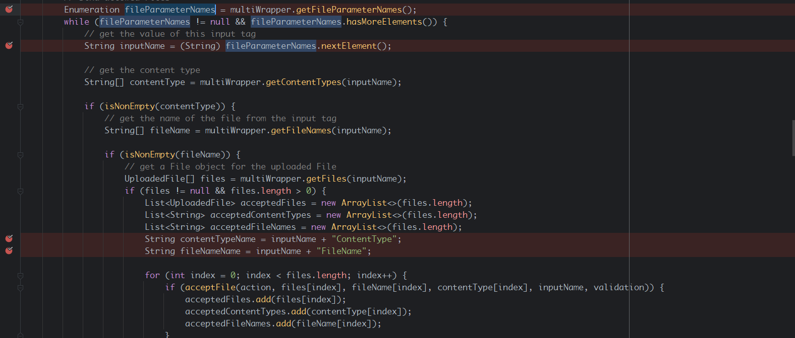  
其中文件名（filename参数）是从multiWrapper.getFileNames中获取。
```java
String[] fileName = multiWrapper.getFileNames(inputName);
```  
在其中会调用`org/apache/struts2/dispatcher/multipart/AbstractMultiPartRequest.java#getCanonicalName()`方法会文件名进行安全过滤，主要就是防止目录穿越。  
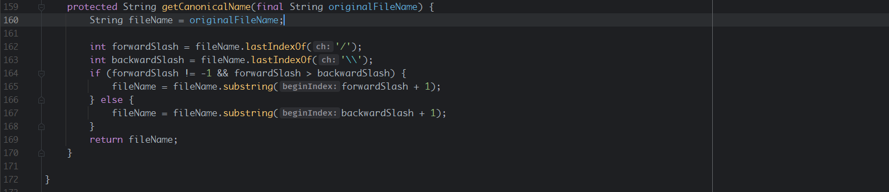  
得到安全的文件名称后就开始设置开头说得相关参数，可以看到其中的逻辑是将inputName和`ContentType`,`FileName`做拼接得到contentTypeName参数名和fileNameName参数名。  
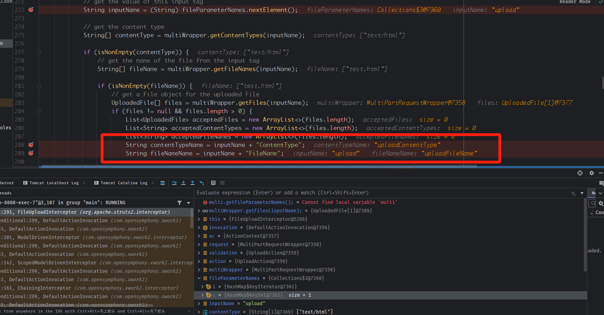
然后将该参数添加到ac中，也就是actionContext,该action的上下文中。  
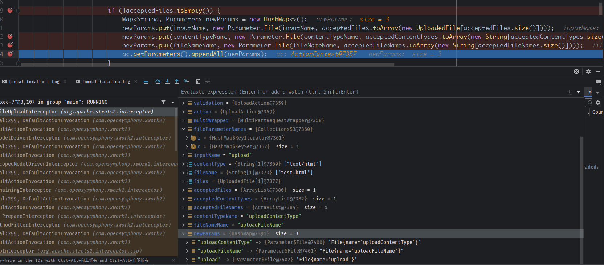  
最后会通过`com/opensymphony/xwork2/interceptor/ParametersInterceptor.java#setParameters`将对应Action中含有set方法的参数设置到对应的属性中，Action就可以获取到文件上传的相关参数值了。  
  
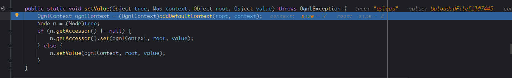   
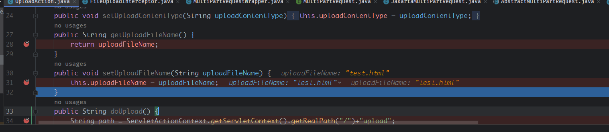  
### ParametersInterceptor
而从`FileUploadInterceptor`中可以看到，文件名的名称是固定的上传请求中的name+FileName,那么在action中为了获取到该文件名那么自然对应的属性名也就是name+FileName了。  

而Struts2经典的参数绑定特性则是在文件上传拦截器进行处理之前就进行了参数设置，如果我们注入一个相同的参数名进行覆盖，那么在`FileUploadInterceptor`中会被覆盖掉，因为存储参数值的属性是一个map结构，Key是唯一的，尝试注入一个uploadFilename参数为，请求如下：  
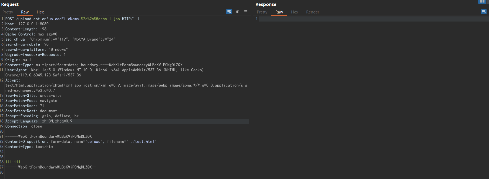  
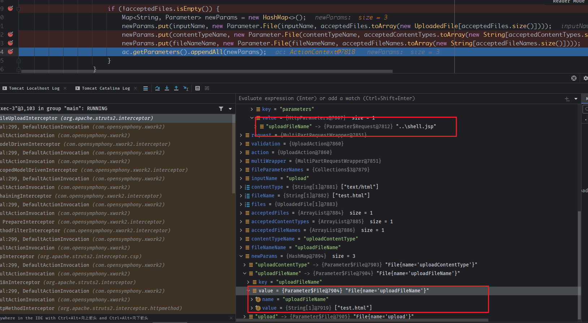  
调用appendAll添加到上下文中，可以看到两个uploadFilename参数，最后注入的uploadFilename参数值会被覆盖为test.html。
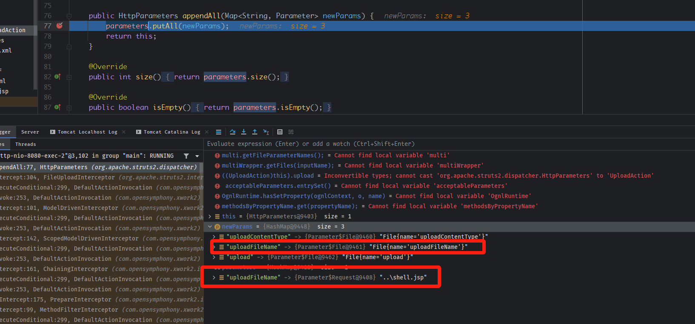  
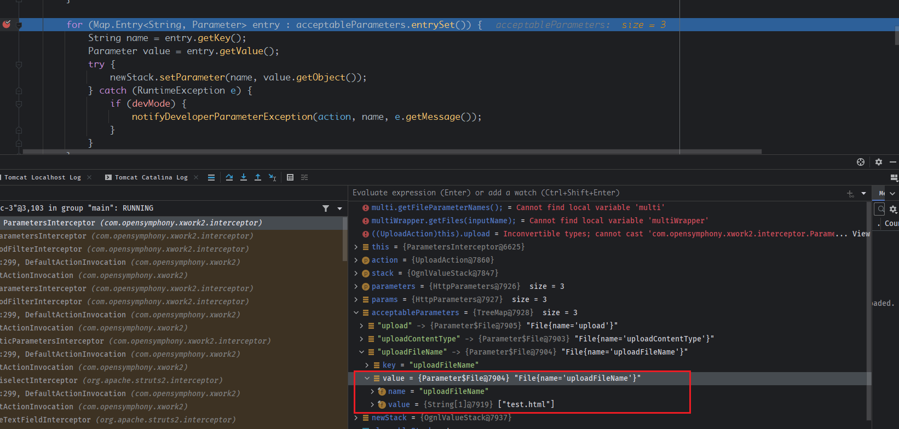
### case insensitive
该漏洞有两个关键的大小写差异，在Map中是区分大小写的，a和A是不同的Key，而set方法反射设置属性值时第一个字母是不区分大小写的，setAxx和setaxx方法是一样的，如果将上传name的首字母大写，请求如下  
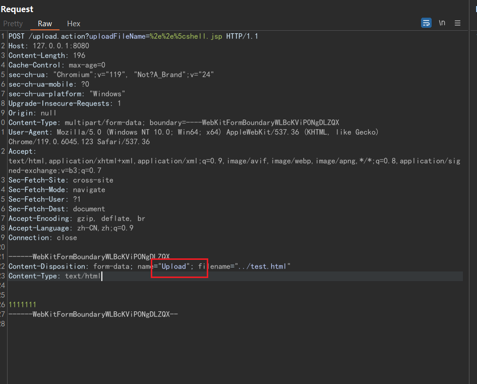  
可以看到得到的文件上传的相关属性值如下  
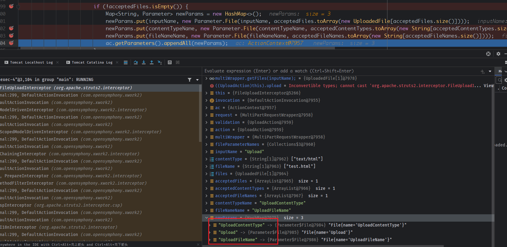  
那么在反射设置相关属性值可以发现同时存在`uploadFilename`,`UploadFilename`。 
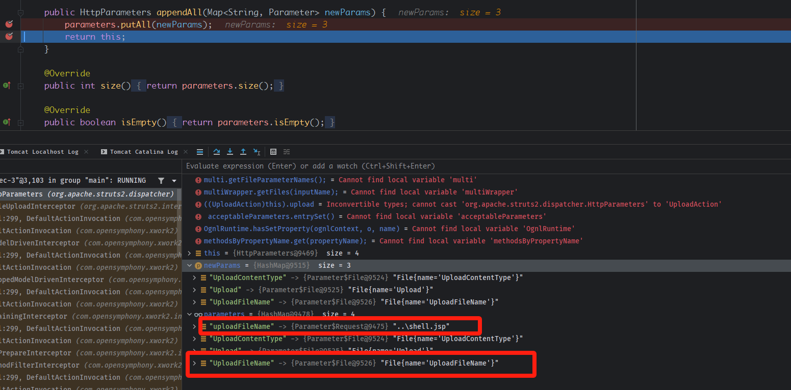  
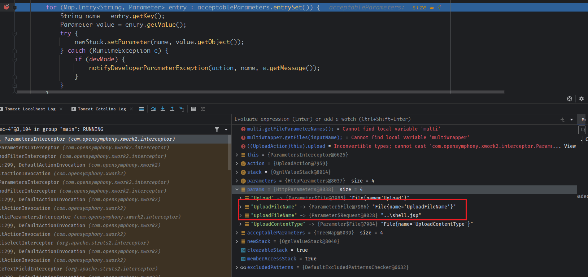  
那么就会调用两次setUploadFilename方法来设置对应的属性。  
第一次设置正常的UploadFileName。  
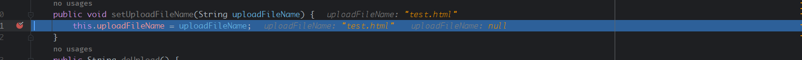  
第二次设置恶意的`UploadFileName`,覆盖原来的属性值。  
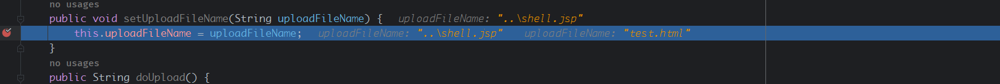  
而且在这里只能是文件上传的name首字母大写，如果是恶意文件名的参数名字母大写`?UploadFileName=%2e%2e%5cshell.jsp`，那么得到的参数列表顺序如下  
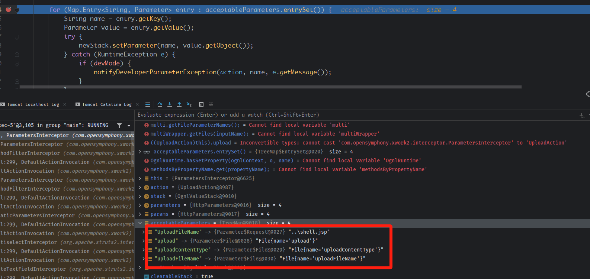
我们注入的恶意文件名会在第一个，会先被调用进行设置，导致后面会被正常的文件名覆盖。  
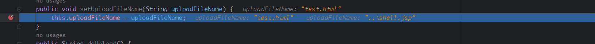  
而其它字母大写是找不到对应的setter方法的，因为setter只对首字母大小写不敏感。
## 漏洞复现
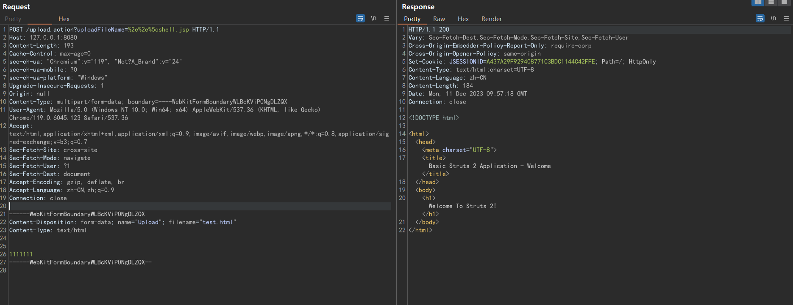  

  
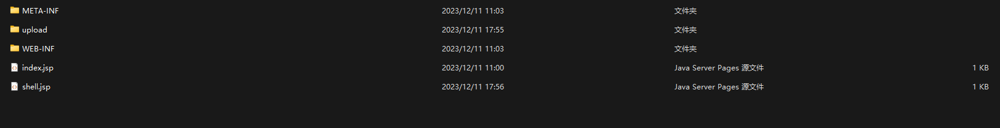
## 补丁  
在HttpParameters.java中对HTTP参数进行获取时，不再区分大小写，导致无法再通过大小写来进行变量覆盖。  
https://github.com/apache/struts/commit/162e29fee9136f4bfd9b2376da2cbf590f9ea163      
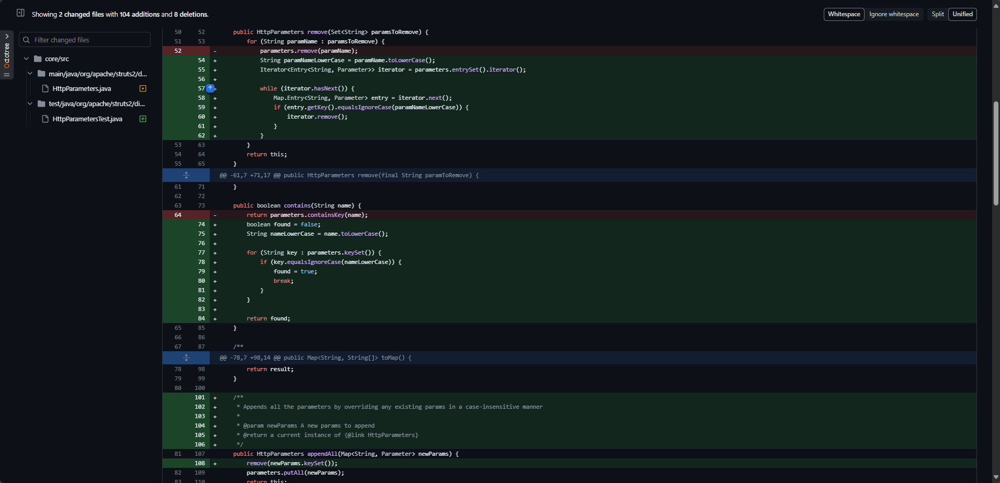

## 参考  
https://github.com/apache/struts/commit/162e29fee9136f4bfd9b2376da2cbf590f9ea163#