- [CVE-2022-22954 VMware WorkSpace ONE Access 未授权 SSTI](#cve-2022-22954vmware-workspace-one-access-未授权-ssti)
  - [环境搭建](#环境搭建)
  - [影响版本](#影响版本)
  - [原理分析](#原理分析)
    - [customError.ftl](#customerrorftl)
    - [UiErrorController](#uierrorcontroller)
    - [resolveException](#resolveexception)
    - [handleAnyGenericException](#handleanygenericexception)
    - [LocalizationParamValueException](#localizationparamvalueexception)
    - [InvalidAuthContextException](#invalidauthcontextexception)
  - [漏洞复现](#漏洞复现)
  - [补丁](#补丁)
# CVE-2022-22954 VMware WorkSpace ONE Access 未授权 SSTI
## 环境搭建
http://file.xipudata.com/ 下载OVA导入VMware.  
安装时填写FQDN名称,并且用域名访问安装.
## 影响版本

## 原理分析
### customError.ftl
在补丁中删除了`endusercatalog-ui-1.0-SNAPSHOT-classes.jar`中的customError.ftl Freemaker模板文件,其中FM模板代码如下  
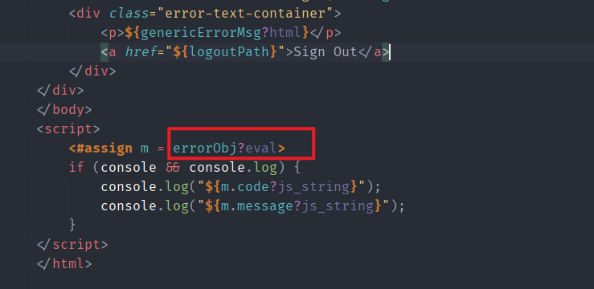
使用eval来渲染errorObj对象.
在Freemaker中,eval用于求值,也就是会把前面的字符串当作ftl模板代码进行解析,如果errorObj可控则会导致SSTI.
### UiErrorController
在包中搜索使用了customError模板的地方,在`UiErrorController.class#handleGenericError`中renturn跳转到该模板渲染,并且设置了`errorObj`属性的值.    
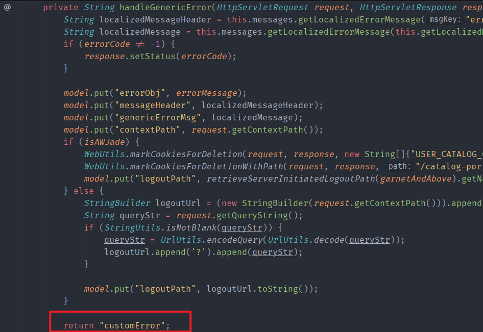  
而调用了`handleGenericError`的地方有两个如下`getErrorPage`和`handleUnauthorizedError`.
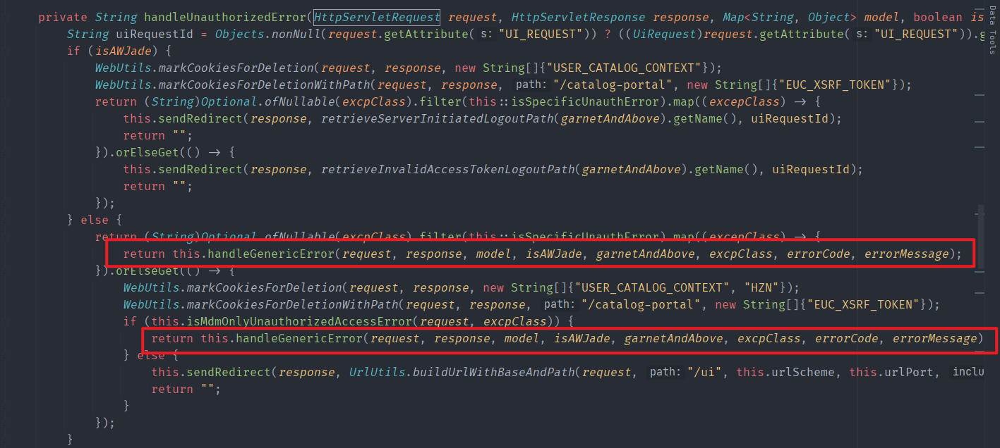
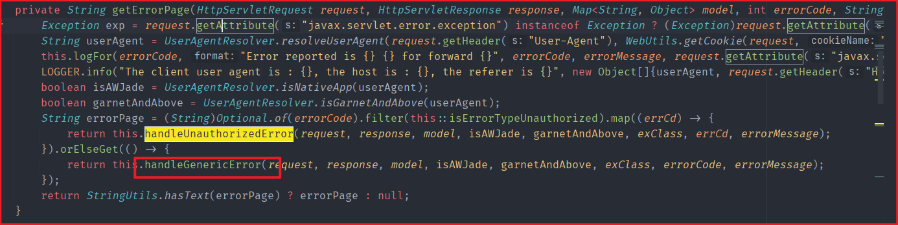  
而调用`handleUnauthorizedError`也在`getErrorPage`中,所以只用看调用了`getErrorPage`的地方,一共有两个路由如下  
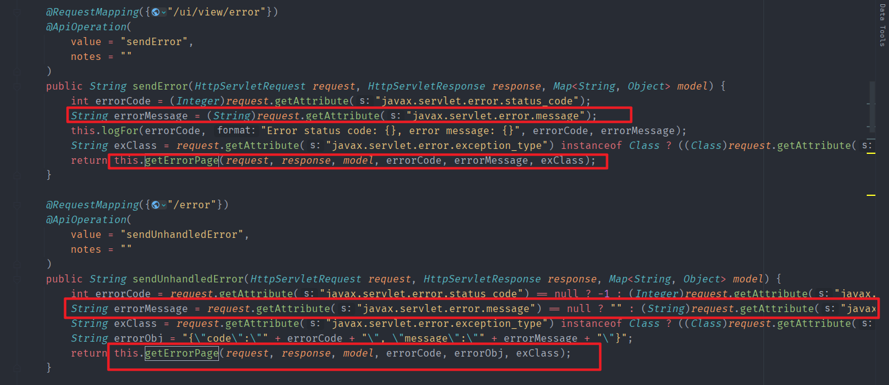  
但`/ui/view/error`和`/error`路由下的`errorMessage`均来自`javax.servlet.error.message`无法控制.
在包中再次搜索是否有访问这两个路由的其它地方.
  
### resolveException
可以发现在`UiApplicationExceptionResolver.class#resolveException`中使用return跳转到了`ui/view/error`路由下,其中还设置了`javax.servlet.error.message`的值为`errorJson`,该值来自于调用时的最后一个参数` Object... msgArgs`.
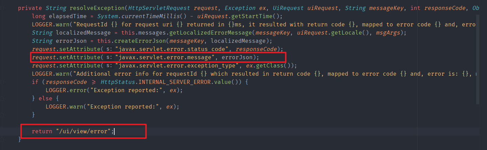  
### handleAnyGenericException
调用`resolveException`的地方是两个异常处理类`handleHttpMediaTypeNotAcceptableException`和`handleAnyGenericException`.
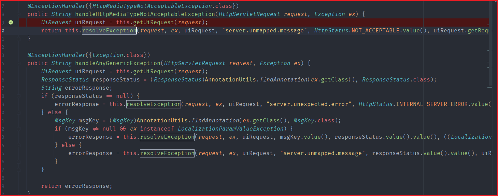  
在`handleHttpMediaTypeNotAcceptableException`中,其调用`resolveException`的最后一个参数为`uiRequest.getRequestId()`不可控,无法利用,且其只处理`MediaType`类型异常.  
```java
return this.resolveException(request, ex, uiRequest, "server.unmapped.message", HttpStatus.NOT_ACCEPTABLE.value(), uiRequest.getRequestId());
```
而`handleAnyGenericException`则会处理所有通用异常异常类.
### LocalizationParamValueException
而在`handleAnyGenericException`中,进入`resolveException`时会根据异常的类型传入不同的参数,如果异常类不是`LocalizationParamValueException`子类的话则传入的参数和`handleHttpMediaTypeNotAcceptableException`一致,为`uiRequest.getRequestId()`,所以还要抛出`LocalizationParamValueException`异常类.  

```java
            if (msgKey != null && ex instanceof LocalizationParamValueException) {
                errorResponse = this.resolveException(request, ex, uiRequest, msgKey.value(), responseStatus.value().value(), ((LocalizationParamValueException)ex).getArgs());
            } else {
                errorResponse = this.resolveException(request, ex, uiRequest, "server.unmapped.message", responseStatus.value().value(), uiRequest.getRequestId());
            }
```
此时传入的参数为`(LocalizationParamValueException)ex).getArgs()`.
而`LocalizationParamValueException`中该Args的值在构造函数中设置.  
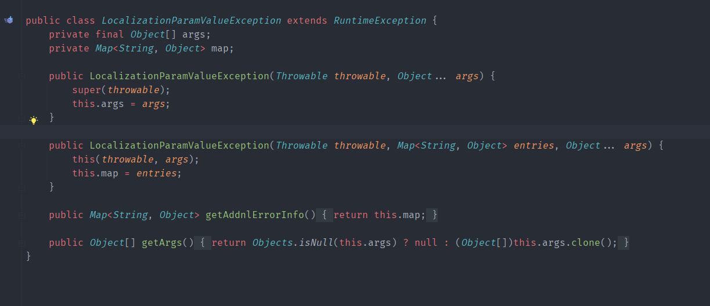
所以需要找到一个抛出`LocalizationParamValueException`或其子类异常且其构造函数可控的地方.
### InvalidAuthContextException
以`InvalidAuthContextException`异常类为例,继承于`LocalizationParamValueException` . 
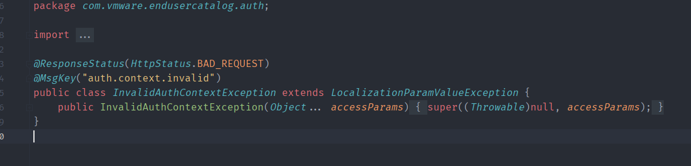
在`AuthContext`的构造函数中抛出该异常.  
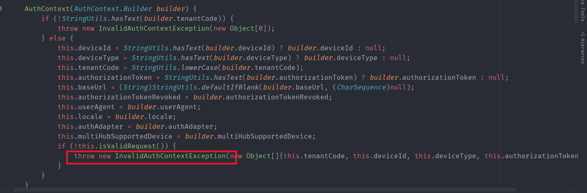  
参数均来自于传入的`AuthContext.Builder builder`对象.    
而生成`AuthContext`对象的地方在`AuthContextPopulationInterceptor`拦截器中  
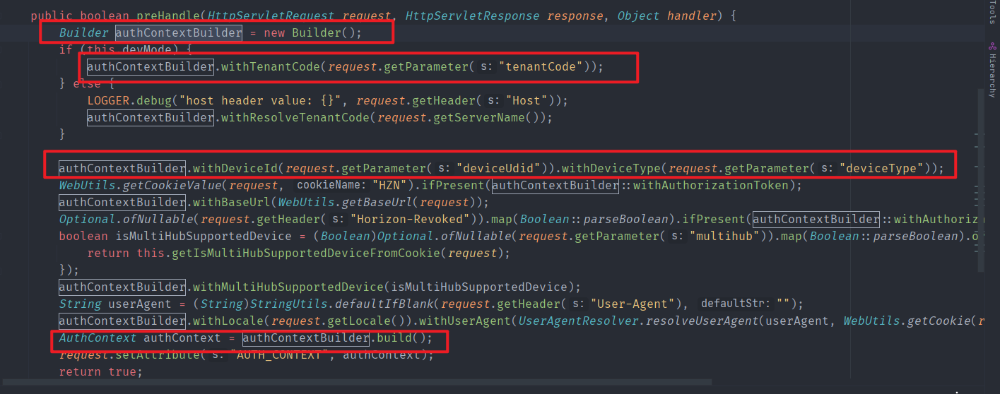  
而且各项参数均是从请求中获取,可控.但该拦截器类是在
`endusercatalog-auth-1.0-SNAPSHOT.jar`中的,正常情况下无法访问到类,但从`UiApplication.class`发现其使用了`@ComponentScan`注解将该auth包的类装配进了bean容器.  
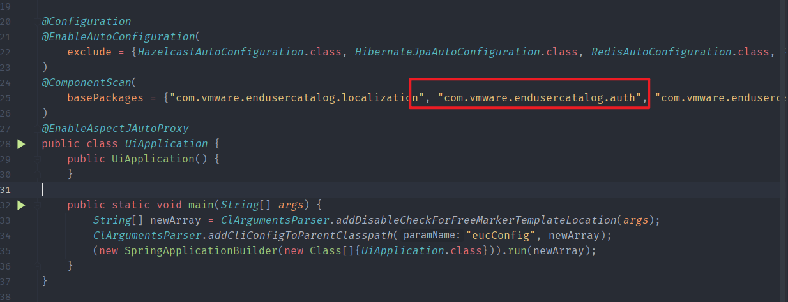  
在包中查找添加该拦截器的地方,处于`endusercatalog\ui\config\WebConfig.class`中  
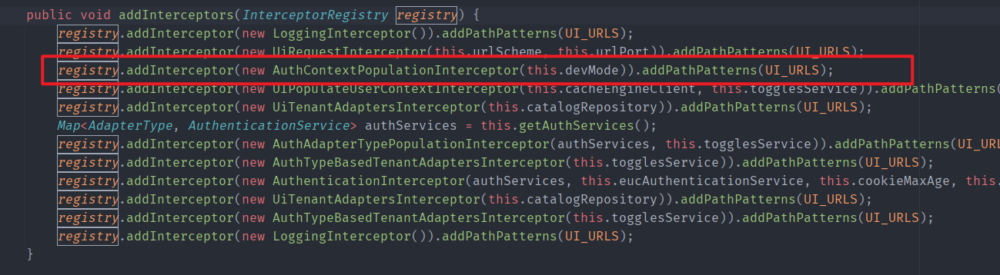  
匹配的url如下  
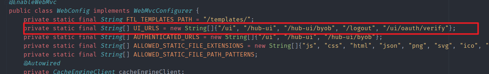  
```
/ui", "/hub-ui", "/hub-ui/byob", "/logout", "/ui/oauth/verify"
```  
以`/hub-ui/byob`为例,构造请求如下  
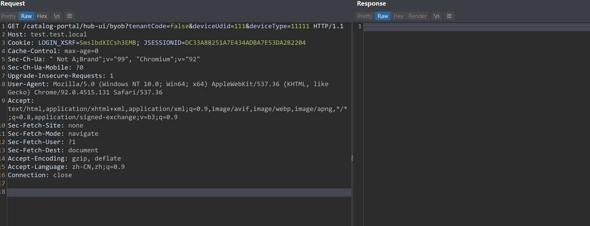  
传入的111已经被带进了`errorJson`从而控制了`javax.servlet.error.message`变量.  
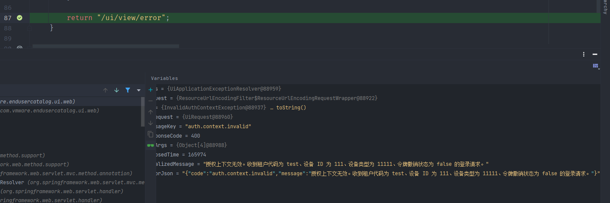  
在最后的`handleGenericError`中成功控制了errObj参数传入tpl模板进行渲染.   
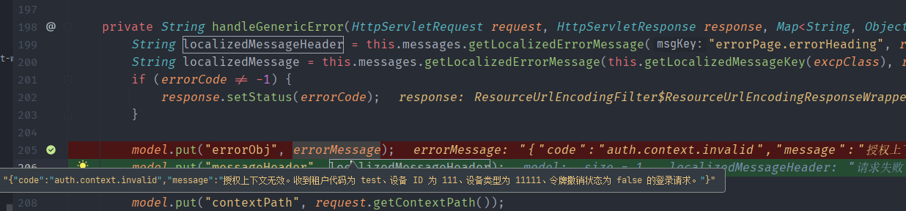
## 漏洞复现
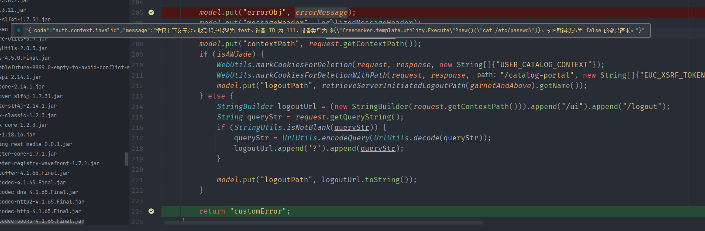
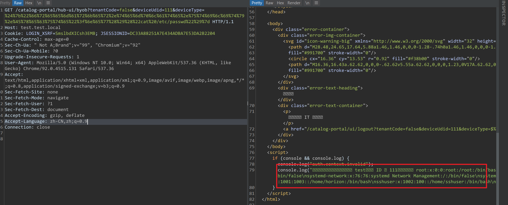
## 补丁
删除了该模板文件