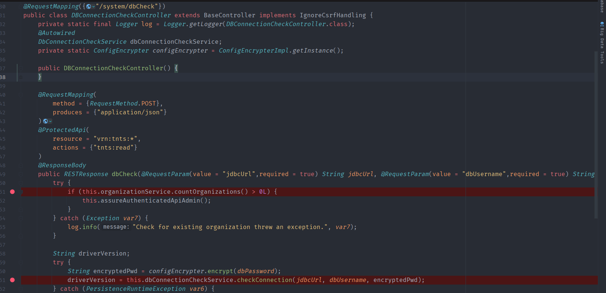
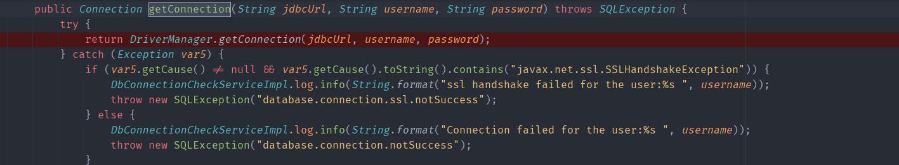
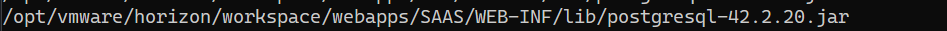
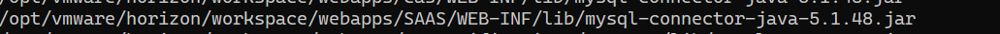
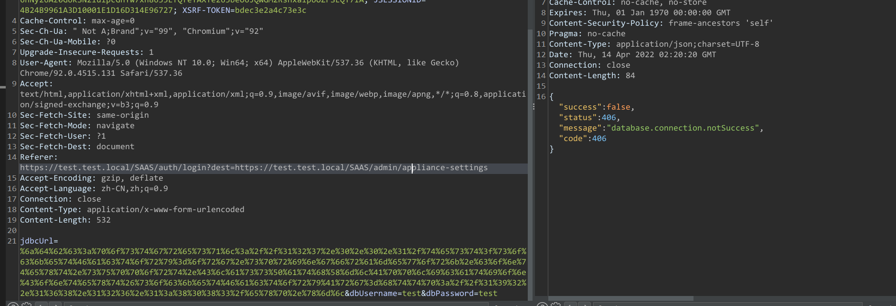
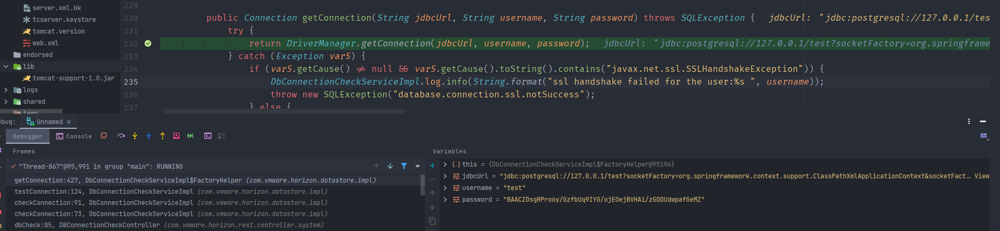
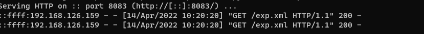

- [CVE-2022-22957(22958)  VMware WorkSpace ONE Access JDBC Attack 远程代码执行](#cve-2022-2295722958-vmware-workspace-one-access-jdbc-attack-远程代码执行)
  - [环境搭建](#环境搭建)
  - [影响版本](#影响版本)
  - [原理分析](#原理分析)
    - [dbCheck](#dbcheck)
    - [驱动版本](#驱动版本)
  - [漏洞复现](#漏洞复现)
  - [补丁](#补丁)
# CVE-2022-22957(22958)  VMware WorkSpace ONE Access JDBC Attack 远程代码执行
## 环境搭建
http://file.xipudata.com/ 下载OVA导入VMware.  
安装时填写FQDN名称,并且用域名访问安装.
## 影响版本
VMware Workspace One Access-VMware, Inc.
=21.08.0.1||=21.08.0.0||=20.10.0.1||=20.10.0.0

VMware Cloud Foundation-VMware,Inc.
=4.x||=3.x

VMware Identity Manager-VMware, Inc.
=3.3.6||=3.3.5||=3.3.4||=3.3.3

VMware vRealize Automation-VMware,Inc.
=8.x||=7.6

vRealize Suite Lifecycle Manager-VMware
=8.x
## 原理分析
一个利用PostgreSql,一个利用Mysql.
### dbCheck
补丁中对`/API/1.0/REST/system/dbCheck`路由做了限制,不允许直接访问.
  
该路由定义位置为`DBConnectionCheckController`.  

可以看到在`dbCheck`方法中有一个获取驱动版本的方法,传入了请求中获取的jdbcurl和用户名,密码  
```java
  driverVersion = this.dbConnectionCheckService.checkConnection(jdbcUrl, dbUsername, encryptedPwd);
```
跟进`this.dbConnectionCheckService.checkConnection`最后会来到`DbConnectionCheckServiceImpl.class`实现类的`getConnection`来获取连接.  
  
可以看到调用的`DriverManager.getConnection(jdbcUrl, username, password);`建立连接,造成可以进行jdbc Attack.
### 驱动版本
各个数据库的依赖包版本如下  
Postgresql:
  
Mysql:  
  
都处于可利用版本
## 漏洞复现
PostgreSql加载恶意bean,程序含有Spring利用相关依赖包:  





Mysql
## 补丁
限制了对该路由的直接访问.