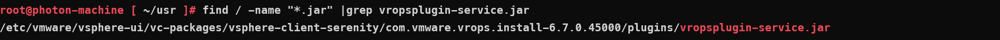
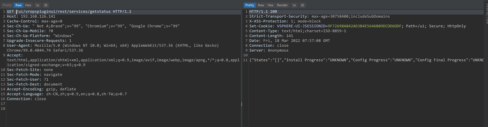
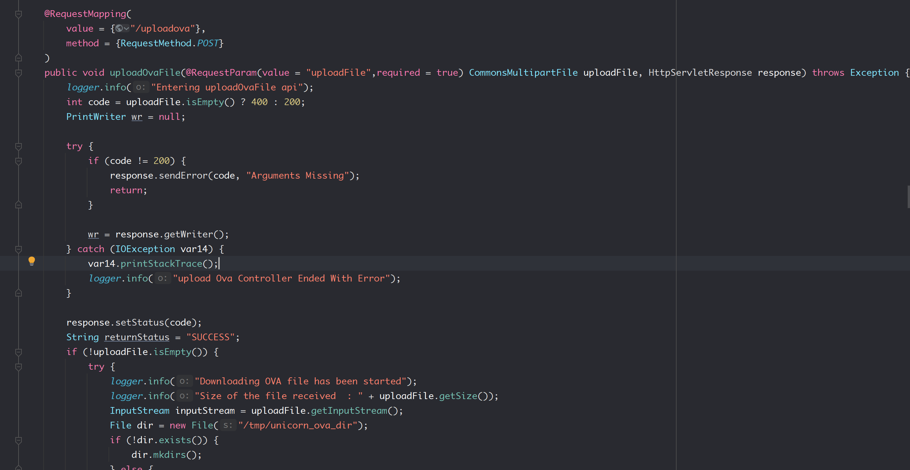
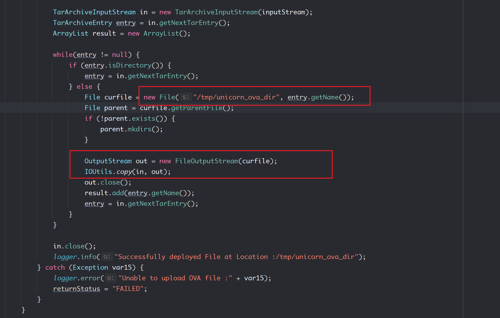
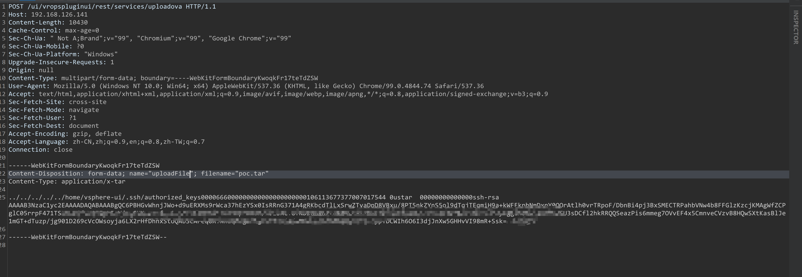
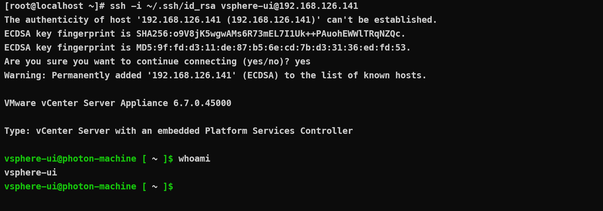

- [CVE-2021-21972 Vcenter Server 未授权远程代码执行漏洞](#cve-2021-21972-vcenter-server-未授权远程代码执行漏洞)
  - [影响版本](#影响版本)
  - [环境搭建](#环境搭建)
  - [原理分析](#原理分析)
    - [vropsPlugins](#vropsplugins)
      - [uploadOvaFile](#uploadovafile)
  - [漏洞复现](#漏洞复现)
    - [Linux](#linux)
    - [Windows](#windows)
  - [补丁](#补丁)
# CVE-2021-21972 Vcenter Server 未授权远程代码执行漏洞
## 影响版本
vmware:vcenter_server 7.0 U1c 之前的 7.0 版本
vmware:vcenter_server 6.7 U3l 之前的 6.7 版本
vmware:vcenter_server 6.5 U3n 之前的 6.5 版本
## 环境搭建
1. EXSI.
2. 然后安装VCSA.

安装步骤参考B站: 
https://www.bilibili.com/video/BV1Cp4y147Dd
https://www.bilibili.com/video/BV1G541187F4

VCSA ISO下载链接: https://blog.whsir.com/post-5673.html
EXSI ISO下载链接: https://pan.baidu.com/s/1zX4Y4RZe5sBepgRyJm27_Q  提取码:rjda
## 原理分析
### vropsPlugins
jar包路径:  

同时访问该插件服务不需要授权.

#### uploadOvaFile
该插件中有一个`uploadOvaFile`方法可以上传Ova文件,相关代码如下:

从http请求中得到一个文件上传包,关键在于后面处理该文件时的逻辑:

其解压该ova文件,然后遍历其中的所有条目,将每一个条目的名字和`/tmp/unicorn_ova_dir`字符串做拼接得到该条目在服务器上的存储路径
,然后使用IOUtis.copy写入,在整个过程中没有对条目的名字进行过滤,导致可以创建带名字../的文件进行路径穿越,实现对服务器的任意文件写入.
## 漏洞复现
大多数压缩文件会防止压缩时放入如../这种路径遍历的压缩文件,但编程语言并没有这方面机制,可以用脚本来创建这种恶意压缩文件.
工具链接:https://github.com/ptoomey3/evilarc

### Linux
对于 Linux 版本，可以创建一个包含 `../../home/vsphere-ui/.ssh/authorized_keys` 的 TAR 文件并上传后利用 SSH 登陆：
1. 创建恶意压缩文件.

2. 上传恶意压缩文件.

3. 远程ssh登录

### Windows
针对 Windows 版本，可以在目标服务器上写入 JSP webshell 文件，由于服务是 System 权限，所以可以任意文件写。
可写路径:`ProgramData\VMware\vCenterServer\data\perfcharts\tc-instance\webapps\statsreport`
## 补丁
增加了认证和对路径进行了过滤.
