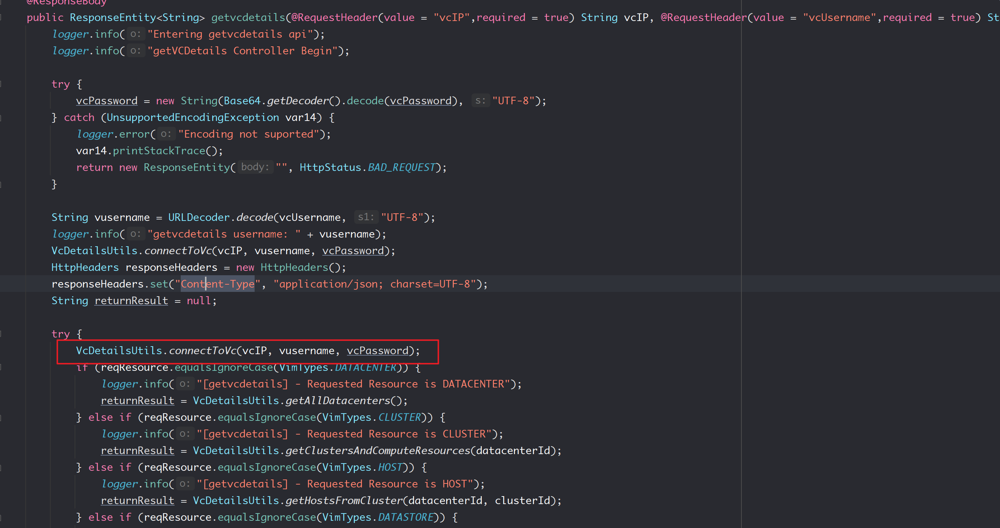
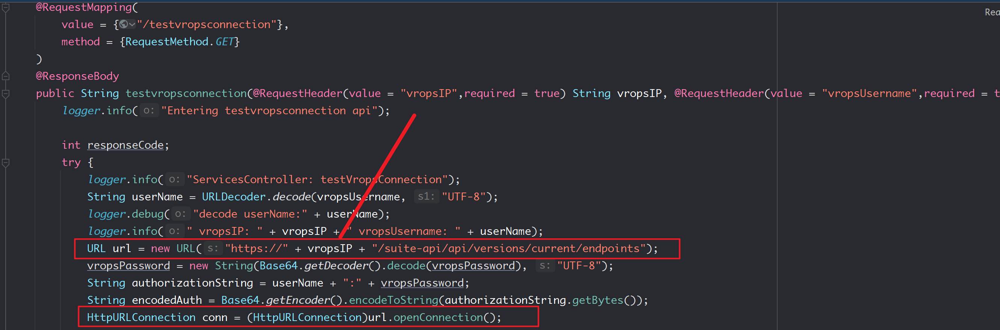
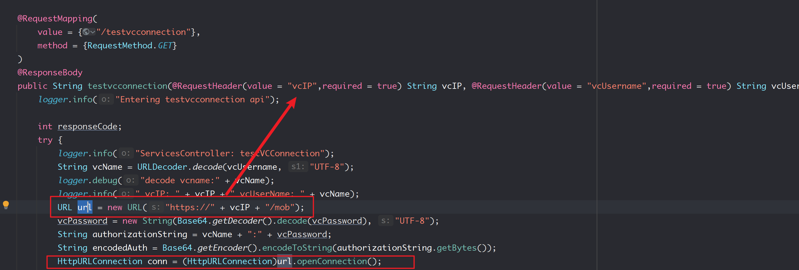
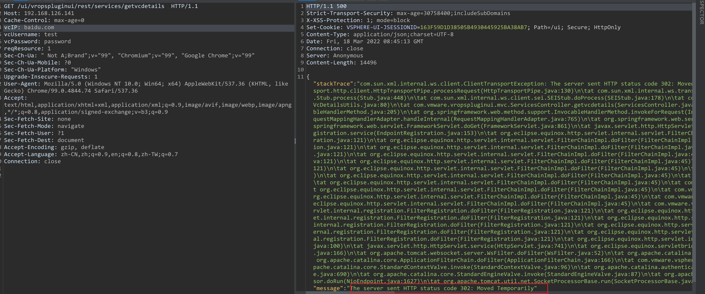

- [CVE-2021-21973](#cve-2021-21973)
  - [影响范围](#影响范围)
  - [环境搭建](#环境搭建)
    - [安装EXSI+VCSA](#安装exsivcsa)
    - [只安装VCSA](#只安装vcsa)
  - [原理分析](#原理分析)
    - [vropsPlugins](#vropsplugins)
      - [vcIP](#vcip)
  - [漏洞复现](#漏洞复现)
  - [补丁](#补丁)
# CVE-2021-21973
## 影响范围
vmware:vcenter_server 7.0 U1c 之前的 7.0 版本  
vmware:vcenter_server 6.7 U3l 之前的 6.7 版本  
vmware:vcenter_server 6.5 U3l 之前的 6.5 版本  
## 环境搭建
### 安装EXSI+VCSA
1. EXSI.
2. 然后安装VCSA.

安装步骤参考B站: 
https://www.bilibili.com/video/BV1Cp4y147Dd  
https://www.bilibili.com/video/BV1G541187F4  

VCSA ISO下载链接: https://blog.whsir.com/post-5673.html  
EXSI ISO下载链接: https://pan.baidu.com/s/1zX4Y4RZe5sBepgRyJm27_Q  提取码:rjda

### 只安装VCSA
不使用EXSI的方法直接搭建Vcenter:
打开iso文件,直接使用vmware导入vcsa目录下的ova文件即可,访问5480端口进行相关即可配置.
## 原理分析
### vropsPlugins
#### vcIP
还是在vropsPlugins插件中,在该插件中对VC地址处理时有多个地方都直接把HTTP请求中的VCIP直接拿来进行URL connection导致SSRF.
getvcdetails方法

testvropsconnection方法

testvcconnection方法

## 漏洞复现

## 补丁