- [CVE-2021-21985](#cve-2021-21985)
  - [影响范围](#影响范围)
  - [环境搭建](#环境搭建)
  - [原理分析](#原理分析)
    - [ProxygenController](#proxygencontroller)
    - [invokeService](#invokeservice)
  - [漏洞复现](#漏洞复现)
    - [MethodInvokingFactoryBean](#methodinvokingfactorybean)
  - [补丁](#补丁)
# CVE-2021-21985
## 影响范围
vmware:vcenter_server 7.0 U2b 之前的 7.0 版本  
vmware:vcenter_server 6.7 U3n 之前的 6.7 版本  
vmware:vcenter_server 6.5 U3o 之前的 6.5 版本  
## 环境搭建
1. EXSI.
2. 然后安装VCSA.

安装步骤参考B站: 
https://www.bilibili.com/video/BV1Cp4y147Dd  
https://www.bilibili.com/video/BV1G541187F4  

VCSA ISO下载链接: https://blog.whsir.com/post-5673.html  
EXSI ISO下载链接: https://pan.baidu.com/s/  1zX4Y4RZe5sBepgRyJm27_Q  提取码:rjda

开始WEB界面debug:`/etc/vmware/vmware-vmon/svcCfgfiles/vsphere-ui.json`
## 原理分析
漏洞jar包路径:  
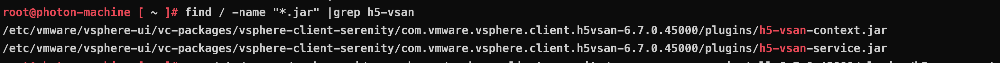
### ProxygenController
`ProxygenController`从名字看是一个代理生成类,在`ProxygenController`中有一个`invokeServiceWithJson`方法支持从Json数据中来调用服务,而json数据是直接从http请求中得到,相关代码如下.
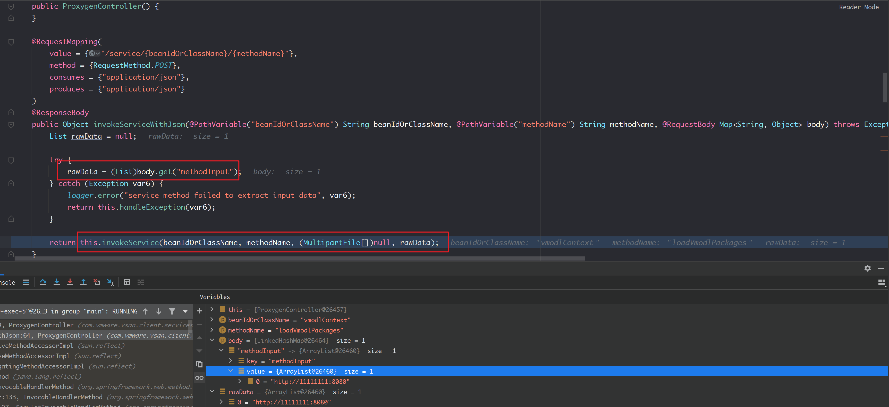
从url中获取bean和方法名,从json中获取`methodInput`,然后在最后传入`this.invokeService`.
### invokeService
在`invokeService`中首先获得到对应的bean实例和方法,调用`method.invoke`执行了指定方法.
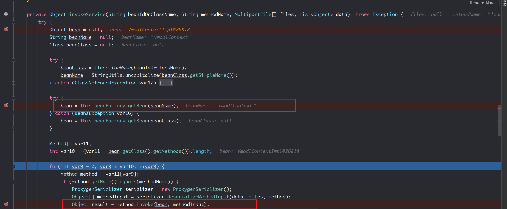
其中使用`class.forname`来尝试获取指定类,然后使用`this.beanFactory.getBean(beanName);`来从工厂中得到指定bean.
工厂中的bean根据版本不同大概有200个左右.
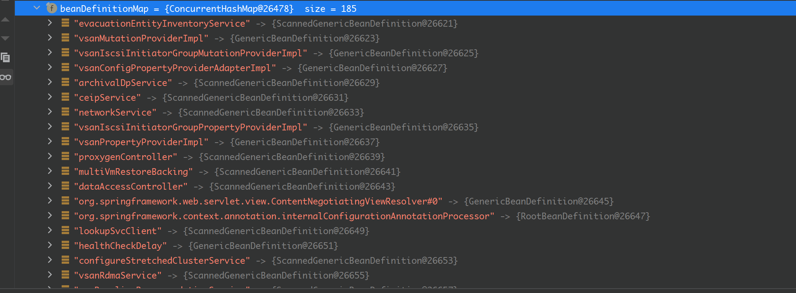
最后只要从其中找到可利用的bean即可.
## 漏洞复现
`com.vmware.vim.vmomi.core.types.impl.VmodContextImpl#loadVmodlPackage`这个利用bean因为版本问题环境中代码有一些差异,这里以MethodInvokingFactoryBean这个bean利用为例.
### MethodInvokingFactoryBean
从`vsan-base-context.xml`可以看到`vsanProviderUtils_setVmodlHelper`这个bean对应的class是`org.springframework.beans.factory.config.MethodInvokingFactoryBean`
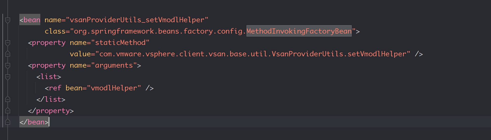
而其在BeanFactory内的映射名称有六个.
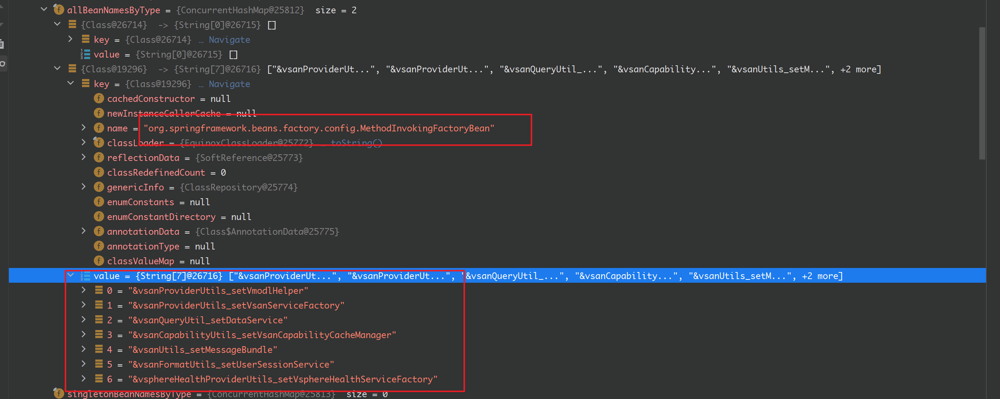
代码如下
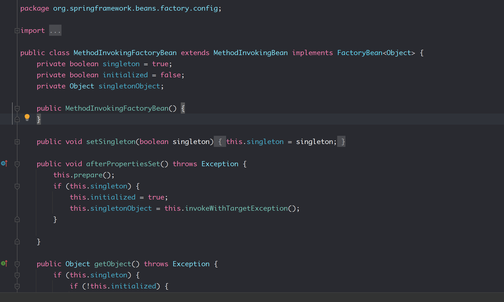
可以看到该类其实最终继承于MethodInvoker类.
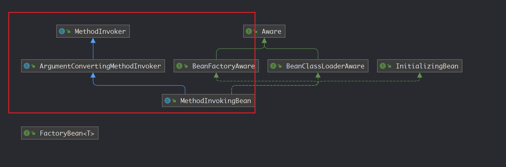
而在MethodInvoker类中的invoke方法则是利用反射来直接执行对象的指定方法,其中的`targetObject`和`preparedMethod`则是通过对应的set方法可以直接设置,同时这些方法都为public方法.
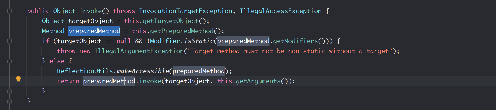
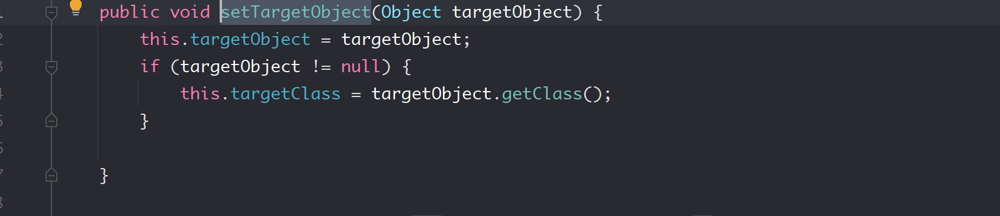
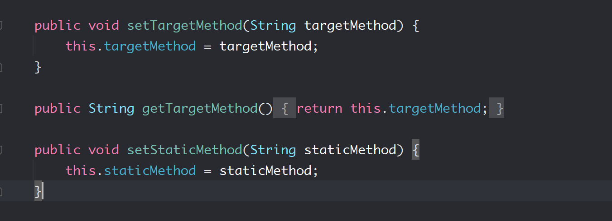

通过prepare方法初始化各项参数.
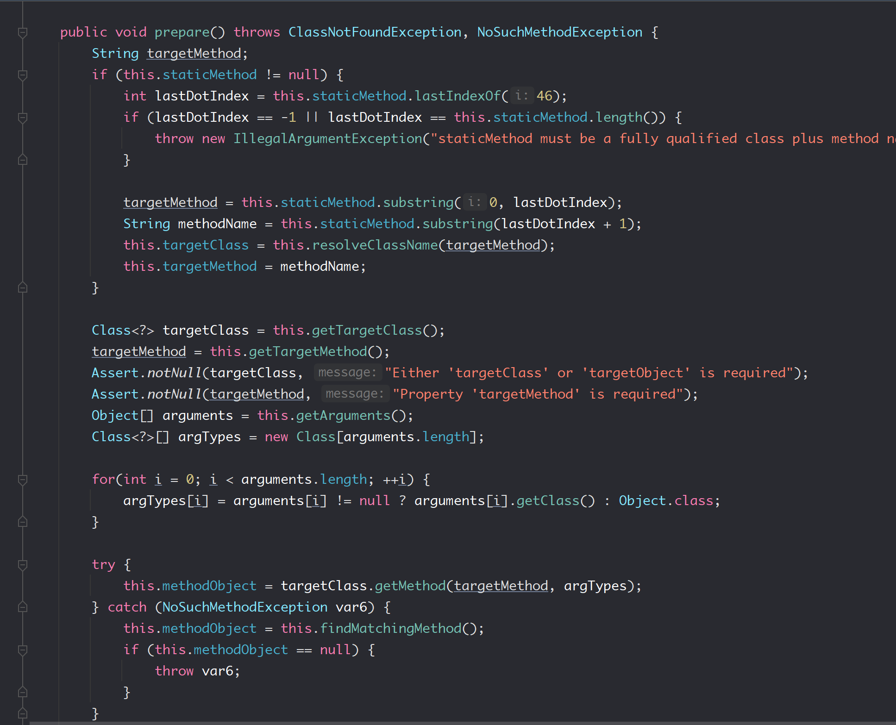
因为在Spring框架中,bean对象在内存中是共用的,所以我们可以通过多次请求来设置该bean对象的参数,最后再调用其invoke方法来执行任意对象的任意方法.
以JDNI注入为例.
1. 因为要执行的doLookup是静态方法,所以第一步先把object置为空

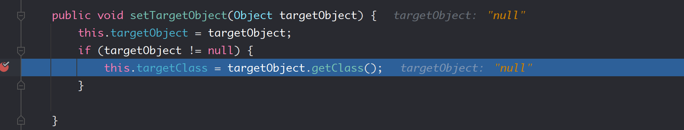
2. 设置StaticMethod
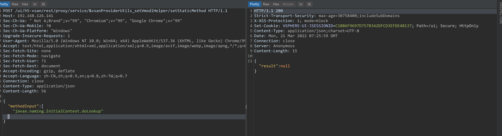
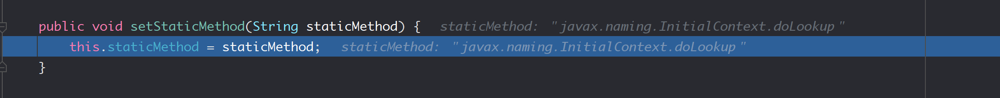
3. 设置参数
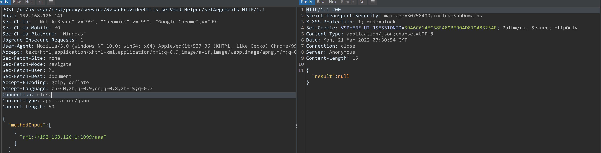
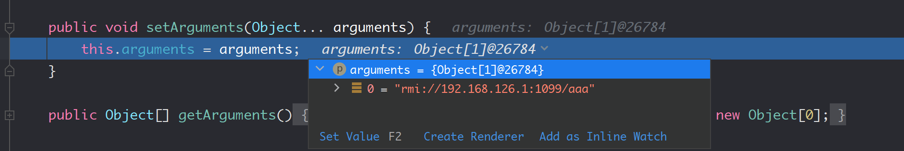
4. 调用prepare初始化参数
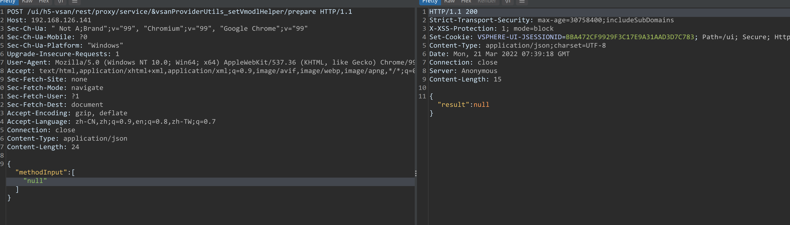
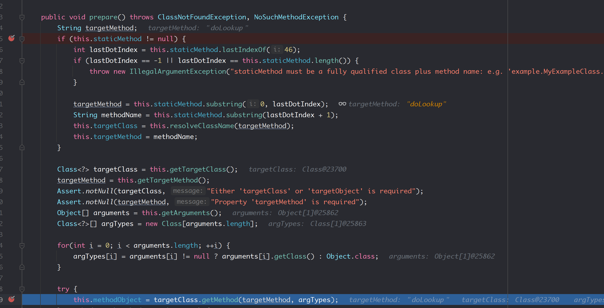
5. 调用invoke触发
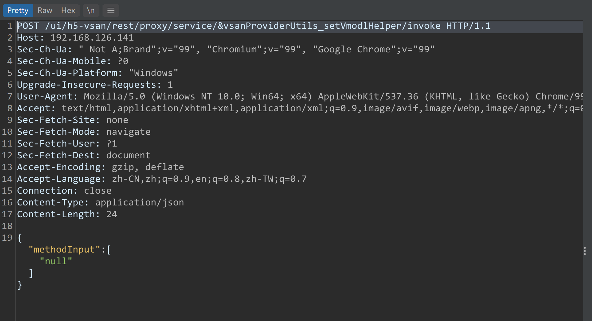
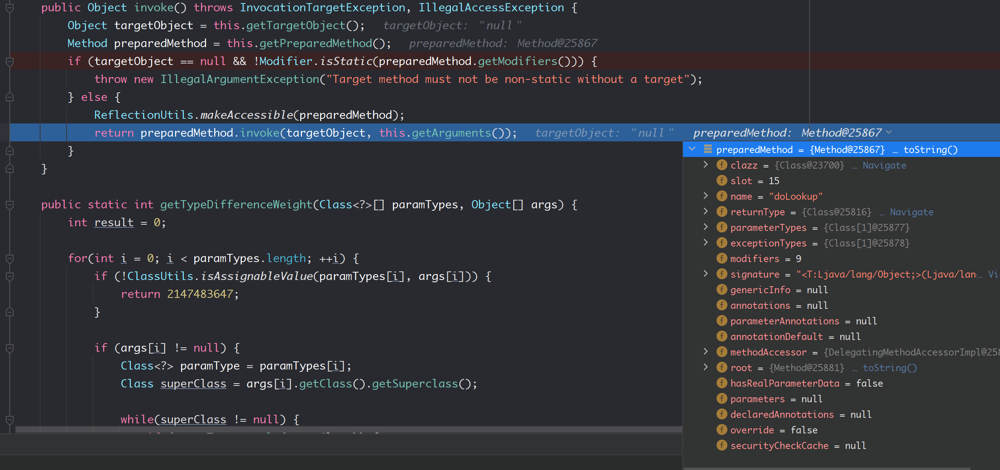
进入lookup.
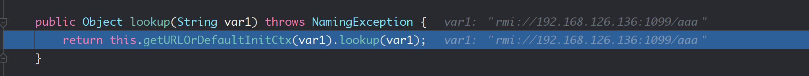
调用栈
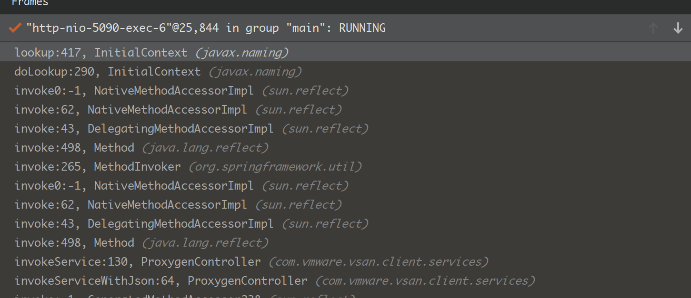
## 补丁
1. 删除了对 /rest/* 的路由映射.
2. 在 com.vmware.vsan.client.services.ProxygenController 类中添加了对 method 的判断.
