- [CVE-2021-22005 任意文件写入漏洞](#cve-2021-22005-任意文件写入漏洞)
  - [影响版本](#影响版本)
  - [环境搭建](#环境搭建)
    - [安装EXSI+VCSA](#安装exsivcsa)
    - [只安装VCSA](#只安装vcsa)
  - [原理分析](#原理分析)
    - [AsyncTelemetryController](#asynctelemetrycontroller)
    - [LogTelemetryService](#logtelemetryservice)
    - [Path traveral](#path-traveral)
    - [漏洞复现](#漏洞复现)
      - [计划任务RCE](#计划任务rce)
    - [DataAppAgentController](#dataappagentcontroller)
    - [Velocity](#velocity)
    - [GLOBAL-logger](#global-logger)
    - [结合CVE-2021-22017](#结合cve-2021-22017)
  - [漏洞复现](#漏洞复现-1)
  - [补丁](#补丁)
  - [参考](#参考)
# CVE-2021-22005 任意文件写入漏洞
## 影响版本
<7.0 U2c
<6.7 U3o
## 环境搭建
### 安装EXSI+VCSA
1. EXSI.
2. 然后安装VCSA.

安装步骤参考B站: 
https://www.bilibili.com/video/BV1Cp4y147Dd  
https://www.bilibili.com/video/BV1G541187F4  

VCSA ISO下载链接: https://blog.whsir.com/post-5673.html  
EXSI ISO下载链接: https://pan.baidu.com/s/1zX4Y4RZe5sBepgRyJm27_Q  提取码:rjda

### 只安装VCSA
不使用EXSI的方法直接搭建Vcenter:
打开iso文件,直接使用vmware导入vcsa目录下的ova文件即可,访问5480端口进行相关即可配置.

开启debug:`/etc/vmware/vmware-vmon/svcCfgfiles/analytics.json`
## 原理分析
一共有两个文件上传漏洞,其中一个需要结合CVE-2021-22017进行利用.
### AsyncTelemetryController
`AsyncTelemetryController`是一个控制器,位于`com.vmware.ph.phservice.push.telemetry.server`包中,主要用于处理Vcenter推送服务中的遥测请求处理,其构造方法如下:
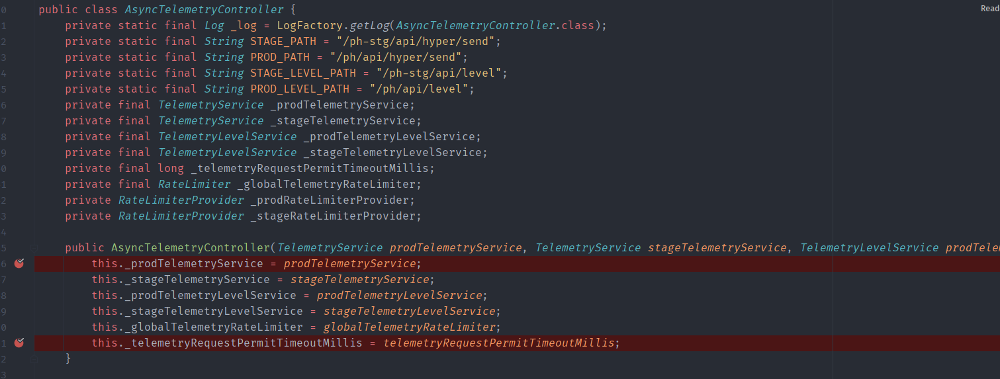  
其中对`/ph/api/hyper/send`路由的处理如下,接受三个参数,`_v`,`_c`,`_i`.然后调用`this.handleSendRequest`.
```java
    @RequestMapping(
        method = {RequestMethod.POST},
        value = {"/ph/api/hyper/send"}
    )
    public Callable<ResponseEntity<Void>> handleSendRequest(HttpServletRequest httpRequest, @RequestParam(value = "_v",required = false) String version, @RequestParam("_c") String collectorId, @RequestParam(value = "_i",required = false) String collectorInstanceId) throws IOException {
        return this.handleSendRequest(this._prodTelemetryService, this._prodRateLimiterProvider, httpRequest, version, collectorId, collectorInstanceId);
    }
```
`handleSendRequest`如下,可以看到先是调用`createTelemetryRequest`生成了一个遥测请求,传入的各项参数均是我们请求的参数,然后调用`telemetryService.processTelemetry`来处理该遥测请求.
```java
    private Callable<ResponseEntity<Void>> handleSendRequest(final TelemetryService telemetryService, final RateLimiterProvider rateLimiterProvider, HttpServletRequest httpRequest, String version, final String collectorId, final String collectorInstanceId) throws IOException {
        final TelemetryRequest telemetryRequest = createTelemetryRequest(httpRequest, version, collectorId, collectorInstanceId);
        return new Callable<ResponseEntity<Void>>() {
            public ResponseEntity<Void> call() throws Exception {
                if (!AsyncTelemetryController.this.isRequestPermitted(collectorId, collectorInstanceId, rateLimiterProvider)) {
                    return new ResponseEntity(HttpStatus.TOO_MANY_REQUESTS);
                } else {
                    telemetryService.processTelemetry(telemetryRequest.getCollectorId(), telemetryRequest.getCollectorIntanceId(), new TelemetryRequest[]{telemetryRequest});
                    return new ResponseEntity(HttpStatus.CREATED);
                }
            }
        };
    }
```
而传入的`telemetryService`的遥测服务则是`AsyncTelemetryController`构造函数定义的`telemetryService`,可以看到其实是一个`TelemetryLevelBasedTelemetryServiceWrapper`,其中含有一个装饰器`LogTelemetryService`.
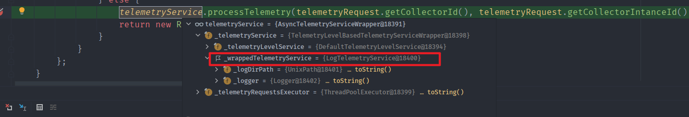  
进入`processTelemetry`后会将该遥测请求放入`_telemetryRequestsExecutor`遥测请求执行器中,也就是放入一个队列进行多线程执行,然后会调用run()方法最后调用`this._telemetryService.processTelemetry`,也就是进入`TelemetryLevelBasedTelemetryServiceWrapper.processTelemetry`中.
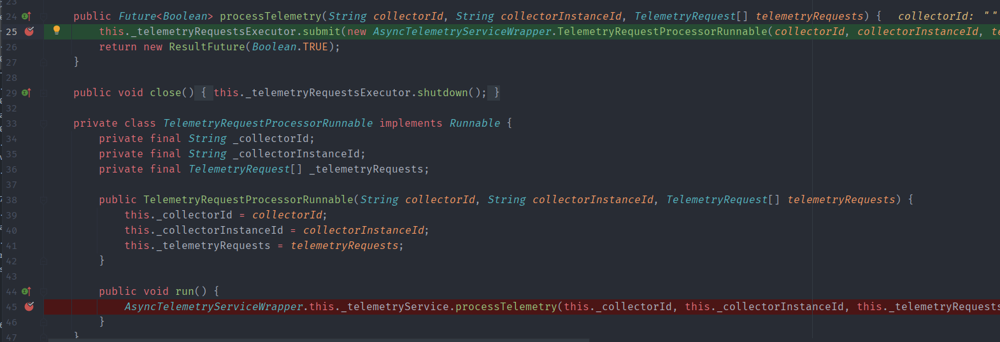
来到`TelemetryLevelBasedTelemetryServiceWrapper.processTelemetry`中,其首先调用`this._telemetryLevelService.getTelemetryLevel`获取遥测等级.
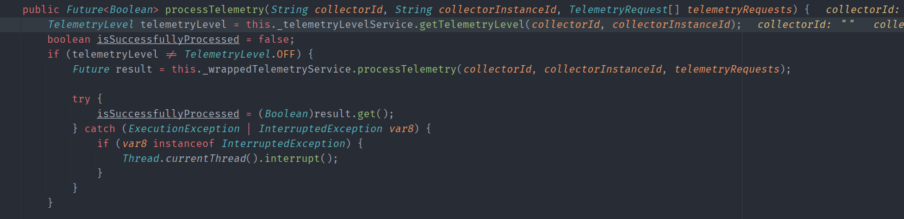
在`getTelemetryLevel`中首先判断是否开启CEIP,也就是客户体验提升计划功能,然后再调用`this._collectorToTelemetryLevelCache.get`从缓存中通过该收集器获取其遥测等级,如果缓存中没有的话再调用`getTelemetryLevelFromManifest`从`Manifest`获取然后放入缓存中返回.  
`getTelemetryLevelFromManifest`如下
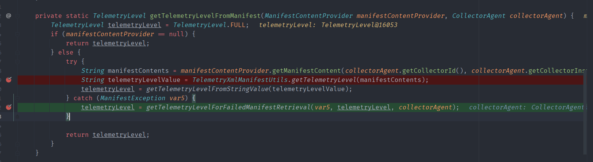
当我们随机输入参数时会发现在调用`manifestContentProvider.getManifestContent(collectorAgent.getCollectorId(), collectorAgent.getCollectorInstanceId());
`时会抛出异常如下
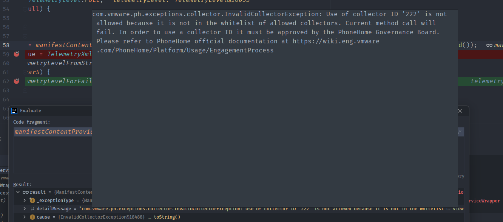  
表示`collector ID`不是白名单ID,然后进入下面的`getTelemetryLevelForFailedManifestRetrieval`中来获取`telemetryLevel`.在`getTelemetryLevelForFailedManifestRetrieval`中通过判断异常的类型来得到不同得遥测等级.
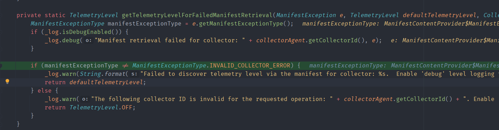
异常等级一共两种,在`ManifestContentProvider`中定义如下
```java
    public static enum ManifestExceptionType {
        GENERAL_ERROR,
        INVALID_COLLECTOR_ERROR;

        private ManifestExceptionType() {
        }
    }
```
如果异常类型不是`INVALID_COLLECTOR_ERROR`则返回默认的`defaultTelemetryLevel`,为FULL,否则返回OFF.  
而在使用同一个`CollectorId`和不同的`CollectorInstanceId`再次请求时抛出的异常却是`GENERAL_ERROR`,这是因为`CollectorId`在第一次请求之后进行了缓存,在第二次请求时就会造成`CollectorId`重复的异常.
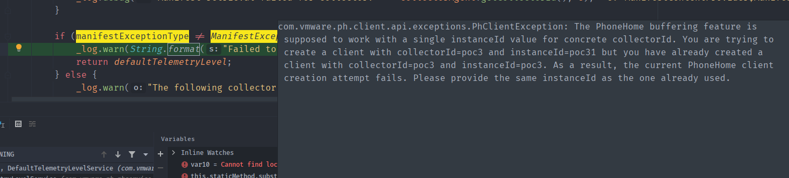  
这就导致了返回的`TelemetryLevel`为默认的`FULL`.
最后在`TelemetryLevelBasedTelemetryServiceWrapper.processTelemetry`中如果`TelemetryLevel`不为OFF则进入`_wrappedTelemetryService.processTelemetry`,也就是`LogTelemetryService.processTelemetry`.
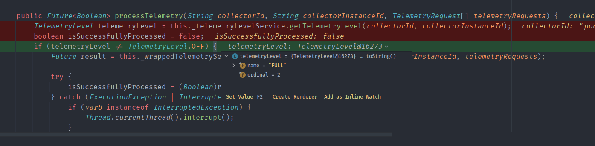.
### LogTelemetryService
在`LogTelemetryService`中则是将`collectorId`和`collectorInstanceId`进行拼接得到文件名后将请求的内容写到了`/var/log/vmware/analytics/prod`路径下.
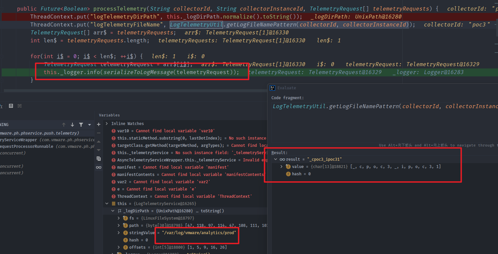
### Path traveral
测试如果直接使用../来实现跨目录写入会报错,因为在linux下路径穿越时../前面的路径不存在会直接返回错误,而windows下则会先暂时识别../最后再判断路径.  
Linux:
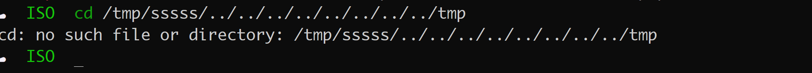  
Windows:
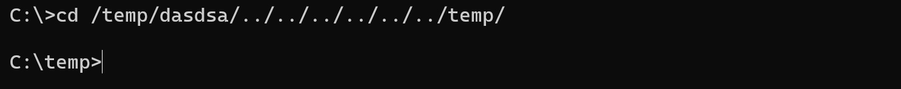
但Log4j在记录日志时如果文件名中含有目录则会判断该父目录是否存在,如果不存在的话则会创建该目录.
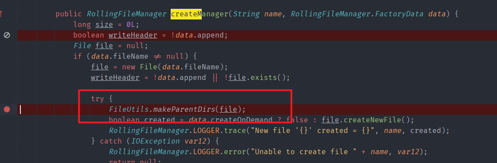  
所以在遍历时在最前面加上`/`让log4j自动创建该目录.
### 漏洞复现
#### 计划任务RCE
因为文件名会带有.json后缀,导致无法直接写入Webshell,但通过目录穿越写入计划任务RCE.  
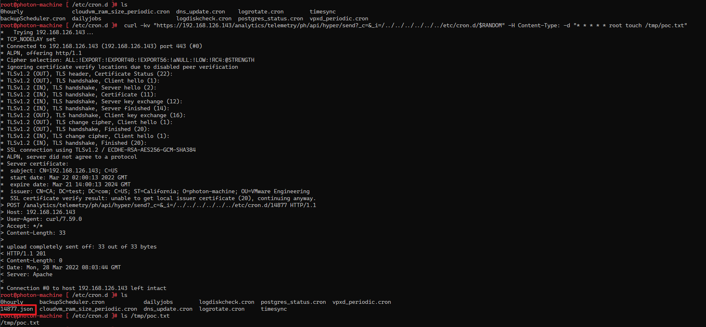  
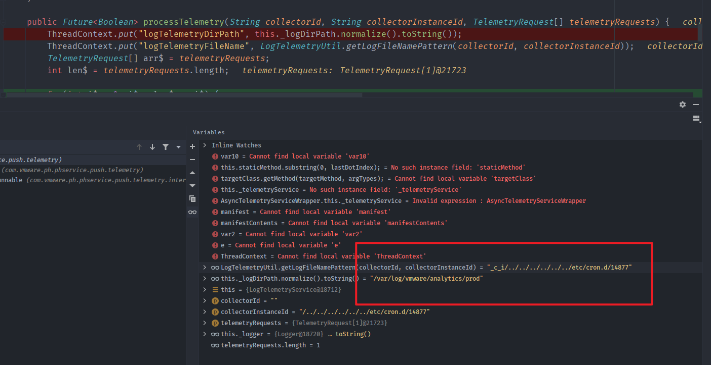

### DataAppAgentController
`DataAppAgentController`是处理`DataAppAgent`相关请求的控制器,其存在一个路由如下:
```java
    public Callable<ResponseEntity<String>> collect(@RequestParam("action") String action, @RequestParam("_c") String collectorId, @RequestParam("_i") String collectorInstanceId, @RequestHeader("X-Deployment-Secret") String deploymentSecret, @RequestHeader(value = "X-Plugin-Type",required = false) String pluginType, @RequestHeader(value = "X-Object-Id",required = false) final String objectId, @RequestBody String collectRequestSpecJson) {
        final DataAppAgentId agentId = new DataAppAgentId(collectorId, collectorInstanceId, deploymentSecret, pluginType);
        CollectRequestSpec collectRequestSpec = DataAppAgentRequestDeserializer.deserializeCollectRequestSpec(collectRequestSpecJson);
        final String manifestContent = collectRequestSpec.getManifestContent();
        final String jsonLdContextData = collectRequestSpec.getContextData();
        return new Callable<ResponseEntity<String>>() {
            public ResponseEntity<String> call() throws Exception {
                ResponseEntity var2;
                try {
                    ExceptionsContextManager.createCurrentContext();
                    DataAppAgent agent = DataAppAgentController.this._dataAppAgentService.getAgent(agentId);
                    String collectedData = null;
                    if (agent instanceof CollectorDataAppAgent) {
                        collectedData = ((CollectorDataAppAgent)agent).collect(manifestContent, objectId, jsonLdContextData);
                    }
```
其通过指定的AgentID获取到Agent实例和用户输入的一些程序清单内容带入Agent.collect中.
Agent实例创建相关路由代码如下:
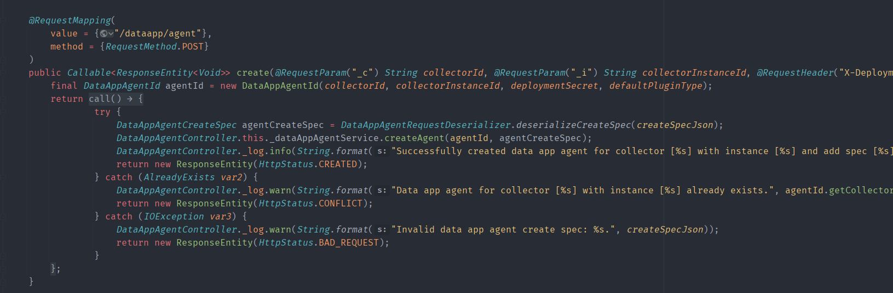
### Velocity
一路跟随collect方法最后来到`ResourceItemToJsonLdMapping#map`方法中.

在其中可以看到其将`this._mappingCode`带入了`Velocity`模板进行解析,而`this._mappingCode`是我们输入的`ManifestContent`的节点内容,可控.
```java
    public ResourceItemToJsonLdMapping(String forType, String mappingCode) {
        this._forType = forType;
        this._mappingCode = mappingCode;
    }
```
调用栈如下:

### GLOBAL-logger 
Velocity模板自带了一黑名单,无法直接新建一些直接命令执行的实例,但在`Velocity`渲染时的上下文中有一个实例为`GLOBAL-logger `,其中配置了Log4j相关信息,其中包括了日志文件的路径.
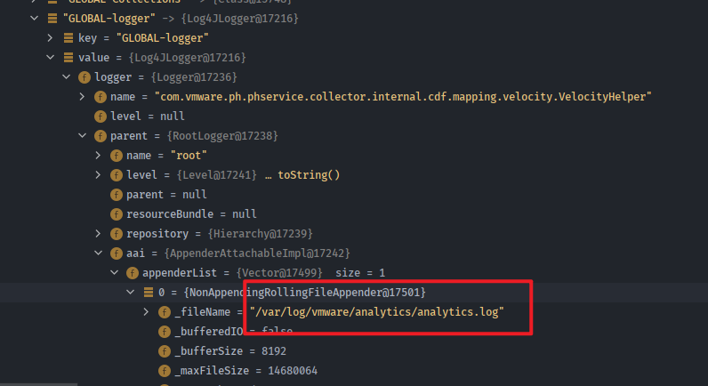

利用思路:  
1.修改日志文件路径为Web目录下的jsp文件.
2.调用log4j日志记录将webshell内容写入jsp文件.
### 结合CVE-2021-22017
analytics目录是由rhttpproxy进行代理访问的,某些版本中其只能通过localhost访问,但可以结合CVE-2021-22017 利用rhttpproxy bypass漏洞绕过,在路由前面加上可访问的`rhttpproxy`代理路径再加上等数量的`..;`即可.
## 漏洞复现
1. 创建Agent
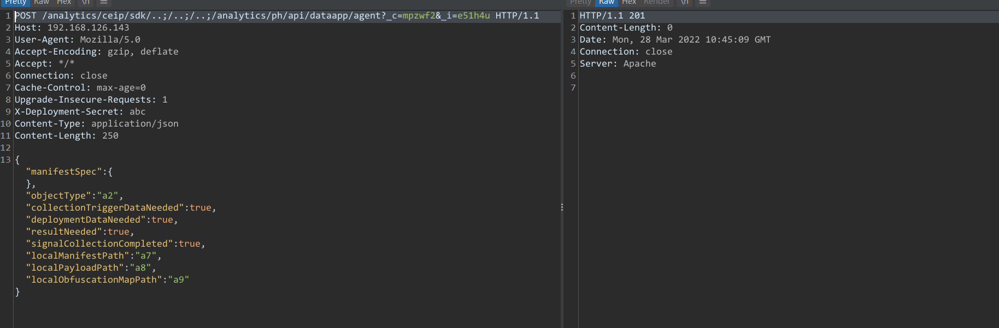
2. 写入Webshell


## 补丁
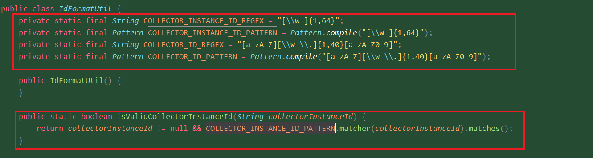  
1. 对`collectorInstanceId`增加了正则验证.  
2. 删除了dataapp/agent的collect端点.
## 参考
https://testbnull.medium.com/quick-note-of-vcenter-rce-cve-2021-22005-4337d5a817ee   
https://mp.weixin.qq.com/s/hZsfz4nw4HuYlduz7LK18g