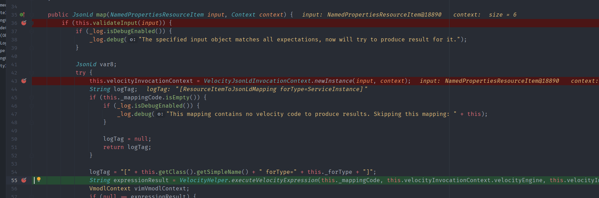
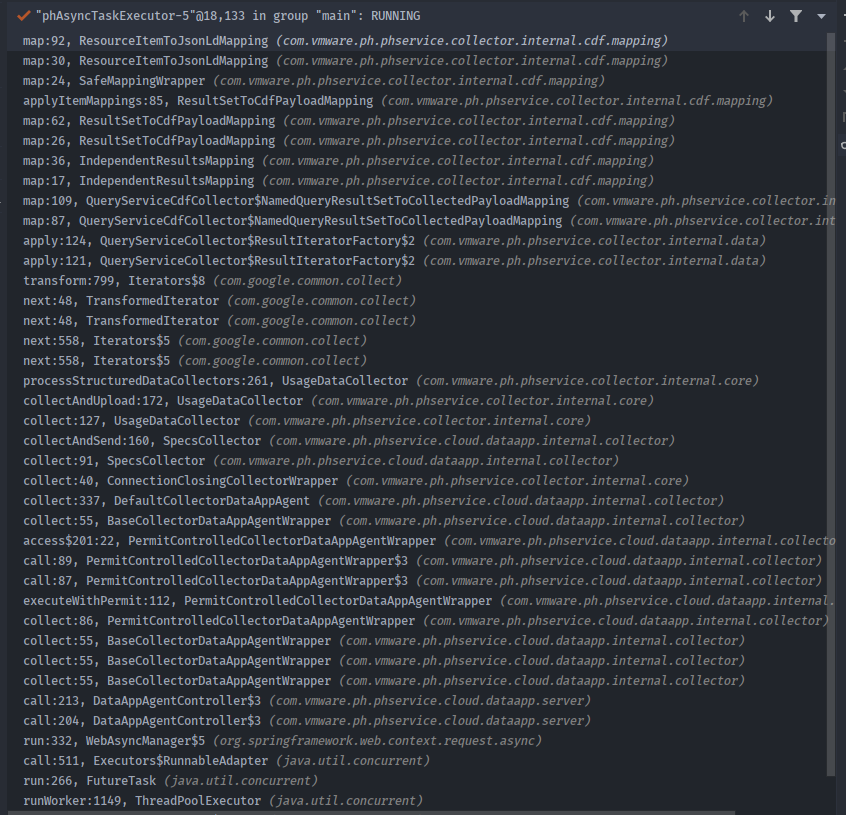
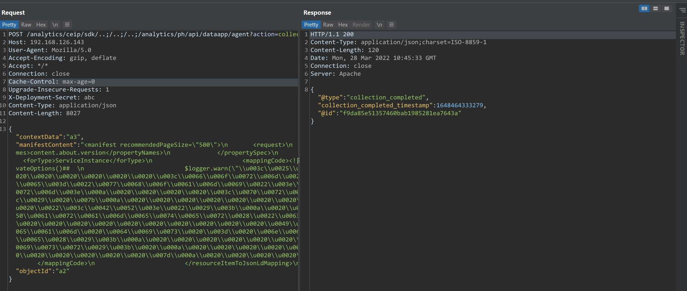
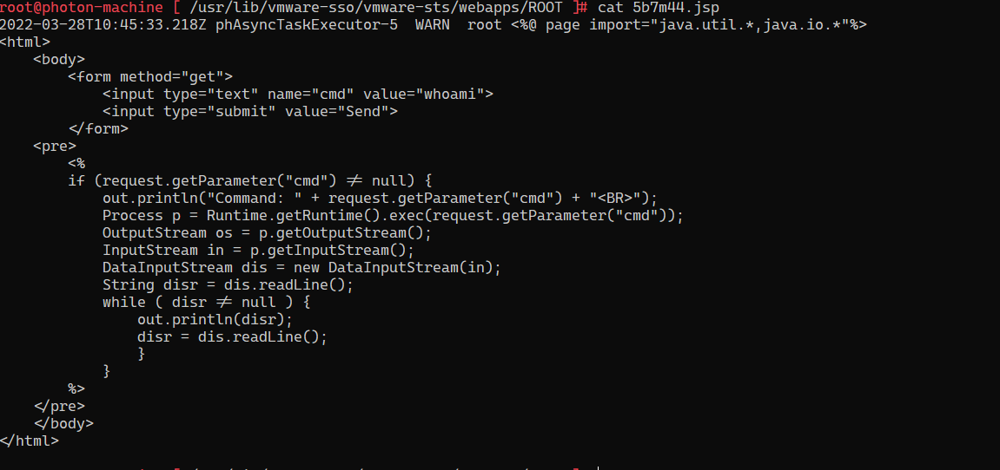

# CVE-2021-22017 rhttpproxy 绕过漏洞
## 影响版本
Version < 6.7 U3o
Version < 6.5 U3q
## 环境搭建
1. EXSI.
2. 然后安装VCSA.

安装步骤参考B站: 
https://www.bilibili.com/video/BV1Cp4y147Dd  
https://www.bilibili.com/video/BV1G541187F4  

VCSA ISO下载链接: https://blog.whsir.com/post-5673.html  
EXSI ISO下载链接: https://pan.baidu.com/s/1zX4Y4RZe5sBepgRyJm27_Q  提取码:rjda

### 只安装VCSA
不使用EXSI的方法直接搭建Vcenter:
打开iso文件,直接使用vmware导入vcsa目录下的ova文件即可,访问5480端口进行相关即可配置.

开启debug:`/etc/vmware/vmware-vmon/svcCfgfiles/analytics.json`
## 原理分析
rhttpproxy是VMware使用的一个代理服务器,其配置文件如下:
### DataAppAgentController
`DataAppAgentController`是处理`DataAppAgent`相关请求的控制器,其存在一个路由如下:
```java
    public Callable<ResponseEntity<String>> collect(@RequestParam("action") String action, @RequestParam("_c") String collectorId, @RequestParam("_i") String collectorInstanceId, @RequestHeader("X-Deployment-Secret") String deploymentSecret, @RequestHeader(value = "X-Plugin-Type",required = false) String pluginType, @RequestHeader(value = "X-Object-Id",required = false) final String objectId, @RequestBody String collectRequestSpecJson) {
        final DataAppAgentId agentId = new DataAppAgentId(collectorId, collectorInstanceId, deploymentSecret, pluginType);
        CollectRequestSpec collectRequestSpec = DataAppAgentRequestDeserializer.deserializeCollectRequestSpec(collectRequestSpecJson);
        final String manifestContent = collectRequestSpec.getManifestContent();
        final String jsonLdContextData = collectRequestSpec.getContextData();
        return new Callable<ResponseEntity<String>>() {
            public ResponseEntity<String> call() throws Exception {
                ResponseEntity var2;
                try {
                    ExceptionsContextManager.createCurrentContext();
                    DataAppAgent agent = DataAppAgentController.this._dataAppAgentService.getAgent(agentId);
                    String collectedData = null;
                    if (agent instanceof CollectorDataAppAgent) {
                        collectedData = ((CollectorDataAppAgent)agent).collect(manifestContent, objectId, jsonLdContextData);
                    }
```
其通过指定的AgentID获取到Agent实例和用户输入的一些程序清单内容带入Agent.collect中.
Agent实例创建相关路由代码如下:

### Velocity
一路跟随collect方法最后来到`ResourceItemToJsonLdMapping#map`方法中.

在其中可以看到其将`this._mappingCode`带入了`Velocity`模板进行解析,而`this._mappingCode`是我们输入的`ManifestContent`的节点内容,可控.
```java
    public ResourceItemToJsonLdMapping(String forType, String mappingCode) {
        this._forType = forType;
        this._mappingCode = mappingCode;
    }
```
调用栈如下:

### GLOBAL-logger 
Velocity模板自带了一黑名单,无法直接新建一些直接命令执行的实例,但在`Velocity`渲染时的上下文中有一个实例为`GLOBAL-logger `,其中配置了Log4j相关信息,其中包括了日志文件的路径.


利用思路:  
1.修改日志文件路径为Web目录下的jspl文件.
2.调用log4j日志记录将webshell内容写入jsp文件.
### Tomcat绕过
analytics目录是由rhttpproxy进行代理的,某些版本中其只能通过localhost访问,但可以利用Tomcat的路径穿越漏洞绕过,在路由前面加上可访问的`rhttpproxy`代理路径再加上等数量的`..;`即可.
## 漏洞复现
1. 创建Agent

2. 写入Webshell


## 补丁 
删除了dataapp/agent的collect端点.
## 参考
https://testbnull.medium.com/quick-note-of-vcenter-rce-cve-2021-22005-4337d5a817ee  
https://mp.weixin.qq.com/s/hZsfz4nw4HuYlduz7LK18g