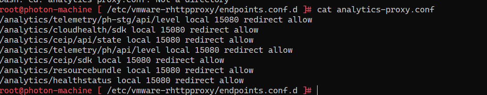

# CVE-2021-22017 rhttpproxy 绕过漏洞
## 影响版本
Version < 6.7 U3o
Version < 6.5 U3q
## 环境搭建
1. EXSI.
2. 然后安装VCSA.

安装步骤参考B站: 
https://www.bilibili.com/video/BV1Cp4y147Dd  
https://www.bilibili.com/video/BV1G541187F4  

VCSA ISO下载链接: https://blog.whsir.com/post-5673.html  
EXSI ISO下载链接: https://pan.baidu.com/s/1zX4Y4RZe5sBepgRyJm27_Q  提取码:rjda

### 只安装VCSA
不使用EXSI的方法直接搭建Vcenter:
打开iso文件,直接使用vmware导入vcsa目录下的ova文件即可,访问5480端口进行相关即可配置.

开启debug:`/etc/vmware/vmware-vmon/svcCfgfiles/analytics.json`
## 原理分析
rhttpproxy是VMware使用的一个代理服务器,其配置文件路径:`/etc/vmware-rhttpproxy/endpoints.conf.d/analytics-proxy.conf`.
在不同版本其配置不尽相同:  
6.7.0-19300125:

### Tomcat绕过
analytics目录是由rhttpproxy进行代理的,某些版本中其只能通过localhost访问,但可以利用Tomcat的路径穿越漏洞绕过,在路由前面加上可访问的`rhttpproxy`代理路径再加上等数量的`..;`即可.
## 漏洞复现
结合CVE-2021-22005.
## 补丁 
## 参考
https://testbnull.medium.com/quick-note-of-vcenter-rce-cve-2021-22005-4337d5a817ee  
https://mp.weixin.qq.com/s/hZsfz4nw4HuYlduz7LK18g