- [Weblogic T3\&IIOP协议](#weblogic-t3iiop协议)
  - [T3](#t3)
    - [InboundMsgAbbrev](#inboundmsgabbrev)
    - [MsgAbbrevInputStream](#msgabbrevinputstream)
  - [IIOP](#iiop)
    - [ValueHandlerImpl](#valuehandlerimpl)
# Weblogic T3&IIOP协议
## T3
Weblogic T3协议是Weblogic对RMI在Weblogic中的实现协议,在原生JAVA中RMI传输是使用JRMP协议进行传输,在Weblogic中使用RMI則是使用的T3协议,T3协议针对Weblogic主要是有一些特定的增强.
同样的在T3中传输对象也是用的序列化机制,同样可以进行反序列化攻击,T3协议大概的交互过程如下  
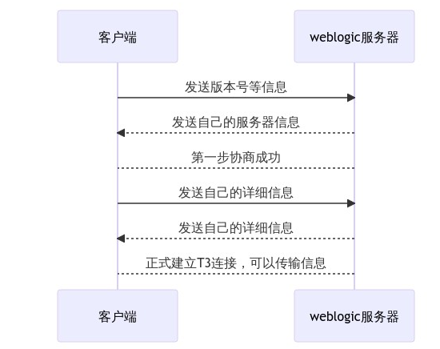  
在T3协议的数据流中有几个序列化的部分,分别对应了代码中几个触发反序列化的点.
### InboundMsgAbbrev
常用的触发反序列化的地方点在于InboundMsgAbbrev类中,这也是第一个T3协议中最先触发反序列化的地方.    
首先客户端和服务端建立socket连接后,会调用SocketMuxer的`dispatch()`方法.
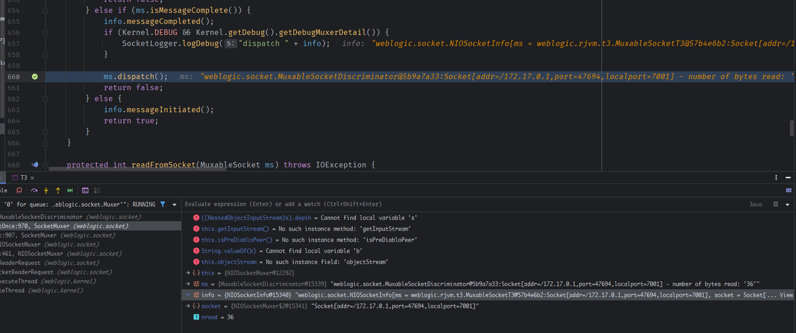  
进入dispatch()后读取协议为T3,并根据协议创建一个对应的`MuxableSocket`.
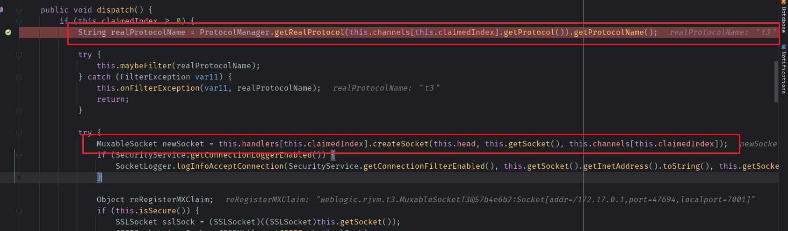  
然后调用这个新T3 Socket的`dispatch`方法. 
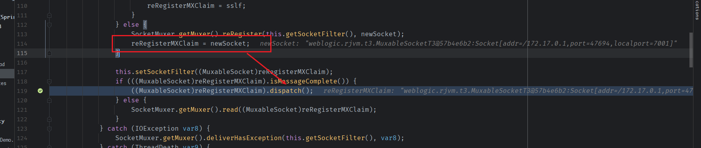
进入`MuxableSocketT3`的`dispatch`方法
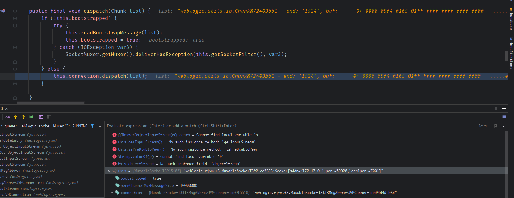  
然后会初始化一些参数后来到`InboundMsgAbbrev`的`readObject`方法中,其中创建一个`ServerChannelInputStream`对象并调用其readObject()方法.
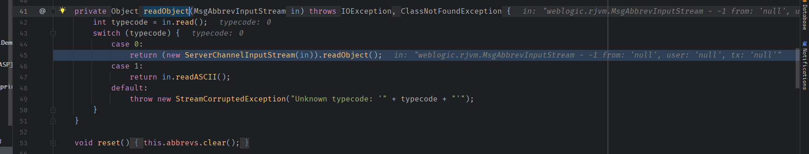  
而`ServerChannelInputStream`类是一个继承了原生ObjectInputStream的输出流,从而触发反序列化.  
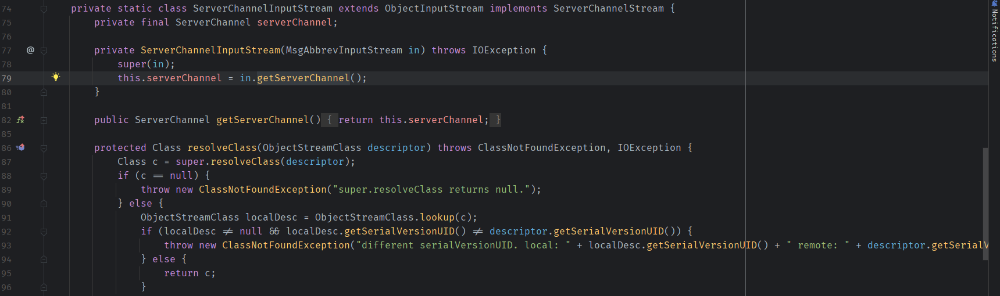  
调用栈如下:  
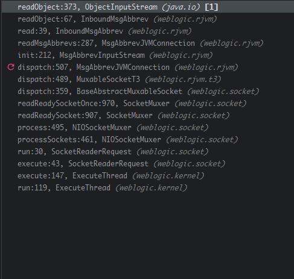
### MsgAbbrevInputStream  
MsgAbbrevInputStream的触发主要是在readPeerinfo的时候,在`ChunkedObjectInputStream#readObjectFromPreDiabloPeer()`中当读取的前两个字节为不为4时,则会调用当前输入流的reabOject().  
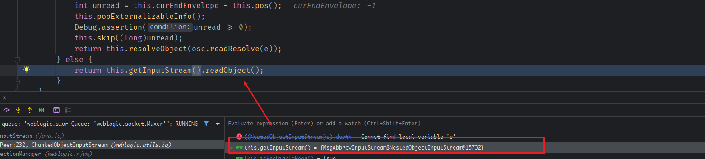  
而当前的inputStream()为`ChunkedObjectInputStream`的内部类`NestedObjectInputStream`,同样继承于原生的ObjectInputStream.
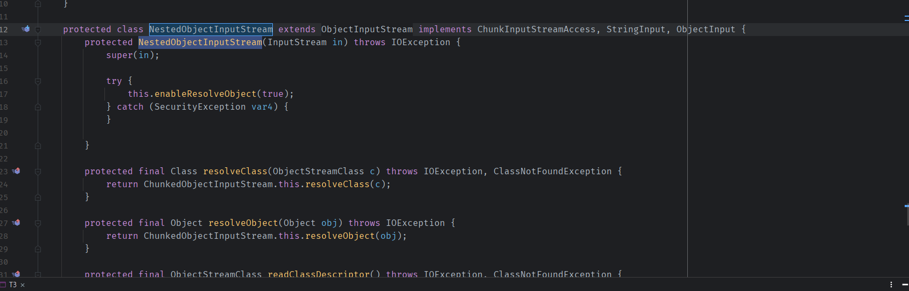  
调用堆栈如下:  
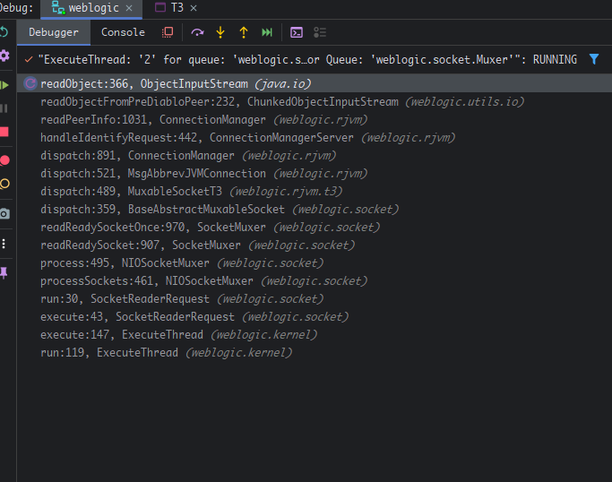
## IIOP
IIOP协议(Internet Inter-ORB Protocol)是针对TCP/IP层实现的通用对象请求协议(GIOP),而对象请求是指一种分布式调用的服务,通过在对象间建立一个CS关系,ORB(Object Request Broker)做中介代理,然后客户端通过这个代理(ORB)来调用服务端对象的方法.  

简单来说,ORB即中间代理,而GIOP是ORB和客户端,服务端之间进行通信的通用协议,而针对不同的通信层又有不同的具体实现方式,而IIOP就是TCP/IP层的具体实现协议,而CORBA(Common ObjectRequest Broker Architecture)则是对ORB代理制定的一套标准的体系规范,这样可以让不同的应用都可以通过同一个ORB进行通信.  

根据CORBA规定,在通信过程中存在三个部分,客户端,服务端,中间代理,这个体系类似于RMI,中间代理(ORB)即类似于注册中心的作用.  
```java
import java.rmi.Remote;

public interface iiopServiceInterface extends Remote {
    public void say() throws java.rmi.RemoteException;
}

import javax.rmi.PortableRemoteObject;
import java.rmi.RemoteException;

public class iiopServiceImpl extends PortableRemoteObject implements iiopServiceInterface {

    /**
     * Initializes the object by calling <code>exportObject(this)</code>.
     *
     * @throws RemoteException if export fails.
     */
    public  iiopServiceImpl() throws RemoteException {
        super();
    }
    @Override
    public void say(){
        System.out.println("hi");
    }
}

    public static void main(String[] args) throws NamingException,RemoteException {
        Hashtable<String, String> env = new Hashtable<>();
        env.put(Context.INITIAL_CONTEXT_FACTORY, "com.sun.jndi.cosnaming.CNCtxFactory");
        env.put("java.naming.provider.url", "iiop://127.0.0.1:7001");
        InitialContext initialContext = new InitialContext(env);
        iiopServiceImpl iiopService = new iiopServiceImpl();
        initialContext.rebind("test",iiopService);
        Object ob = initialContext.lookup("test");
        System.out.println(ob.toString());

    }
```
其实现过程和RMI类似,但区别在于需要手动生成`skeletons`和`stubs`.  
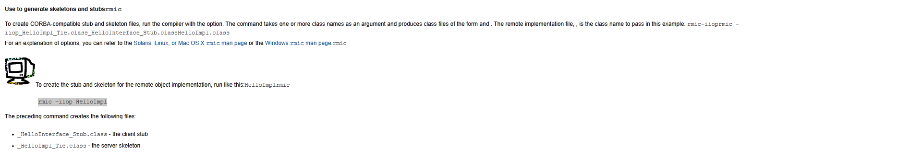  
`rmic -iiop iiopServiceImpl`.  
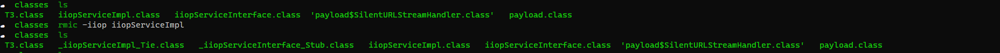
然后会得到`_iiopServiceImpl_Tie.class`和`_iiopServiceInterface_Stub.class`.

在weblogic中实现了RMI-IIOP,即把RMI和IIOP进行了一些结合,可以在RMI客户端中使用IIOP协议进行JNDI操作.  
### ValueHandlerImpl
同样IIOP协议也是通过序列化来传递数据,而触发反序列化的点在`ValueHandlerImpl#readValueData`方法中,最终会反射调用对象的`readObject()`.  
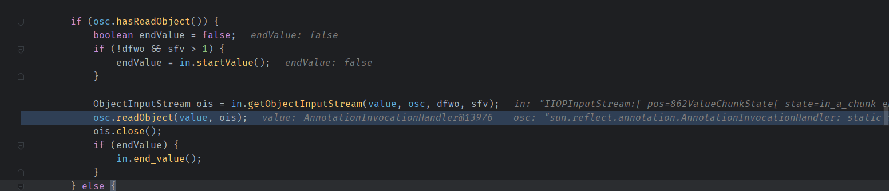  
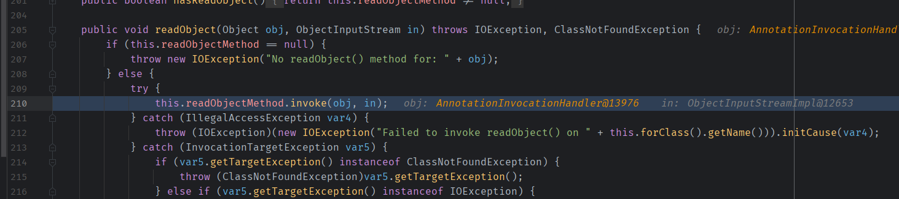  
<!-- ## CVE-2016-0638
该漏洞即对上个漏洞补丁的绕过,重新寻找了weblogic.jms.common.StreamMessageImpl的readExternal()进行反序列化来绕过黑名单.
## CVE-2016-3510
原理也是继续绕过黑名单,原理是将反序列化的对象封装进了weblogic.corba.utils.MarshalledObject,然后再对MarshalledObject进行序列化.当字节流反序列化时MarshalledObject不在WebLogic 黑名单里,可正常反序列化,在反序列化时MarshalledObject对象调用readObject时对MarshalledObject封装的序列化对象再次反序列化,这样就逃过了黑名单的检查.
MarshalledObject比较符合需求,即在封装原链的基础上可以通过自身的反序列化来反序列化成员变量.
## CVE-2017-3248
该漏洞则是利用JRMP协议进行了黑名单的绕过
## CVE-2018-2628
绕过CVE-2017-3248
## CVE-2018-2893
绕过CVE-2018-2628  -->