- [CVE-2022-27925 Zimbra Mail 需授权RCE](#cve-2022-27925-zimbra-mail-需授权rce)
  - [影响版本](#影响版本)
  - [环境搭建](#环境搭建)
    - [配置防火墙](#配置防火墙)
    - [配置主机名](#配置主机名)
    - [安装相关库](#安装相关库)
    - [关闭MTA](#关闭mta)
    - [配置dns服务器](#配置dns服务器)
      - [/etc/named.conf](#etcnamedconf)
      - [/var/named/test.com](#varnamedtestcom)
      - [/var/named/192.168.126.arpa](#varnamed192168126arpa)
      - [重启DNS](#重启dns)
      - [使用本地DNS](#使用本地dns)
    - [安装](#安装)
    - [IDEA Debug](#idea-debug)
  - [原理分析](#原理分析)
    - [MailboxImport](#mailboximport)
    - [ZipBackupTarget](#zipbackuptarget)
  - [漏洞复现](#漏洞复现)
  - [参考](#参考)
# CVE-2022-27925 Zimbra Mail 需授权RCE
## 影响版本
 8.8.15P31 and 9.0P24及之前.
## 环境搭建
以Centos7为例  
商业版下载地址:https://files.zimbra.com/downloads/8.8.12_GA/zcs-NETWORK-8.8.12_GA_3794.RHEL7_64.20190329045002.tgz  
开源版的没有对应存在漏洞的功能,需要在官网注册邮箱后在邮箱得到License文件,在安装时指定该License文件.

域名:mail.test.com  
ip:192.168.126.136
### 配置防火墙
```bash 
sed -i 's/SELINUX=enforcing/SELINUX=disabled/' /etc/sysconfig/selinux
yum -y install iptables-services
iptables -F
iptables -X
iptables -z
service iptables save
reboot
```
### 配置主机名
```
hostnamectl set-hostname mail.test.com
echo "192.168.126.136  mail.test.com" >> /etc/hosts
```
### 安装相关库
```
yum -y update
yum -y install perl perl-core nmap sudo libidn gmp libaio libstdc++ unzip sysstat sqlite nc
```
### 关闭MTA
```
systemctl stop postfix.service
systemctl disable postfix.service
```
### 配置dns服务器
`yum -y install bind bind-utils`
#### /etc/named.conf
```
zone "test.com" IN {
       type master;
       file "test.com";
       allow-update { none; };
};
zone "126.168.192.in-addr.arpa" IN {
       type master;
       file "192.168.126.arpa";
       allow-update { none; };
};
```
#### /var/named/test.com
```
$TTL 1D
@	IN SOA	test.com. rname.invalid. (
					0	; serial
					1D	; refresh
					1H	; retry
					1W	; expire
					3H )	; minimum
	NS ns.test.com.
	MX 10 mail.test.com.
ns A 192.168.126.136
mail A 192.168.126.136

```
#### /var/named/192.168.126.arpa
```
$TTL 1D
@	IN SOA	test.com. rname.invalid. (
					0	; serial
					1D	; refresh
					1H	; retry
					1W	; expire
					3H )	; minimum
	NS	ns.test.com.
136	PTR 	ns.test.com.
136	PTR 	mail.test.com.

```
#### 重启DNS
`systemctl restart named.service`
#### 使用本地DNS
`echo "nameserver 127.0.0.1" >> /etc/resolv.conf`  
记得注释原有的dns服务器.
### 安装
运行压缩包的./install即可.
中途不修改域名  
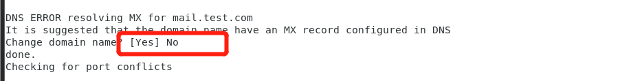  
设置带星的选项即可  
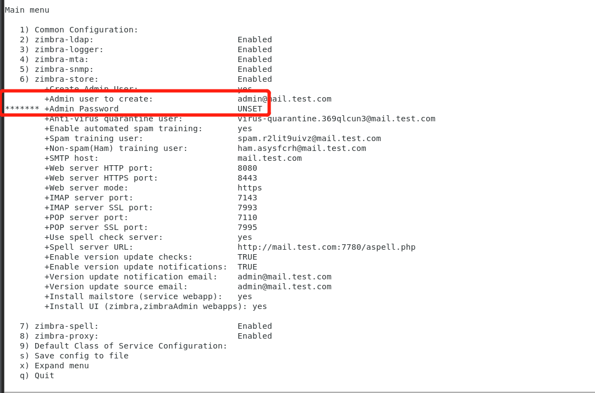  
完成安装.
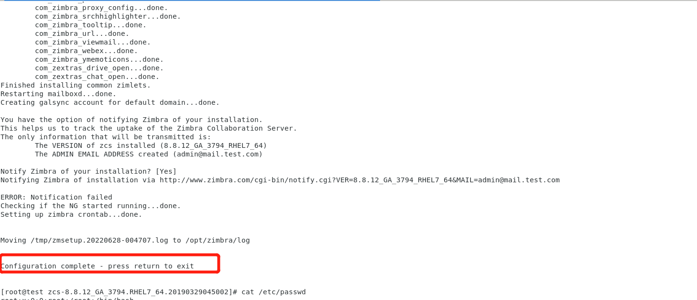  
访问https://hostname:7071/zimbraAdmin/即可 
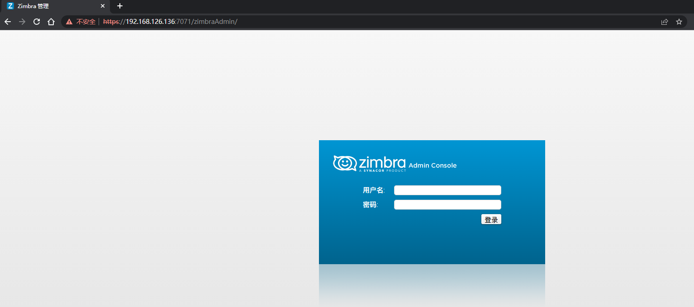
### IDEA Debug
[官方文档](https://github.com/Zimbra-Community/zimbra-tools/blob/master/java-debug-zimbra-intellij-ide.md)  
```
zmcontrol stop
cp /opt/zimbra/libexec/zmmailboxdmgr /opt/zimbra/libexec/zmmailboxdmgr.old
cp /opt/zimbra/libexec/zmmailboxdmgr.unrestricted /opt/zimbra/libexec/zmmailboxdmgr
vim /opt/zimbra/conf/localconfig.xml 
修改 mailboxd_java_options行.  
添加 -agentlib:jdwp=transport=dt_socket,server=y,suspend=n,address=*:5005
firewall-cmd --add-port=5005/tcp
zmcontrol start
```

## 原理分析
### MailboxImport
**MailboxImportServlet**提供了一个邮箱导入功能,该Severlet位于zimbrabackup.jar中,只有Network版才有该功能.  
其doPost代码如下:
  
可以看到该Serverlet需要权限校验,同时其取得的cookie名为`ZM_AUTH_TOKEN`的值进行校验,但正常admin登录的cookie名为`ZM_ADMIN_AUTH_TOKEN`,需要修改`ZM_ADMIN_AUTH_TOKEN`为`ZM_AUTH_TOKEN`.
  
在后面将数据导入到邮箱的处理过程中其调用了该类的importForm方法,而且可以看到in参数的内容来自于用户请求输入.
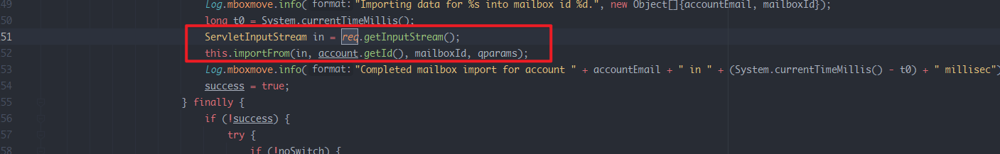  
在之前还有一些参数的校验,主要是合法的用户邮箱.
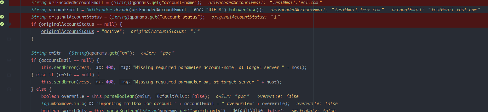  
且该用户必须处于维护状态才能进行导入.  
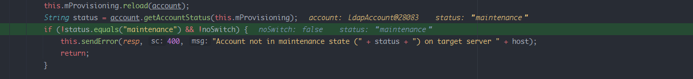  
所以需要新建一个维护状态的邮箱.
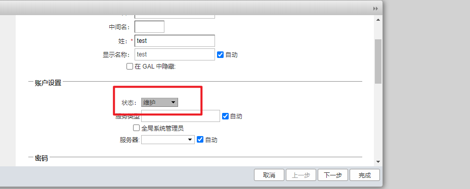  
而在importForm中主要是把用户的输入转换成了一个压缩包对象,然后调用ZipBackupTarget类的restore来还原压缩包的内容.  
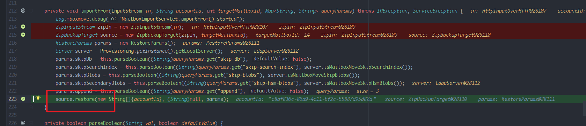  
### ZipBackupTarget
在ZipBackupTarget的restore方法中,可以看到先调用了getAccountSession().  
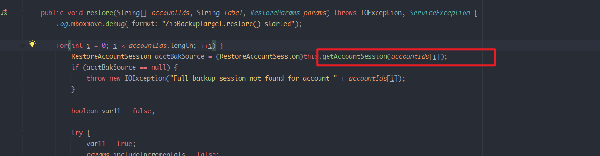    
然后调用ZipBackupTarget的RestoreAcctSession方法.  
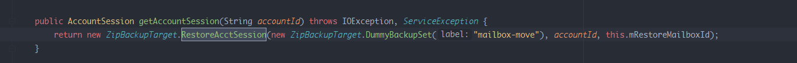  
而这其中的RestoreAcctSession方法调用的其实是来自ZipBackupTarget类的内部类RestoreAcctSession的RestoreAcctSession方法.  
而在RestoreAcctSession类中,对压缩包进行了解压,同时并没有对压缩包内的文件名做检查导致可以使用`..`来实现跨目录解压到web目录下导致生成Webshell RCE.
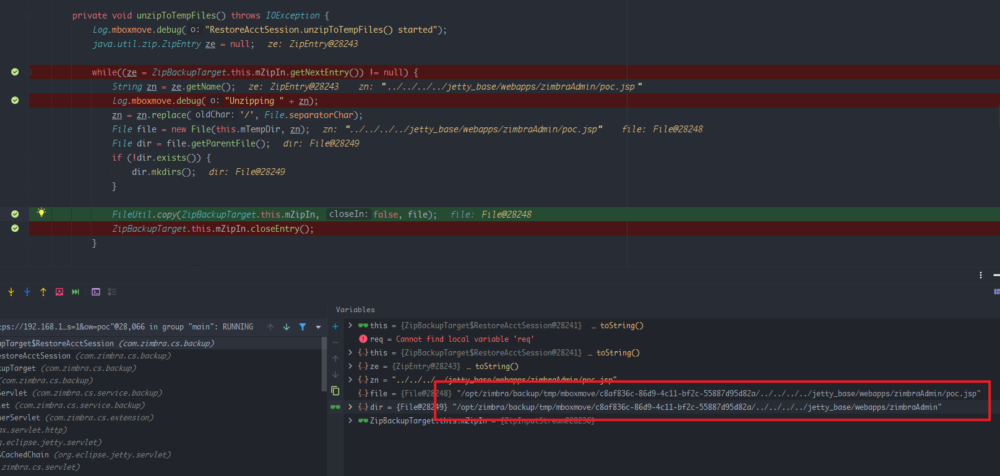  
## 漏洞复现
漏洞压缩包制作  

[工具](https://github.com/ptoomey3/evilarc)  
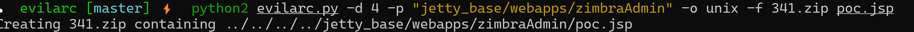  
url:`https://192.168.126.136:7071/service/extension/backup/mboximport?account-name=test@mail.test.com&account-status=1&ow=poc`  
其中account-name为合法邮箱,account-status不为空即可,ow参数为生成的文件名.  
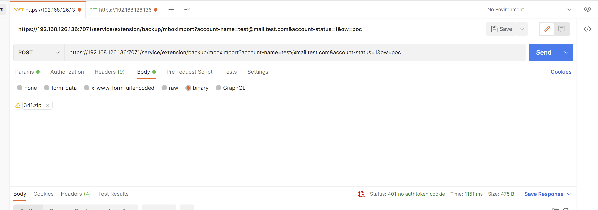  
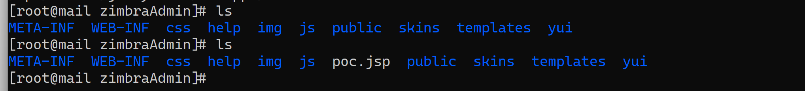  
  
## 参考
https://www.lxlinux.net/4607.html