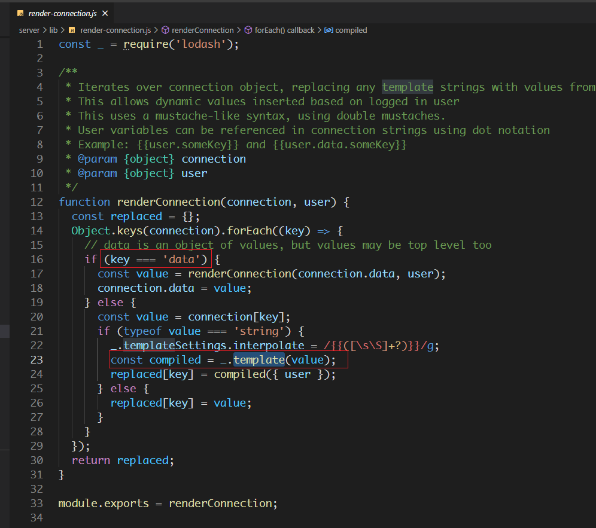
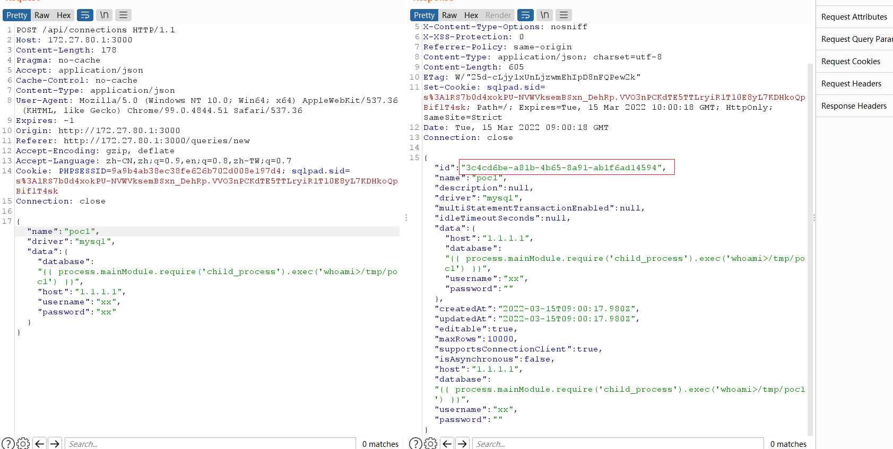
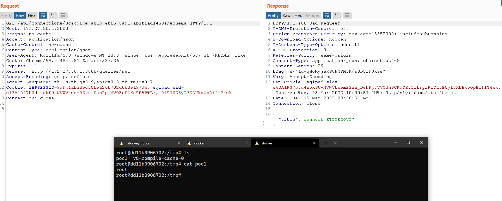
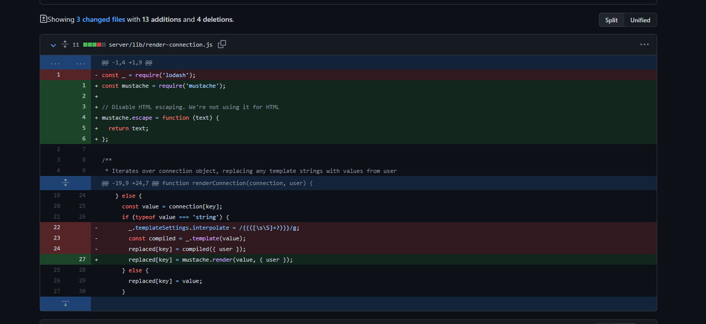

- [CVE-2022-0944 SqlPad 模板注入漏洞](#cve-2022-0944-sqlpad-模板注入漏洞)
  - [影响版本](#影响版本)
  - [环境搭建](#环境搭建)
  - [原理分析](#原理分析)
    - [lodash#template](#lodashtemplate)
  - [漏洞复现](#漏洞复现)
  - [补丁](#补丁)
# CVE-2022-0944 SqlPad 模板注入漏洞
## 影响版本
Version < 6.1.1
## 环境搭建
`docker run -p 3000:3000 --env SQLPAD_ADMIN=admin --env SQLPAD_ADMIN_PASSWORD=admin sqlpad/sqlpad:6.10.0`
## 原理分析
### lodash#template
在server\lib\render-connection.js中对建立连接的各项参数进行渲染,其中当渲染database时,也就是key='data'时，使用了lodash模板的template方法对传入的database值直接进行编译，造成了模板注入。

## 漏洞复现
新建一个连接,得到连接的ID号。

根据ID访问该数据库的schema,服务端对参数模板进行解析触发漏洞。

## 补丁
