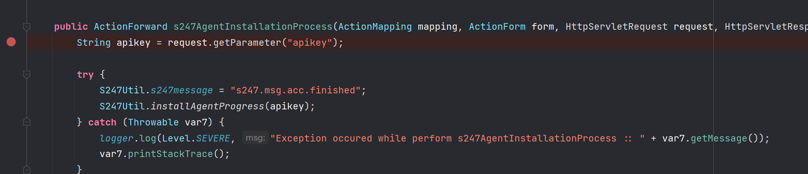
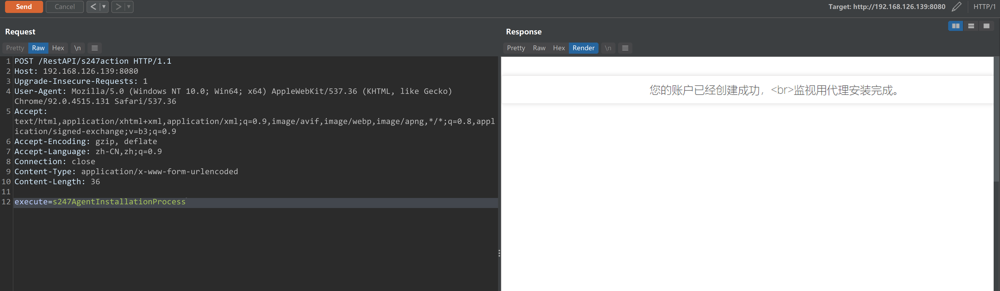
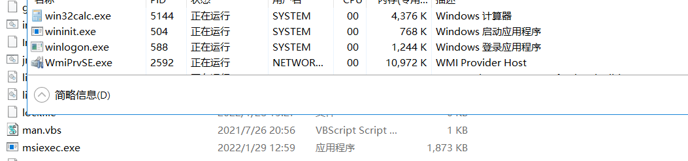

- [CVE-2021-44077](#cve-2021-44077)
  - [影响版本](#影响版本)
  - [原理分析](#原理分析)
    - [RestAPI](#restapi)
    - [ImportTechniciansAction 上传EXE](#importtechniciansaction-上传exe)
    - [S247Action 触发EXE](#s247action-触发exe)
    - [组合利用](#组合利用)
  - [复现](#复现)
  - [参考](#参考)
# CVE-2021-44077
## 影响版本
Zoho ManageEngine ServiceDesk Plus before 11306；
Zoho ManageEngine ServiceDesk Plus MSP before 10530；
Zoho ManageEngine SupportCenter Plus before 11014。
## 原理分析
利用RestAPI未授权访问上传接口,上传恶意exe到bin目录下覆盖原exe,然后利用程序自带的功能触发exe执行导致RCE.
### RestAPI
在web.xml中API接口的路由如下
```xml
	<servlet-mapping>
		<servlet-name>action</servlet-name>
		<url-pattern>/RestAPI/*</url-pattern>
	</servlet-mapping>
```
### ImportTechniciansAction 上传EXE
`ImportTechniciansAction`中有一个上传功能,且自身不带权限校验,如下
  
其从`ImportTechniciansForm`中直接获取form表单上传的文件,写入当前目录,即/bin/目录.
### S247Action 触发EXE
在`S247Action`类的`s247AgentInstallationProcess`中调用了` S247Util.installAgentProgress`.

而`S247Util#installAgentProgress`中会调用bin目录下的msiexec.exe执行系统命令.

其路由定义在struts-config.xml
```xml
                <action path="/s247action" scope="request" type="com.manageengine.s247.actions.S247Action" parameter="execute">
            </action>
```
### 组合利用
利用思路:
1. 利用RestAPI访问`ImportTechniciansAction`上传恶意msiexec.exe覆盖原exe.
2. 利用RestAPI访问`s247AgentInstallationProcess`方法,触发调用上传的恶意msiexec.exe RCE.
## 复现
exe代码
```go
func main(){
	cmd := exec.Command("calc.exe")
	cmd.Start()
}
```
1. 上传exe

2. 构造请求触发exe执行


## 参考
https://www.cvedetails.com/cve-details.php?t=1&cve_id=CVE-2021-44077  
https://packetstormsecurity.com/files/165400/ManageEngine-ServiceDesk-Plus-Remote-Code-Execution.html    
https://pitstop.manageengine.com/portal/en/community/topic/security-advisory-for-cve-2021-44077-unauthenticated-rce-vulnerability-in-servicedesk-plus-versions-up-to-11305-22-11-2021 