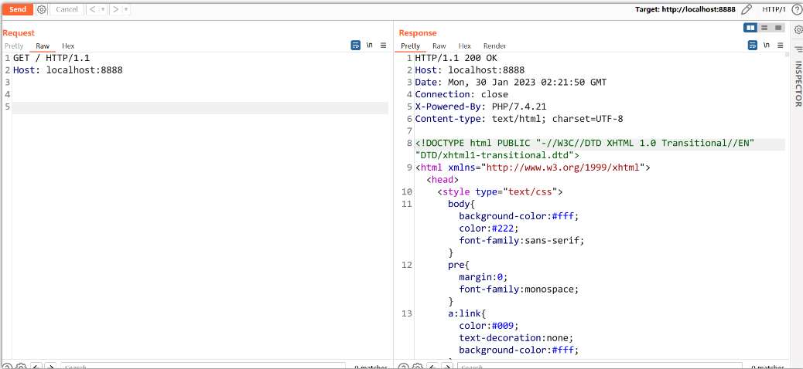
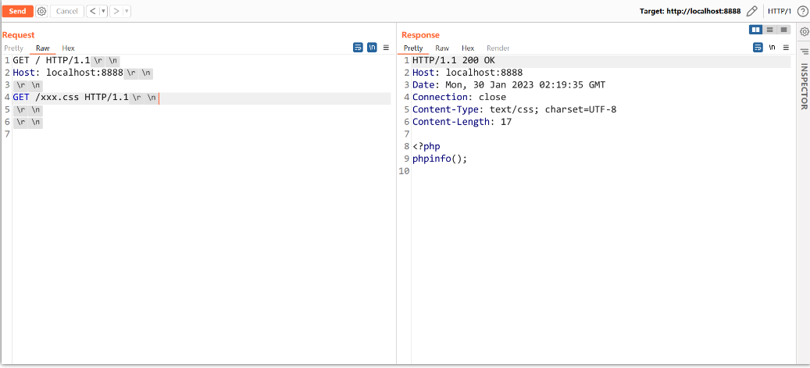

# PHP Development Server信息泄露
## 影响版本
PHP Development Server<=7.4.21
## 环境搭建
index.php:
```php
<?php
phpinfo();
```
Dockerfile:
```
FROM php:7.4.21-zts-buster
COPY index.php /var/www/html/index.php
CMD ["php", "-S", "0.0.0.0:8888", "-t", "/var/www/html/"]
```
```bash
docker build . -t phptest
docker run -p 8888:8888 phptest
```
## 漏洞原理
具体相关php源码细节可参考https://blog.projectdiscovery.io/php-http-server-source-disclosure/    


大致原理:  
php在解析请求时,如果请求的不是php支持解析的后缀,比如静态文件时,那么会直接读取该文件内容返回.  
而php在磁盘上访问相关文件时,会将请求中的相对路径转换为磁盘上的绝对路径,并且该路径会储存在变量中(比如A变量).
php会判断该变量存储的绝对路径的文件是否存在,如果不存在则会返回404,然后再判断是否为静态文件,而该判断的依据是根据请求中url的后缀进行判断,如果是则直接返回,不然则交给后续的php引擎进行解析.
而当我们在一个tcp链接中发送两个http请求时,其存在一个逻辑错误.  

当第一个请求为php文件时,A变量被设置为该php文件的绝对路径,并交给引擎进行解析返回,而当紧跟的第二个请求为静态文件时,其先判断了A变量是否为NULL,而在一个TCP链接中A变量并未被清除,其值仍然为第一次请求的php文件的路径,然后则继续进行是否为静态文件的判断,但该判断的依据是从url的后缀得到的,所以解析第二个请求时会认为是静态文件直接将该文件的内容返回,然而这个时候该文件的路径却是第一次php文件的路径,导致该php的源码直接返回.
## 漏洞复现
  

## 参考
https://blog.projectdiscovery.io/php-http-server-source-disclosure/