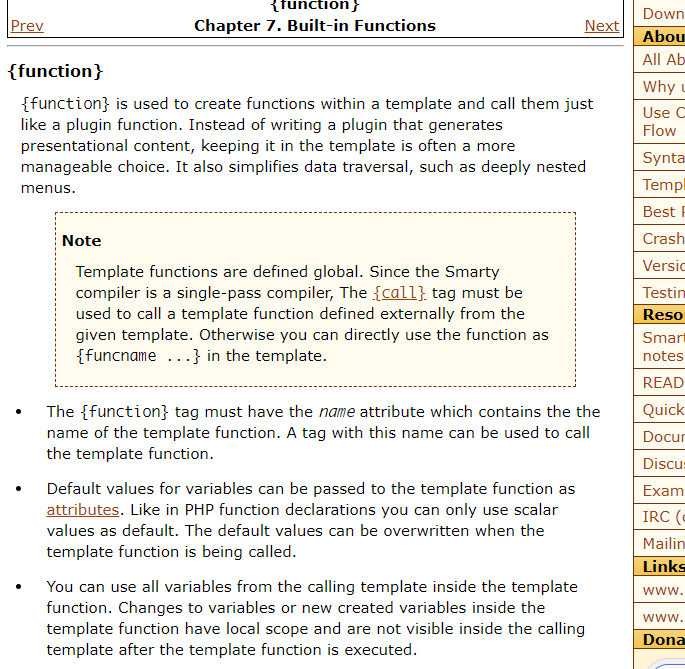
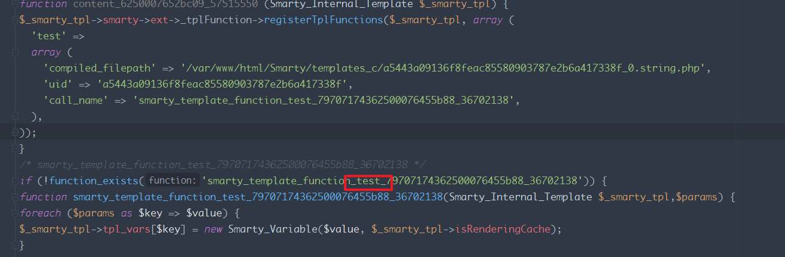
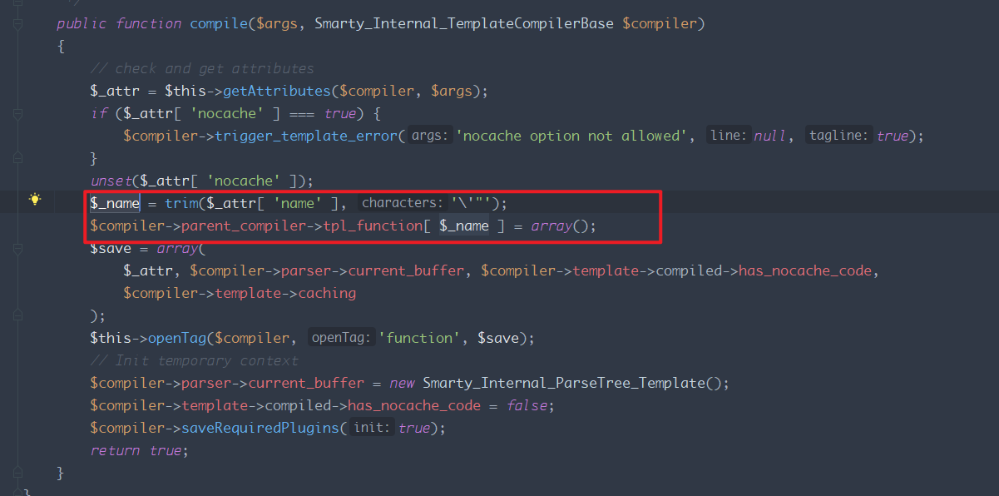
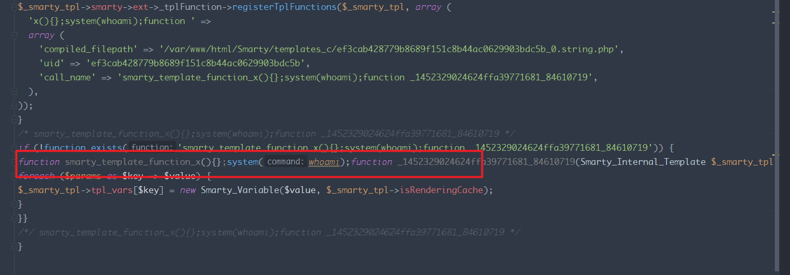
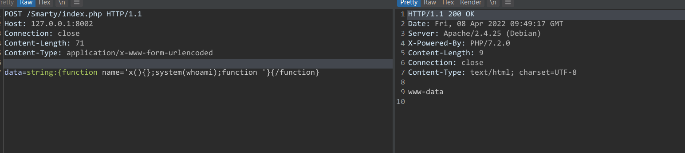
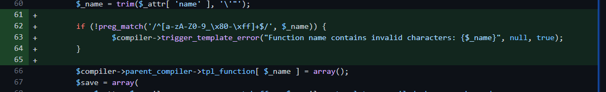

# CVE-2021-26120 Smarty 模板注入

## 影响版本
< 3.1.39
## 环境搭建
https://github.com/smarty-php/smarty  
测试代码:
```php
<?php
error_reporting(0);
require "./lib/Smarty.class.php";
$smarty = new Smarty();
$data = $_REQUEST['data'];
$smarty->display($data);
?>
```
## 原理分析
### Function name
Smarty执行Fucction标签,用于在模板中创建一个函数并调用.
  
name属性既要调用的函数名称.
当传递一个函数名称时,如`string:{function name='test'}{/function}`,其生成的模板文件如下.
  
可以看到其将函数名称于模板拼接得到一个新的函数名称写入模板文件,相关处理代码在`lib/sysplugins/smarty_internal_compile_function.php`中.  
  
其只是去掉了`'"`,也就是模板文件中的某个字符串中一部分可控,因此可以考虑闭合前半部分和后半部分字符串,在中间插入恶意php代码.  
当发送payload`string:{function name='x(){};system(whoami);function '}{/function}`时,其模板文件如下  
  
该函数字符串被切分为了三部分,中间则生成了恶意的php代码.
## 漏洞复现

## 补丁
对name属性进行了正则匹配  
