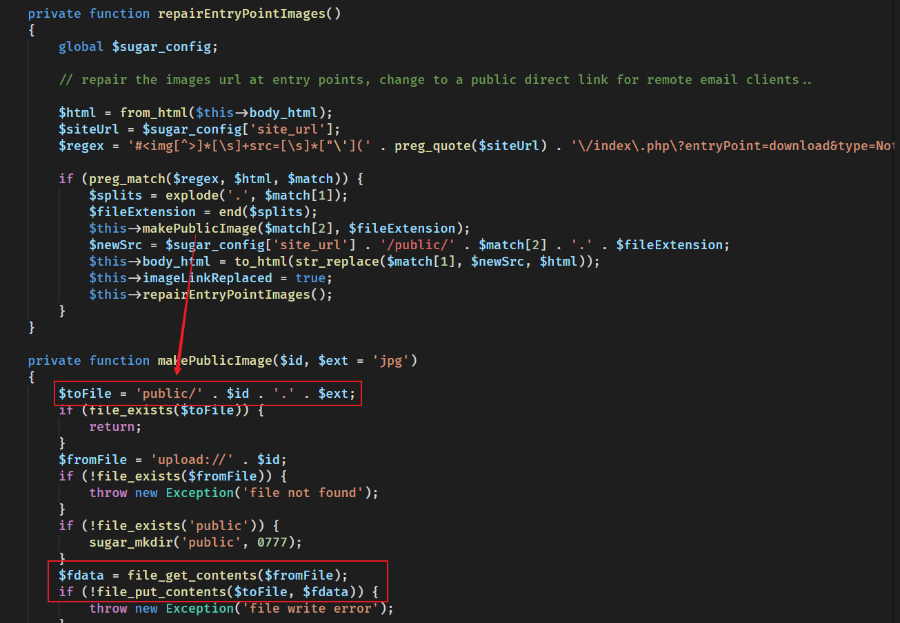
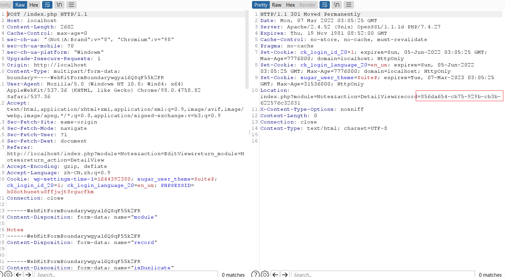
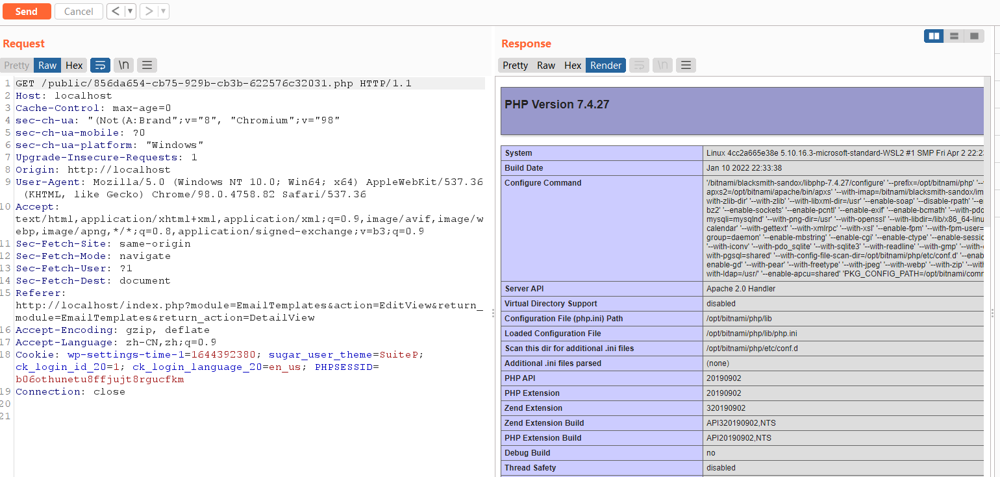
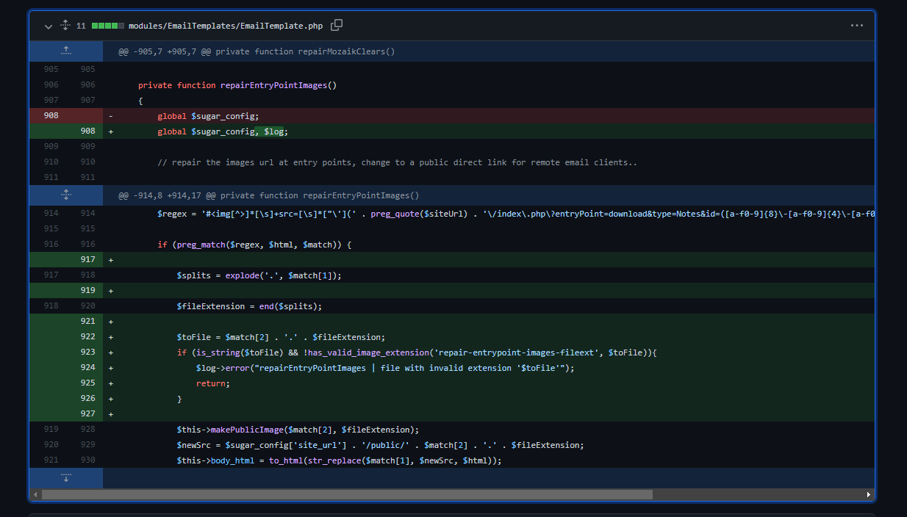

- [CVE-2021-45897 SuiteCRM 远程代码执行](#cve-2021-45897-suitecrm-远程代码执行)
  - [影响版本](#影响版本)
  - [环境搭建](#环境搭建)
  - [原理分析](#原理分析)
    - [repairEntryPointImages](#repairentrypointimages)
    - [Notes](#notes)
    - [利用思路](#利用思路)
  - [漏洞复现](#漏洞复现)
  - [补丁](#补丁)
# CVE-2021-45897 SuiteCRM 远程代码执行
## 影响版本
Vsersion < 7.12.3 and < 8.0.2
## 环境搭建
```yaml
version: '2'
services:
  mariadb:
    image: docker.io/bitnami/mariadb:10.3
    environment:
      # ALLOW_EMPTY_PASSWORD is recommended only for development.
      - ALLOW_EMPTY_PASSWORD=yes
      - MARIADB_USER=bn_suitecrm
      - MARIADB_DATABASE=bitnami_suitecrm
  suitecrm:
    image: docker.io/bitnami/suitecrm:7.12.2-debian-10-r31 
    ports:
      - '80:8080'
      - '443:8443'
    environment:
      - SUITECRM_DATABASE_HOST=mariadb
      - SUITECRM_DATABASE_PORT_NUMBER=3306
      - SUITECRM_DATABASE_USER=bn_suitecrm
      - SUITECRM_DATABASE_NAME=bitnami_suitecrm
      # ALLOW_EMPTY_PASSWORD is recommended only for development.
      - ALLOW_EMPTY_PASSWORD=yes
    depends_on:
      - mariadb
volumes:
  mariadb_data:
    driver: local
  suitecrm_data:
    driver: local

```
`docker-composer up`
## 原理分析
### repairEntryPointImages
在modules/EmailTemplates/EmailTemplate.php编辑邮件模板时有一个功能可以将已有的附件内容添加到模板中。

其从邮件模板的body_html字段中匹配一段正则内容，正则如下
`$regex = '#]*[\s]+src=[\s]*["\'](' . preg_quote($siteUrl) . '\/index\.php\?entryPoint=download&type=Notes&id=([a-f0-9]{8}\-[a-f0-9]{4}\-[a-f0-9]{4}\-[a-f0-9]{4}\-[a-f0-9]{12})&filename=.+?)["\']#si';`
也就是字符串要满足``格式。
而从以下代码可以看出,id参数的内容将被作为参数传入`makePublicImage`中,而$fileExtension参数则是字符串的filename参数取得。
```php
            $splits = explode('.', $match[1]);
            $fileExtension = end($splits);
            $this->makePublicImage($match[2], $fileExtension);
```
在`makePublicImage`中,$id则和传入的$fileExtension文件后缀组合起来和/public/目录做拼接得到一个文件路径,同时若public目录不存在还会自动创建，而文件内容则是根据ID参数从upload目录下得到。
也就是说如果我们能在upload目录下创建包含恶意代码的任意格式文件再利用该功能则可以将其复制到/public/目录下改为php后缀即可写入Webshell。
### Notes
从url可以看出type=Notes,也就是Notes类型的附件。当创建一个notes时可以上传附件,而附件的存在形式就是以随机id命名的格式存在/uploads/下。
相关逻辑在modules\Notes\controller.php#action_save()中。

而且在上传后可以得到文件ID。
### 利用思路
1. 利用Notes功能上传包含webshell的任意文件,通过返回得到该文件ID号
2. 编辑邮件模板,在body_html字段传入上传文件的URL,其中filename参数随意写入以.php结尾的文件名，匹配正则。
3. 使用模板或者查看模板,触发解析,upload目录下的恶意文件被移动到public目录生成webshell。
## 漏洞复现
1. 创建一个Notes，上传test.txt，内容为`<?php phpinfo();?>`,得到该文件的存储id.

2. 创建邮件模板,在body_html字段写入``.

3. 访问webshell.


## 补丁
在写入文件前对后缀进行了校验。
