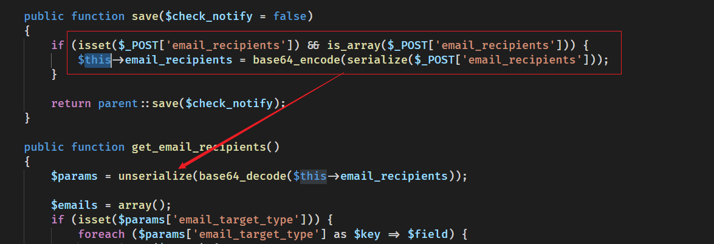
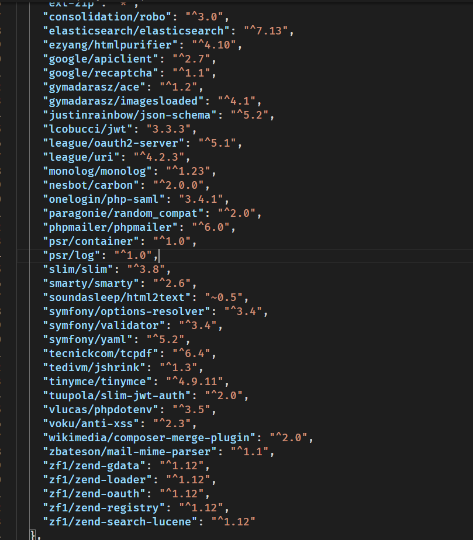

- [CVE-2022-23940 SuiteCRM 远程代码执行漏洞](#cve-2022-23940-suitecrm-远程代码执行漏洞)
  - [影响版本](#影响版本)
  - [环境搭建](#环境搭建)
  - [原理分析](#原理分析)
    - [AOR_Scheduled_Reports](#aor_scheduled_reports)
    - [利用链](#利用链)
  - [漏洞复现](#漏洞复现)
  - [补丁](#补丁)
# CVE-2022-23940 SuiteCRM 远程代码执行漏洞
## 影响版本
SuiteCRM (<= 7.12.4) 和 SuiteCRM-Core (<= 8.0.3)
## 环境搭建
```yaml
version: '2'
services:
  mariadb:
    image: docker.io/bitnami/mariadb:10.3
    environment:
      # ALLOW_EMPTY_PASSWORD is recommended only for development.
      - ALLOW_EMPTY_PASSWORD=yes
      - MARIADB_USER=bn_suitecrm
      - MARIADB_DATABASE=bitnami_suitecrm
  suitecrm:
    image: docker.io/bitnami/suitecrm:7.12.2-debian-10-r31 
    ports:
      - '80:8080'
      - '443:8443'
    environment:
      - SUITECRM_DATABASE_HOST=mariadb
      - SUITECRM_DATABASE_PORT_NUMBER=3306
      - SUITECRM_DATABASE_USER=bn_suitecrm
      - SUITECRM_DATABASE_NAME=bitnami_suitecrm
      # ALLOW_EMPTY_PASSWORD is recommended only for development.
      - ALLOW_EMPTY_PASSWORD=yes
    depends_on:
      - mariadb
volumes:
  mariadb_data:
    driver: local
  suitecrm_data:
    driver: local

```
`docker-composer up`
## 原理分析
一个反序列化漏洞。
### AOR_Scheduled_Reports
在AOR计划报告功能中，对接受者的邮箱地址是序列化后再用base64编码进行存储,同样的在获取该邮箱地址时则是base64解码后再进行反序列化，而接收者的邮箱地址则是由用户输入可控,导致反序列化漏洞。

### 利用链
通过直接查看composer.json可以得到使用的第三方依赖组件。

直接利用phpgg生成Monolog/RCE1利用链。
## 漏洞复现

## 补丁