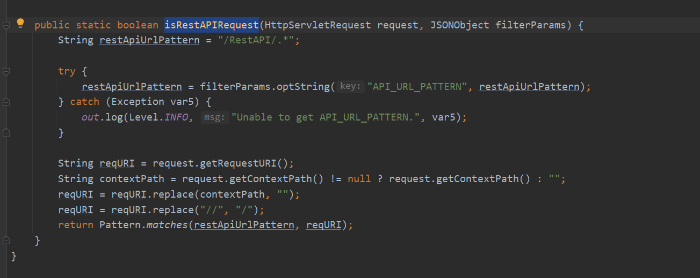
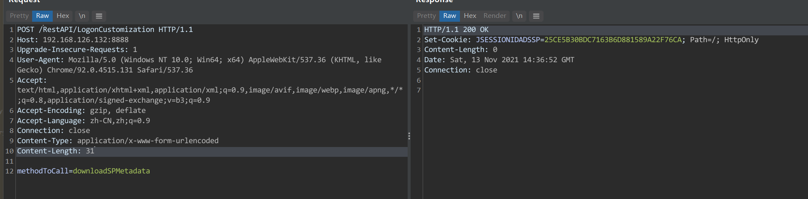
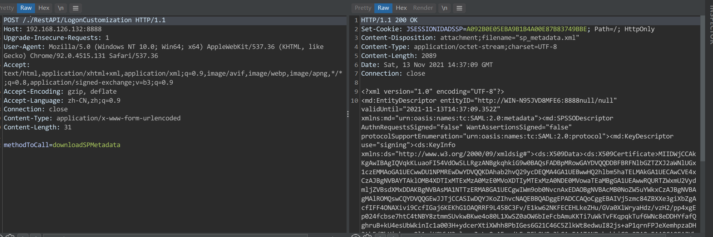
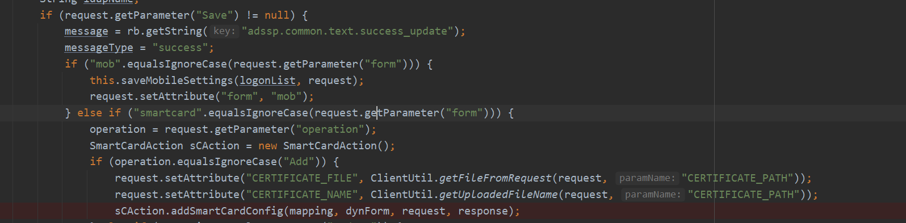
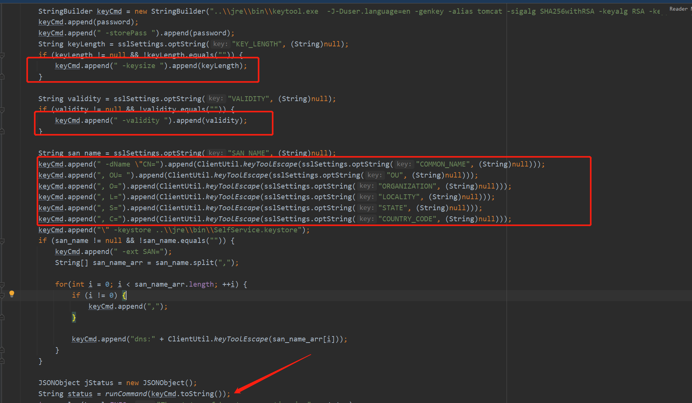
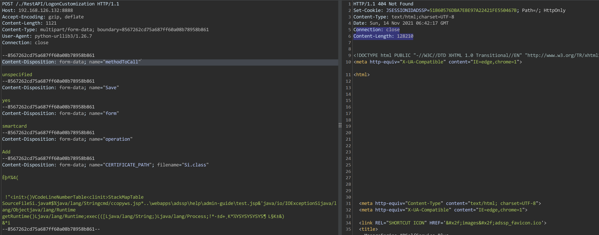
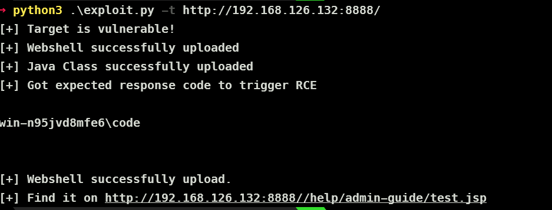

# CVE-2021-40539
- [CVE-2021-40539](#cve-2021-40539)
  - [影响版本](#影响版本)
  - [漏洞分析](#漏洞分析)
    - [RestAPI绕过](#restapi绕过)
    - [unspecified](#unspecified)
    - [ConnectionAction](#connectionaction)
    - [keytool](#keytool)
  - [利用链](#利用链)
    - [POC](#poc)
  - [补丁](#补丁)
  - [参考](#参考)
## 影响版本
Zoho ManageEngine ADSelfService Plus 6113 及更早版本  
## 漏洞分析
### RestAPI绕过 
在`com/manageengine/ads/fw/api/RestAPIUtil#isRestAPIRequest`中判断了请求是否为RestAPI请求.

在最后使用了正则进行匹配,但在之前未正确处理类似于`./`的字符导致带有该类字符的RestAPI请求被认为不是RestAPI请求从而绕过了认证过程导致可以通过RestAPI未授权访问接口.
  

### unspecified
在`com/adventnet/sym/adsm/common/webclient/admin/LogonCustomization#unspecified`方法中有一个添加智能卡配置的功能,其中调用了`SmartCardAction.addSmartCardConfig`方法.

在`addSmartCardConfig`中调用了`FileActionHandler.getFileFromRequest`来从请求得form表单中得到输入流后直接写入了文件,而文件名也是从表单中获取,可控.

根据之前`unspecified`来构造表单上传.

上传后的路径为bin目录下.

### ConnectionAction
在`com/adventnet/sym/adsm/common/webclient/admin/ConnectionAction#openSSLTool`方法中有一个`SSLUtil.createCSR(request)`方法.

跟进`SSLUtil.createCSR`,从http请求中获取到相关的配置参数后开始拼接了一个命令字符串用于执行keytool.exe

而在拼接字符串的过程中将从http请求中获取的配置参数未经过滤也加入到了命令中,导致命令注入.

### keytool
该工具为程序自带的工具,路径在/jre/bin/目录下,同时该工具的`genkeypair`生成密钥对时支持两个参数来加载指定的类文件和指定指定的方法.

## 利用链
最后的利用链:
1. RestAPI绕过后利用`unspecified`接口上传恶意Class文件到bin目录下.

2. 通过`ConnectionAction`接口命令注入来利用自带的keytool工具来加载我们上传的恶意class文件RCE.

### POC
https://github.com/synacktiv/CVE-2021-40539/blob/main/exploit.py  

## 补丁
添加了一个`getNormalizedURI`方法来过滤类似字符.

## 参考
https://www.synacktiv.com/publications/how-to-exploit-cve-2021-40539-on-manageengine-adselfservice-plus.html  
https://github.com/synacktiv/CVE-2021-40539/blob/main/exploit.py  
https://mp.weixin.qq.com/s/xfkyTIp0Gge3MDemtmoYMA  