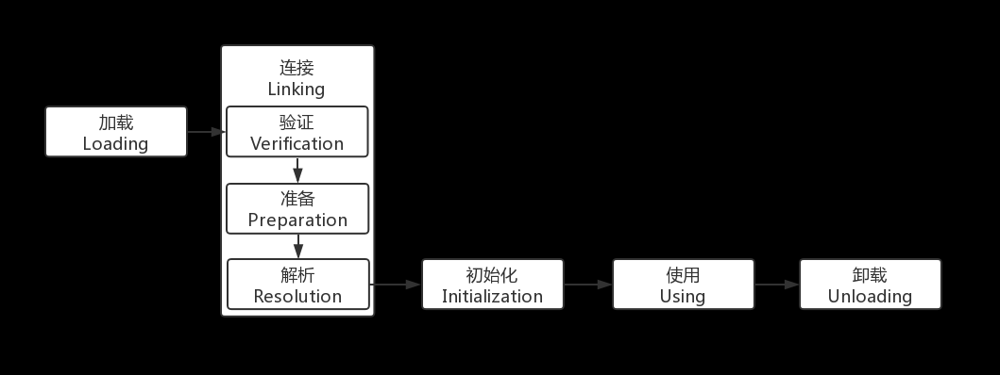
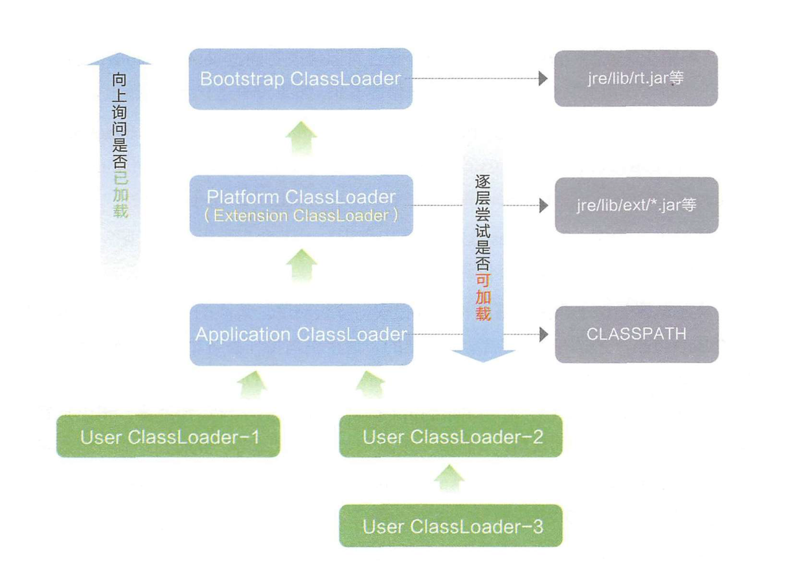

# JAVA-AduitBasic
- [JAVA-AduitBasic](#java-aduitbasic)
  - [JAVA类加载](#java类加载)
    - [加载](#加载)
    - [验证](#验证)
    - [准备](#准备)
    - [解析](#解析)
    - [初始化](#初始化)
  - [类加载器](#类加载器)
    - [类的唯一性和类加载器](#类的唯一性和类加载器)
    - [双亲委派模型](#双亲委派模型)
  - [反序列化](#反序列化)
    - [前置知识](#前置知识)
  - [反射](#反射)
  - [JAVA代理机制](#java代理机制)
    - [代理类](#代理类)
    - [调用处理器(InvocationHanlder)](#调用处理器invocationhanlder)
    - [创建代理对象](#创建代理对象)
    - [EventHanlder](#eventhanlder)
  - [参考](#参考)

## JAVA类加载
JAVA虚拟机把描述一个类的数据从class文件加载到内存中,对其进行校验,解析,初始化为一个可以被JAVA虚拟机使用的java类型即为类加载过程.

### 加载
1. 通过全限定类名来获取定义此类的二进制字节流。
2. 将这个字节流所代表的静态存储结构转化为方法区的运行时数据结构。
3. 在内存中生成一个代表这个类的 java.lang.Class 对象，作为方法区这个类的各种数据的访问入口。
### 验证
1. 文件格式验证:文件头为0xCAFEBABY,主次版本号是否与虚拟机符合.
2. 元数据校验:主要检测是否符合语言规范.
3. 字节码验证:确定程序执行逻辑正确合法.
4. 符号引用验证:验证是否可以把符号引用转化为直接引用.
`-Xverify:none`开关可以关闭大部分验证措施来提高加载速度.
### 准备
为类变量分配内存和设置初始值.
### 解析
虚拟机将常量池内的符号引用替换为直接引用的过程。
解析动作主要针对类或接口、字段、类方法、接口方法、方法类型、方法句柄和调用点限定符 7 类符号引用进行。
### 初始化
此阶段是执行 <clinit>() 方法的过程。
<clinit>() 方法是由编译器按语句在源文件中出现的顺序，依次自动收集类中的所有类变量的赋值动作和静态代码块中的语句合并产生的。（不包括构造器中的语句。构造器是初始化对象的，类加载完成后，创建对象时候将调用的 <init>() 方法来初始化对象）
静态语句块中只能访问到定义在静态语句块之前的变量，定义在它之后的变量，在前面的静态语句块可以赋值，但是不能访问.

## 类加载器
把实现类加载阶段中的“通过一个类的全限定名来获取描述此类的二进制字节流”这个动作的代码模块称为"类加载器",将 class 文件二进制数据放入方法区内，然后在堆内（heap）创建一个 java.lang.Class 对象，Class 对象封装了类在方法区内的数据结构，并且向开发者提供了访问方法区内的数据结构的接口.
### 类的唯一性和类加载器
对于任意一个类，都需要由加载它的类加载器和这个类本身一同确立其在Java虚拟机中的唯一性.
即使两个类来源于同一个 Class 文件，被同一个虚拟机加载，只要加载它们的类加载器不同，那这两个类也不相等.
这里所指的“相等”，包括代表类的 Class 对象的 equals() 方法、 isAssignableFrom() 方法、isInstance() 方法的返回结果，也包括使用 instanceof 关键字做对象所属关系判定等情况.
### 双亲委派模型
如果一个类加载器收到了类加载的请求，它首先不会自己去尝试加载这个类，而是把这个请求委派给父类加载器去完成，每一个层次的类加载器都是如此，因此所有的加载请求最终都应该传送到顶层的启动类加载器中，只有当父加载器反馈自己无法完成这个加载请求（它的搜索范围中没有找到所需的类）时，子加载器才会尝试自己去加载。

1. Bootstrap 类加载器
Bootstrap 类加载器是用 C++ 实现的，是虚拟机自身的一部分，如果获取它的对象，将会返回 null
2. 扩展类加载器和应用类加载器是独立于虚拟机外部，为 Java 语言实现的，均继承自抽象类 java.lang.ClassLoader ，开发者可直接使用这两个类加载器,Application 类加载器对象可以由 ClassLoader.getSystemClassLoader() 方法的返回，所以一般也称它为系统类加载器。它负责加载用户类路径（ClassPath）上所指定的类库，如果应用程序中没有自定义过自己的类加载器，一般情况下这个就是程序中默认的类加载器。
## 反序列化
### 前置知识
* 反序列化的类必须要显示声明**Serializable**接口.
* 反序列化数据的特征:前四个字节为`0xaced(Magic Number)0005(Version).
## 反射

## JAVA代理机制
### 代理类
代理类可以在运行时创建全新的类,能够实现指定的接口,具有以下方法:
* 指定接口所需要的全部方法.
* Object类的全部方法(toString,equals).
### 调用处理器(InvocationHanlder)
调用处理器是实现了`InvocationHandlder`接口的类对象,该接口只有一个`invoke`方法,无论何时调用代理对象的方法,调用处理器的`invoke`方法都会被调用,并向其传递Method对象和原始的调用参数.
```java
Object invoke(Object proxy,Method method,Object[] args)
```
### 创建代理对象
使用`Proxy`类的`newProxyInstance`方法创建代理对象.
```java
public static Object newProxyInstance(ClassLoader loader,Class<?>[] interfaces,InvocationHandler h)
```   
Demo:
```java
import java.lang.reflect.InvocationHandler;
import java.lang.reflect.InvocationTargetException;
import java.lang.reflect.Method;
import java.lang.reflect.Proxy;

public class Handler {

    public static void main(String[] args) {
        realperson test = new realperson();
        InvocationHandler handler = new personone(test);
        person person = (person)(Proxy.newProxyInstance(handler.getClass().getClassLoader(),test.getClass().getInterfaces(),handler));
        System.out.println(person.getClass().getName());
        person.execute();
        person.sucess();
        }
    }
    interface person{
        void execute();
        void sucess();
    }
    class realperson implements person{
        public void execute(){
            System.out.println("exec");
        }
        public void sucess()
        {
            System.out.println("sucess");
        }
    }
    class personone implements InvocationHandler {
        private Object person;
        personone(Object person){
            this.person = person;
        }
        public Object invoke(Object object, Method method, Object[] args) throws InvocationTargetException, IllegalAccessException {
                System.out.println("Invoke call");
                method.invoke(person,args);
                return null;
        }
}

```
结果
```
Invoke call 1
exec
Invoke call 2
Invoke call 1
sucess
Invoke call 2
```
### EventHanlder
EventHandler是一个内置的实现了InvocationHandler的动态代理类,EventHanlder能够监控接口中的方法被调用了之后执行EventHanlder中成员的变量和方法.

## 参考
https://www.cnblogs.com/czwbig/p/11127222.html