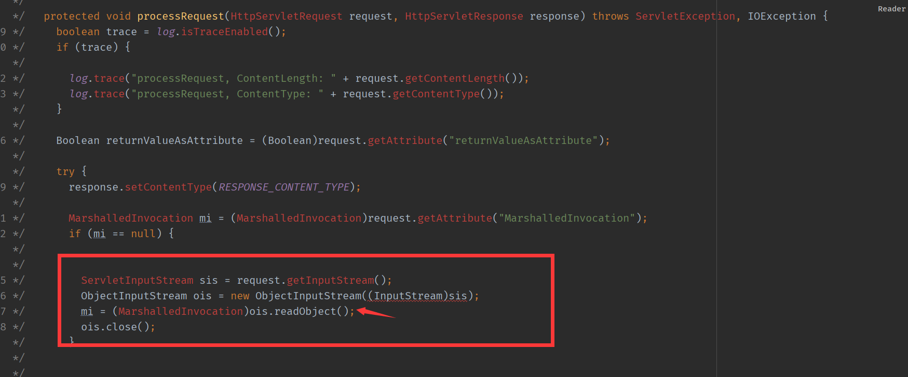
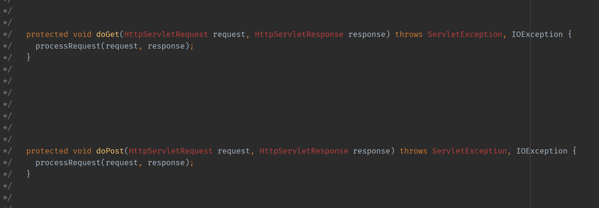

- [CVE-2017-12149 反序列化](#cve-2017-12149-反序列化)
  - [原理](#原理)
# CVE-2017-12149 反序列化
影响:
```
JBoss AS 4.x及之前版本
Jboss AS 5.x
Jboss AS 6.x
```
## 原理
在`server/all/deploy/httpha-invoker.sar/invoker.war/WEB-INF/classes/org/jboss/invocation/http/servlet`组件中直接从请求中对获取到数据无任何过滤进行了反序列化操作,其中包括了两处可以触发的点.
第一个触发点在`ReadOnlyAccessFilter.class`的`doFilter`方法中.
  
第二个触发点在`InvokerServlet.class`的processRequest方法中.

而该组件处理get和post请求均会调用`processRequest`.

通过查看web.xml可知以下url路径均可触发反序列化漏洞.
```xml
    <filter-mapping>
      <filter-name>ReadOnlyAccessFilter</filter-name>
      <url-pattern>/readonly/*</url-pattern>
    </filter-mapping>
        <servlet-mapping>
        <servlet-name>EJBInvokerServlet</servlet-name>
        <url-pattern>/EJBInvokerServlet/*</url-pattern>
    </servlet-mapping>
    <servlet-mapping>
       <servlet-name>EJBInvokerHAServlet</servlet-name>
       <url-pattern>/EJBInvokerHAServlet/*</url-pattern>
    </servlet-mapping>
   <servlet-mapping>
       <servlet-name>JMXInvokerServlet</servlet-name>
       <url-pattern>/JMXInvokerServlet/*</url-pattern>
   </servlet-mapping>
   <servlet-mapping>
       <servlet-name>JMXInvokerServlet</servlet-name>
       <url-pattern>/JMXInvokerHAServlet/*</url-pattern>
   </servlet-mapping>
```