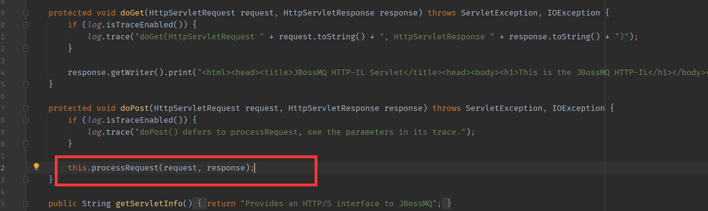

# CVE-2017-7504
---
影响
```
JBoss AS 4.x及之前版本
```
## 原理
漏洞组件:在`server/default/deploy/jms/jbossmq-httpil.sar/jbossmq-httpil.war/WEB-INF/classes/org/jboss/mq/il/http/servlet/HTTPServerILServlet.class`中.  
在processRequest()方法中,将`request.getInputStream()`请求中的数据直接进行了反序列化操作.

该方法在处理POST请求中的`doPost()`调用.
  
查看web.xml可知触发路径有两个,`/HTTPServerILServlet/*`和`/restricted/HTTPServerILServlet/*`.
```xml
  <servlet>
    <servlet-name>HTTPServerILServlet</servlet-name>
    <display-name>JBossMQ HTTP-IL Servlet</display-name>
    <description>Provides and HTTP invocation layer for JBossMQ</description>
    <servlet-class>org.jboss.mq.il.http.servlet.HTTPServerILServlet</servlet-class>
    <init-param>
        <param-name>Invoker</param-name> 
        <param-value>jboss.mq:service=Invoker</param-value> 
     </init-param>
  </servlet>
  <servlet-mapping>
    <servlet-name>HTTPServerILServlet</servlet-name>
    <url-pattern>/HTTPServerILServlet/*</url-pattern>
  </servlet-mapping>

  <!-- Alternate mappings that place the servlets under the restricted
    path to required authentication for access. Remove the unsecure mappings
    if only authenticated users should be allowed.
    -->
  <servlet-mapping>
    <servlet-name>HTTPServerILServlet</servlet-name>
    <url-pattern>/restricted/HTTPServerILServlet/*</url-pattern>
  </servlet-mapping>
```