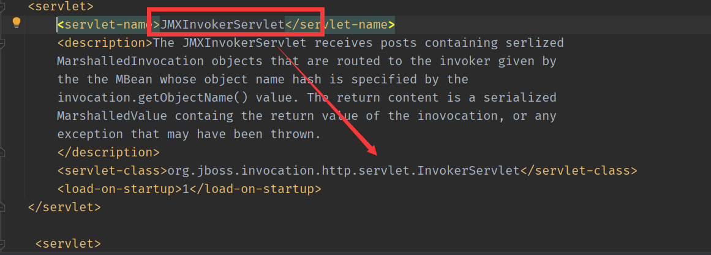

# JMX反序列化
影响:
```
Jboss AS 5.x
Jboss AS 6.x
```
## 原理
与CVE-2017-12149 反序列化漏洞相同,只是触发点不一样,从web.xml可以看出,访问/JMXInvokerServlet/路径下会调用JMXInvokerServlet的servlet.
```xml
   <servlet-mapping>
       <servlet-name>JMXInvokerServlet</servlet-name>
       <url-pattern>/JMXInvokerServlet/*</url-pattern>
   </servlet-mapping>
```
而JMXInvokerServlet对应的class为`org.jboss.invocation.http.servlet.InvokerServlet`.

而在InvokerServlet中原理则跟CVE-2017-12149相同,在处理用户请求时直接将传输的body进行了反序列化.
