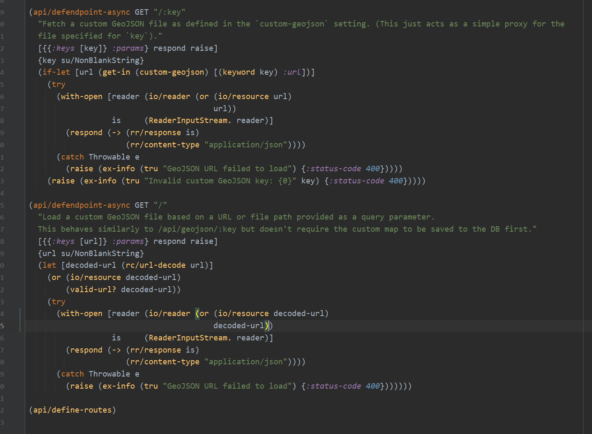
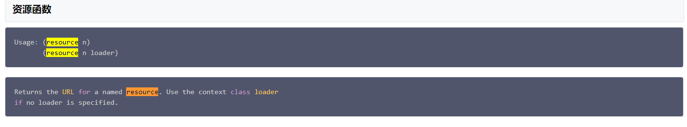
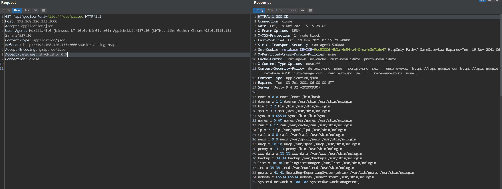

# CVE-2021-41277-任意文件读取
- [CVE-2021-41277-任意文件读取](#cve-2021-41277-任意文件读取)
  - [影响范围](#影响范围)
  - [漏洞分析](#漏洞分析)
  - [补丁](#补丁)
## 影响范围
x.40.0<=Metabase<=x.40.4
## 漏洞分析
原理分析得好像有点问题,后续再看看.

**commit**:
https://github.com/metabase/metabase/commit/042a36e49574c749f944e19cf80360fd3dc322f0  
相关逻辑代码是用Clojure语言写的.  
[语言参考](https://www.w3cschool.cn/clojure/clojure_repl.html)

相关漏洞代码:`metabase/api/geojson.clj`

前面有一个简单的校验如下
```clj
  {url su/NonBlankString}
  (let [decoded-url (rc/url-decode url)]
    (or (io/resource decoded-url)
        (valid-url? decoded-url))
```
首先判断参数`url`是否为空,然后将url进行url解码后绑定给`decoded url`,然后分别运算`io/resource decoded-url`和`valid-url? decoded-url`表达式的值.关于`io`的定义在最代码开头导入如下,即`clojure.java.io`.
```clj
:require [clojure.java.io :as io]
...
```
而`clojure.java.io/resource`则是返回指定的url资源.

后面还有一个`valid-url`校验,相关函数如下,判断url是否为内置的两个黑名单的一个,和url的协议是否为`http`或者`https`.

但在校验时使用的是`or`运算符,导致`io/resource decoded-url`返回true之后后面的`valid-url`函数校验协议和黑名单校验直接被跳过了.
后续直接调用了`io/reader`,`io/reader`即一个读函数.

后续直接把读取的内容返回在了`response中`导致任意文件读取.
最后该功能本来是管理员手动添加地图的功能,但该API接口并没有做权限校验,导致不需要任何权限即可读取文件.  

## 补丁

添加`(api/check-superuser)`进行权限校验.