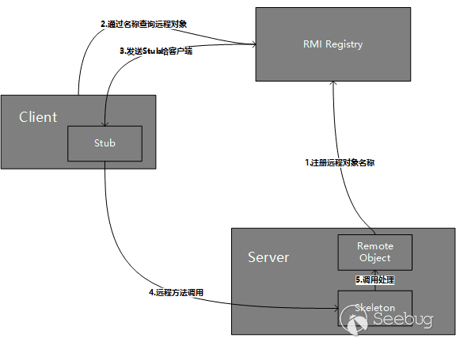

# RMI
---
Remote methed Invocation,远程方法调用,远程服务器实现具体的Java方法并提供接口，客户端本地仅需根据接口类的定义，提供相应的参数即可调用远程方法并获取执行结果.
JAVA对RMI的实现为JRMP协议,Weblogic的实现为T3协议.
>1. RMI的传输是基于反序列化的。
>2. 对于任何一个以对象为参数的RMI接口，你都可以发一个自己构建的对象，迫使服务器端将这个对象按任何一个存在于服务端classpath（不在classpath的情况，可以看后面RMI动态加载类相关部分）中的可序列化类来反序列化恢复对象。

## JAVA RMI远程方法调用过程

通信流程:
1. Server端监听一个端口，这个端口是JVM随机选择的.
2. Client端并不知道Server远程对象的通信地址和端口，但是Stub中包含了这些信息，并封装了底层网络操作.
3. Client端可以调用Stub上的方法.
4. Stub连接到Server端监听的通信端口并提交参数.
5. 远程Server端上执行具体的方法，并返回结果给Stub.
6. Stub返回执行结果给Client端，从Client看来就好像是Stub在本地执行了这个方法一样.

在JVM之间通信时，RMI对远程对象和非远程对象的处理方式是不一样的，它并没有直接把远程对象复制一份传递给客户端，而是传递了一个远程对象的Stub，Stub基本上相当于是远程对象的引用或者代理（Java RMI使用到了代理模式.
### Stub获取
JDK提供了一个RMI注册表（RMIRegistry）来解决这个问题。RMIRegistry也是一个远程对象，默认监听在1099端口上，可以使用代码启动RMIRegistry，也可以使用rmiregistry命令.
调用关系:

所以服务端应用是有两个端口的，一个是RMI Registry端口（默认为1099），另一个是远程对象的通信端口（随机分配的），通常我们只需要知道Registry的端口就行了，Server的端口包含在了Stub中。RMI Registry可以和Server端在一台服务器上，也可以在另一台服务器上，不过大多数时候在同一台服务器上且运行在同一JVM环境下.
### 实例代码
Server:
```java
package com.company;

import java.rmi.Naming;
import java.rmi.Remote;
import java.rmi.RemoteException;
import java.rmi.registry.LocateRegistry;
import java.rmi.server.UnicastRemoteObject;

public class Main {
    public interface IRemotetest extends Remote {//继承java.rmi.Remote的接口,定义远程调用的函数,在这为test()
        public String test() throws RemoteException;
    }
    public class Remotetest extends UnicastRemoteObject implements  IRemotetest{//实现上面的接口类
        protected Remotetest() throws RemoteException{//构造函数
            super();
        }
        @Override
        public String test() throws RemoteException {//实现要调用的函数test()
            System.out.println("call test");
            return "call";
        }
    }
    private void start() throws Exception{//创建Registry,实例化上面的类,然后绑定到监听地址供客户端调用
        Remotetest  h = new  Remotetest();
        LocateRegistry.createRegistry(1099);
        Naming.rebind("rmi://127.0.0.1:1099/test",h);//在Registry注册实例化的对象绑定
        System.out.println("Listenning on 1099");
    }
    public static void main(String[] args) throws Exception {
	// write your code here
        new Main().start();
    }
}
```
Client:
```java
package com.company;

import java.net.MalformedURLException;
import java.rmi.Naming;
import java.rmi.NotBoundException;
import java.rmi.RemoteException;

public class client {
        public static void main(String[] args) throws NotBoundException, RemoteException, MalformedURLException {
            // write your code here
            Main.IRemotetest t = (Main.IRemotetest) Naming.lookup("rmi://127.0.0.1:1099/test");
            //使用Naming.lookup在Registry中寻找test对象
            //这里的类为定义接口的父类,而不是实现的子类类型
            String res = t.test();
            System.out.println(res);
        }
}
```
## Attack RMI
对于RMI的攻击主要原理为RMI支持动态加载类,即`java.rmi.server.codebase`属性,该属性指定了一个地址,使得客户端和服务端都可以从这个地址来远程下载自己本地classpath找不到的类,而codebase属性可以在RMI中随着序列化的数据一起传输的,使得我们可以搭建一个恶意的远程地址来加载我们构造的恶意对象,因为rmi传输都是基于序列化和反序列化的,所以加载了远程类之后则会使用反序列化恢复对象,从而加载恶意对象.
**利用条件:**
1. 安装并配置SecurityManager.
2. Java版本低于7u21,6u45,或者设置了java.rmi.server.useCodebaseOnly=false,因为Java版本在7u21,6u45时官方将java.rmi.server.useCodebaseOnly的默认值由false改为了true.在java.rmi.server.useCodebaseOnly配置为true的情况下,Java虚拟机将只信任预先配置好的codebase.不再支持从RMI请求中获取.
**参考**
https://paper.seebug.org/1091/