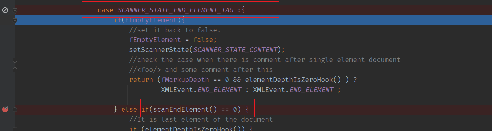
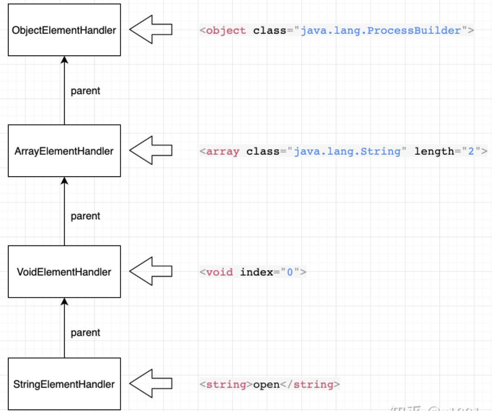
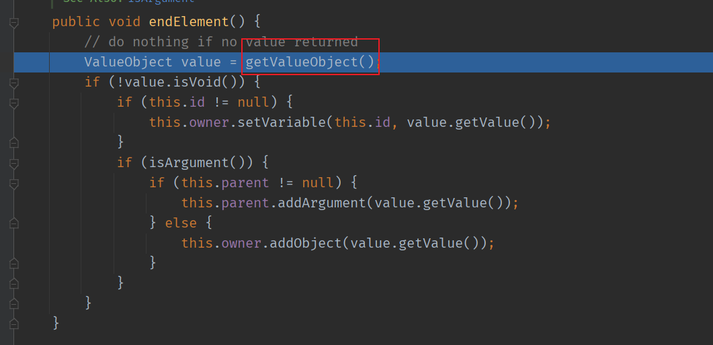
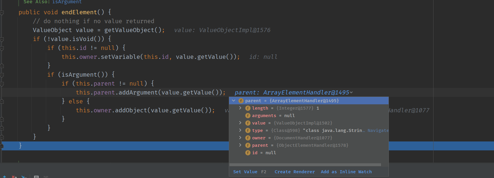
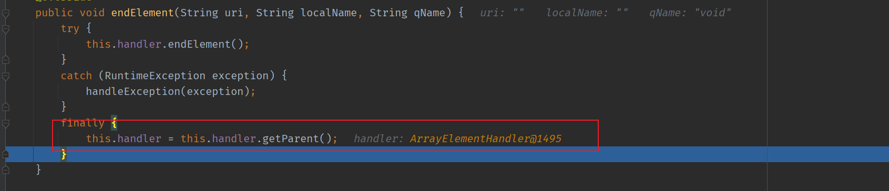
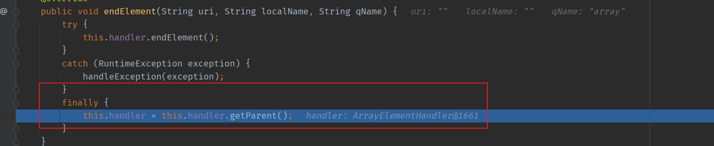
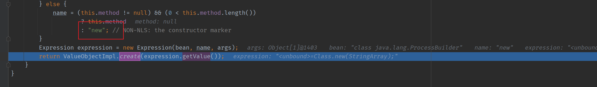
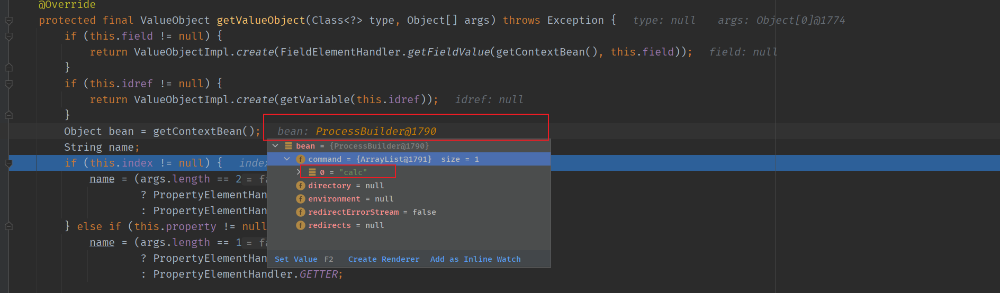
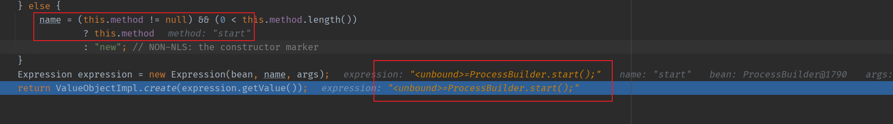
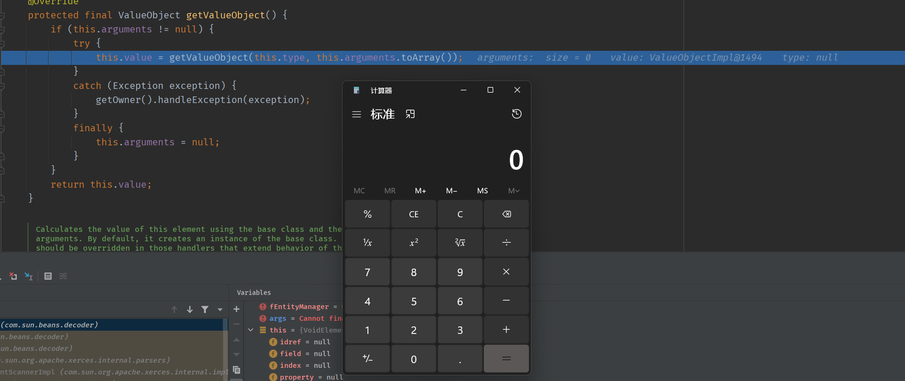

# XMLDecoder反序列化
## 示例代码
```java
package test;
import java.beans.XMLDecoder;
import java.io.IOException;
import java.io.StringBufferInputStream;
class main {

    public static void main(String[] args) throws IOException, InterruptedException {

        String s = "<java version=\"1.7.0_80\" class=\"java.beans.XMLDecoder\">\n" +
                " <object class=\"java.lang.ProcessBuilder\">\n" +
                "  <array class=\"java.lang.String\" length=\"1\">\n" +
                "    <void index=\"0\"><string>calc</string></void>\n" +
                "  </array>\n" +
                "  <void method=\"start\"></void>\n" +
                " </object>\n" +
                "</java>";
        StringBufferInputStream stringBufferInputStream = new StringBufferInputStream(s);
        XMLDecoder xmlDecoder = new XMLDecoder(stringBufferInputStream);
        Object o = xmlDecoder.readObject();
        System.out.println(o);

    }
}
```
## 调用链
在`XMLDocumentFragmentScannerImpl.scanDocument`前主要是初始化xml解析器,然后进入`scanDocument`正式开始处理xml数据,在这之前的调用链如下  
```
scanDocument:462, XMLDocumentFragmentScannerImpl (com.sun.org.apache.xerces.internal.impl)
parse:888, XML11Configuration (com.sun.org.apache.xerces.internal.parsers)
parse:824, XML11Configuration (com.sun.org.apache.xerces.internal.parsers)
parse:141, XMLParser (com.sun.org.apache.xerces.internal.parsers)
parse:1216, AbstractSAXParser (com.sun.org.apache.xerces.internal.parsers)
parse:635, SAXParserImpl$JAXPSAXParser (com.sun.org.apache.xerces.internal.jaxp)
parse:324, SAXParserImpl (com.sun.org.apache.xerces.internal.jaxp)
run:377, DocumentHandler$1 (com.sun.beans.decoder)
run:374, DocumentHandler$1 (com.sun.beans.decoder)
doPrivileged:-1, AccessController (java.security)
doIntersectionPrivilege:85, ProtectionDomain$JavaSecurityAccessImpl (java.security)
parse:374, DocumentHandler (com.sun.beans.decoder)
run:201, XMLDecoder$1 (java.beans)
run:199, XMLDecoder$1 (java.beans)
doPrivileged:-1, AccessController (java.security)
parsingComplete:199, XMLDecoder (java.beans)
readObject:250, XMLDecoder (java.beans)
main:19, main (test)
```
### XMLDocumentFragmentScannerImpl.scanDocument
在scanDocument中主要使用Do-While循环来扫描xml各个标签,然后调用next()对不同的节点根据节点名称调用不同的handler来处理,各个handler都存储在一个Hash Map中,在解析到标签的结尾处时,即`SCANNER_STATE_END_ELEMENT_TAG`会进入到scanEndElement()中进行解析.
  
进入`SCANNER_STATE_END_ELEMENT_TAG`  

而对应节点的数据并且通过链表的结构将各个handler连接起来.
类似链表结构

即在该POC中的链表结构为`stringHandler->voidHandler->arrayHandler->voidHandler->objectHandler`
在`endElement`方法中调用`this.handler.endElement()`

在`endElement()`中则调用了`getValueObject()`来获取对应的值.

而在`getValueObject()`中继续调用`getValueObject()`获取值.  


#### stringHandler
该Handlerz中主要解析了`<string>calc</string>`,在stringHandler中调用`getValueObject()`来将string属性的值赋值给当前handler的sb属性返回.

返回后被添加到父节点的参数当中,而父节点为voidHandler.然后将当前handler重置为父节点,即voidHandler.

#### 第一个voidHandler
第一个voidhandler主要解析了`<void index="0"><string>calc</string></void>`,然后将handler重置为父节点的arrayhanlder.


#### ArrayHandler
该Handler主要解析了` <array class="java.lang.String><array>" `,ArrayHandler与StringHandler类似,获取到array标签对应的值后也就是`calc`将其添加到父节点的参数中,然后将当前handler重置为父节点,也就是ObjectHandler.

重置为父节点

#### 第二个voidHandler
该voidHandler用来解析`<void method="start"></void>`中的`method`属性的start并将其作为参数赋值给父节点Obejct.  
在`getValueObject`中通过getContextBean()获取到一个带有calc参数的ProcessBuilder对象.
在`getContextBean()`的`getValueObject`中,调用了其父节点的`getValueObject()`方法,即OjectHandler的`getValueObject()`方法,在该方法中则直接通过new的方式创建ProcessBuilder对象了返回.
  

在后续的Expression中则将start赋给了的得到Object对象.

>public Expression(Object target, String methodName, Object[] arguments)  
按照所给参数创建一个新的Statement对象，使其具有target、  methodName和arguments。 
参数：  
target- 此表达式的 target。  
methodName- 此表达式的 methodName。  
arguments- 此表达式的 arguments。如果该参数为null，则使用一个空数组

最后返回拼接的表达式对象,触发命令执行.

# 思路总结
主要原理即在对各个标签的解析当中,可以将取得的object标签值进行对象实例化,并通过链表的方式从其它标签中获取其对象的参数值,最后使用了Expression()方法来调用了对象的指定方法造成了我们可以实例化一个ProcessBuilder对象,并调用其start方法来执行命令.